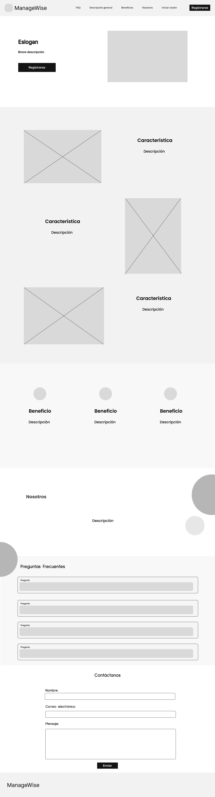
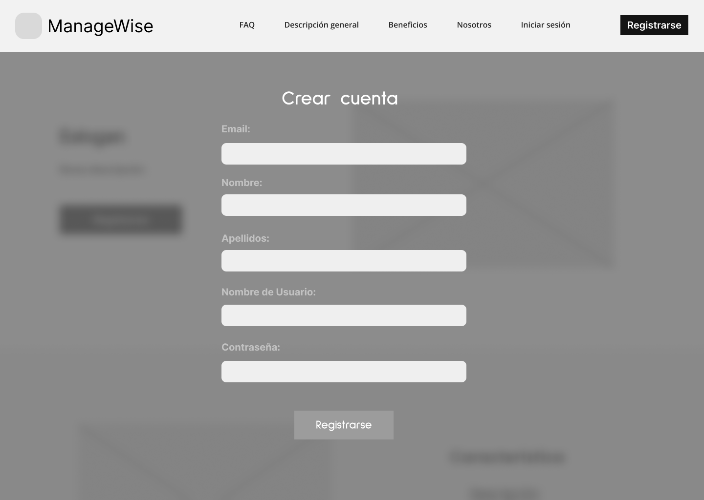
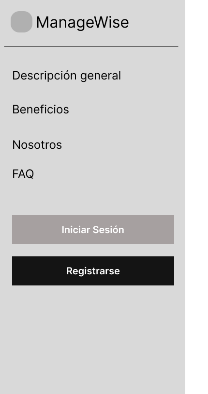
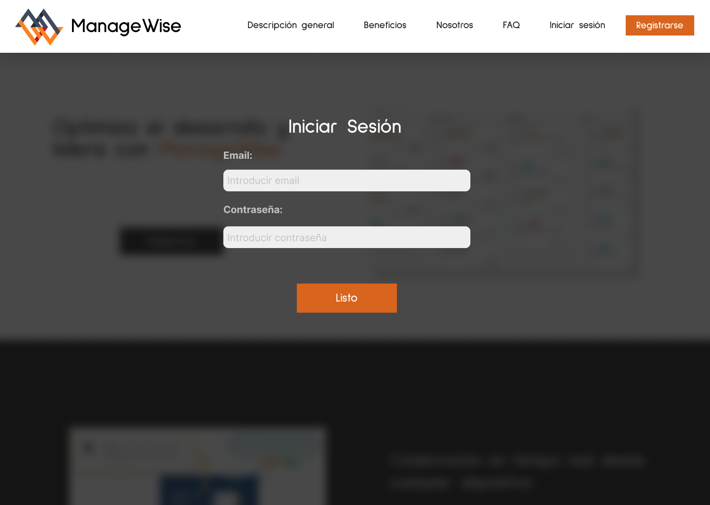

# Horizon

Product: ManageWise

# UNIVERSIDAD PERUANA DE CIENCIAS APLICADAS

  

## Ingenieria de Software

## 5to ciclo

## Desarrollo de Aplicaciones Open Source

### **Sección:** WS53

### **Profesor:** Juan Antonio Flores Moroco

### Informe de Trabajo Final

### "Horizon"

### "ManageWise"

### **Integrantes:**

- Estefano Oscar Jaque Peña - u202225466
- Diego Rolin Acuña Tomas - u202221436
- Jose Antonio Alejo Cardenas - u202122484
- John Telesforo Arevalo Meza - u202117377
- Valentino Sandoval Paiva - u20211a962

### Agosto, 2024

## Registro de Versiones del Informe

|Version|Fecha|Autor|Descripcion|
|-|-|-|-|
|TB1|28/08/24|José Alejo| Desarrollé el Lean UX Hypothesis Statements, Lean UX Canvas, Segmentos objetivo, Registro de entrevistas (1 entrevista) y Análisis de entrevistas (1 entrevista) |
|TB1|29/08/24|José Alejo| Desarrollé el To-Be Scenario Mapping, 6 de las User Stories, Impact Mapping y todo el Information Architecture|
|TB1|26/08/2024|Estefano Jaque|Desarrollé el Lean UX Problem Statements,Lean UX Assumptions,Diseño de entrevistas,Coompetidores y Estrategias y tácticas frente a competidores|
|TB1|05/09/2024|Estefano Jaque|Desarrollé las User Stories,Product Backlog, Class Diagrams, Class Dictionary, Database Diagram, Sprint Planning 1, Sprint Backlog 1|
|TB1      |29/08/2024  |Valentino Sandoval Paiva      |Desarrollé la Descripción de la Startup, Solution Profile, el regitro de una entrevista a un usuario del segmento 1 y 2, y realicé una entrevista.|
|TB1      |05/09/2024  |Valentino Sandoval Paiva      |Desarrollé el Empathy Mapping, User Task Matrix, Style Guidelines y Software configuration Management|
| TB1     | 25/09/2024 | Diego Rolin Acuña Tomas      | Realice el Startup Profile. Completando los antecedentes y problematica                                                                                                                                                                                                                                                                                                             |
| TB1     | 27/09/2024 | Diego Rolin Acuña Tomas      | Realice las entrevistas. Grabando y resumiendo para el Registro de entrevistas.                                                                                                                                                                                                                                                                                                     |
| TB1     | 1/09/2024  | Diego Rolin Acuña Tomas      | Complete el Ubiquitous Language. Realice el Domain-Driven Software Architecture al finalizar el Software Architecture Context Diagram, Software Architecture Container Diagrams y Software Architecture Components Diagrams.                                                                                                                                                        |
| TB1     | 6/09/2024  | Diego Rolin Acuña Tomas      | Desarrolle el Sprint 1, al desarrollar el Sprint Planning 1, Testing Suite Evidence for Sprint Review, Execution Evidence for Sprint Review, Services Documentation Evidence for Sprint Review, Software Deployment Evidence for Sprint Review y Team Collaboration Insights during Sprint.                                                                                         |
| TB1     | 8/09/2024  | Diego Rolin Acuña Tomas      | Desarrolle el Landing Page, cumpliendo los User Stories que me delegaron.
| TB1     | 29/08/2024  | John Arévalo   | Desarrolle los as-is y to-be scenarios, además del registro de 1 entrevista por segmento objetivo.      
| TB1     | 6/09/2024  | John Arévalo   | Desarrolle los wireframes y mockups de la landing page, además de los wireframes, mockups, wireflows y user flows diagrams para la aplicación web.      
| TB1     | 8/09/2024  | John Arévalo   | Desarrolle el Landing Page, cumpliendo los User Stories que me delegaron.     

## Project Report Collaboration Insights

TB1: 
|Integrante|Tarea Asignada|
|-|-|
|Alejo Cárdenas, Jose Antonio|Lean UX Hypothesis Statements, Lean UX Canvas, Segmentos objetivo, 1 Registro de entrevistas, 1 Análisis de entrevistas, To-Be Scenario Mapping, 6 User Stories, Impact Mapping, Organization Systems, Labeling Systems, SEO Tags and Meta Tags, Searching Systems, Navigation Systems, Creacion del keynote, Reporte de participacion y parte la estructuracion del informe.|
|Jaque Peña, Estefano Oscar|Lean UX Problem Statements,Lean UX Assumptions,Diseño de entrevistas,Coompetidores,Estrategias y tácticas frente a competidores,User Stories,Product Backlog, Class Diagrams, Class Dictionary, Database Diagram, Sprint Planning 1, Sprint Backlog 1|
|Sandoval Paiva Valentino|Descripción de la Startup, 5w y 2h, Solution Profile, Antecedentes y problemática, el regitro de una entrevista , Empathy Mapping, User Task Matrix, Style Guidelines y Software configuration Management.|
| Diego Rolin Acuña Tomas | Startup Profile, Descripción de la Startup, Antecedentes y problemática, Entrevistas, Registro de entrevistas, User Personas, Ubiquitous Language, Domain-Driven Software Architecture, Software Architecture Context Diagram, Software Architecture Container Diagrams, Software Architecture Components Diagrams, Sprint 1, Sprint Planning 1, Testing Suite Evidence for Sprint Review, Execution Evidence for Sprint Review, Services Documentation Evidence for Sprint Review, Software Deployment Evidence for Sprint Review, Team Collaboration Insights during Sprint. |
| Arévalo Meza John | Segmentos objetivos, registro de entrevistas, as-is scenario mapping, to-be scenario mapping, landing page wireframes, landing page mockups, web application wireframes, web application mockups, web applications wireflow diagrams, web applications user flow diagrams, desarrollo de la landing page. |

## Contenido

### Tabla de contenidos

- [Horizon](#horizon)
- [UNIVERSIDAD PERUANA DE CIENCIAS APLICADAS](#universidad-peruana-de-ciencias-aplicadas)
  - [Ingenieria de Software](#ingenieria-de-software)
  - [5to ciclo](#5to-ciclo)
  - [Desarrollo de Aplicaciones Open Source](#desarrollo-de-aplicaciones-open-source)
    - [**Sección:** WS53](#sección-ws53)
    - [**Profesor:** Juan Antonio Flores Moroco](#profesor-juan-antonio-flores-moroco)
    - [Informe de Trabajo Final](#informe-de-trabajo-final)
    - ["Horizon"](#horizon-1)
    - ["ManageWise"](#managewise)
    - [**Integrantes:**](#integrantes)
    - [Agosto, 2024](#agosto-2024)
  - [Registro de Versiones del Informe](#registro-de-versiones-del-informe)
  - [Project Report Collaboration Insights](#project-report-collaboration-insights)
  - [Contenido](#contenido)
    - [Tabla de contenidos](#tabla-de-contenidos)
  - [Student Outcome](#student-outcome)
  - [Capítulo I: Introducción](#capítulo-i-introducción)
    - [1.1. Startup Profile](#11-startup-profile)
    - [1.1.1. Descripción de la Startup](#111-descripción-de-la-startup)
    - [1.1.2. Perfiles de integrantes del equipo](#112-perfiles-de-integrantes-del-equipo)
    - [1.2. Solution Profile](#12-solution-profile)
    - [1.2.1. Antecedentes y problemática](#121-antecedentes-y-problemática)
      - [What?](#what)
      - [When?](#when)
      - [Where?](#where)
      - [Who?](#who)
      - [Why?](#why)
      - [How?](#how)
          - [How much?](#how-much)
    - [1.2.2. Lean UX Process](#122-lean-ux-process)
    - [1.2.2.1. Lean UX Problem Statements](#1221-lean-ux-problem-statements)
    - [1.2.2.2. Lean UX Assumptions](#1222-lean-ux-assumptions)
    - [1.2.2.3. Lean UX Hypothesis Statements](#1223-lean-ux-hypothesis-statements)
    - [1.2.2.4. Lean UX Canvas](#1224-lean-ux-canvas)
    - [1.3. Segmentos objetivo](#13-segmentos-objetivo)
  - [Capítulo II: Requirements Elicitation \& Analysis](#capítulo-ii-requirements-elicitation--analysis)
    - [2.1. Competidores](#21-competidores)
    - [2.1.1. Análisis competitivo](#211-análisis-competitivo)
    - [2.1.2. Estrategias y tácticas frente a competidores](#212-estrategias-y-tácticas-frente-a-competidores)
    - [2.2. Entrevistas](#22-entrevistas)
    - [2.2.1. Diseño de entrevistas](#221-diseño-de-entrevistas)
    - [Segmento: Líder o Gerente de Empresa de Desarrollo de Software en Crecimiento](#segmento-líder-o-gerente-de-empresa-de-desarrollo-de-software-en-crecimiento)
    - [Segmento: Equipo de Desarrollo de Software](#segmento-equipo-de-desarrollo-de-software)
    - [2.2.2. Registro de entrevistas](#222-registro-de-entrevistas)
      - [Segmento 1: Líder o Gerente de Empresa de Desarrollo de Software en Crecimiento](#segmento-1-líder-o-gerente-de-empresa-de-desarrollo-de-software-en-crecimiento)
      - [Segmento 2: Equipo de Desarrollo de Software](#segmento-2-equipo-de-desarrollo-de-software)
    - [2.2.3. Análisis de entrevistas](#223-análisis-de-entrevistas)
      - [Análisis Segmento 1: Líder o Gerente de Empresa de Desarrollo de Software en Crecimiento](#análisis-segmento-1-líder-o-gerente-de-empresa-de-desarrollo-de-software-en-crecimiento)
      - [Análisis Segmento 2: Equipo de Desarrollo de Software](#análisis-segmento-2-equipo-de-desarrollo-de-software)
    - [2.3. Needfinding](#23-needfinding)
    - [2.3.1. User Personas](#231-user-personas)
      - [Segmento 1: Líder o Gerente de Empresa de Desarrollo de Software en Crecimiento](#segmento-1-líder-o-gerente-de-empresa-de-desarrollo-de-software-en-crecimiento-1)
      - [Segmento 2: Equipo de Desarrollo de Software](#segmento-2-equipo-de-desarrollo-de-software-1)
    - [2.3.2. User Task Matrix](#232-user-task-matrix)
    - [2.3.3. User Journey Mapping](#233-user-journey-mapping)
      - [User Journey Mapping - Líder o Gerente de Empresa de Desarrollo de Software](#user-journey-mapping---líder-o-gerente-de-empresa-de-desarrollo-de-software)
      - [User Journey Mapping - Equipo de Desarrollo de Software](#user-journey-mapping---equipo-de-desarrollo-de-software)
    - [2.3.4. Empathy Mapping](#234-empathy-mapping)
- [Segmento 1: María (Líder/Gerente de Proyecto)](#segmento-1-maría-lídergerente-de-proyecto)
- [Segmento 2: Fabricio (Equipo de Desarrollo de Software)](#segmento-2-fabricio-equipo-de-desarrollo-de-software)
    - [2.3.5. As-is Scenario Mapping](#235-as-is-scenario-mapping)
      - [**Segmento 1:** Lider o gerente de empresa de desarrollo de software en crecimiento](#segmento-1-lider-o-gerente-de-empresa-de-desarrollo-de-software-en-crecimiento)
      - [**Segmento 2:** Miembros de un equipo de Desarrollo de Software](#segmento-2-miembros-de-un-equipo-de-desarrollo-de-software)
    - [2.4. Ubiquitous Language](#24-ubiquitous-language)
  - [Capítulo III: Requirements Specification](#capítulo-iii-requirements-specification)
    - [3.1. To-Be Scenario Mapping](#31-to-be-scenario-mapping)
    - [**Segmento 1:** Lider o gerente de proyectos de software](#segmento-1-lider-o-gerente-de-proyectos-de-software)
    - [**Segmento 2:** Miembro de un equipo de desarrollo de software](#segmento-2-miembro-de-un-equipo-de-desarrollo-de-software)
    - [3.2. User Stories](#32-user-stories)
    - [3.3. Impact Mapping](#33-impact-mapping)
    - [3.4. Product Backlog](#34-product-backlog)
  - [Capítulo IV: Product Design](#capítulo-iv-product-design)
    - [4.1. Style Guidelines.](#41-style-guidelines)
    - [4.1.1. General Style Guidelines.](#411-general-style-guidelines)
    - [4.1.2. Web Style Guidelines.](#412-web-style-guidelines)
    - [4.2. Information Architecture](#42-information-architecture)
      - [4.2.1. Organization Systems](#421-organization-systems)
      - [4.2.2. Labeling Systems](#422-labeling-systems)
      - [4.2.3. SEO Tags and Meta Tags](#423-seo-tags-and-meta-tags)
      - [4.2.4. Searching Systems](#424-searching-systems)
      - [4.2.5. Navigation Systems](#425-navigation-systems)
    - [4.3. Landing Page UI Design](#43-landing-page-ui-design)
      - [4.3.1. Landing Page Wireframe](#431-landing-page-wireframe)
        - [Desktop Web Browser:](#desktop-web-browser)
        - [Mobile Web Browser:](#mobile-web-browser)
      - [4.3.2. Landing Page Mock-up](#432-landing-page-mock-up)
        - [Desktop Web Browser:](#desktop-web-browser-1)
        - [Mobile Web Browser:](#mobile-web-browser-1)
    - [4.4. Web Applications UX/UI Design](#44-web-applications-uxui-design)
      - [4.4.1. Web Applications Wireframes](#441-web-applications-wireframes)
      - [4.4.2. Web Applications Wireflow Diagrams](#442-web-applications-wireflow-diagrams)
        - [User goal: Registrar un nuevo usuario](#user-goal-registrar-un-nuevo-usuario)
        - [User goal: Registrar un nuevo usuario](#user-goal-registrar-un-nuevo-usuario-1)
        - [User goal: Iniciar sesión](#user-goal-iniciar-sesión)
        - [User goal: Acceso a videollamadas](#user-goal-acceso-a-videollamadas)
        - [User goal: Acceso a historial](#user-goal-acceso-a-historial)
        - [User goal: Visualizar secciónes del foro](#user-goal-visualizar-secciónes-del-foro)
        - [User goal: Realiazar el seguimiento de tareas en tiempo real](#user-goal-realiazar-el-seguimiento-de-tareas-en-tiempo-real)
        - [User goal: Visualizar cronograma](#user-goal-visualizar-cronograma)
        - [User goal: Modificar estado de tareas](#user-goal-modificar-estado-de-tareas)
      - [4.4.3. Web Applications Mock-ups](#443-web-applications-mock-ups)
      - [4.4.4. Web Applications User Flow Diagrams](#444-web-applications-user-flow-diagrams)
        - [User goal: Como usuario quiero poder iniciar sesión en ManageWise. Para lograrlo, completar el formulario, en caso de usar datos válidos, podre iniciar sesión, caso contrario, el formulario se reinicia.](#user-goal-como-usuario-quiero-poder-iniciar-sesión-en-managewise-para-lograrlo-completar-el-formulario-en-caso-de-usar-datos-válidos-podre-iniciar-sesión-caso-contrario-el-formulario-se-reinicia)
        - [User goal: Como usuario quiero poder registrarme en ManageWise. Para lograrlo, ingreso mi usuario y contraseña en el formulario, en caso sean válidos, ingresaré a la plataforma, de lo contrario, el formulario se reinicia.](#user-goal-como-usuario-quiero-poder-registrarme-en-managewise-para-lograrlo-ingreso-mi-usuario-y-contraseña-en-el-formulario-en-caso-sean-válidos-ingresaré-a-la-plataforma-de-lo-contrario-el-formulario-se-reinicia)
        - [User goal: Como lider del equipo quiero realizar un seguimiento en tiempo real del progreso de este. Para lograrlo, ingreso a reporte y luego a la sección progreso.](#user-goal-como-lider-del-equipo-quiero-realizar-un-seguimiento-en-tiempo-real-del-progreso-de-este-para-lograrlo-ingreso-a-reporte-y-luego-a-la-sección-progreso)
        - [User goal: Como miembro del equipo, quiero poder visualizar el cronograma sprint. Para lograrlo, ingreso a la sección Cronograma desde el apartado de Proyectos.](#user-goal-como-miembro-del-equipo-quiero-poder-visualizar-el-cronograma-sprint-para-lograrlo-ingreso-a-la-sección-cronograma-desde-el-apartado-de-proyectos)
        - [User goal: Como lider de equipo, quiero acceder al historial de actividades. Para lograrlo, ingreso a Historial en el panel lateral, y posteriormente a la sección Actividades.](#user-goal-como-lider-de-equipo-quiero-acceder-al-historial-de-actividades-para-lograrlo-ingreso-a-historial-en-el-panel-lateral-y-posteriormente-a-la-sección-actividades)
        - [User goal: Como miembro del equipo, quiero poder ingresar al foro para visualizar sugerencias. Para lograrlo, ingreso a Foro en el panel lateral.](#user-goal-como-miembro-del-equipo-quiero-poder-ingresar-al-foro-para-visualizar-sugerencias-para-lograrlo-ingreso-a-foro-en-el-panel-lateral)
        - [User goal: Como miembro de equipo, quiero poder ingresar a una videollamada realizada por el líder. Para lograrlo, me dirijo a Herramientas en el panel lateral y luego ingreso a la seccion Videollamadas, para finalmente ingresar a la deseada.](#user-goal-como-miembro-de-equipo-quiero-poder-ingresar-a-una-videollamada-realizada-por-el-líder-para-lograrlo-me-dirijo-a-herramientas-en-el-panel-lateral-y-luego-ingreso-a-la-seccion-videollamadas-para-finalmente-ingresar-a-la-deseada)
    - [4.5. Web Applications Prototyping](#45-web-applications-prototyping)
    - [4.6. Domain-Driven Software Architecture](#46-domain-driven-software-architecture)
    - [4.6.1. Software Architecture Context Diagram](#461-software-architecture-context-diagram)
    - [4.6.2. Software Architecture Container Diagrams](#462-software-architecture-container-diagrams)
    - [4.6.3. Software Architecture Components Diagrams](#463-software-architecture-components-diagrams)
      - [**Component: Desarrollo**](#component-desarrollo)
      - [**Component: Equipos**](#component-equipos)
      - [**Component: Opiniones**](#component-opiniones)
    - [4.7. Software Object-Oriented Design](#47-software-object-oriented-design)
      - [4.7.1. Class Diagrams](#471-class-diagrams)
    - [4.8. Database Design](#48-database-design)
      - [4.7.2. Database Dictionary](#472-database-dictionary)
      - [4.8.1. Database Diagram](#481-database-diagram)
  - [Capítulo V: Product Implementation, Validation \& Deployment](#capítulo-v-product-implementation-validation--deployment)
    - [5.1. Software Configuration Management.](#51-software-configuration-management)
    - [5.1.1. Software Development Environment Configuration.](#511-software-development-environment-configuration)
  - [Diseño y Desarrollo](#diseño-y-desarrollo)
    - [5.1.2. Source Code Management.](#512-source-code-management)
    - [5.1.3. Source Code Style Guide \& Conventions.](#513-source-code-style-guide--conventions)
    - [5.1.4. Software Deployment Configuration.](#514-software-deployment-configuration)
    - [5.2 Landing Page, Services \& Applications Implementation.](#52-landing-page-services--applications-implementation)
    - [5.2.1 . Sprint 1](#521--sprint-1)
      - [5.2.1.1 Sprint Planning 1.](#5211-sprint-planning-1)
      - [5.2.1.2 Sprint Backlog 1.](#5212-sprint-backlog-1)
      - [5.2.1.3 Development Evidence for Sprint Review](#5213-development-evidence-for-sprint-review)
      - [5.2.1.4 Testing Suite Evidence for Sprint Review.](#5214-testing-suite-evidence-for-sprint-review)
      - [5.2.1.5 Execution Evidence for Sprint Review.](#5215-execution-evidence-for-sprint-review)
      - [5.2.1.6 Services Documentation Evidence for Sprint Review.](#5216-services-documentation-evidence-for-sprint-review)
      - [5.2.1.7 Software Deployment Evidence for Sprint Review.](#5217-software-deployment-evidence-for-sprint-review)
      - [5.2.1.8 Team Collaboration Insights during Sprint.](#5218-team-collaboration-insights-during-sprint)
    - [Conclusiones](#conclusiones)
    - [Bibliografia](#bibliografia)
    - [Anexos](#anexos)

## Student Outcome

_ABET – EAC - Student Outcome 3_  
**Criterio:** Capacidad de comunicarse efectivamente con un rango de audiencias.

En el siguiente cuadro se describen las acciones realizadas y enunciados de conclusiones por parte del grupo, que permiten sustentar el haber alcanzado el logro del ABET - EAC - Student Outcome 3.

| Criterio especifico                                                          | Acciones Realizadas                                                                                                                                                                                                                                                                                                                                                                                                                                                                                                                                                                                                                                                                                                                                                                                                                                                                                                                                                                                                                                             | Conclusiones  |
| :--------------------------------------------------------------------------- | :-------------------------------------------------------------------------------------------------------------------------------------------------------------------------------------------------------------------------------------------------------------------------------------------------------------------------------------------------------------------------------------------------------------------------------------------------------------------------------------------------------------------------------------------------------------------------------------------------------------------------------------------------------------------------------------------------------------------------------------------------------------------------------------------------------------------------------------------------------------------------------------------------------------------------------------------------------------------------------------------------------------------------------------------------------------- | ------------- |
| 1. Comunica oralmente con efectividad a diferentes rangos de audiencia   | **Estefano Oscar Jaque Peña** TB1: Realice el Lean UX Prolem statements y los assumptions luego de ello apoye con el diseño de la pregunta para las entrevistas .Para los siguientes capitulos realice el diagrama de base de dato y de diagrama de clase, asi como el database dictionary.Para finalizar con mi aporte en el grupo realice el Sprint planning y el Sprint Backlog **Diego Rolin Acuña Tomas**  TB1: Realice la "Descripción de la Startup" y "Antecedentes y problemática"  **Jose Antonio Alejo Cardenas:**  TB1: Para esta TB1, realicé actividades como Lean UX Hypothesis Statements, desarrollando hipótesis enfocadas en el usuario, Lean UX Canvas, realizando investigaciones y resaltando puntos clave, definición de Segmentos objetivo basados en datos demográficos, Registro y análisis de entrevistas para obtener informacion valiosa, To-Be Scenario Mapping, detallando escenarios futuros de como deberia ser, User Stories centradas en las necesidades del usuario, Impact Mapping para alinear entregables con sus respectivas user stories, desarrollo de Organization Systems y Labeling Systems para una mejor estructura, implementación de SEO Tags y Meta Tags para optimización de búsqueda, diseño de Searching Systems efectivos y configuración de Navigation Systems para mejorar la experiencia del usuario. **Valentino Sandoval Paiva**  TB1: Para esta entrega, realicé una matriz de tareas de usuario para entender mejor las necesidades y prioridades de nuestros usuarios. También desarrollé un mapa de empatía para identificar sus emociones y comportamientos clave. Establecí directrices de estilo generales y específicas para la web para garantizar una presentación coherente y efectiva. Configuré el entorno de desarrollo, gestioné el código fuente y definí normas para su estilo y convenciones. Finalmente, preparé la configuración para el despliegue del software, asegurando una implementación fluida y exitosa.  **John Arévalo Meza**  TB1: Para esta entrega realicé los segmentos objetivos, asis scenario mapping, tobe scenario mapping, landing page wireframes y mockups, web application wireframes, mockups, wireflow and user flow diagrams y el registro de 1 entrevista por cada segmento objetivo.|    **Jose Antonio Alejo Cardenas**  TB1:  En esta TB1, durante la exposición de los resultados del desarrollo de Lean UX Hypothesis Statements, Lean UX Canvas, y el análisis de entrevistas, se demostró una habilidad sólida para comunicar oralmente con efectividad a diferentes audiencias. Para los líderes, se presentó el impacto estratégico del To-Be Scenario Mapping y el Impact Mapping, destacando cómo estos instrumentos contribuyen al éxito del proyecto. Con el equipo de desarrollo, se hizo énfasis en las User Stories y la Information Architecture, explicando su relevancia en términos técnicos y prácticos para la ejecución del proyecto. **Estefano Oscar Jaque Peña** TB1:Durante mi participación, comuniqué de manera clara los aspectos técnicos y estratégicos en reuniones y planificación. Presenté los diagramas y el Sprint Backlog adaptando mi lenguaje a audiencias con diferentes niveles de experiencia, asegurando que todos comprendieran la lógica del proyecto.  **John Telesforo Arevalo Meza**  TB1:  A lo largo de la TB1, la comnunicación oral fue de suma importancia, ya que gracias a esta pudimos empatizar con los segmentos objetivos, así como dar a conocer de manera correcta nuestras ideas, además logramos compenetrar mejor como equipo y así realizar un trabajo exitoso.  |
| 2. Comunica por escrito con efectividad a diferentes rangos de audiencia | **Estefano Oscar Jaque Peña** TB1: Realice el Lean UX Prolem statements y los assumptions luego de ello apoye con el diseño de la pregunta para las entrevistas .Para los siguientes capitulos realice el diagrama de base de dato y de diagrama de clase, asi como el database dictionary.Para finalizar con mi aporte en el grupo realice el Sprint planning y el Sprint Backlog **Diego Rolin Acuña Tomas**  TB1: Realice la "Descripción de la Startup" y "Antecedentes y problemática"  **Jose Antonio Alejo Cardenas**  TB1: En esta TB1, creé un entorno colaborativo e inclusivo al involucrar a todos lotesis clave. Se establecio metas claras a través del Lean UX Canvas, donde planificamos tareas alineadas con nuestros objetivos. Definimos Segmentoss miembros del equipo en la elaboración de cada uno de los siguientes puntos ,tales como Lean UX Hypothesis Statements, definiendo conjuntamente hipó objetivo basados en datos compartidos y analizamos en equipo el Registro y análisis de entrevistas para tomar decisiones informadas. El To-Be Scenario Mapping nos ayudó a visualizar escenarios futuros y planificar el cumplimiento de nuestras metas. A través de la creación conjunta de User Stories, Impact Mapping, Organization Systems, y Labeling Systems, garantizamos una planificación efectiva y estructurada, mientras que los SEO Tags, Meta Tags, Searching Systems, y Navigation Systems se diseñaron con una visión compartida para cumplir los objetivos establecidos que se implementaran en siguientes entregas.  **John Telesforo Arevalo Meza**  Para esta entrega realicé los segmentos objetivos, asis scenario mapping, tobe scenario mapping, landing page wireframes y mockups, web application wireframes, mockups, wireflow and user flow diagrams y el registro de 1 entrevista por cada segmento objetivo. Además de la creación de la landgin page en base a el us asignado **Valentino Sandoval Paiva**  TB1: "Al abordar esta entrega, analicé las tareas y necesidades de los usuarios para optimizar la experiencia del software. Desarrollé directrices de estilo para asegurar una presentación coherente, configuré el entorno de desarrollo y gestioné el código fuente. Además, preparé la configuración necesaria para un despliegue exitoso del software. |    **Jose Antonio Alejo Cardenas**  TB1:  En esta TB1, la comunicación escrita ha sido clave para asegurar que todas las partes involucradas, desde líderes hasta miembros del equipo, comprendan claramente los objetivos, estrategias y decisiones tomadas. Se utilizó un lenguaje claro y conciso en la planificación y documentación, ajustando el nivel de detalle según la audiencia: proporcionando explicaciones estratégicas para los líderes y directrices más técnicas para el equipo de desarrollo. Esto garantizó una alineación efectiva entre todos los participantes, fomentando la colaboración y facilitando la toma de decisiones informadas basadas en datos compartidos y análisis grupales. **Estefano Oscar Jaque Peña** TB1:A lo largo del proyecto, redacté documentación clara y precisa, como los problem statements, assumptions, y el database dictionary, ajustando el nivel de detalle según la audiencia. Esto garantizó la comprensión y alineación de todo el equipo para una ejecución eficiente del proyecto.      **John Telesforo Arevalo Meza**  TB1:  Durante la Tb1, la comunicación escrita ha se de suma importancia, puesto que gracias a esta pudimos reconocer las necesidades de nuestros segmentos objetivos ,además de mejorar el trabajo en grupo y la organización en general   |

## Capítulo I: Introducción

### 1.1. Startup Profile

### 1.1.1. Descripción de la Startup

Horizon es una startup innovadora creada por estudiantes de la Facultad de Ingeniería de la Universidad Privada de Ciencias Aplicadas (UPC).
Las empresas emergentes en el sector del desarrollo de software enfrentan una serie de desafíos únicos, entre los cuales se destaca la carencia de herramientas eficaces para gestionar proyectos e iniciativas.
Esta falta de recursos puede limitar el crecimiento y la capacidad de estas empresas para competir en un mercado cada vez más exigente.
Con el objetivo de proporcionar un apoyo significativo a estas startups, estamos desarrollando un software que no solo mejorará la eficiencia en la gestión de iniciativas, sino que también fomentará una cultura de innovación y adaptabilidad.
Este software integrará tecnologías avanzadas, como inteligencia artificial, para ofrecer análisis predictivos y automatización de tareas, y bases de datos robustas para una gestión efectiva de la información. Además, nuestro software incluirá características personalizables para adaptarse a las necesidades específicas de cada empresa, permitiendo una integración fluida con sus procesos existentes y facilitando una colaboración más eficiente entre equipos.

Misión:
Nuestra misión es elevar la eficiencia, calidad y rentabilidad de los proyectos en startups de desarrollo de software mediante la optimización de sus procesos de gestión de iniciativas. Buscamos ofrecer soluciones innovadoras que no solo simplifiquen y agilicen los flujos de trabajo, sino que también fomenten la colaboración efectiva y la toma de decisiones basada en datos.
Nuestra misión es no solo ser un proveedor de herramientas de gestión, sino un socio estratégico en el camino hacia el éxito y el crecimiento sostenido de nuestras empresas clientes.

Visión:
Aspiramos a convertirnos en el referente principal en la optimización de la gestión de proyectos para startups de desarrollo de software, siendo reconocidos no solo por nuestras soluciones innovadoras, sino también por nuestra capacidad de transformar y potenciar el éxito de las empresas emergentes. Queremos ser el socio estratégico preferido que permita a las startups no solo alcanzar sus metas, sino superar sus expectativas y mantenerse a la vanguardia en un entorno tecnológico en constante evolución.
Nuestro objetivo es liderar el mercado con herramientas que no sólo aborden las necesidades actuales, sino que también anticipen las tendencias futuras y adapten nuestras soluciones a los cambios del sector. Planeamos desarrollar capacidades adicionales como la integración con plataformas emergentes, el soporte para metodologías ágiles avanzadas y la incorporación de funciones de colaboración global para equipos distribuidos.

### 1.1.2. Perfiles de integrantes del equipo

- Estefano Oscar Jaque Peña - U202225466

|  | Soy Estefano Oscar Jaque Peña, tengo 23 años y soy estudiante de la carrera de Ingeniería de Software,  una disciplina enfocada en el diseño, desarrollo y gestión de software para solucionar problemas  complejos. Desde temprana edad, he sentido fascinación por la tecnología y he buscado aprender  constantemente sobre las últimas tendencias en programación. He ampliado mis conocimientos a  través de cursos en Python, SQL, y C++, así como también explorando otros lenguajes de programación  por mi cuenta. Además, tengo habilidades en el uso avanzado de Excel para análisis de datos y gestión  de información. Mi experiencia trabajando en equipos me ha brindado habilidades de comunicación y  colaboración que considero fundamentales para contribuir de manera efectiva a proyectos innovadores  en el área de la Ingeniería de Software. |
| ----------------------------------------------- | :------------------------------------------------------------------------------------------------------------------------------------------------------------------------------------------------------------------------------------------------------------------------------------------------------------------------------------------------------------------------------------------------------------------------------------------------------------------------------------------------------------------------------------------------------------------------------------------------------------------------------------------------------------------------------------------------------------------------------------------------------------------------------------------------------------------------------------------------------------------------------------------- |

- Diego Rolin Acuña Tomas - U202221436

| 
 
 | Soy Diego Rolin Acuña Tomas, tengo 22 años y estoy cursando la carrera de Ingeniería de Software en la Universidad Peruana de Ciencias Aplicadas. Desde una temprana edad me han facinado las computadoras y como se mostraban en las peliculas los expertos en informatica. Hoy en dia entiendo la importancia de mi disciplina en el mundo y quisiera ser parte de las ventajas que pueden proveer los conocimientos en el campo de la informática y la ciencia de la computación. He llevado cursos para aprender lenguajes como Python, C++ y MATLAB, aprendiendo patrones de algoritmo para mi vida profecional. Tambien conosco los tipos de base de datos, aprendi sql server para la bases de datos relacional y mongo DB para bases de datos no relaciones. Quiero seguir mejorando mis habilidades y especializarme en DataScience y Gestión de proyectos. |
| ------------------------------------------------------------------------------------------- | -------------------------------------------------------------------------------------------------------------------------------------------------------------------------------------------------------------------------------------------------------------------------------------------------------------------------------------------------------------------------------------------------------------------------------------------------------------------------------------------------------------------------------------------------------------------------------------------------------------------------------------------------------------------------------------------------------------------------------------------------------------------------------------------------------------------------------------------------------------------- |

- Valentino Sandoval Paiva - U20211A962
  | 
 
 | Mi nombre es Valentino Sandoval, tengo 19 años y soy estudiante de la carrera de Ingeniería de Software, cursando el 4to ciclo. Siempre he estado interesado en la tecnología, el software y hardware de las computadoras. Además, me gustan mucho los videojuegos, esto me llevo a decidirme a estudiar esta carrera. |
  | ------------------------------------------------------------------------------------------- | -------------------------------------------------------------------------------------------------------------------------------------------------------------------------------------------------------------------------------------------------------------------------------------------------------------------------------------------------------------------------------------------------------------------------------------------------------------------------------------------------------------------------------------------------------------------------------------------------------------------------------------------------------------------------------------------------------------------------------------------------------------------------------------------------------------------------------------------------------------------- |

- José Antonio Alejo Cárdenas - U202122484

|  | Soy José Alejo Cárdenas tengo 23 años soy estudiante de la carrera de Ingeniería de Software del quinto ciclo. Desde pequeño he sentido facinacion por la tecnologia en general sobretodo por el funcionamiento, desarrollo y proteccion del software. He estudiado lenguajes de programacion (java, python y C++), bases de datos (Microsoft SQL Server y Mongo DB) y Sistemas Operativos (Kali Linux y Windows). Asi mismo, tengo experiencia con hardware a nivel de esamblamiento de equipos y funcionamiento del mismo con sus especificaciones tecnicas. Además, mi constante comunicacion y organizacion durante cualquier trabajo grupal aportara mucho dinamismo al proyecto. Mis principales hobbies son entrenar en el gimnasio, jugar videojuegos con mis amigos y salir a conversar con estos ultimos durante algun almuerzo o cena. Para el proyecto aportare organizacion, comunicacion e inspiracion durante todo el transcurso del mismo. |
| :------------------------------------------------------------------------------------------------------------------------------------------------------------------------------------------------------------------------------------------------------------------------------- | ---------------------------------------------------------------------------------------------------------------------------------------------------------------------------------------------------------------------------------------------------------------------------------------------------------------------------------------------------------------------------------------------------------------------------------------------------------------------------------------------------------------------------------------------------------------------------------------------------------------------------------------------------------------------------------------------------------------------------------------------------------------------------------------------------------------------------------------------------------------------------------------------------------------------------------------------------------- |

- John Telésforo Arévalo Meza - U202117377

| 
 
 | Soy John Arévalo, tengo 20 años y soy estudiante de la carrera de Ingeniería de Software. Tengo conocimiento en lenguajes de programación como python y c++, y bases de datos como SQLServer y MongoDB. Desde pequeño me sentí atraído por la tecnología, por lo que me decidí a estudiar la carrera, además disfruto de jugar videojuegos con amigos en mi tiempo libre. |
| :------------------------------------------------------------------------------------------------------------------------------------------------------------------------------------------------------------------------------------------------------- | ------------------------------------------------------------------------------------------------------------------------------------------------------------------------------------------------------------------------------------------------------------------------------------------------------------------------------------------------------------------------- |

### 1.2. Solution Profile

### 1.2.1. Antecedentes y problemática

Actualmente los entornos están caracterizados por una alta competencia e incertidumbre, las organizaciones se enfocan en realizar proyectos de software orientados a objetivos estratégicos.
La gestión de proyectos requiere la aplicación de conocimientos, herramientas, técnicas, métodos y habilidades a las actividades del proyecto para lograr el éxito.
En consecuencia, un project manager capacitado es pieza clave en la competitividad de una empresa.
Sin embargo, aun con sus conocimientos le falta una herramienta que facilite la observación del avance del proyecto que pueda ayudar a reducir los fracasos de los proyectos y mejorar el rendimiento de la organización del proyecto.

#### What?

¿Qué problema hay? La problemática principal es la falta de herramientas especializadas en el rubro del desarrollo de software que permitan a los project managers (PM) facilitar el seguimiento y la gestión de proyectos. Los problemas específicos incluyen la falta de planificación adecuada, asignación inadecuada de recursos, y dificultades en el seguimiento del progreso de los miembros del equipo.

¿Qué relación tiene el problema con el usuario/cliente? El problema afecta directamente la capacidad de los PM para gestionar proyectos de manera efectiva. Esto puede llevar a plazos retrasados, conflictos no resueltos, y un uso ineficiente de los recursos, impactando negativamente en la eficiencia del proyecto y en el ambiente laboral.

#### When?

¿Cuándo sucede el problema? El problema se manifiesta cuando los PM no pueden realizar un seguimiento continuo y detallado del avance del proyecto o de las tareas asignadas a cada miembro del equipo. Esto ocurre especialmente en situaciones en las que los miembros del equipo no comunican retrasos o problemas a tiempo, impidiendo al PM actuar de manera oportuna.

¿Cuándo el cliente necesita el programa? El cliente necesita el programa durante todo el ciclo de vida del desarrollo del software. Desde la fase de planificación, donde se definen las tareas y los plazos, hasta la fase de monitoreo y evaluación del progreso. La herramienta es crucial para gestionar y controlar el avance continuo y resolver problemas conforme surgen.

#### Where?

¿Dónde el cliente usará el producto? El cliente usará la herramienta en sus entornos de trabajo habituales, como oficinas o desde sus hogares, dado que muchas veces el trabajo en desarrollo de software no requiere presencia física constante en una oficina. La herramienta debe ser accesible desde diferentes ubicaciones y dispositivos.

¿A quién está destinado? La herramienta está destinada a project managers y miembros de los equipos de desarrollo de software. Está diseñada para ser usada por cualquier persona involucrada en la gestión y ejecución del proyecto, facilitando la coordinación y el seguimiento de tareas y recursos.

#### Who?

¿Quiénes van a involucrarse con nuestra aplicación? Los principales usuarios serán los project managers y los miembros del equipo del proyecto. Ellos utilizarán la aplicación para registrar avances, comunicar problemas y actualizar el estado de las tareas. Además, otros interesados en el proyecto, como líderes de equipos y supervisores, también interactuarán con la herramienta para monitorear el progreso y recibir notificaciones.

¿Quiénes son afectados por el problema? El problema afecta a toda la organización involucrada en el proyecto. Incluye desde los miembros del equipo que pueden enfrentar dificultades para cumplir sus tareas eficientemente, hasta la empresa en general que podría experimentar retrasos, costos adicionales y pérdida de confianza si los proyectos no se gestionan adecuadamente.

#### Why?

¿Por qué ocurre el problema? El problema ocurre debido a la falta de herramientas especializadas que se adapten a las necesidades específicas del desarrollo de software. Las aplicaciones de gestión de proyectos existentes no suelen ofrecer características detalladas que los PM necesitan para comprender en profundidad el progreso y los problemas técnicos del proyecto.

¿Por qué los clientes elegirían utilizar nuestro producto? Los clientes optarían por nuestra herramienta porque ofrece una solución adaptada a las necesidades del desarrollo de software, con funciones especializadas para planificación, seguimiento, y gestión de tareas técnicas y colaborativas. Esto mejora la eficiencia y la probabilidad de éxito del proyecto, ofreciendo un valor significativo frente a las herramientas genéricas existentes.

#### How?

¿Cómo nos descubren nuestros clientes? Nuestros clientes pueden descubrir nuestra herramienta a través de estrategias publicitarias en línea, como anuncios en redes sociales y campañas de email marketing. También es fundamental el boca a boca y las recomendaciones de empresas que ya utilizan nuestro producto y han visto mejoras en la gestión de sus proyectos.

¿Cómo pueden los clientes acceder a nuestro contenido? Los clientes podrán acceder a nuestra aplicación desde diversos dispositivos, incluyendo teléfonos inteligentes, tablets, y computadoras. La plataforma será compatible con diferentes sistemas operativos y proporcionará una experiencia de usuario fluida y accesible desde cualquier lugar.

¿Qué factores llevan a los clientes a elegirnos? Los clientes elegirán nuestra solución debido a su capacidad para centralizar toda la información relevante del proyecto, facilitando la coordinación y la transparencia. La mejora en la gestión y seguimiento de proyectos, así como la eficiencia en la comunicación entre miembros del equipo, serán factores clave para la elección de nuestra herramienta. Dame el How much pero ideas como esas

###### How much?

La falta de herramientas especializadas en la gestión de proyectos de software puede causar retrasos costosos y pérdidas de ingresos debido a una planificación y seguimiento inadecuados. Estos retrasos también incrementan los costos operativos por ajustes y correcciones necesarias, afectando negativamente las finanzas de la empresa y la productividad del equipo.

Además, los problemas de comunicación y coordinación pueden generar conflictos y reducir la moral del equipo, resultando en costos adicionales y mayor rotación de personal. La alta tasa de fracaso de proyectos por una gestión deficiente también puede dañar la reputación de la empresa, reduciendo futuras oportunidades de negocio y destacando la urgencia de solucionar esta problemática.

### 1.2.2. Lean UX Process

El proceso Lean UX se adapta especialmente bien a startups como Horizon que buscan crear soluciones innovadoras y efectivas en el mercado. Este enfoque se caracteriza por su agilidad y centrado en el usuario, lo que significa que estamos constantemente buscando validar nuestras ideas y prototipos con los usuarios para garantizar que estamos abordando sus necesidades de manera adecuada.

### 1.2.2.1. Lean UX Problem Statements

Después de analizar la problemática y los factores que la ocasionan, podemos tener un panorama de cómo solucionar la necesidad del usuario declarando supuestos, lo cual corresponde al siguiente paso de la Lean UX. Por ello, es necesario tener un conocimiento previo de las empresas que tienen características similares a las nuestras y cómo estas se han desarrollado con el paso del tiempo.
En primer lugar, hablamos de la herramienta Trello, creada por el ingeniero y escritor Avram Joel Spolsky, que su objetivo es proveer una herramienta para la organización de la información. Esta plataforma está optimizada para hacer más sencillas las tareas de los equipos de trabajo.
En segundo lugar, tenemos la herramienta Jira Software, fue desarrollada por la empresa australiana Atlassian. Está es similar a las funciones de Trello, pero lo resaltante es la compatibilidad con cualquier metodología ágil, ya sea Scrum, Kanban o la tuya propia.

### 1.2.2.2. Lean UX Assumptions

Assumptions:

1. Creo que mis clientes necesitan una forma más eficiente de gestionar proyectos e iniciativas dentro de sus empresas emergentes de desarrollo de software.

2. Estas necesidades se pueden resolver con una herramienta de gestión de proyectos ágil y adaptable que se integre fácilmente con los flujos de trabajo existentes.

3. Mis clientes iniciales serán startups de tecnología que buscan mejorar la eficiencia y la colaboración en sus equipos de desarrollo.

4. El valor que un cliente quiere de mi servicio que requieren los usuarios es una plataforma intuitiva que les permita planificar, seguir y adaptarse rápidamente a los cambios en sus proyectos.

5. El cliente también puede obtener estos beneficios adicionales en donde implementaremos integraciones con herramientas populares de desarrollo de software, como repositorios de código y herramientas de colaboración.

6. Voy a adquirir la mayoría de mis clientes a través de estrategias de marketing digital dirigidas a startups de tecnología y a través de referencias de clientes satisfechos.

7. Haré dinero a través de un modelo de suscripción mensual o anual, ofreciendo diferentes niveles de funcionalidad según las necesidades del cliente.

8. Mi competencia principal en el mercado serán Trello, Jira Software y Asana.

9. Los venceremos debido a nuestra facilidad de uso, integraciones flexibles y enfoque en las necesidades específicas de las empresas emergentes de desarrollo de software.

10. Mi mayor riesgo de producto es la falta de adopción por parte de los equipos de desarrollo, debido a la resistencia al cambio o a la preferencia por soluciones existentes.

Business Outcomes:

- Optimizar la eficiencia operativa y la colaboración dentro de equipos de desarrollo de software.
- Reducción de obstáculos relacionados con la falta de herramientas de gestión de proyectos e iniciativas.

User Outcomes:

1. ¿Quién es el usuario?  
   Los usuarios son gerentes de proyectos de software, equipos de desarrollo de software y líderes empresariales de empresas emergentes en el ámbito del desarrollo de software.

2. ¿Dónde encaja nuestra empresa en su trabajo o vida?  
   Nuestra empresa se posiciona como proveedora de herramientas de gestión de proyectos e iniciativas para facilitar el desarrollo de software en empresas emergentes.

3. ¿Qué problemas tiene nuestra empresa?  
   Nos enfrentamos a la falta de herramientas especializadas que se adapten a las necesidades únicas de las empresas emergentes de desarrollo de software, lo que dificulta la gestión eficiente de proyectos y recursos.

4. ¿Cuándo y cómo es nuestra empresa?  
   Nuestra empresa está en una etapa inicial, ofreciendo soluciones ágiles y flexibles que se ajustan a las demandas cambiantes del mercado de desarrollo de software.

5. ¿Qué características son importantes?  
   Las características importantes incluyen una interfaz intuitiva y fácil de usar, capacidades para la gestión de tareas y asignación de recursos, así como integraciones con herramientas populares de desarrollo de software.

6. ¿Cómo debe verse nuestra empresa y comportarse?  
   Nuestra empresa debe presentarse como un aliado confiable que simplifica y optimiza la gestión de proyectos de desarrollo de software, siendo receptiva a las sugerencias de los usuarios y comprometida con la innovación y la mejora continua.

### 1.2.2.3. Lean UX Hypothesis Statements

- Hypothesis 1:

Creemos que la implementación de un software que haga uso de inteligencia artificial y bases de datos, inclinado a mejorar gestión de actividades en startups de desarrollo de software, incrementará notablemente la eficiencia operativa y la rentabilidad de los proyectos.
Sabremos que esto es cierto cuando observemos una reducción del 20% en los retrasos en la entrega de proyectos y una mejora del 30% en el uso eficiente de recursos.

- Hypothesis 2:

Creemos que brindar herramientas adecuadas para la gestión eficaz de proyectos e iniciativas en startups de desarrollo de software permitirá superar obstáculos y dificultades relacionados con plazos y recursos limitados.
Sabremos que hemos tenido exito cuando los usuarios informen un incremento del 35% en la claridad y seguimiento de tareas, junto con una mejora del 18% en la satisfacción del equipo respecto a la gestión de proyectos.

- Hypothesis 3:

Creemos que la implementacion de un software integral que simplifique el seguimiento y la gestión de proyectos en startups de desarrollo de software mejorará el trabajo en equipo y la suficiencia de entrega de productos a tiempo.
Sabremos que estamos en lo cierto cuando veamos con una reducción del 25% en los costos asociados a retrasos y una mejora del 15% en la capacidad de adaptación a cambios en los requisitos.

- Hypothesis 4:

Creemos que al brindar una herramienta tecnológica que favorezca la gestión de proyectos en startups de desarrollo de software, incrementaremos la capacidad de produccion del equipo y la capacidad de adaptarse rápidamente a cambios en los requisitos del proyecto.
Sabremos que hemos tenido éxito cuando veamos un aumento del 22% en la agilidad y una reduccion del 10% de tiempo de respuesta del equipo ante nuevas solicitudes y una reducción del 10% en los tiempos de comunicación y coordinación entre equipos.

- Hypothesis 5:

Creemos que al proporcionar una solución innovadora basada en inteligencia artificial y bases de datos para la gestión de proyectos, mejoraremos la calidad de los entregables y la satisfacción del cliente en startups de desarrollo de software.
Sabremos que hemos tenido exito cuando observemos un incremento del 20% en las calificaciones de satisfacción del cliente y una disminución del 15% en los errores de las entregas.

- Hypothesis 6:

Creemos que la integración de herramientas de seguimiento y análisis de datos en nuestro software aumentará la transparencia y visibilidad del desarrollo de los proyectos para los líderes de equipo y supervisores en startups de desarrollo de software.
Sabremos que estamos en lo cierto cuando veamos un aumento del 25% en la capacidad de los líderes para tomar decisiones informadas basadas en datos y una mejora del 20% en la precisión de los estimados de tiempo y optimizacion de recursos.

- Hypothesis 7:

Creemos que al ofrecer una plataforma de facil uso y acceso desde múltiples dispositivos, aumentaremos la aceptacion y la eficacia del software por parte de los equipos de trabajo en startups de desarrollo de software.
Sabremos que hemos tenido exito cuando observemos en un incremento del 30% en la tasa de aceptacion del software y una mejora del 20% en la colaboración y participación entre equipos.

- Hypothesis 8:

Creemos que la implementación de un sistema automatizado de seguimiento de proyectos disminuira la carga administrativa y permitirá que los equipos se concentren en actividades más productivas durante el desarrollo de software.
Sabremos que hemos tenido exito cuando veamos una reducción del 10% en el tiempo destinado a tareas administrativas y una mejora del 22% en el tiempo invertido en actividades de desarrollo y despliegue de software.

- Hypothesis 9:

Creemos que al proveer herramientas de análisis predictivo para la gestionar riesgos, ayudaremos a aminorizar problemas potenciales y a mejorar la capacidad de anticipación en startups de desarrollo de software.
Sabremos que hemos tenido éxito cuando veamos una reducción del 12% en los riesgos identificados durante los proyectos y un incremento del 30% en la capacidad de respuesta ante riesgos críticos.

- Hypothesis 10:

Creemos que posibilitar la colaboración remota y la comunicación en tiempo real entre los equipo de trabajo incrementará la eficiencia operativa y la flexibilidad laboral en startups de desarrollo de software.
Sabremos que hemos tenido exito cuando veamos un aumento del 35% en la productividad de los equipos de trabajo y una reducción del 15% en los tiempos de respuesta al solucionar problemas y organizar actividades entre ubicaciones distantes.

### 1.2.2.4. Lean UX Canvas

| Sección                                                                                             | Contenido                                                                                                                                                                                                                                                                                                                                                                                                                                                                                                                                                                                                                                                                                                                                                                                                                                                                                                                 |
| --------------------------------------------------------------------------------------------------- | ------------------------------------------------------------------------------------------------------------------------------------------------------------------------------------------------------------------------------------------------------------------------------------------------------------------------------------------------------------------------------------------------------------------------------------------------------------------------------------------------------------------------------------------------------------------------------------------------------------------------------------------------------------------------------------------------------------------------------------------------------------------------------------------------------------------------------------------------------------------------------------------------------------------------- |
| **Business Problem**                                                                                | La falta de una solución completa para la gestión de proyectos puede resultar en demoras en las entregas, sobrepasar   los presupuestos y disminuir la satisfacción del cliente.   Gestión ineficiente de proyectos e iniciativas.                                                                                                                                                                                                                                                                                                                                                                                                                                                                                                                                                                                                                                                                                  |
| **Business Outcomes**                                                                               | Aumentar la productividad de la empresa.   Reducir el tiempo desde la planificación del proyecto hasta el lanzamiento del producto final.                                                                                                                                                                                                                                                                                                                                                                                                                                                                                                                                                                                                                                                                                                                                                                              |
| **Users and Customers**                                                                             | Identificación de los diferentes tipos de usuarios y clientes que interactuarán con el producto, sus necesidades, comportamientos y características.                                                                                                                                                                                                                                                                                                                                                                                                                                                                                                                                                                                                                                                                                                                                                                      |
| **User Benefits**                                                                                   | Optimización del tiempo y recursos   Comunicación mejorada   Productos y servicios de excelente calidad                                                                                                                                                                                                                                                                                                                                                                                                                                                                                                                                                                                                                                                                                                                                                                                                             |
| **Solution Ideas**                                                                                  | Facilitar la comunicación y colaboración entre equipos mediante la integración de herramientas de mensajería instantánea,   como Slack o Microsoft Teams, directamente en la plataforma de gestión de proyectos.   Establecimiento de objetivos claros y alcanzables.                                                                                                                                                                                                                                                                                                                                                                                                                                                                                                                                                                                                                                               |
| **Hypotheses**                                                                                      | Creemos que la implementación de un software que haga uso de inteligencia artificial y bases de datos, inclinado a mejorar gestión de actividades en   startups de desarrollo de software, incrementará notablemente la eficiencia operativa y la rentabilidad de los proyectos. Sabremos que esto es cierto cuando observemos una reducción del 20% en los retrasos en la entrega de proyectos y una mejora del 30% en el uso eficiente de recursos.   Creemos que brindar herramientas adecuadas para la gestión eficaz de proyectos e iniciativas en startups de desarrollo de software permitirá superar obstáculos   y dificultades relacionados con plazos y recursos limitados. Sabremos que hemos tenido exito cuando los usuarios informen un incremento del 35% en la claridad y seguimiento de tareas, junto con una mejora del 18% en la satisfacción del equipo respecto a la gestión de proyectos. |
| **What's the most important   thing we need to learn first?**                                    | Conocer las expectativas y deseos de los clientes.   Identificar los problemas que los clientes puedan enfrentar.   Descubrir qué actualizaciones esperan los futuros usuarios para mejorar la app.                                                                                                                                                                                                                                                                                                                                                                                                                                                                                                                                                                                                                                                                                                                 |
| **What's the least amount of   work we need to do to learn   the next most important thing?** | Realizar entrevistas para explorar cómo abordar el tema.   Tener como referencia una app similar que tenga algunas funciones, pero no idénticas.   Realizar encuestas a personas con experiencia y conocimientos.                                                                                                                                                                                                                                                                                                                                                                                                                                                                                                                                                                                                                                                                                                   |

### 1.3. Segmentos objetivo

**Lider o gerente de empresa de desarrollo de software en crecimiento:**  
Descripción: Empresas desde startups innovadoras hasta organizaciones establecidas con rápido crecimiento. Se distinguen por su necesidad de herramientas que optimicen sus procesos de desarrollo y gestión de proyectos.  
Necesidades: Buscan soluciones que les permitan gestionar proyectos de manera eficiente y mejorar la coordinación del equipo.  
Aspiraciones: Quieren liderar en su sector, innovar constantemente, y ofrecer productos de software de alta calidad.

**Equipo de Desarrollo de Software:**  
Descripción: Equipos dentro de empresas de TI dedicados a la creación y mejora de software.
Necesidades: Necesitan plataformas que faciliten la colaboración, gestionen el flujo de trabajo, y ofrezcan visibilidad sobre el progreso del mismo. Además de poder supervisar el trabajo de todos los miembros.  
Aspiraciones: Aspiran a culminar el proyecto de la mejor forma y en el menor tiempo posible.

## Capítulo II: Requirements Elicitation & Analysis

### 2.1. Competidores

Wrike: Wrike es una plataforma de gestión de proyectos colaborativa que permite a los equipos planificar, rastrear y gestionar proyectos con alta eficiencia.

Trello:Trello es una herramienta de gestión de proyectos basada en tableros que permite organizar tareas de manera visual y sencilla.

ClickUp: ClickUp es una plataforma todo-en-uno de gestión de proyectos que incluye desde tareas simples hasta colaboración avanzada y gestión de tiempo.

### 2.1.1. Análisis competitivo

Competitive Analysis Landscape

¿Por qué llevar a cabo este análisis?  
Para poder tener un análisis completo sobre nuestro modelo de negocio además de poder comprender a nuestros competidores.

| Nombre de  los Startups   o Empresas |                                                               | Nuestra startup                                                                                                                                                                                                                                                  | Competidor 1                                                                                                                                                                                                                                                                                                     | Competidor 2                                                                                                                                                                                       | Competidor 3                                                                                                                                                                                                      |
| ------------------------------------------ | ------------------------------------------------------------- | ---------------------------------------------------------------------------------------------------------------------------------------------------------------------------------------------------------------------------------------------------------------- | ---------------------------------------------------------------------------------------------------------------------------------------------------------------------------------------------------------------------------------------------------------------------------------------------------------------- | -------------------------------------------------------------------------------------------------------------------------------------------------------------------------------------------------- | ----------------------------------------------------------------------------------------------------------------------------------------------------------------------------------------------------------------- |
| Perfil                                     | Overview                                                      | Horizon                                                                                                                                                                                                                                                          | Wrike                                                                                                                                                                                                                                                                                                            | Trello                                                                                                                                                                                             | ClickUp                                                                                                                                                                                                           |
|                                            | Ventaja competitiva: ¿Qué valor ofrece  a los clientes? | Proporciona una interfaz intuitiva  y fácil de usar, en la que Lo usan  antes, durante y después del  Ciclo de Vida del Desarrollo de  Software.                                                                                                     | ofrece análisis predictivos,  automatización avanzada y  herramientas de colaboración  que permiten a los equipos  mejorar la productividad y  la visibilidad del proyecto  en tiempo real.                                                                                                    | Proporciona una interfaz  intuitiva y fácil de usar,  ideal para equipos pequeños  y startups que buscan  simplicidad en la gestión  de tareas.                                     | Proporciona una solución  altamente personalizable  que puede adaptarse a  diferentes necesidades  empresariales, integrando  gestión de tareas, tiempo  y recursos en una sola  plataforma. |
| Perfil de Marketing                        | Mercado Objetivo                                              | Startups de tecnología que buscan  mejorar la eficiencia y la colaboración  en sus equipos de desarrollo                                                                                                                                                   | Empresas medianas a grandes,  así como equipos de proyectos  complejos que requieren  integración y colaboración  avanzadas.                                                                                                                                                                         | Equipos pequeños, startups  y empresas que necesitan  una herramienta  de gestión de proyectos  visual y simple.                                                                       | Startups, pequeñas y medianas  empresas que buscan una  herramienta flexible y completa  para la gestión de proyectos.                                                                                   |
|                                            | Estrategias de Marketing                                      | Uso de marketing digital dirigido  a comunidades tecnológicas, con   pruebas gratuitas y asociaciones  estratégicas                                                                                                                                     | Wrike se posiciona como una  herramienta robusta y flexible  para equipos que necesitan  mejorar la eficiencia operativa  y la gestión de proyectos.  Su estrategia incluye  demostraciones personalizadas  y un enfoque en las  integraciones con otras  herramientas empresariales. | Se enfoca en la simplicidad  y la accesibilidad,  promocionando su facilidad  de uso y la posibilidad de  integrarse con herramientas  populares como Slack y  Google Workspace. | Se posiciona como una alternativa  más económica y todo-en-uno a  las herramientas tradicionales de  gestión de proyectos, con un  fuerte enfoque en la personalización  y la escalabilidad.       |
| Perfil del producto                        | Productos y servicios                                         | Plataforma que ofrece un sistema  de colaboración en tiempo real  con características como edición  simultánea de documentos y un  espacio de trabajo unificado,  permitiendo a los equipos trabajar  de manera más eficiente y  conectada. | Ofrece un conjunto completo de  herramientas de gestión de  proyectos, desde la planificación  hasta la ejecución, incluyendo  paneles de control, cronogramas  de Gantt y flujos de trabajo  automatizados.                                                                                   | Ofrece tableros Kanban para  la gestión de proyectos, con  opciones de listas de tareas,  etiquetas y archivos adjuntos                                                                   | Ofrece una amplia gama de  herramientas para la gestión de  tareas, seguimiento del tiempo,  automatización de flujos de  trabajo y colaboración en equipo.                                           |
|                                            | Precios y Costos                                              | Planes escalables, comenzando  con versiones gratuitas para  atraer startups en etapas iniciales                                                                                                                                                           | Sus planes varían desde versiones  gratuitas limitadas hasta  suscripciones empresariales  premium, comenzando en aproximadamente $9.80 por  usuario/mes.                                                                                                                                         | Ofrece una versión gratuita  con limitaciones y planes  premium que comienzan en  $5 por usuario/mes.                                                                                     | Plan gratuito robusto y planes  pagos que comienzan en $5  por usuario/mes.                                                                                                                                 |
|                                            | Canales de distribución  (Web y/o Móvil)                   | La plataforma se ofrecerá  como un servicio web basado  en la nube (SaaS), accesible  desde cualquier navegador,  con integraciones clave como  Slack y Google Workspace.                                                                         | Se distribuye principalmente a  través de su sitio web oficial,  con soporte adicional en  aplicaciones móviles y a través  de integraciones con plataformas  como Microsoft Teams y  Salesforce.                                                                                              | Distribuido principalmente a  través de su sitio web oficial,  y también disponible en  aplicaciones móviles para iOS  y Android.                                                      | Se distribuye a través de su  sitio web y tiene aplicaciones  para dispositivos móviles,  además de extensiones  para navegadores.                                                                    |
| Análisis SWOT                              | Fortalezas                                                    | Innovación en colaboración  en tiempo real, enfoque en startups.                                                                                                                                                                                              | Funcionalidad robusta,  integración con otras herramientas  empresariales, análisis predictivo.                                                                                                                                                                                                            | Interfaz intuitiva, amplia  accesibilidad, integración  con múltiples herramientas.                                                                                                          | Altamente personalizable,  excelente relación calidad-precio,  fuerte integración.                                                                                                                          |
|                                            | Debilidades                                                   | Base de usuarios inicial limitada.                                                                                                                                                                                                                               | Curva de aprendizaje  pronunciada para nuevos usuarios.                                                                                                                                                                                                                                                       | Limitaciones en funciones  avanzadas para la gestión  de proyectos complejos.                                                                                                                | Puede ser abrumador para  usuarios nuevos debido  a su vasta cantidad de funciones.                                                                                                                         |
|                                            | Oportunidades                                                 | Expansión en mercados emergentes  y nuevas tecnologías.                                                                                                                                                                                                       | Expansión en mercados emergentes,  desarrollo de nuevas   funcionalidades de IA.                                                                                                                                                                                                                           | Expansión de integraciones  y nuevas funcionalidades  para grandes equipos.                                                                                                                  | Expansión en mercados globales,  mejoras continuas en  automatización y AI.                                                                                                                                 |
|                                            | Amenazas                                                      | Competencia con herramientas  más establecidas y la necesidad  de mantenerse al día con la  evolución tecnológica.                                                                                                                                      | Competencia creciente con  herramientas más accesibles  y económicas.                                                                                                                                                                                                                                      | Competencia con  herramientas que ofrecen  más funciones por un costo  similar.                                                                                                           | La competencia con  herramientas establecidas  que tienen una base de  usuarios leal.                                                                                                                    |

### 2.1.2. Estrategias y tácticas frente a competidores

Para enfrentarse a la competencia, nuestra estrategia se centrará en maximizar la ventaja competitiva mediante la oferta de una interfaz intuitiva que optimice la colaboración en tiempo real, dirigida a startups tecnológicas. Aprovecharemos tácticas de marketing digital segmentadas, destacando nuestras pruebas gratuitas y asociaciones estratégicas con comunidades tecnológicas clave. Para competir con empresas como Wrike y ClickUp, que ofrecen herramientas robustas y personalizables, nos enfocaremos en nuestra simplicidad y eficiencia, adaptando nuestros precios de manera flexible para atraer a equipos en crecimiento. Además, desarrollaremos integraciones con plataformas populares como Slack y Google Workspace, y mantendremos una mejora continua en la automatización de tareas y funcionalidades innovadoras para diferenciar nuestra propuesta.

### 2.2. Entrevistas

En esta sección del informe se realizará el diseño, registro y análisis de las entrevistas de nuestros segmentos objetivos

### 2.2.1. Diseño de entrevistas

Segmentos encontrados:

- Líder o Gerente de Empresa de Desarrollo de Software en Crecimiento

- Equipo de Desarrollo de Software

Antes de poder realizar las entrevistas, consideramos prudente poder concretar un análisis previo para poder realizar las entrevistas de una mejor manera. Es por ello, que para cada uno de nuestros segmentos proponemos estas preguntas para poder conocer un poco más sobre nuestro público objetivo.

Preguntas :
preguntas ordenadas para entrevistar a los dos segmentos objetivos de la startup "Horizon":

### Segmento: Líder o Gerente de Empresa de Desarrollo de Software en Crecimiento

**Principales:**

1. **Introducción al Rol**: ¿Podría describir su rol en la empresa y las principales responsabilidades que tiene en el área de desarrollo de software?
2. **Contexto Empresarial**: ¿Cuál es el enfoque principal de su empresa en términos de productos o servicios de software?
3. **Crecimiento y Desafíos**: ¿Cuáles son los mayores desafíos que enfrenta su empresa actualmente en términos de crecimiento y gestión de proyectos?
4. **Experiencias Pasadas**: ¿Ha tenido alguna experiencia negativa con las herramientas actuales de gestión de proyectos que utiliza?
5. **Necesidades Específicas**: ¿Qué características considera esenciales en una herramienta de gestión de proyectos para apoyar el crecimiento y la eficiencia de su equipo?
6. **Impacto de la Innovación**: ¿Qué tan importante es para usted que la herramienta de gestión de proyectos incorpore tecnologías emergentes como la inteligencia artificial?
7. **Colaboración y Comunicación**: ¿Cómo maneja actualmente la colaboración y la comunicación entre los diferentes equipos dentro de su empresa?
8. **Evaluación de Soluciones Actuales**: ¿Siente que las herramientas actuales limitan su capacidad para innovar y liderar en su sector?
9. **Visión Futura**: ¿Cómo imagina la evolución de sus procesos de gestión de proyectos en los próximos 5 años?
10. **Interés en Nuevas Soluciones**: ¿Qué tan abierto estaría a explorar y adoptar una nueva herramienta de gestión de proyectos que ofrezca características avanzadas y personalizables?
11. **Experiencia con Proveedores Externos**: ¿Cuál ha sido su experiencia al trabajar con proveedores externos de soluciones de software? ¿Qué busca en un socio estratégico?
12. **Expectativas a Largo Plazo**: ¿Qué expectativas tendría para una colaboración a largo plazo con una empresa que ofrezca soluciones de gestión de proyectos?
13. **Adaptabilidad y Personalización**: ¿Qué tan importante es para usted que una herramienta de gestión se adapte específicamente a las necesidades y procesos de su empresa?
14. **Consideraciones de Seguridad**: ¿Qué preocupaciones o requisitos de seguridad tiene al implementar nuevas herramientas de software?
15. **Disposición a Colaborar**: Si encuentra que una herramienta cumple con sus expectativas, ¿estaría dispuesto a colaborar con la empresa desarrolladora para ajustar la herramienta a las necesidades emergentes de su equipo?

**Complementarias:**

1. **Integración con Herramientas Existentes**: ¿Qué tan importante es para usted que la nueva herramienta de gestión de proyectos se integre sin problemas con las herramientas de software que ya utiliza su equipo?
2. **Medición del Éxito del Proyecto**: ¿Cuáles son los indicadores clave que utiliza para medir el éxito de un proyecto? ¿Cómo una nueva herramienta podría ayudar a mejorar estos indicadores?
3. **Gestión de Riesgos**: ¿Cómo maneja actualmente los riesgos en los proyectos de desarrollo de software? ¿Qué características le gustaría ver en una herramienta de gestión para facilitar este proceso?
4. **Personalización de Flujos de Trabajo**: ¿Qué tan crucial es para usted la capacidad de personalizar los flujos de trabajo dentro de una herramienta de gestión de proyectos?
5. **Soporte y Actualizaciones**: ¿Qué expectativas tiene respecto al soporte técnico y la frecuencia de actualizaciones de una herramienta de gestión de proyectos?

### Segmento: Equipo de Desarrollo de Software

**Principales:**

1. **Introducción al Rol**: ¿Podría compartirnos un poco sobre su rol en el equipo de desarrollo y las tareas diarias que realiza?
2. **Contexto del Equipo**: ¿Cómo describiría la estructura de su equipo y el tipo de proyectos en los que trabajan habitualmente?
3. **Desafíos en el Desarrollo**: ¿Cuáles son los principales desafíos que enfrenta su equipo en la gestión del flujo de trabajo y la colaboración?
4. **Experiencias Pasadas**: ¿Han tenido alguna experiencia negativa con las herramientas actuales que utilizan para la gestión de proyectos?
5. **Necesidades Específicas**: ¿Qué funcionalidades cree que le facilitarían a su equipo la colaboración y la gestión del trabajo diario?
6. **Impacto en la Productividad**: ¿Cómo afecta la falta de herramientas adecuadas en la eficiencia y productividad del equipo?
7. **Visibilidad y Supervisión**: ¿Qué tan importante es para su equipo tener visibilidad sobre el progreso de los proyectos y el trabajo de cada miembro?
8. **Adopción de Nuevas Tecnologías**: ¿Qué tan abiertos están a la idea de incorporar tecnologías emergentes, como la inteligencia artificial, en las herramientas de gestión?
9. **Satisfacción con Soluciones Actuales**: ¿Sienten que las herramientas actuales limitan su capacidad de entregar proyectos de alta calidad en tiempo y forma?
10. **Visión Futura**: ¿Cómo imagina que podrían mejorar los procesos de desarrollo con una herramienta que optimice la gestión y la colaboración?
11. **Evaluación de Nuevas Soluciones**: ¿Qué factores considera cruciales al evaluar una nueva herramienta de gestión para su equipo?
12. **Experiencia con Proveedores Externos**: ¿Han trabajado anteriormente con proveedores de herramientas de software? ¿Cómo fue esa experiencia?
13. **Expectativas a Largo Plazo**: ¿Qué espera de una colaboración a largo plazo con un proveedor de soluciones de gestión de proyectos?
14. **Personalización y Flexibilidad**: ¿Qué tan importante es para su equipo que una herramienta de gestión sea flexible y personalizable según sus necesidades?
15. **Disposición a Adoptar Nuevas Herramientas**: Si una nueva herramienta satisface las necesidades del equipo, ¿estaría dispuesto a adoptarla y colaborar con la empresa desarrolladora para su mejora continua?

**Complementarias:**

1. **Interfaz de Usuario**: ¿Qué tan importante es para usted que la interfaz de la herramienta de gestión sea intuitiva y fácil de usar? ¿Cómo influiría esto en la adopción por parte del equipo?
2. **Colaboración entre Equipos**: ¿Cómo podría una nueva herramienta de gestión mejorar la colaboración no solo dentro de su equipo, sino también con otros departamentos de la empresa?
3. **Manejo de Prioridades**: ¿Cómo maneja actualmente su equipo las prioridades de tareas y proyectos? ¿Qué funcionalidades en una herramienta de gestión podrían facilitar este proceso?
4. **Capacitación y Adaptación**: ¿Qué tan fácil o difícil le resulta a su equipo adaptarse a nuevas herramientas? ¿Qué tipo de soporte o capacitación considera necesario para una transición exitosa?
5. **Retroalimentación Continua**: ¿Cómo se maneja actualmente la retroalimentación dentro del equipo? ¿Qué tan útil sería una herramienta que facilite la retroalimentación continua sobre el progreso y la calidad del trabajo?

Estas preguntas están diseñadas para llevar la conversación de manera lógica y ordenada, desde la comprensión del rol y desafíos actuales hasta la exploración de futuras colaboraciones y expectativas.

### 2.2.2. Registro de entrevistas

#### Segmento 1: Líder o Gerente de Empresa de Desarrollo de Software en Crecimiento

1. Entrevista 1:  
   Datos del entrevistado  
   Nombre: Juan  
   Apellidos: de la Cruz 
   Edad: 23  
   Distrito: San Martin de Porres  

URL: [Link de entrevista](https://drive.google.com/file/d/1WrxFb_8KqRk6mWSrgUbvFpkfpjyIU0vI/view?usp=sharing)

Inicio: 0:00 
Duracion: 8:24

Resumen: 
La entrevista con Juan de la Cruz, lidel del Grupo JPSP, reveló aspectos clave sobre la gestión de proyectos y el impacto de las herramientas que existen actualmente. El destacó que su principal responsabilidad es supervisar al equipo de desarrollo para cumplir con los plazos y estándares de calidad, mientras maneja el crecimiento rápido y los desafíos de integración tecnológica. Aunque también menciono que ha tenido experiencias mixtas con las herramientas actuales, principalmente debido a problemas de integración y personalización, considera esencial que las nuevas soluciones ofrezcan flexibilidad, integración fluida y capacidades avanzadas. La incorporación de tecnologías emergentes, como la inteligencia artificial, es vista como crucial para mejorar la eficiencia y la toma de decisiones. Además, se busca una solución que facilite la colaboración y la comunicación centralizada, y que esté dispuesta a adaptarse a las necesidades cambiantes del equipo. El entrevistado enfatiza la importancia de la seguridad y prioriza a los proveedores que brindan soporte confiable y pueden adaptar sus soluciones a los requisitos individuales. En el futuro, se espera una evolución hacia mayor automatización y herramientas que se adapten rápidamente a los cambios en los proyectos.

2.  Entrevista 2:  
    Datos del entrevistado  
    Nombre: María 
    Apellidos: Gutiérrez 
    Edad: 26  
    Distrito: San Isidro  

URL: [Link de entrevista](https://drive.google.com/file/d/1URH3QIgHteG1cNFRdPeFrunflBu3zA8j/view?usp=sharing "Entrevista 2")

Inicio: 0:18 
Duracion: 6:17

Resumen: 
La entrevista con María nos comenta que en su trabajo como líder de proyecto su principal responsabilidad es monitorear todas las operaciones y gestionarlas para lograr el óptimo desarrollo. Considera que las empresas deben empezar a utilizar nuevos programas para la gestión de proyecto, pues las que usan están quedando obsoletas. También nos cuenta de la importancia de que este nuevo programa debe ser intuitiva y fácil de usar, además de ser adaptable para cualquier dispositivo con acceso a internet. Nos comenta su interés de la IA en estos programas está relacionada con todos los logros que han logrado y que ella misma también usa cuando trabaja. Con su experiencia resalta que debe ser poner atención cuando busques una empresa que te ofrezca este producto, es importante que el software pueda adaptarse a sus necesidades y tenga la seguridad de que protegerá sus datos.

3.  Entrevista 3:  
    Datos del entrevistado  
    Nombre: Nora  
    Apellidos: Castro Manrique 
    Edad: 42  
    Distrito: Pueblo Libre  

URL: [Link de entrevista](https://drive.google.com/file/d/11xswJuEZQy51WRqAmZDu0KfjyF-6rV-F/view?usp=sharing "Entrevista 3")

Inicio: 0:40 
Duracion: 5:39

Resumen: 
La entrevista con Nora reveló aspectos importantes sobre la gestión y flujo de trabajo. Se destacó que el trabajo en equipo es fundamental para el éxito de un proyecto, y que contar con herramientas de gestión y seguimiento efectivas es crucial para mantener la coordinación y el progreso del equipo. Además, se considera que, tecnologías emergentes como la inteligencia artificial serían de mucha ayuda. En un futuro, se espera que este tipo de tecnologías sumadas a herramientas existentes puedan ayudar a su adaptación para diferentes modelos de negocio y a agilizar el trabajo.

#### Segmento 2: Equipo de Desarrollo de Software

1.  Entrevista 1:  
    Datos del entrevistado  
    Nombre: Fabricio  
    Apellidos: Caysedo Salvador 
    Edad: 19  
    Distrito: San Martin de Porres  

URL: [Link de entrevista](https://drive.google.com/file/d/1uXZ6G0zsHYuDO0gdae2g7U5mKxVTHGnG/view?usp=sharing "Entrevista 1")

Inicio: 0:38 
Duracion: 6:52

Resumen: 
La entrevista con Fabricio proporcionó información valiosa sobre como un integrante del equipo de desarrollo realiza sus actividades y sus principales desafios. Fabricio nos comenta que la diferencia de pensamientos es un gran problema para un flujo de trabajo continuo y la colaboración. El no ha tenido malas experiencias con otras herramientas gracias a la capacitacion de las mismas. Por otro lado, el considera que la falta de herramientas innovadoras limita el trabajo en equipo, ya que es fundamental conocer un registro de lo avanzado por cada miembro. Así mismo, El cree que las herramientas actualizadas que promueven la gestion y la colaboración deberian ser muy precisas y fiables , pues algunas herramientas tienen fallas. El espera que las herramientas de gestion sean flexibles para adaptarlas a cada modelo de negocio de cada empresa.

2.  Entrevista 2:  
    Datos del entrevistado  
    Nombre: Agustín 
    Apellidos: Aguilar Lindo 
    Edad: 21  
    Distrito: San Borja  

URL: [Link de entrevista](https://drive.google.com/file/d/1GgzFpXSX2uaFr_GiZCo5utxRtd5Z-t24/view?usp=sharing "Entrevista 2")

Inicio: 0:10 
Duracion: 6:45

Resumen: 
La entrevista a Agustín nos cuenta de primera mano la experiencia como practicante y como las herramientas de gestión actuales influyen. Nos cuenta que su líder de proyecto, para seguir las metodologías Agiles, programa muchas reuniones donde en muchas se redunda en los mismos temas, y el preferiría otra forma de comunicación, problema que podría solucionarse con un programa de gestión. Menciona que una herramienta habitual es GitHub, pero lo considera poco intuitivo y difícil de dominar. Cree firmemente que es necesario una herramienta que ponga más atención en la interfaz de usuario, y a la facilidad de personalizarla.

3.  Entrevista 3:  
    Datos del entrevistado  
    Nombre: Rodrigo  
    Apellidos: Acosa Ramirez 
    Edad: 22  
    Distrito: San Miguel  

URL: [Link de entrevista](https://drive.google.com/file/d/1aZ94C1wixcfQNa_dZCZSkIKiBnpPf91i/view?usp=sharing "Entrevista 3")

Inicio: 0:50 
Duracion: 10:19

Resumen: 
La entrevista con Rodrigo, reveló aspectos clave sobre cómo percibe su entorno de trabajo y los desafíos que enfrenta. Se destacó que herramientas poco intuitivas y sin seguimiente constante pueden ralentizar el trabajo, además que la flexiblidad y adaptabilidad son muy importantes a la hora de acelerar el mismo. Aunque ha logrado adaptarse a las herramientas disponibles, considera que lo detallado con aterioridad limita su eficiencia. Rodrigo espera que en el futuro se desarrollen herramientas que también ofrezcan la flexibilidad necesaria para ajustarse a diferentes entornos y metodologías de trabajo, y que implementen tecnologías emergentes.

### 2.2.3. Análisis de entrevistas

#### Análisis Segmento 1: Líder o Gerente de Empresa de Desarrollo de Software en Crecimiento

Durante las entrevistas realizadas a distintos lideres o gerentes de empresas de desarrollo de software indican una necesidad urgente de modernizar las herramientas de gestión de proyectos, con un enfoque en la integración de tecnologías emergentes como la inteligencia artificial. Los entrevistados destacan la importancia de que estas herramientas sean intuitivas, adaptables a diferentes dispositivos y seguras, además de facilitar una integración fluida y una personalización acorde a las necesidades del equipo. También subrayan la importancia de una buena relación costo-beneficio, con un énfasis en que las nuevas soluciones deben mejorar la eficiencia, la colaboración y la protección de datos, al tiempo que se adaptan a las cambiantes demandas del proyecto.

#### Análisis Segmento 2: Equipo de Desarrollo de Software

Las entrevistas revelan que los equipos de desarrollo de software enfrentan desafíos significativos con las herramientas de gestión actuales. Un problema común es la falta de flexibilidad y adaptabilidad de estas herramientas, lo que limita la colaboración y la eficiencia del trabajo en equipo. Las herramientas existentes suelen ser percibidas como poco intuitivas y difíciles de personalizar, lo que afecta tanto la comunicación dentro del equipo como la capacidad para ajustar los procesos a diferentes metodologías de trabajo. Además, se destaca la importancia de contar con herramientas innovadoras que ofrezcan una interfaz de usuario mejorada y un seguimiento constante del progreso. Los entrevistados coinciden en que las herramientas ideales deben ser precisas, fiables y adaptables a los distintos modelos de negocio, con el objetivo de mejorar la gestión de proyectos y optimizar el flujo de trabajo. La incorporación de tecnologías emergentes y la atención a la facilidad de uso son vistas como claves para superar las limitaciones actuales y fomentar una mayor eficiencia y colaboración en los equipos de desarrollo.

### 2.3. Needfinding

### 2.3.1. User Personas

#### Segmento 1: Líder o Gerente de Empresa de Desarrollo de Software en Crecimiento

  

#### Segmento 2: Equipo de Desarrollo de Software

### 2.3.2. User Task Matrix

| **Tarea**                                                                    | **FABRICIO Frecuencia** | **FABRICIO Importancia** | **MARÍA Frecuencia** | **MARÍA Importancia** |
| ---------------------------------------------------------------------------- | ----------------------- | ------------------------ | -------------------- | --------------------- |
| Monitorear operaciones y gestionar proyectos                                 | A menudo                | Alta                     | A menudo             | Alta                  |
| Evaluar y seleccionar software de gestión de proyectos                       | A menudo                | Alta                     | A menudo             | Alta                  |
| Verificar la adaptabilidad y facilidad de uso del software                   | A veces                 | Alta                     | A veces              | Alta                  |
| Asegurarse de que el software tenga seguridad de datos                       | A veces                 | Alta                     | A veces              | Alta                  |
| Investigar sobre nuevas tecnologías e IA aplicadas a la gestión de proyectos | Mensual                 | Media                    | Mensual              | Media                 |
| Utilizar herramientas de desarrollo para colaboración                        | A menudo                | Alta                     | A menudo             | Alta                  |
| Conducir capacitaciones sobre nuevas herramientas                            | A veces                 | Media                    | A veces              | Media                 |
| Evaluar la precisión y fiabilidad de las herramientas usadas                 | Mensual                 | Alta                     | Mensual              | Alta                  |
| Adaptar herramientas a los modelos de negocio específicos                    | A veces                 | Alta                     | A veces              | Alta                  |
| Mantener un registro del avance de cada miembro del equipo                   | A menudo                | Alta                     | A menudo             | Alta                  |
| Alta                                                                         |

### 2.3.3. User Journey Mapping

#### User Journey Mapping - Líder o Gerente de Empresa de Desarrollo de Software

#### User Journey Mapping - Equipo de Desarrollo de Software

### 2.3.4. Empathy Mapping

# Segmento 1: María (Líder/Gerente de Proyecto)

| **¿Qué Piensa y Siente?**                                                                                                | **¿Qué Ve?**                                                                             |
| ------------------------------------------------------------------------------------------------------------------------ | ---------------------------------------------------------------------------------------- |
| Necesita garantizar que todos los proyectos se gestionen eficazmente y que el equipo alcance los objetivos establecidos. | Observa un entorno empresarial donde muchas empresas aún usan herramientas anticuadas.   |
| Está interesada en nuevas tecnologías y en cómo pueden mejorar la gestión de proyectos.                                  | Ve que la competencia está adoptando nuevas tecnologías y herramientas más avanzadas.    |
| Quiere un software intuitivo y adaptable que mejore la eficiencia del equipo y proteja los datos de la empresa.          | Nota una creciente integración de la inteligencia artificial en la gestión de proyectos. |
| Lidiar con herramientas obsoletas y encontrar soluciones que se adapten a las necesidades cambiantes de la empresa.      |                                                                                          |

| **¿Qué Dice y Hace?**                                                                                     | **¿Qué Oye?**                                                                                                                   |
| --------------------------------------------------------------------------------------------------------- | ------------------------------------------------------------------------------------------------------------------------------- |
| Habla sobre la necesidad de modernizar el software y la importancia de la seguridad de los datos.         | Recibe comentarios de su equipo sobre la falta de funcionalidad en las herramientas actuales y las necesidades de capacitación. |
| Busca constantemente nuevas soluciones y herramientas que puedan integrarse y ser útiles para la empresa. | Escucha sobre nuevas tecnologías y herramientas que podrían ser beneficiosas para su empresa.                                   |

| **Dolores**                                                                                                                  | **Ganancias**                                                                                                    |
| ---------------------------------------------------------------------------------------------------------------------------- | ---------------------------------------------------------------------------------------------------------------- |
| Experimenta frustraciones con las herramientas obsoletas y la falta de opciones intuitivas que se adapten a sus necesidades. | Una solución moderna y segura que facilite la gestión de proyectos y mejore la colaboración del equipo.          |
| Preocupada por la seguridad de los datos y la posible falta de protección que puedan ofrecer las herramientas actuales.      | La implementación exitosa de un software eficiente que permita al equipo alcanzar sus metas con mayor facilidad. |

# Segmento 2: Fabricio (Equipo de Desarrollo de Software)

| **¿Qué Piensa y Siente?**                                                                                                                 | **¿Qué Ve?**                                                                                                                 |
| ----------------------------------------------------------------------------------------------------------------------------------------- | ---------------------------------------------------------------------------------------------------------------------------- |
| Le preocupa que las herramientas actuales limiten la colaboración efectiva y el flujo de trabajo del equipo.                              | Observa que muchas herramientas están desactualizadas y no cumplen con las expectativas actuales del desarrollo de software. |
| Está interesado en herramientas que mejoren la eficiencia y precisión en el desarrollo de software.                                       | Ve que otras empresas están usando herramientas más avanzadas y adaptativas.                                                 |
| Desea trabajar con herramientas innovadoras que faciliten la colaboración y permitan un mejor seguimiento del progreso.                   | Nota una necesidad creciente de herramientas que promuevan una colaboración más efectiva y un registro preciso del trabajo.  |
| Enfrenta desafíos al trabajar con herramientas que no se adaptan bien a las necesidades del equipo y a la falta de capacitación adecuada. |                                                                                                                              |

| **¿Qué Dice y Hace?**                                                                                                   | **¿Qué Oye?**                                                                                                                        |
| ----------------------------------------------------------------------------------------------------------------------- | ------------------------------------------------------------------------------------------------------------------------------------ |
| Habla sobre la importancia de la precisión y fiabilidad de las herramientas y cómo estas impactan en su trabajo diario. | Escucha a sus compañeros expresar la necesidad de herramientas más actualizadas y la falta de eficacia de las herramientas actuales. |
| Participa en capacitaciones y busca herramientas que mejoren la colaboración y el seguimiento del progreso del equipo.  | Oye sobre nuevas soluciones y tecnologías que podrían ayudar a resolver problemas de colaboración y precisión.                       |

| **Dolores**                                                                                                                               | **Ganancias**                                                                                                    |
| ----------------------------------------------------------------------------------------------------------------------------------------- | ---------------------------------------------------------------------------------------------------------------- |
| **Frustraciones:** Frustrado por la falta de herramientas innovadoras que limiten la colaboración y el seguimiento del progreso.          | Herramientas de desarrollo que sean precisas, fiables, y que faciliten una colaboración efectiva.                |
| **Riesgos:** Preocupado por la falta de adaptación de las herramientas a los modelos de negocio y las necesidades específicas del equipo. | Un entorno de trabajo más colaborativo y eficiente con herramientas que se adaptan a las necesidades del equipo. |

### 2.3.5. As-is Scenario Mapping

#### **Segmento 1:** Lider o gerente de empresa de desarrollo de software en crecimiento

Anexo C
#### **Segmento 2:** Miembros de un equipo de Desarrollo de Software

Anexo D
### 2.4. Ubiquitous Language

| Término              | Definición                                                                                                                                                                                                                                                                                                                                                                                                                                                                                                                                   |
| -------------------- | -------------------------------------------------------------------------------------------------------------------------------------------------------------------------------------------------------------------------------------------------------------------------------------------------------------------------------------------------------------------------------------------------------------------------------------------------------------------------------------------------------------------------------------------- |
| **Proyecto**         | En el contexto del ciclo de vida de desarrollo de software, un proyecto es el uso de la mano de obra de programadores de manera estructurada y con planificación para el desarrollo de un producto de software especifico, para cumplir con objetivos, marco de tiempo y presupuesto definidos en reuniones con expertos en otras áreas.                                                                                                                                                                                                     |
| **Herramienta**      | En este contexto, una herramienta se refiere a un software, aplicación o recurso que se especializa en facilitar o automatizar aspectos de la gestión, desarrollo o comunicación en el proceso de desarrollo de un software especifico.                                                                                                                                                                                                                                                                                                      |
| **Opciones**         | En este contexto, las opciones son las diferentes características, funcionalidades, configuraciones que las herramientas que ayudan en la gestión de desarrollo de software ofrecen.                                                                                                                                                                                                                                                                                                                                                         |
| **Scrum**            | Scrum es un marco de gestión de proyectos de mitología ágil que es popular entre los desarrolladores de software. Facilita la gestión y ejecución de proyectos mediante reuniones recurrentes y tiempos específicos de entrega de avances, una ventaja significativa es su predisposición a ser flexible y permitir adaptarse a los cambios.                                                                                                                                                                                                 |
| **Product owner**    | Es un rol dentro del Scrum y miembro del Scrum Team, su función es ser el contacto entre los desarrolladores del proyecto y los clientes internos. Los últimos conocen las características que los clientes finales buscan, necesitan y utilizan, sin embargo, el Product owner debe filtrar por razones económicas, limitaciones tecnológicas o falta de experiencia del equipo de desarrollo para decidir qué características son aceptadas. Recordando que el Scrum pide la mayor cantidad de funcionalidades en el menor tiempo posible. |
| **Scrum Master**     | Es un rol dentro del Scrum y miembro del Scrum Team, sin embargo, no es un líder, él es un personal encargado en facilitar y corroborar el cumplimiento del Scrum de parte de todos los miembros del equipo de desarrollo. Entre sus responsabilidades esta la planificación de reuniones en todo el ciclo de tiempo de cada Sprint y estimar el tiempo para completar cada objetivo.                                                                                                                                                        |
| **Development Team** | En el Scrum se refiere al equipo de desarrollo del producto de software conformado por profesionales como los programadores, Frontends o Backends, y miembros del Scrum Team. Aquí se encuentran también los lideres del proyecto o los Project mánager, pues aquí se encuentran todos los que no tienen un rol especifico dentro del Scrum.                                                                                                                                                                                                 |
| **Customers**        | Es un rol en Scrum pero no son miembros del Scrum Team, son los clientes internos de la organización, ellos reconocen y comunican las características, apariencias o facilidades debe tener el software desarrollado. Aquí se encuentran los equipos de marketing, contabilidad, ventas todas las personas que pueden dar una opinión informada de otros campos, sin embargo, aquí no se encuentran los usuarios finales.                                                                                                                    |
| **Backlog**          | Dentro del Scrum es una lista de historias de usuario de donde se pueden sacar una o varias tareas filtradas por el Product owner y aprobadas por los Customers, pero solo el Development Team decide el orden y cantidad de objetivos desarrollados en cada sprint.                                                                                                                                                                                                                                                                         |
| **Sprint**           | El tiempo de desarrollo con Scrum se divide en Sprints, generalmente duran entre 1 y 4 semanas y se caracterizan en que terminado el tiempo estimado se espera que una parte funcional del proyecto este ya desarrollado.                                                                                                                                                                                                                                                                                                                    |

## Capítulo III: Requirements Specification

### 3.1. To-Be Scenario Mapping

### **Segmento 1:** Lider o gerente de proyectos de software

Anexo A
### **Segmento 2:** Miembro de un equipo de desarrollo de software

Anexo B
### 3.2. User Stories

EPICS:
|EPIC(ID)|Titulo|Descripcion|
|--------|------|-----------|
|EP01|Optimización de la gestión de tareas|Como líder de proyecto, quiero optimizar la asignación y el seguimiento de tareas para mejorar la eficiencia en el desarrollo y entrega de proyectos.|
|EP02|Colaboración efectiva del equipo|Como líder de equipo, quiero facilitar la colaboración y la comunicación centralizada para mejorar el intercambio de información y coordinación entre los miembros.|
|EP03|Automatización de la gestión del rendimiento|Como líder de proyecto, quiero automatizar el análisis del rendimiento del equipo para identificar oportunidades de mejora de forma eficiente.|
|EP04|Seguridad y control del proyecto|Como administrador de la plataforma, quiero implementar medidas avanzadas de seguridad y control para garantizar la protección de los datos y el éxito del proyecto.|
|EP05|Personalización y adaptabilidad de la plataforma|Como usuario de la plataforma, quiero poder personalizar la interfaz y funciones para adaptar la herramienta a las necesidades específicas del proyecto.|

| User Storiy ID | Título                                                  | Descripción                                                                                                                                                                                                                   | Criterios de Aceptación                                                                                                                                                                                                                                                                                                                                                                                                                                                 | Relacionado con(Epic ID) |     |
| -------------- | ------------------------------------------------------- | ----------------------------------------------------------------------------------------------------------------------------------------------------------------------------------------------------------------------------- | ----------------------------------------------------------------------------------------------------------------------------------------------------------------------------------------------------------------------------------------------------------------------------------------------------------------------------------------------------------------------------------------------------------------------------------------------------------------------- | ------------------------ | --- |
| US01           | Comentar actividades                                    | Como líder del equipo, quiero que la plataforma me permita agregar comentarios a los trabajos y actividades realizadas por los diferentes miembros del equipo, y una vez sean tomados en cuenta, poder eliminarlos.           | titulo: Dado que un miembro del equipo está visualizando una tarea, cuando desee agregar un comentario, entonces podrá hacerlo directamente en la sección de comentarios y este se mostrará en tiempo real a todos los miembros del equipo. titulo2: Dado que un comentario ha sido agregado, cuando otros miembros visualicen la tarea, entonces verán el nuevo comentario junto con los anteriores en orden cronológico.                                     | EP02                     |
| US02           | Análisis de rendimiento basado en IA                    | Como líder de proyecto, quiero que la plataforma utilice inteligencia artificial para analizar el rendimiento de los miembros del equipo y proporcionar recomendaciones personalizadas para mejorar la eficiencia.            | titulo: Dado que el sistema ha recogido datos de rendimiento durante una semana, cuando el líder de proyecto solicite un análisis, entonces el sistema generará un informe detallado utilizando inteligencia artificial, destacando tendencias y áreas de mejora. titulo2: Dado que el análisis de IA está completo, cuando el líder de proyecto lo revise, entonces podrá ver recomendaciones específicas para optimizar el rendimiento del equipo.           | EP03                     |
| US03           | Personalización de interfaz                             | Como usuario de la plataforma, quiero poder personalizar la interfaz según mis preferencias y necesidades para facilitar el acceso rápido a las herramientas y funciones más utilizadas.                                      | titulo: Dado que un usuario desea personalizar su interfaz, cuando acceda a la sección de configuración de la plataforma, entonces podrá seleccionar entre varias opciones de temas y disposiciones para la interfaz. titulo2: Dado que se ha seleccionado un nuevo tema, cuando el usuario guarde los cambios, entonces la interfaz se actualizará de inmediato reflejando la nueva configuración.                                                            | EP05                     |
| US04           | Sincronización con herramientas externas                | Como líder de proyecto, quiero que la plataforma se integre de manera fluida con otras herramientas y sistemas externos (como calendarios y aplicaciones de mensajería) para centralizar la gestión de proyectos.             | titulo: Dado que el equipo usa herramientas externas para la gestión de proyectos, cuando un líder de proyecto configure la sincronización, entonces las tareas y eventos se sincronizarán automáticamente entre la plataforma y las herramientas seleccionadas. titulo2: Dado que la sincronización está activa, cuando se haga un cambio en las herramientas externas o en la plataforma, entonces dicho cambio se reflejará en ambas partes en tiempo real. | EP02                     |
| US05           | Gestión de la seguridad y protección de datos           | Como administrador de la plataforma, quiero que el sistema implemente medidas avanzadas de seguridad para proteger los datos sensibles del proyecto y garantizar la privacidad de la información.                             | titulo: Dado que un usuario intenta acceder a la plataforma, cuando ingrese sus credenciales, entonces el sistema verificará su identidad mediante autenticación de dos factores. titulo2: Dado que se ha realizado un intento de acceso no autorizado, cuando el sistema lo detecte, entonces el administrador recibirá una alerta y el acceso será bloqueado.                                                                                                | EP04                     |
| US06           | Soporte técnico en tiempo real                          | Como usuario de la plataforma, quiero tener acceso a soporte técnico en tiempo real para resolver problemas rápidamente y mantener la continuidad del trabajo sin interrupciones.                                             | titulo: Dado que un usuario tiene un problema técnico, cuando acceda al soporte técnico en tiempo real, entonces podrá comunicarse con un representante de soporte y recibir asistencia inmediata. titulo2: Dado que el soporte técnico está disponible, cuando el usuario inicie la conversación, entonces recibirá una respuesta dentro de un plazo máximo de 5 minutos.                                                                                     | EP05                     |
| US07           | Informes automatizados de progreso                      | Como líder de equipo, quiero que la plataforma genere informes automatizados sobre el progreso del proyecto y el desempeño del equipo para tomar decisiones informadas sin tener que crear informes manualmente.              | titulo: Dado que un proyecto está en curso, cuando se alcance el final de la semana laboral, entonces el sistema generará automáticamente un informe de progreso que será enviado al líder de proyecto. titulo2: Dado que el informe ha sido generado, cuando el líder de proyecto lo reciba, entonces podrá visualizar el resumen de tareas completadas, en progreso y pendientes.                                                                            | EP07                     |
| US08           | Herramienta de seguimiento de tareas en tiempo real     | Como miembro del equipo, quiero una herramienta que permita el seguimiento de tareas en tiempo real para ver el estado actual y las actualizaciones de los proyectos al instante.                                             | titulo: Dado que un proyecto está activo, cuando un miembro del equipo actualice el estado de una tarea, entonces la herramienta de seguimiento mostrará el cambio en tiempo real a todos los usuarios. titulo2: Dado que un miembro desea ver el progreso general del proyecto, cuando acceda a la herramienta de seguimiento, entonces podrá visualizar un tablero actualizado con el estado actual de todas las tareas.                                     | EP01                     |
| US09           | Adaptación a modelos de negocio                         | Como gestor de proyectos, quiero que la plataforma pueda adaptarse a diferentes modelos de negocio y metodologías de trabajo para ser flexible y ajustarse a las necesidades específicas de cada proyecto.                    | titulo: Dado que un líder de proyecto desea configurar la plataforma para adaptarse a un modelo de negocio específico, cuando acceda a la configuración de modelos de negocio, entonces podrá seleccionar y ajustar las plantillas y procesos disponibles. titulo2: Dado que un modelo de negocio ha sido seleccionado, cuando el líder guarde los cambios, entonces la plataforma adaptará automáticamente las funciones y vistas relevantes.                 | EP01                     |
| US10           | Recordatorios personalizados de plazos y entregas       | Como miembro del equipo, quiero recibir recordatorios personalizados sobre los plazos y entregas de las tareas para evitar retrasos y mantener el ritmo adecuado en el proyecto.                                              | titulo: Dado que un usuario ha configurado recordatorios para plazos y entregas, cuando se acerque la fecha límite, entonces el sistema enviará un recordatorio personalizado a través de la plataforma y por correo electrónico. titulo2: Dado que un recordatorio ha sido enviado, cuando el usuario lo reciba, entonces podrá visualizar los detalles de la entrega o tarea pendiente.                                                                      | EP05                     |
| US11           | Colaboración y comunicación centralizada                | Como líder de proyecto, quiero que la plataforma ofrezca herramientas integradas para la colaboración y comunicación centralizada entre los miembros del equipo para mejorar la coordinación y el intercambio de información. | titulo: Dado que un equipo está trabajando en un proyecto, cuando un miembro inicie una conversación o comparta un documento, entonces todos los miembros recibirán una notificación en la plataforma. titulo2: Dado que la comunicación está centralizada, cuando un miembro busque información específica, entonces podrá encontrar todas las conversaciones y documentos relacionados en un solo lugar.                                                     | EP02                     |
| US12           | Integración de gráfico radial de habilidades            | Como lider de equipo, quiero que la plataforma refleje un gráfico radial sobre las debilidades y fortalezas de cada integrante                                                                                                | titulo: Dado que un proyecto requiere habilidades específicas, cuando el líder de proyecto visualice el gráfico radial de habilidades, entonces podrá ver una representación visual de las competencias de los miembros del equipo. titulo2: Dado que un nuevo miembro se une al equipo, cuando se actualice su perfil con habilidades, entonces el gráfico radial se actualizará automáticamente para reflejar las nuevas capacidades.                        | EP03                     |
| US13           | Integración de cronogramas                              | Como lider de equipo, quiero poder sincronizar automáticamente fechas y actividades importantes                                                                                                                               | titulo: Dado que un proyecto tiene un cronograma establecido, cuando el líder de proyecto lo integre en la plataforma, entonces todas las fechas y hitos importantes serán visibles para el equipo en un calendario compartido. titulo2: Dado que el cronograma está integrado, cuando se realicen cambios en fechas o hitos, entonces estos se reflejarán automáticamente en el calendario compartido.                                                        | EP01                     |
| US14           | Alertas ante inactividad o paso de fecha limite         | Como lider de equipo, quiero que la plataforma me mande notificaciones cuando algun miembro este inactivo o se haya pasado la fecha límite de entrega                                                                         | titulo: Dado que una tarea ha estado inactiva durante un período específico, cuando se alcance dicho período, entonces la plataforma enviará una alerta al responsable de la tarea y al líder de proyecto. titulo2: Dado que una tarea ha pasado su fecha límite sin ser completada, cuando se detecte esta condición, entonces la plataforma enviará notificaciones al responsable y al líder de proyecto, destacando la urgencia de la tarea.                | EP01                     |
| US15           | Implementación de mensajes directos                     | Como usuario miembro de un equipo de software, quiero poder enviar mensajes directos al lider y a otros miembros                                                                                                              | titulo: Dado que un miembro del equipo necesita comunicarse directamente con otro miembro, cuando envíe un mensaje directo, entonces el destinatario recibirá una notificación instantánea en la plataforma. titulo2: Dado que se ha recibido un mensaje directo, cuando el destinatario lo abra, entonces podrá leer y responder en tiempo real desde la misma interfaz.                                                                                      | EP02                     |
| US16           | Historial de cambios en el proyecto                     | Como miembro del equipo, quiero poder acceder a un historial detallado de todos los cambios realizados en el proyecto para entender cómo este ha evolucionado y tomar decisiones informadas.                                  | titulo: Dado que se ha realizado un cambio en cualquier aspecto del proyecto, cuando el líder de proyecto revise el historial, entonces podrá ver un registro detallado de todos los cambios, incluyendo quién los realizó y cuándo. titulo2: Dado que el historial de cambios está disponible, cuando un miembro del equipo acceda a él, entonces podrá filtrar los cambios por tipo, fecha y responsable.                                                    | EP01                     |
| US17           | Automatización de asignación de tareas                  | Como líder de proyecto, quiero automatizar la asignación de tareas basadas en las habilidades del equipo para optimizar el flujo de trabajo.                                                                                  | titulo: Dado que existe un proyecto activo, cuando se creen nuevas tareas, entonces el sistema debe asignarlas automáticamente a los miembros más capacitados.                                                                                                                                                                                                                                                                                                       | EP01                     |
| US18           | Reportes de tareas atrasadas                            | Como líder de proyecto, quiero recibir reportes automáticos de tareas atrasadas para tomar medidas correctivas.                                                                                                               | titulo: Dado que una tarea está atrasada, cuando se genere el reporte semanal, entonces incluirá un resumen de las tareas pendientes con plazos vencidos.                                                                                                                                                                                                                                                                                                            | EP01                     |
| US19           | Gestión de dependencias de tareas                       | Como miembro del equipo, quiero visualizar las dependencias de tareas para evitar bloqueos y retrasos.                                                                                                                        | titulo: Dado que una tarea depende de otra, cuando visualice el flujo de tareas, entonces se debe mostrar la relación entre ellas.                                                                                                                                                                                                                                                                                                                                   | EP01                     |
| US20           | Seguimiento de progreso diario                          | Como líder de proyecto, quiero revisar el progreso diario de las tareas para asegurarme de que se cumplan los plazos.                                                                                                         | titulo: Dado que un proyecto está en curso, cuando revise el progreso diario, entonces debo ver el estado actualizado de todas las tareas.                                                                                                                                                                                                                                                                                                                           | EP01                     |
| US21           | Optimización de asignaciones de recursos                | Como gestor de proyectos, quiero que el sistema sugiera la mejor asignación de recursos para proyectos múltiples basándose en la carga de trabajo.                                                                            | titulo: Dado que el sistema conoce la carga de trabajo, cuando revise la asignación de recursos, entonces el sistema debe proponer asignaciones óptimas.                                                                                                                                                                                                                                                                                                             | EP01                     |
| US22           | Espacios de trabajo colaborativos                       | Como miembro del equipo, quiero tener un espacio colaborativo donde compartir ideas y documentos relacionados con el proyecto.                                                                                                | titulo: Dado que estamos trabajando en equipo, cuando accedamos al espacio colaborativo, entonces podremos compartir y comentar documentos en tiempo real.                                                                                                                                                                                                                                                                                                           | EP02                     |
| US23           | Integración con herramientas de videollamadas           | Como líder de proyecto, quiero que la plataforma se integre con herramientas de videollamadas para realizar reuniones directamente desde la aplicación.                                                                       | titulo: Dado que hay una reunión programada, cuando accedamos al evento en la plataforma, entonces podremos iniciar una videollamada integrada.                                                                                                                                                                                                                                                                                                                      | EP02                     |
| US24           | Foro de discusión del proyecto                          | Como miembro del equipo, quiero tener acceso a un foro de discusión del proyecto para hacer preguntas y compartir respuestas.                                                                                                 | titulo: Dado que tengo una duda, cuando la publique en el foro, entonces los demás miembros del equipo podrán responder.                                                                                                                                                                                                                                                                                                                                             | EP02                     |
| US25           | Historial de conversaciones                             | Como líder de proyecto, quiero poder acceder al historial de conversaciones para revisar decisiones tomadas durante el desarrollo del proyecto.                                                                               | titulo: Dado que hubo una conversación relevante, cuando revise el historial, entonces debo poder ver las conversaciones anteriores y sus contextos.                                                                                                                                                                                                                                                                                                                 | EP02                     |
| US26           | Notificaciones en tiempo real de nuevas actualizaciones | Como miembro del equipo, quiero recibir notificaciones en tiempo real cuando alguien comente o actualice algo importante en el proyecto.                                                                                      | titulo: Dado que una actualización importante ha ocurrido, cuando esté trabajando en la plataforma, entonces recibiré una notificación en tiempo real.                                                                                                                                                                                                                                                                                                               | EP02                     |
| US27           | Herramienta de comentarios en documentos compartidos    | Como miembro del equipo, quiero hacer comentarios en documentos compartidos para colaborar en la revisión de contenidos.                                                                                                      | titulo: Dado que un documento está siendo revisado, cuando haga un comentario, entonces todos los miembros del equipo podrán verlo y responder.                                                                                                                                                                                                                                                                                                                      | EP02                     |
| US28           | Sistema de evaluación automática de productividad       | Como líder de equipo, quiero recibir una evaluación automática semanal de la productividad de cada miembro para identificar fortalezas y áreas de mejora.                                                                     | titulo: Dado que se ha completado una semana de trabajo, cuando consulte la evaluación, entonces recibiré un análisis detallado del rendimiento individual y colectivo.                                                                                                                                                                                                                                                                                              | EP03                     |
| US29           | Sugerencias de mejoras basadas en IA                    | Como líder de proyecto, quiero recibir sugerencias automáticas de IA sobre cómo mejorar el rendimiento del equipo basado en los datos recogidos.                                                                              | titulo: Dado que la IA ha analizado los datos de rendimiento, cuando revise el informe, entonces veré sugerencias específicas de mejoras.                                                                                                                                                                                                                                                                                                                            | EP03                     |
| US30           | Análisis predictivo de riesgos                          | Como líder de proyecto, quiero que la plataforma identifique y me notifique automáticamente los posibles riesgos futuros para prevenir problemas.                                                                             | titulo: Dado que existen datos históricos del proyecto, cuando se produzca un análisis predictivo, entonces se me notificará sobre posibles riesgos.                                                                                                                                                                                                                                                                                                                 | EP03                     |
| US31           | Reportes automáticos de eficiencia del equipo           | Como líder de proyecto, quiero recibir reportes automáticos que muestren la eficiencia general del equipo en términos de tareas completadas y tiempo empleado.                                                                | titulo: Dado que el proyecto está en curso, cuando se genere el reporte, entonces incluirá un análisis de la eficiencia del equipo.                                                                                                                                                                                                                                                                                                                                  | EP03                     |
| US32           | Dashboard de métricas clave en tiempo real              | Como líder de proyecto, quiero tener acceso a un dashboard con métricas clave en tiempo real para tomar decisiones informadas rápidamente.                                                                                    | titulo: Dado que el proyecto está en desarrollo, cuando acceda al dashboard, entonces veré métricas clave como velocidad de entrega y porcentaje de tareas completadas.                                                                                                                                                                                                                                                                                              | EP03                     |
| US33           | Control de acceso basado en roles                       | Como administrador, quiero implementar un sistema de control de acceso basado en roles para limitar las funcionalidades a los usuarios autorizados.                                                                           | titulo: Dado que se ha definido un rol de usuario, cuando acceda a la plataforma, entonces las funcionalidades serán limitadas de acuerdo a su rol.                                                                                                                                                                                                                                                                                                                  | EP04                     |
| US34           | Copias de seguridad automáticas                         | Como administrador, quiero que se realicen copias de seguridad automáticas de todos los datos del proyecto para evitar pérdidas.                                                                                              | titulo: Dado que el proyecto está en curso, cuando se complete el día, entonces se generará una copia de seguridad automática.                                                                                                                                                                                                                                                                                                                                       | EP04                     |
| US35           | Monitoreo de actividades sospechosas                    | Como administrador, quiero ser notificado si la plataforma detecta actividades sospechosas para tomar medidas inmediatas.                                                                                                     | titulo: Dado que se detecta actividad sospechosa, cuando revise las notificaciones, entonces seré alertado para tomar acciones correctivas.                                                                                                                                                                                                                                                                                                                          | EP04                     |
| US36           | Registro de auditoría completo                          | Como administrador, quiero tener un registro completo de todas las acciones realizadas en la plataforma para realizar auditorías.                                                                                             | titulo: Dado que se realizan cambios en la plataforma, cuando acceda al registro, entonces veré un historial detallado de cada acción.                                                                                                                                                                                                                                                                                                                               | EP04                     |
| US37           | Autenticación de dos factores (2FA)                     | Como administrador, quiero implementar autenticación de dos factores para aumentar la seguridad del acceso a la plataforma.                                                                                                   | titulo: Dado que un usuario intenta iniciar sesión, cuando se le solicite la 2FA, entonces deberá verificar su identidad con un código adicional.                                                                                                                                                                                                                                                                                                                    | EP04                     |
| US38           | Temas personalizables para la interfaz                  | Como usuario de la plataforma, quiero poder elegir entre varios temas para personalizar la interfaz según mis preferencias.                                                                                                   | titulo: Dado que quiero personalizar la interfaz, cuando acceda a la configuración de temas, entonces podré elegir entre varias opciones visuales.                                                                                                                                                                                                                                                                                                                   | EP05                     |
| US39           | Personalización de informes                             | Como líder de proyecto, quiero personalizar el formato y contenido de los informes generados para adaptarlos a las necesidades específicas del equipo.                                                                        | titulo: Dado que necesito un informe, cuando acceda a la opción de generación de informes, entonces podré personalizar su formato y contenido.                                                                                                                                                                                                                                                                                                                       | EP05                     |
| US40           | Integración de widgets personalizados                   | Como usuario de la plataforma, quiero poder añadir widgets personalizados a mi dashboard para tener acceso rápido a la información más relevante para mí.                                                                     | titulo: Dado que estoy en el dashboard, cuando acceda a la opción de personalización, entonces podré añadir o eliminar widgets según mis preferencias.                                                                                                                                                                                                                                                                                                               | EP05                     |
| US41           | Recordatorios basados en la ubicación                   | Como usuario de la plataforma, quiero recibir recordatorios personalizados basados en mi ubicación para optimizar el tiempo dedicado a tareas.                                                                                | titulo: Dado que mi ubicación es relevante para una tarea, cuando esté cerca del lugar necesario, entonces recibiré un recordatorio para completarla.                                                                                                                                                                                                                                                                                                                | EP05                     |
| US42           | Configuración avanzada de notificaciones                | Como usuario de la plataforma, quiero tener opciones avanzadas para personalizar las notificaciones que recibo, de acuerdo con mi carga de trabajo.                                                                           | titulo: Dado que quiero ajustar mis notificaciones, cuando acceda a la configuración, entonces podré activar o desactivar notificaciones específicas.                                                                                                                                                                                                                                                                                                                | EP05                     |
| US43           | Vista General de Beneficios y Funcionalidades           | Como usuario potencial, quiero ver una descripción general de los beneficios y funcionalidades clave de la plataforma                                                                                                         | Escenario: El usuario potencial visita la página principal. Dado que el usuario potencial ha accedido a la página de inicio, Cuando navega hacia la sección de beneficios y funcionalidades, Entonces puede ver una descripción clara y visualmente destacada de las características clave de la plataforma.                                                                                                                                                         | EP06                     |
| US44           | Enlaces Directos a Redes Sociales                       | Como usuario potencial, quiero tener enlaces directos a las redes sociales de la plataforma para seguir la empresa y estar al tanto de novedades.                                                                             | Escenario: El usuario potencial busca información sobre la plataforma en redes sociales. Dado que el usuario potencial navega a la página de inicio,Cuando se desplaza hasta el pie de página o la sección de contacto,Entonces puede hacer clic en enlaces directos a las redes sociales de la plataforma.                                                                                                                                                          | EP06                     |
| US45           | Registro Rápido y Simple                                | Como usuario nuevo, quiero poder registrarme de una manera rápida y sin tantas complicaciones                                                                                                                                 | Escenario: Un nuevo usuario desea registrarse. Dado que el usuario nuevo accede a la página de registro,Cuando completa el formulario con los datos básicos,Entonces puede finalizar el registro sin complicaciones ni pasos adicionales innecesarios.                                                                                                                                                                                                               | EP06                     |
| US46           | Iniciar Sesión Rápido y Visible                         | Como usuario de la plataforma, quiero poder iniciar sesión desde un enlace visible en la página principal para acceder rápidamente a mi cuenta.                                                                               | Escenario: Un usuario de la plataforma busca iniciar sesión. Dado que el usuario accede a la página principal,Cuando localiza el enlace de inicio de sesión en la esquina superior derecha,Entonces puede hacer clic en el enlace e iniciar sesión fácilmente.                                                                                                                                                                                                       | EP06                     |
| US47           | Resumen de la Empresa, Misión y Visión                  | Como visitante, quiero ver un resumen de la empresa junto con la misión y visión para entender su enfoque y valores antes de registrarme.                                                                                     | Escenario: El visitante quiere conocer más sobre la empresa antes de registrarse. Dado que el visitante navega por la sección "Acerca de" en la página principal,Cuando lee el contenido de la misión y visión,Entonces puede obtener un resumen claro y conciso sobre la empresa y sus valores.                                                                                                                                                                     | EP06                     |
| US48           | Navegación Clara y Directa en la Página                 | Como usuario potencial, quiero poder navegar de forma clara y directa entre las secciones de la página para encontrar la información que necesito rápidamente.                                                                | Escenario: El usuario potencial navega por las secciones de la página. Dado que el usuario se encuentra en la página principal,Cuando interactúa con el menú de navegación principal,Entonces puede moverse fácilmente entre las secciones sin perderse o sentir confusión.                                                                                                                                                                                          | EP06                     |

### 3.3. Impact Mapping

Anexo E
### 3.4. Product Backlog

| #Orden | User Story ID | Título                                                  | Descripción                                                                                                                                                                                                                   | Story Points   (1/2/3/5/8) |
| ------ | ------------- | ------------------------------------------------------- | ----------------------------------------------------------------------------------------------------------------------------------------------------------------------------------------------------------------------------- | :---------------------------: |
| 1      | US01          | Comentar actividades                                    | Como líder del equipo, quiero que la plataforma me permita agregar comentarios a los trabajos y actividades realizadas por los diferentes miembros del equipo, y una vez sean tomados en cuenta, poder eliminarlos.           |               2               |
| 2      | US02          | Análisis de rendimiento basado en IA                    | Como líder de proyecto, quiero que la plataforma utilice inteligencia artificial para analizar el rendimiento de los miembros del equipo y proporcionar recomendaciones personalizadas para mejorar la eficiencia.            |               8               |
| 3      | US03          | Personalización de interfaz                             | Como usuario de la plataforma, quiero poder personalizar la interfaz según mis preferencias y necesidades para facilitar el acceso rápido a las herramientas y funciones más utilizadas.                                      |               3               |
| 4      | US04          | Sincronización con herramientas externas                | Como líder de proyecto, quiero que la plataforma se integre de manera fluida con otras herramientas y sistemas externos (como calendarios y aplicaciones de mensajería) para centralizar la gestión de proyectos.             |               5               |
| 5      | US05          | Gestión de la seguridad y protección de datos           | Como administrador de la plataforma, quiero que el sistema implemente medidas avanzadas de seguridad para proteger los datos sensibles del proyecto y garantizar la privacidad de la información.                             |               5               |
| 6      | US06          | Soporte técnico en tiempo real                          | Como usuario de la plataforma, quiero tener acceso a soporte técnico en tiempo real para resolver problemas rápidamente y mantener la continuidad del trabajo sin interrupciones.                                             |               3               |
| 7      | US07          | Informes automatizados de progreso                      | Como líder de equipo, quiero que la plataforma genere informes automatizados sobre el progreso del proyecto y el desempeño del equipo para tomar decisiones informadas sin tener que crear informes manualmente.              |               3               |
| 8      | US08          | Herramienta de seguimiento de tareas en tiempo real     | Como miembro del equipo, quiero una herramienta que permita el seguimiento de tareas en tiempo real para ver el estado actual y las actualizaciones de los proyectos al instante.                                             |               3               |
| 9      | US09          | Adaptación a modelos de negocio                         | Como gestor de proyectos, quiero que la plataforma pueda adaptarse a diferentes modelos de negocio y metodologías de trabajo para ser flexible y ajustarse a las necesidades específicas de cada proyecto.                    |               5               |
| 10     | US10          | Recordatorios personalizados de plazos y entregas       | Como miembro del equipo, quiero recibir recordatorios personalizados sobre los plazos y entregas de las tareas para evitar retrasos y mantener el ritmo adecuado en el proyecto.                                              |               2               |
| 11     | US11          | Colaboración y comunicación centralizada                | Como líder de proyecto, quiero que la plataforma ofrezca herramientas integradas para la colaboración y comunicación centralizada entre los miembros del equipo para mejorar la coordinación y el intercambio de información. |               5               |
| 12     | US12          | Integración de gráfico radial de habilidades            | Como lider de equipo, quiero que la plataforma refleje un gráfico radial sobre las debilidades y fortalezas de cada integrante                                                                                                |               5               |
| 13     | US13          | Integración de cronogramas                              | Como lider de equipo, quiero poder sincronizar automáticamente fechas y actividades importantes.                                                                                                                              |               5               |
| 14     | US14          | Alertas ante inactividad o paso de fecha limite         | Como lider de equipo, quiero que la plataforma me mande notificaciones cuando algun miembro este inactivo o se haya pasado la fecha límite de entrega.                                                                        |               3               |
| 15     | US15          | Implementación de mensajes directos                     | Como usuario miembro de un equipo de software, quiero poder enviar mensajes directos al lider y a otros miembros.                                                                                                             |               3               |
| 16     | US16          | Historial de cambios en el proyecto                     | Como miembro del equipo, quiero poder acceder a un historial detallado de todos los cambios realizados en el proyecto para entender cómo este ha evolucionado y tomar decisiones informadas.                                  |               3               |
| 17     | US17          | Automatización de asignación de tareas                  | Como líder de proyecto, quiero automatizar la asignación de tareas basadas en las habilidades del equipo para optimizar el flujo de trabajo.                                                                                  |               5               |
| 18     | US18          | Reportes de tareas atrasadas                            | Como líder de proyecto, quiero recibir reportes automáticos de tareas atrasadas para tomar medidas correctivas.                                                                                                               |               3               |
| 19     | US19          | Gestión de dependencias de tareas                       | Como miembro del equipo, quiero visualizar las dependencias de tareas para evitar bloqueos y retrasos.                                                                                                                        |               3               |
| 20     | US20          | Seguimiento de progreso diario                          | Como líder de proyecto, quiero revisar el progreso diario de las tareas para asegurarme de que se cumplan los plazos.                                                                                                         |               3               |
| 21     | US21          | Optimización de asignaciones de recursos                | Como gestor de proyectos, quiero que el sistema sugiera la mejor asignación de recursos para proyectos múltiples basándose en la carga de trabajo.                                                                            |               5               |
| 22     | US22          | Espacios de trabajo colaborativos                       | Como miembro del equipo, quiero tener un espacio colaborativo donde compartir ideas y documentos relacionados con el proyecto.                                                                                                |               3               |
| 23     | US23          | Integración con herramientas de videollamadas           | Como líder de proyecto, quiero que la plataforma se integre con herramientas de videollamadas para realizar reuniones directamente desde la aplicación.                                                                       |               5               |
| 24     | US24          | Foro de discusión del proyecto                          | Como miembro del equipo, quiero tener acceso a un foro de discusión del proyecto para hacer preguntas y compartir respuestas.                                                                                                 |               2               |
| 25     | US25          | Historial de conversaciones                             | Como líder de proyecto, quiero poder acceder al historial de conversaciones para revisar decisiones tomadas durante el desarrollo del proyecto.                                                                               |               3               |
| 26     | US26          | Notificaciones en tiempo real de nuevas actualizaciones | Como miembro del equipo, quiero recibir notificaciones en tiempo real cuando alguien comente o actualice algo importante en el proyecto.                                                                                      |               2               |
| 27     | US27          | Herramienta de comentarios en documentos compartidos    | Como miembro del equipo, quiero hacer comentarios en documentos compartidos para colaborar en la revisión de contenidos.                                                                                                      |               3               |
| 28     | US28          | Sistema de evaluación automática de productividad       | Como líder de equipo, quiero recibir una evaluación automática semanal de la productividad de cada miembro para identificar fortalezas y áreas de mejora.                                                                     |               5               |
| 29     | US29          | Sugerencias de mejoras basadas en IA                    | Como líder de proyecto, quiero recibir sugerencias automáticas de IA sobre cómo mejorar el rendimiento del equipo basado en los datos recogidos.                                                                              |               8               |
| 30     | US30          | Análisis predictivo de riesgos                          | Como líder de proyecto, quiero que la plataforma identifique y me notifique automáticamente los posibles riesgos futuros para prevenir problemas.                                                                             |               8               |
| 31     | US31          | Reportes automáticos de eficiencia del equipo           | Como líder de proyecto, quiero recibir reportes automáticos que muestren la eficiencia general del equipo en términos de tareas completadas y tiempo empleado.                                                                |               3               |
| 32     | US32          | Dashboard de métricas clave en tiempo real              | Como líder de proyecto, quiero tener acceso a un dashboard con métricas clave en tiempo real para tomar decisiones informadas rápidamente.                                                                                    |               5               |
| 33     | US33          | Control de acceso basado en roles                       | Como administrador, quiero implementar un sistema de control de acceso basado en roles para limitar las funcionalidades a los usuarios autorizados.                                                                           |               5               |
| 34     | US34          | Copias de seguridad automáticas                         | Como administrador, quiero que se realicen copias de seguridad automáticas de todos los datos del proyecto para evitar pérdidas.                                                                                              |               3               |
| 35     | US35          | Monitoreo de actividades sospechosas                    | Como administrador, quiero ser notificado si la plataforma detecta actividades sospechosas para tomar medidas inmediatas.                                                                                                     |               5               |
| 36     | US36          | Registro de auditoría completo                          | Como administrador, quiero tener un registro completo de todas las acciones realizadas en la plataforma para realizar auditorías.                                                                                             |               5               |
| 37     | US37          | Autenticación de dos factores (2FA)                     | Como administrador, quiero implementar autenticación de dos factores para aumentar la seguridad del acceso a la plataforma.                                                                                                   |               5               |
| 38     | US38          | Temas personalizables para la interfaz                  | Como usuario de la plataforma, quiero poder elegir entre varios temas para personalizar la interfaz según mis preferencias.                                                                                                   |               2               |
| 39     | US39          | Personalización de informes                             | Como líder de proyecto, quiero personalizar el formato y contenido de los informes generados para adaptarlos a las necesidades específicas del equipo.                                                                        |               3               |
| 40     | US40          | Integración de widgets personalizados                   | Como usuario de la plataforma, quiero poder añadir widgets personalizados a mi dashboard para tener acceso rápido a la información más relevante para mí.                                                                     |               3               |
| 41     | US41          | Recordatorios basados en la ubicación                   | Como usuario de la plataforma, quiero recibir recordatorios personalizados basados en mi ubicación para optimizar el tiempo dedicado a tareas.                                                                                |               5               |
| 42     | US42          | Configuración avanzada de notificaciones                | Como usuario de la plataforma, quiero tener opciones avanzadas para personalizar las notificaciones que recibo, de acuerdo con mi carga de trabajo.                                                                           |               3               |
| 43     | US43          | Vista General de Beneficios y Funcionalidades           | Como usuario potencial, quiero ver una descripción general de los beneficios y funcionalidades clave de la plataforma                                                                                                         |               2               |
| 44     | US44          | Enlaces Directos a Redes Sociales                       | Como usuario potencial, quiero tener enlaces directos a las redes sociales de la plataforma para seguir la empresa y estar al tanto de novedades.                                                                             |               2               |
| 45     | US45          | Registro Rápido y Simple                                | Como usuario nuevo, quiero poder registrarme de una manera rápida y sin tantas complicaciones                                                                                                                                 |               3               |
| 46     | US46          | Iniciar Sesión Rápido y Visible                         | Como usuario de la plataforma, quiero poder iniciar sesión desde un enlace visible en la página principal para acceder rápidamente a mi cuenta.                                                                               |               3               |
| 47     | US47          | Resumen de la Empresa, Misión y Visión                  | Como visitante, quiero ver un resumen de la empresa junto con la misión y visión para entender su enfoque y valores antes de registrarme.                                                                                     |               2               |
| 48     | US48          | Navegación Clara y Directa en la Página                 | Como usuario potencial, quiero poder navegar de forma clara y directa entre las secciones de la página para encontrar la información que necesito rápidamente.                                                                |               2               |

## Capítulo IV: Product Design

### 4.1. Style Guidelines.

En este capítulo se mostrará el desarrollo de las interfaces y procesos relacionados a la aplicación. Se tiene como objetivo ser llamativa y simple para el usuario. Para ello, se usaron colores atractivos, uso del espacio de manera dinámica independiente del dispositivo enfocado, uso de imágenes y texto que no sobrecarga de información al usuario y la separación de las herramientas según su grupo determinado.

### 4.1.1. General Style Guidelines.

**Colors:**

Para los colores de la aplicación “MANAGEWISE” utilizamos una corta variedad de colores vivos, enfocado en los caminos que brinda nuestro logo. Hubo variaciones en PC, ya que se decidió darle espacio a la interfaz y a la simplicidad de está. Además, utilizamos colores importantes para llamar la atención del usuario. Esto se debe a que el mayor público se encuentra en estos dispositivos y se necesita de mayor visibilidad de la app.

**Logo:**

**Tipografía:**

**Escala:**

En formato general se utiliza 30px y Sulphur point como tipografía del programa. Estas medidas tendrán variaciones según el dispositivo. A continuación, se presentará la tipografía elegida para el diseño de la app web.

**• Base:** 30 px

**• Ratio:** 2,05

**• Tipografía:** Sulphur Point

**• Interlineado:** 1,1

**Weights:**

**Nomenclature:**

**Example:**

**• Título:** Sulphur Point

**• Cuerpo:** Sulphur Point

**• Tamaño:** 30 letra y 60 título

**Elementos Gráficos:**

La principal estética tanto de la página web como de la aplicación será minimalista, enfocándose en mantener una paleta de colores limitada y resaltando el producto por encima del diseño de la interfaz.

### 4.1.2. Web Style Guidelines.

**Diseño de Página:**

- La página contará con una barra de navegación, en donde se encontrarán los apartados de: Descripción general, Beneficios y FAQ. Así mismo, contará con un footer en donde habrán links a diferentes redes como por ejemplo instagram.  
  Se emplearán animaciones simples y básicas para mostrar diferentes imágenes y texto que ayude al usuario a conocer más acerca del servicio. Si este se encuentra en una laptop o pc, bastará con scrollear para poder visualizar toda la página.

**Diseño Responsive:**

- Para permitir que la página se adapte a diferentes pantallas o el usuario cambie el tamaño de la ventana para que el contenido siga pudiéndose entender y visualizar de manera correcta, se utilizará CSS3 y media queries para definir estilos según el tamaño de la pantalla. Los elementos clave, como la barra de navegación y el footer, se ajustarán automáticamente en diferentes dispositivos mediante unidades de medida relativas.

**Imágenes**

- Los formatos de imagen sugeridos son JPEG y PNG para asegurar una alta calidad. Se establecerán tamaños recomendados y se aplicarán normas de compresión para mejorar el rendimiento del sitio web.

**Interacción del Usuario**

- Se utilizarán animaciones sencillas para presentar imágenes y textos que informen al usuario sobre el servicio. En laptops o PCs, basta con hacer scroll para ver toda la página y disfrutar de estas interacciones.

**Navegación:**

- La barra de navegación y el pie de página tendrán márgenes y espaciado apropiados para garantizar una visualización óptima en distintos dispositivos. El menú de navegación será intuitivo y fácil de usar, incluyendo una opción de menú tipo hamburguesa para dispositivos más pequeños. Los enlaces a las redes sociales en el footer serán fácilmente accesibles y se ajustarán al diseño responsive.

**Recursos:**

- Se facilitarán enlaces a recursos visuales, como imágenes de marca y gráficos, para que el equipo pueda acceder a ellos de manera sencilla. Además, se incluirán enlaces de descarga para las fuentes y archivos de diseño utilizados en el sitio web.

### 4.2. Information Architecture

#### 4.2.1. Organization Systems

Tenemos como objetivo proporcionar una experiencia de usuario coherente y eficiente tanto en nuestra página web como en nuestra aplicación móvil. A continuación, podemos ver la estructura visual, la cual fue diseñada para adaptarse a nuestros dos segmentos objetivos.

Para nuestro primer segmento enfocado en Lider o gerente de empresa de desarrollo de software en crecimiento, el proceso inicia accediendo a la plataforma y registrándose. El líder o gerente accede a la plataforma "ManageWise" y completa el proceso de registro o inicio de sesión. Si es un usuario nuevo, configura su perfil, incluyendo información sobre su empresa, roles, y preferencias de notificación. Personaliza su Dashboard y otras vistas clave para alinear la información presentada con los objetivos estratégicos de la empresa. Esto incluye seleccionar los KPIs más relevantes, definir prioridades de proyectos, y establecer alertas para actualizaciones importantes.Navega por los proyectos actuales y planificados, categorizados por estado (en curso, pendientes, finalizados) y impacto estratégico. Puede acceder a un mapa visual que muestra cómo cada proyecto contribuye a los objetivos a largo plazo de la empresa.Supervisa el progreso de los proyectos, ajusta recursos, y toma decisiones estratégicas utilizando herramientas de análisis de datos. Puede reorganizar proyectos según prioridades cambiantes y revisar el cumplimiento de plazos y presupuestos.Participa en discusiones estratégicas con otros líderes y stakeholders, utilizando canales de comunicación categorizados por proyectos y temas. Accede a reportes colaborativos y comparte insights con su equipo de liderazgo. Utiliza paneles de control dinámicos y reportes personalizados para revisar el rendimiento general de la empresa y de cada proyecto en particular. Basado en estos análisis, toma decisiones sobre asignación de recursos, ajuste de objetivos y planificación a futuro. Al cierre de un proyecto, revisa informes finales categorizados por lecciones aprendidas y oportunidades de mejora. Participa en sesiones de retroalimentación con el equipo para identificar áreas de mejora para futuros proyectos.

Para nuestro segundo segmento enfocado en Equipo de Desarrollo de Software, el proceso inicia al registrarse y configurar su perfil. El integrante del equipo accede a la plataforma y se registra o inicia sesión. Configura su perfil, incluyendo su rol específico en el equipo, proyectos asignados, y preferencias de notificación. Personaliza su Dashboard para ver las tareas y sprints pendientes, ajusta alertas para fechas límite, y selecciona qué actualizaciones y notificaciones desea recibir de sus compañeros de equipo. Revisa su lista de tareas, categorizadas por prioridad, deadline, y dependencia de otras tareas. Explora el cronograma del proyecto para entender el flujo general de trabajo y cómo su tarea encaja en el contexto más amplio. Organiza y prioriza su trabajo diario utilizando herramientas de gestión de tareas. Marca tareas como completadas, colabora en sprints, y ajusta su flujo de trabajo según nuevas asignaciones o cambios en el proyecto. Participa en conversaciones dentro de los canales de proyecto, categorizados por temas específicos como bugs, nuevas características, o revisiones de código. Colabora activamente con otros miembros del equipo, compartiendo actualizaciones y retroalimentación. Revisa su rendimiento individual y el del equipo a través de dashboards que muestran métricas como velocidad de desarrollo, calidad del código, y cumplimiento de deadlines. Utiliza este análisis para mejorar su eficiencia y productividad. Al finalizar una tarea o sprint, revisa el rendimiento en un resumen categorizado por logros y desafíos. Participa en sesiones de retroalimentación para identificar lo que funcionó bien y lo que podría mejorarse en futuros sprints.

#### 4.2.2. Labeling Systems

El equipo de "ManageWise" opto por usar etiquetas simples, claras y que están diseñadas para minimizar la confusión, garantizando una navegación intuitiva y fluida para todos los usuarios de la plataforma "ManageWise". Acontinuacion las mencionaremos y sus relaciones:

- Proyectos:  
  La sección de Proyectos en ManageWise es el núcleo de la gestión de iniciativas. Aquí, los usuarios pueden crear, visualizar y administrar proyectos de manera integral. Ofrece herramientas para definir tareas, establecer cronogramas, asignar roles, y monitorear el progreso del proyecto. Facilita la coordinación del equipo y asegura que todos los aspectos del proyecto se mantengan organizados y alineados con los objetivos establecidos.

- Herramientas:  
  La sección de Herramientas proporciona una variedad de recursos para mejorar la productividad y la colaboración en el equipo. Incluye funciones como videollamadas para comunicación en tiempo real, documentos compartidos para la colaboración en archivos, y widgets para personalizar el entorno de trabajo. También permite integrar otras aplicaciones y herramientas que el equipo ya utiliza, centralizando todas las funcionalidades necesarias en una sola plataforma.

- Seguridad:  
  La sección de Seguridad se centra en proteger la información y asegurar la integridad de los datos en ManageWise. Incluye configuraciones para autenticación en dos pasos (2FA) para una capa adicional de seguridad, gestión de permisos de usuario para controlar el acceso a diferentes áreas, y medidas para proteger los datos sensibles. También abarca la gestión de copias de seguridad y la monitorización de posibles amenazas para garantizar una plataforma segura.

- Historial:  
  La sección de Historial mantiene un registro detallado de todas las actividades realizadas dentro de la plataforma. Incluye cambios en tareas, comentarios realizados, actualizaciones en el cronograma y estados de tareas. Esta sección proporciona una visión completa del flujo de trabajo y permite a los usuarios revisar y auditar el progreso y las decisiones tomadas durante el ciclo de vida del proyecto.

- Reportes:  
  La sección de Reportes ofrece una serie de análisis y resúmenes clave sobre el rendimiento del proyecto y del equipo. Incluye reportes sobre el progreso individual, cumplimiento de tareas, y resúmenes de sprint. También proporciona informes sobre errores encontrados y eficiencia del equipo, ayudando a identificar áreas de mejora y a tomar decisiones basadas en datos para optimizar el rendimiento general.

- Foro:  
  La sección de Foro facilita la comunicación y el intercambio de ideas entre los miembros del equipo y otros usuarios de la plataforma. Permite discutir problemas técnicos, sugerir mejoras, compartir soluciones de codificación y hacer preguntas. Es un espacio colaborativo para resolver dudas, debatir sobre temas relevantes y recibir feedback sobre diversos aspectos del proyecto y la plataforma.

- Configuración:  
  La sección de Configuración permite a los usuarios personalizar y ajustar su experiencia en ManageWise según sus preferencias y necesidades. Incluye opciones para gestionar notificaciones, ajustar la visualización del dashboard, configurar permisos de usuario y establecer preferencias de idioma. También abarca ajustes de seguridad como la gestión de contraseñas y la configuración de autenticación en dos pasos, asegurando que cada usuario pueda adaptar la plataforma a sus requerimientos personales y de equipo.

#### 4.2.3. SEO Tags and Meta Tags

Para mejorar la visibilidad de "ManageWise" en los motores de búsqueda y atraer a los usuarios adecuados se ha optado por definir los siguientes datos:

- Landing Page

  - Title : 
    ManageWise - Plataforma de Gestión de Proyectos para Startups de Software  
  - Meta Description: ManageWise es una plataforma integral diseñada para startups de desarrollo de software. Mejora la eficiencia, calidad y rentabilidad de tus proyectos con herramientas avanzadas de gestión, seguimiento de progreso y colaboración en equipo. 
  - Keywords :
    gestión de proyectos, plataforma para startups, administración de tareas, herramientas de colaboración, software de gestión, productividad de equipos. 
  - Author: ManageWise Team

- Proyectos

  - Title : 
    Gestión de Proyectos  
  - Meta Description: Organiza y administra tus proyectos de software con ManageWise. Gestiona tareas, cronogramas, roles y monitorea el progreso para asegurar el éxito de tus iniciativas. 
  - Keywords :
    gestión de proyectos, administración de tareas, cronograma de proyectos, roles de equipo, seguimiento de progreso. 
  - Author: ManageWise Team

- Herramientas

  - Title : 
    Herramientas de Colaboración y Productividad 
  - Meta Description: Accede a herramientas avanzadas en ManageWise para mejorar la colaboración y la productividad. Incluye videollamadas, documentos compartidos y widgets personalizables para un flujo de trabajo optimizado. 
  - Keywords :
    herramientas de colaboración, videollamadas, documentos compartidos, widgets de productividad, integración de aplicaciones. 
  - Author: ManageWise Team

- Seguridad

  - Title : 
    Seguridad de Datos y Gestión de Accesos  
  - Meta Description: Protege tus datos con las avanzadas funciones de seguridad de ManageWise. Configura autenticación en dos pasos, gestiona permisos de usuario y asegura la integridad de la información. 
  - Keywords :
    seguridad de datos, autenticación en dos pasos, gestión de accesos, protección de información, medidas de seguridad 
  - Author: ManageWise Team

- Historial

  - Title : 
    Historial de Actividades y Cambios 
  - Meta Description: Consulta el historial completo de actividades en tus proyectos con ManageWise. Revisa cambios, comentarios y actualizaciones para un seguimiento detallado del progreso. 
  - Keywords :
    historial de actividades, registros de cambios, auditoría de proyectos, historial de comentarios 
  - Author: ManageWise Team

- Reportes

  - Title : 
    Reportes y Análisis de Rendimiento 
  - Meta Description: Genera reportes detallados con ManageWise para analizar el progreso y rendimiento de tus proyectos. Obtén insights clave para mejorar la productividad y tomar decisiones basadas en datos. 
  - Keywords :
    reportes de proyectos, análisis de rendimiento, generación de reportes, informes de eficiencia, análisis de datos. 
  - Author: ManageWise Team

- Foro

  - Title : 
    ManageWise - Foro de Discusión y Soporte 
  - Meta Description: Participa en el Foro de ManageWise para resolver problemas, intercambiar ideas y obtener soporte técnico. Conecta con otros usuarios y mejora tu experiencia en la plataforma. 
  - Keywords :
    foro de discusión, preguntas y respuestas, intercambio de ideas, comunidad de usuarios 
  - Author: ManageWise Team

- Configuración
  - Title : 
    Configuración y Personalización 
  - Meta Description: Personaliza tu experiencia en ManageWise con opciones avanzadas de configuración. Ajusta notificaciones, gestiona permisos y personaliza tu entorno de trabajo para adaptarlo a tus necesidades. 
  - Keywords :
    configuración de usuario, ajustes de notificaciones, personalización de plataforma 
  - Author: ManageWise Team

#### 4.2.4. Searching Systems

1. Búsqueda Global 
   Objetivo: Permitir a los usuarios realizar búsquedas amplias en toda la plataforma.

   - Ubicación: En el encabezado o el panel lateral de la aplicación.

   - Funcionalidad: Permite a los usuarios ingresar términos de búsqueda para buscar en todas las secciones de la plataforma (Proyectos, Herramientas, Foro, etc.).

   - Sugerencias en Tiempo Real: Muestra sugerencias mientras el usuario escribe, basadas en términos de búsqueda comunes y resultados previos.

   - Vista de Resultados: Muestra una lista de resultados categorizados por tipo de contenido (Proyectos, Tareas, Documentos, Foro, etc.).

2. Búsqueda en Proyectos 
   Objetivo: Facilitar la localización de proyectos, tareas, y detalles específicos dentro de los proyectos.

   - Ubicación: En la sección de Proyectos.

   - Funcionalidad: Permite buscar por nombre de proyecto, descripción, o tareas asociadas.

   - Vista de Resultados: Muestra proyectos relevantes junto con tareas y sub-tareas relacionadas.

3. Búsqueda en Herramientas 
   Objetivo: Permitir a los usuarios localizar herramientas y documentos compartidos específicos.

   - Ubicación: En la sección de Herramientas.

   - Funcionalidad: Permite buscar herramientas específicas, documentos o recursos compartidos.

   - Vista de Resultados: Muestra herramientas y documentos con opciones para visualizar, editar o descargar.

4. Búsqueda en Seguridad 
   Objetivo: Facilitar la localización de configuraciones y eventos relacionados con la seguridad.

   - Ubicación: En la sección de Seguridad.

   - Funcionalidad: Permite buscar por tipo de configuración de seguridad, eventos de auditoría, o registros de acceso.

   - Vista de Resultados: Muestra eventos y configuraciones relevantes con detalles como fecha, tipo de evento y usuario afectado.

5. Búsqueda en Historial 
   Objetivo: Facilitar la localización de actividades y cambios históricos.

   - Ubicación: En la sección de Historial.

   - Funcionalidad: Permite buscar eventos específicos, cambios o comentarios pasados.

   - Vista de Resultados: Muestra una lista de eventos históricos con detalles como fecha, tipo de actividad y usuario.

6. Búsqueda en Reportes 
   Objetivo: Permitir a los usuarios localizar informes y análisis específicos.

   - Ubicación: En la sección de Reportes.

   - Funcionalidad: Permite buscar por tipo de reporte, fecha o palabras clave en el informe.

   - Vista de Resultados: Muestra reportes relevantes con opciones para ver, editar o exportar.

7. Búsqueda en Foro 
   Objetivo: Facilitar la localización de discusiones y respuestas en el foro.

   - Ubicación: En la sección del Foro.

   - Funcionalidad: Permite buscar por términos en temas de discusión, preguntas y respuestas.

   - Vista de Resultados: Muestra hilos de discusión relevantes con opciones para responder o seguir.

#### 4.2.5. Navigation Systems

1. Página de Inicio (Landing Page)

   - Estructura:
     - Encabezado (Header): Contiene el logotipo de ManageWise, el menú de navegación principal con enlaces a las secciones principales (Proyectos, Herramientas, Seguridad, Historial, Reportes, Foro, Configuración), y un campo de búsqueda.
     - Llamadas a la Acción (CTAs): Botones visibles para "Registrarse" y "Iniciar Sesión". Opcionalmente, incluir un botón de "Solicitar una Demo" para los nuevos usuarios.
     - Sección Principal: Descripción de la plataforma con características clave y beneficios. Incluir enlaces a páginas de detalle como "Características" y "Precios".
   - Acción del Usuario:

     - Nuevos Visitantes: Se les anima a registrarse o solicitar una demostración.
     - Usuarios Existentes: Pueden iniciar sesión para acceder a su cuenta.

2. Registro e Inicio de Sesión

   - Estructura:
     - Formulario de Registro: Campos para nombre, correo electrónico, contraseña, y otros datos necesarios.
     - Formulario de Inicio de Sesión: Campos para correo electrónico y contraseña, con opciones para recuperar contraseña y activar autenticación en dos pasos (2FA).
   - Acción del Usuario:

     - Nuevos Usuarios: Completar el registro y acceder al panel principal.
     - Usuarios Recurrentes: Ingresar credenciales para acceder a su cuenta.

3. Panel Principal (Dashboard)

   - Estructura:
     - Menú Lateral o Superior: Enlaces a las secciones Proyectos, Herramientas, Seguridad, Historial, Reportes, Foro, y Configuración.
     - Resumen de Actividades: Vista general con tareas pendientes, proyectos activos, y notificaciones recientes.
     - Widgets Personalizables: Para acceso rápido a datos clave y funciones.
   - Acción del Usuario:

     - Interacción Inicial: Explorar el panel para acceder a proyectos y tareas, utilizar herramientas, y revisar notificaciones.
     - Acceso a Secciones: Usar el menú para navegar a otras secciones.

4. Sección de Proyectos

   - Estructura:
     - Lista de Proyectos: Muestra proyectos actuales, completados y en espera.
     - Detalles del Proyecto: Información sobre tareas, cronograma y progreso.
     - Opciones de Gestión: Crear, editar, y actualizar proyectos y tareas.
   - Acción del Usuario:

     - Gestión de Proyectos: Agregar nuevos proyectos, actualizar el estado de tareas y revisar el progreso de proyectos.

5. Sección de Herramientas

   - Estructura:
     - Lista de Herramientas: Acceso a herramientas como videollamadas, documentos compartidos, y widgets.
     - Configuración de Herramientas: Personalizar y ajustar las herramientas según las necesidades del equipo.
   - Acción del Usuario:

     - Uso de Herramientas: Acceder a y gestionar herramientas colaborativas para mejorar la eficiencia del equipo.

6. Sección de Seguridad

   - Estructura:
     - Configuración de Seguridad: Ajustes para autenticación en dos pasos, permisos de usuario y protección de datos.
     - Historial de Seguridad: Registro de eventos de seguridad y auditoría.
   - Acción del Usuario:

     - Configuración de Seguridad: Ajustar opciones de seguridad para proteger la cuenta y revisar el historial de eventos.

7. Sección de Historial

   - Estructura:
     - Registro de Actividades: Historial de cambios y acciones realizadas en proyectos y tareas.
     - Filtros y Búsqueda: Herramientas para buscar y filtrar eventos.
   - Acción del Usuario:

     - Revisión de Actividades: Consultar el historial para comprender el contexto de cambios y acciones previas.

8. Sección de Reportes

   - Estructura:
     - Creación de Reportes: Herramientas para crear reportes personalizados con datos relevantes.
     - Visualización de Reportes: Gráficos y tablas para analizar información.
   - Acción del Usuario:

     - Generación de Reportes: Crear y revisar reportes para tomar decisiones informadas.

9. Sección de Foro

   - Estructura:
     - Hilos de Discusión: Temas organizados por categorías y popularidad.
     - Participación en el Foro: Crear nuevos temas, responder y seguir discusiones.
   - Acción del Usuario:

     - Interacción en el Foro: Participar en discusiones, buscar respuestas y contribuir a la comunidad.

10. Sección de Configuración

    - Estructura:
      - Ajustes de Usuario: Configurar notificaciones, idioma, y perfil.
      - Configuración de Cuenta: Cambiar contraseñas, activar 2FA, y gestionar permisos.
    - Acción del Usuario:

      - Personalización: Ajustar la configuración personal y de cuenta para adaptar la plataforma a sus necesidades.

### 4.3. Landing Page UI Design

#### 4.3.1. Landing Page Wireframe

##### Desktop Web Browser:

 

 

 

##### Mobile Web Browser:

 

 

 

 

#### 4.3.2. Landing Page Mock-up

##### Desktop Web Browser:

 

 

 

##### Mobile Web Browser:

 

 

 

 

### 4.4. Web Applications UX/UI Design

#### 4.4.1. Web Applications Wireframes

#### 4.4.2. Web Applications Wireflow Diagrams

##### User goal: Registrar un nuevo usuario

##### User goal: Iniciar sesión

##### User goal: Acceso a videollamadas

##### User goal: Acceso a historial

##### User goal: Visualizar secciónes del foro 

##### User goal: Realiazar el seguimiento de tareas en tiempo real

##### User goal: Visualizar cronograma 

##### User goal: Modificar estado de tareas

#### 4.4.3. Web Applications Mock-ups

#### 4.4.4. Web Applications User Flow Diagrams

##### User goal: Como usuario quiero poder iniciar sesión en ManageWise. Para lograrlo, completar el formulario, en caso de usar datos válidos, podre iniciar sesión, caso contrario, el formulario se reinicia.

##### User goal: Como usuario quiero poder registrarme en ManageWise. Para lograrlo, ingreso mi usuario y contraseña en el formulario, en caso sean válidos, ingresaré a la plataforma, de lo contrario, el formulario se reinicia.

##### User goal: Como lider del equipo quiero realizar un seguimiento en tiempo real del progreso de este. Para lograrlo, ingreso a reporte y luego a la sección progreso.

##### User goal: Como miembro del equipo, quiero poder visualizar el cronograma sprint. Para lograrlo, ingreso a la sección Cronograma desde el apartado de Proyectos.

##### User goal: Como lider de equipo, quiero acceder al historial de actividades. Para lograrlo, ingreso a Historial en el panel lateral, y posteriormente a la sección Actividades.

##### User goal: Como miembro del equipo, quiero poder ingresar al foro para visualizar sugerencias. Para lograrlo, ingreso a Foro en el panel lateral.

##### User goal: Como miembro de equipo, quiero poder ingresar a una videollamada realizada por el líder. Para lograrlo, me dirijo a Herramientas en el panel lateral y luego ingreso a la seccion Videollamadas, para finalmente ingresar a la deseada.

### 4.5. Web Applications Prototyping

Link del prototipo: https://www.figma.com/proto/mz9XRI1PRFgIvEPIuqHzgd/webapp-managewis?page-id=1%3A2&node-id=118-122&node-type=CANVAS&viewport=-385%2C681%2C0.08&t=grI8nuvCu1Ox92G5-1&scaling=scale-down&content-scaling=fixed&starting-point-node-id=118%3A122

 

### 4.6. Domain-Driven Software Architecture

### 4.6.1. Software Architecture Context Diagram

  

  

### 4.6.2. Software Architecture Container Diagrams

  

  

### 4.6.3. Software Architecture Components Diagrams

#### **Component: Desarrollo**

  

  

#### **Component: Equipos**

  

  

#### **Component: Opiniones**

  

  

### 4.7. Software Object-Oriented Design

#### 4.7.1. Class Diagrams

### 4.8. Database Design

#### 4.7.2. Database Dictionary

Este es el formato que deberán seguir nuestras colecciones en MongoDB para replicar nuestras entidades de la base de datos ManageWise

**Empresa**  
Descripción: Colección que representa las empresas registradas en el sistema.
|Campo|Tipo de dato|Descripción|
|-----|------------|-----------|
|Emp_ID|int|Identificador único de la empresa|
|Emp_Nombre|varchar(20)|Nombre de la empresa|
|Emp_Direccion|varchar(50)|Dirección de la empresa|
|Emp_Email|varchar(25)|Correo electrónico de la empresa|

**Cliente**  
Descripción: Colección que representa a los clientes que solicitan proyectos.
|Campo |Tipo de dato |Descripción|
|-----|------------|-----------|
|Cli_ID |int |Identificador único del cliente|
|Cli_Nombre |varchar(30)|Nombre del cliente|
|Cli_Email |varchar(25)|Correo electrónico del cliente|
|Cli_Telef |int |Teléfono del cliente|

**Cargo**  
Descripción: Colección que define los diferentes cargos dentro de una empresa.
|Campo |Tipo de dato |Descripción|
|-----|------------|-----------|
|Car_ID| int| Identificador único del cargo|
|Car_Nom |varchar(30)| Nombre del cargo|

**Empleado**  
Descripción: Colección que representa a los empleados de una empresa.
|Campo| Tipo de dato |Descripción|
|-----|------------|-----------|
|Emp_EmpleadoID |int |Identificador único del empleado|
|Emp_EmpeadoNombre| varchar(20)| Nombre del empleado|
|Emp_EmpleadoCargo| varchar(20) |Cargo del empleado|
|Emp_EmpleadoEmail| varchar(30) |Correo electrónico del empleado|
|Emp_EmpleadoTelef| int |Teléfono del empleado|
|Car_ID |int |Identificador del cargo que ocupa el empleado|

**Proyecto**  
Descripción: Colección que representa los proyectos gestionados por las empresas.
|Campo| Tipo de dato| Descripción|
|-----|------------|-----------|
|Pro_ID |int| Identificador único del proyecto|
|Pro_Nombre |varchar(20)| Nombre del proyecto|
|Pro_Descripción| varchar(50)| Descripción del proyecto|
|Pro_FechInicio| date |Fecha de inicio del proyecto|
|Pro_FechEnt| date |Fecha estimada de entrega del proyecto|
|Pro_Est |varchar(20)| Estado actual del proyecto|
|Cli_ID |int |Identificador del cliente asociado al proyecto|
|Emp_ID |int |Identificador de la empresa asociada al proyecto|

**Tarea**  
Descripción: Colección que describe las tareas específicas dentro de un proyecto.
|Campo| Tipo de dato| Descripción|
|-----|------------|-----------|
|Tar_ID| int| Identificador único de la tarea|
|Tar_Desc| varchar(50)| Descripción de la tarea|
|Tar_FechCreación| date| Fecha de creación de la tarea|
|Tar_Prioridad |varchar(30)| Prioridad de la tarea|
|Tar_Estado |varchar(20) |Estado actual de la tarea|
|Pro_ID |int |Identificador del proyecto al que pertenece la tarea|
|Emp_EmpleadoID| int| Identificador del empleado responsable de la tarea|
|Eta_ID| int |Identificador de la etapa a la que pertenece la tarea|

**Requisito**  
Descripción: Colección que define los requisitos de un proyecto.
|Campo |Tipo de dato |Descripción|
|-----|------------|-----------|
|Req_ID| int| Identificador único del requisito|
|Req_Desc| varchar(50)| Descripción del requisito|
|Req_FechCrea| date |Fecha de creación del requisito|
|Req_Prioridad| int| Prioridad del requisito|
|Req_Estado |varchar(20)| Estado actual del requisito|
|Pro_ID |int| Identificador del proyecto asociado al requisito|

**HistorialCambios**  
Descripción: Colección que registra los cambios realizados en un proyecto.

| Campo              | Tipo de dato | Descripción                                       |
| ------------------ | ------------ | ------------------------------------------------- |
| His_CambiosID      | int          | Identificador único del historial de cambios      |
| His_CambiosDesc    | varchar(50)  | Descripción del cambio realizado                  |
| His_CambiosFechMod | date         | Fecha de modificación del cambio                  |
| Pro_ID             | int          | Identificador del proyecto asociado               |
| Emp_EmpleadoID     | int          | Identificador del empleado responsable del cambio |

**Comentario**  
Descripción: Colección que contiene los comentarios realizados en tareas específicas.
|Campo |Tipo de dato| Descripción|
|-----|------------|-----------|
|Com_ID| int| Identificador único del comentario|
|Com_Texto |varchar(100)| Texto del comentario|
|Com_Fech |date| Fecha del comentario|
|Tar_ID |int |Identificador de la tarea asociada|
|Emp_EmpleadoID |int| Identificador del empleado que hizo el comentario|

**Entregable**  
Descripción: Colección que define los entregables de un proyecto.
|Campo| Tipo de dato| Descripción|
|-----|------------|-----------|
|Ent_ID |int| Identificador único del entregable|
|Ent_Nombre |varchar(30)| Nombre del entregable|
|Ent_Desc |varchar(60)| Descripción del entregable|
|Ent_FechEnt| date |Fecha de entrega del entregable|
|Pro_ID |int |Identificador del proyecto asociado|

**ErroresCalidad**  
Descripción: Colección que registra los errores de calidad encontrados en un proyecto.
|Campo| Tipo de dato| Descripción|
|-----|------------|-----------|
|Err_ID| int| Identificador único del error de calidad|
|Err_Desc| varchar(50) |Descripción del error|
|Err_Gravedad| varchar(30)| Gravedad del error|
|Err_Estado |varchar(20)| Estado actual del error|
|Pro_ID |int |Identificador del proyecto asociado|

**Metodología**  
Descripción: Colección que define las metodologías utilizadas en los proyectos.
|Campo| Tipo de dato| Descripción|
|-----|------------|-----------|
|Met_ID |int| Identificador único de la metodología
|Met_Nombre| varchar(20)| Nombre de la metodología|
|Met_Desc| varchar(50) |Descripción de la metodología|
|Pro_ID |int |Identificador del proyecto asociado|

**Sprints**  
Descripción: Colección que define los sprints de un proyecto.
|Campo |Tipo de dato| Descripción|
|-----|------------|-----------|
|Spr_ID |int| Identificador único del sprint|
|Spr_Nom |varchar(20)| Nombre del sprint|
|Spr_FechCreacion| date| Fecha de creación del sprint|
|Spr_Fechafinal| date |Fecha final del sprint|
|Pro_ID |int| Identificador del proyecto asociado|

**Reunión**  
Descripción: Colección que representa las reuniones realizadas en un proyecto.
|Campo| Tipo de dato| Descripción|
|-|-|-|
|Reu_ID| int| Identificador único de la reunión|
|Reu_Fecha| date| Fecha de la reunión|
|Reu_Prioridad| varchar(30)| Prioridad de la reunión|
|Reu_Estado |varchar(20) |Estado actual de la reunión|
|Pro_ID |int |Identificador del proyecto asociado|

**Documentación**  
Descripción: Colección que almacena los documentos generados en un proyecto.
|Campo| Tipo de dato |Descripción|
|-|-|-|
|Doc_ID |int |Identificador único del documento|
|Doc_Nombre| varchar(30) |Nombre del documento|
|Doc_Prioridad| varchar(30)| Prioridad del documento|
|Doc_Estado |varchar(20) |Estado actual del documento|
|Emp_EmpleadoID| int |Identificador del empleado que creó el documento|

**Módulo**  
Descripción: Colección que define los módulos de un proyecto.
|Campo| Tipo de dato| Descripción|
|-|-|-|
|Mod_ID| int |Identificador único del módulo|
|Mod_Nombre| varchar(20)| Nombre del módulo|
|Mod_Descripcion| text| Descripción del módulo|
|Pro_ID |int |Identificador del proyecto asociado|

**Caso_Prueba**  
Descripción: Colección que define los casos de prueba de un módulo.
|Campo| Tipo de dato| Descripción|
|-|-|-|
|Cas_ID| int |Identificador único del caso de prueba|
|Cas_Descripcion |text |Descripción del caso de prueba|
|Cas_Resultado |varchar(20)| Resultado del caso de prueba|
|Cas_Estado |varchar(20) |Estado actual del caso de prueba|
|Mod_ID |int |Identificador del módulo asociado|
|Emp_EmpleadoID| int| Identificador del empleado responsable del caso de prueba|

**Equipo**  
Descripción: Colección que define los equipos de trabajo en un proyecto.
|Campo| Tipo de dato| Descripción|
|-|-|-|
|Equ_ID |int |Identificador único del equipo|
|Equ_Rol |varchar(25)| Rol del equipo|
|Pro_ID |int |Identificador del proyecto asociado|
|Emp_EmpleadoID| int| Identificador del empleado miembro del equipo|

**Sistema**  
Descripción: Colección que define los sistemas utilizados en un proyecto.
|Campo| Tipo de dato| Descripción|
|-|-|-|
|Sis_ID | int| Identificador único del sistema|
|Sis_Nombre| varchar(20) Nombre del sistema|
|Sis_Descripcion| text Descripción del sistema|
|Pro_ID |int| Identificador del proyecto asociado|

**Cliente_Proyecto**  
Descripción: Colección que representa la relación entre clientes y proyectos.
|Campo |Tipo de dato |Descripción|
|-|-|-|
|Cli_ID | int| Identificador del cliente asociado|
|Pro_ID |int |Identificador del proyecto asociado|

**Etapa**  
Descripción: Colección que define las etapas de un proyecto.
|Campo |Tipo de dato| Descripción|
|-|-|-|
|Eta_ID |int |Identificador único de la etapa|
|Eta_Nombre |varchar(20)| Nombre de la etapa|
|Eta_Descripcion| text| Descripción de la etapa|
|Pro_ID | int| Identificador del proyecto asociado|

#### 4.8.1. Database Diagram

Para la elección de cómo relacionar las entidades, primero nos basamos en buscar tablas principales. Por ejemplo, en el sistema de gestión de proyectos, las entidades principales incluyen Clientes, Empleados, Proyectos, Tareas y Requisitos. Basándonos en ellas como punto de partida es que se nos hizo más sencillo y lógico la relación con las otras entidades. Esto nos ayudó a modelar eficazmente los datos y asegurar la coherencia de la información en nuestra aplicación.

## Capítulo V: Product Implementation, Validation & Deployment

### 5.1. Software Configuration Management.

La Gestión de Configuración de Software (SCM, por sus siglas en inglés) es una disciplina en el desarrollo de software encargada de identificar, controlar y rastrear los componentes del software a lo largo de su ciclo de vida. Esta metodología facilita la administración organizada de cambios en documentos, códigos y otros elementos durante el proceso de desarrollo, garantizando así una gestión eficiente y ordenada. Su objetivo principal es mejorar la eficiencia del equipo de desarrollo y minimizar los errores. (Martin, 2023)

### 5.1.1. Software Development Environment Configuration.

**Directrices de Desarrollo para Horizon**

En esta sección, presentaremos las convenciones y prácticas recomendadas que hemos adoptado en HTML, CSS y JavaScript para el desarrollo de Horizon, nuestro software innovador dirigido a startups del sector del desarrollo de software. Estas directrices están orientadas a asegurar una estructura coherente, facilitar la mantenibilidad del código y optimizar la funcionalidad de nuestra plataforma para la gestión de proyectos e iniciativas. A continuación, detallaremos cómo aplicamos estas prácticas en cada una de las tecnologías utilizadas.

**Definición de Requisitos**

Antes de iniciar el desarrollo, es crucial definir claramente los requisitos de Horizon. Estos requisitos incluyen las funcionalidades clave que deseamos proporcionar, tales como:

- **Análisis Predictivo con Inteligencia Artificial:** Integración de algoritmos avanzados para prever tendencias y resultados en la gestión de proyectos.
- **Automatización de Tareas:** Implementación de herramientas que optimicen y automaticen tareas repetitivas para mejorar la eficiencia.
- **Gestión de Información Robusta:** Uso de bases de datos para una administración efectiva de la información del proyecto.
- **Características Personalizables:** Opciones adaptables a las necesidades específicas de cada startup.
- **Colaboración Eficiente:** Funcionalidades que faciliten la colaboración efectiva entre equipos, incluyendo soporte para metodologías ágiles.

**Elección de la Tecnología**

Con base en los requisitos, hemos seleccionado las siguientes tecnologías para Horizon:

- **Frontend:** Angular para una interfaz de usuario dinámica y receptiva, que permita una interacción fluida con las herramientas de gestión y análisis.
- **Backend:** Express.js sobre Node.js, ofreciendo una solución robusta para manejar la lógica del servidor y las operaciones con la base de datos.
- **Base de Datos:** PostgreSQL para almacenar de manera segura y eficiente la información crítica sobre proyectos e iniciativas.

**Configuración del Entorno de Desarrollo**

- **Editor de Código:** Visual Studio Code
  - **Propósito:** Desarrollo y edición de código con soporte extensivo para JavaScript y herramientas de desarrollo.
  - **Ruta de descarga:** [Visual Studio Code](https://code.visualstudio.com/)
- **Control de Versiones:** Git, con repositorios en GitHub.
  - **Propósito:** Gestión de versiones y colaboración en el código.
  - **Ruta de descarga:** [Git](https://git-scm.com/)
  - **Repositorio:** [GitHub - Horizon](https://github.com/Firtness/Horizon.git)

## Diseño y Desarrollo

- **UI/UX:** Crear una interfaz amigable y accesible para los usuarios.
  - **Herramienta:** Figma
  - **Propósito:** Diseño de prototipos y interfaces de usuario.

Con Horizon, buscamos no solo ofrecer herramientas de gestión de proyectos eficientes, sino también actuar como un socio estratégico para las startups, facilitando su crecimiento y éxito en el competitivo mercado tecnológico.

### 5.1.2. Source Code Management.

**Gestión de Cambios en el Código Fuente con GitHub**

En esta sección, nuestro equipo detalla los métodos y la estructura organizativa para gestionar los cambios en el código fuente utilizando GitHub como plataforma de control de versiones. Hemos configurado un repositorio remoto en GitHub para almacenar el código fuente y facilitar la colaboración entre los miembros del equipo.

**Estructura del Repositorio**

Hemos organizado el repositorio en ramas específicas para diferentes etapas del desarrollo, garantizando un flujo de trabajo ordenado y eficiente. La estructura de ramas es la siguiente:

- **Main branch (rama principal):** Contiene la versión estable y lista para producción del software.
- **Develop branch:** Contiene el código en desarrollo que se integrará en la rama principal después de ser probado y validado.

Además, para el desarrollo de nuevas funcionalidades, creamos ramas específicas siguiendo las convenciones de nomenclatura:

- **Feature branches:** Ramas dedicadas al desarrollo de nuevas características. La nomenclatura para estas ramas es `feature/nueva-funcionalidad`.

Implementamos GitFlow, un modelo de ramificación diseñado por Vincent Driessen, que incluye las siguientes ramas:

- **Main branch:** Rama principal que alberga el código estable y preparado para producción.
- **Develop branch:** Rama de desarrollo donde se integran nuevas funcionalidades y correcciones antes de ser fusionadas a la rama principal.
- **Feature branches:** Creadas a partir de `develop` para añadir nuevas características, siguiendo la nomenclatura `feature/nueva-funcionalidad`.
- **Release branches:** Preparadas para la liberación de nuevas versiones, permitiendo pruebas finales y corrección de errores antes del despliegue a producción.
- **Hotfix branches:** Utilizadas para corregir errores críticos en producción, siguiendo la nomenclatura `hotfix/correccion-critica`.

**Mensajes de Commits**

Adoptamos el estándar Conventional Commits para los mensajes de nuestros commits, lo que facilita la comprensión del historial de cambios y la automatización de versiones. Ejemplos de mensajes son:

- **feat:** Añadir nueva funcionalidad, por ejemplo, `feat: implementar sistema de notificaciones`.
- **fix:** Corregir errores, por ejemplo, `fix: solucionar problema con la validación de datos`.
- **docs:** Actualizar documentación, por ejemplo, `docs: actualizar guía de instalación`.
- **style:** Aplicar formato, por ejemplo, `style: ajustar estilo de código según las pautas`.
- **refactor:** Mejorar el código sin cambiar su funcionalidad, por ejemplo, `refactor: optimizar el rendimiento del módulo de usuario`.
- **test:** Añadir o modificar pruebas, por ejemplo, `test: añadir pruebas para la funcionalidad de autenticación`.

**Documentación**

La documentación del proyecto se encuentra en el archivo `README.md` dentro del repositorio. Este archivo proporciona detalles sobre la configuración, el uso del software y las guías para contribuir al proyecto.

### 5.1.3. Source Code Style Guide & Conventions.

En el _Source Code Style Guide_, presentaremos las convenciones, estilos, diseños y principios aplicados en los lenguajes utilizados durante el desarrollo de nuestro producto. Los lenguajes y herramientas empleados incluyen:

**HTML**

- **Nombres Descriptivos:** Utiliza nombres de clases e IDs que sean descriptivos y significativos, facilitando la comprensión del propósito de cada elemento.
- **Indentación:** Indenta correctamente el código HTML para mejorar la legibilidad y mantener una estructura clara.
- **Etiquetas Semánticas:** Emplea etiquetas semánticas apropiadas, como `<header>`, `<nav>`, `<main>`, y `<footer>`, para mejorar la accesibilidad y el SEO del sitio.
- **Comentarios:** Usa comentarios para explicar secciones complejas o partes importantes del código HTML, facilitando la comprensión para otros desarrolladores.

**CSS**

- **Nombres Descriptivos:** Utiliza nombres de clases y selectores que sean descriptivos y coherentes para facilitar la identificación y el mantenimiento de los estilos.
- **Agrupación y Comentarios:** Agrupa propiedades relacionadas y separa secciones de CSS con comentarios claros. Esto organiza el código y facilita su navegación.
- **Preferencia por Clases:** Prefiere el uso de clases en lugar de IDs para estilos reutilizables y más flexibles.
- **Compatibilidad y Prefijos:** Utiliza prefijos de vendedor y asegúrate de que el código sea compatible con diferentes navegadores cuando sea necesario.
- **Medidas Relativas:** Usa medidas relativas como `em`, `rem`, y `%` en lugar de medidas absolutas para mejorar la flexibilidad y la accesibilidad del diseño.

**JavaScript**

- **Nombres Descriptivos:** Usa nombres de variables y funciones que sean descriptivos y significativos para que el código sea autoexplicativo.
- **Comentarios:** Incluye comentarios para explicar la lógica compleja o el propósito de las funciones. Esto facilita la comprensión y el mantenimiento del código.
- **Espacios y Sangrías:** Utiliza espacios en blanco y sangrías para mejorar la legibilidad del código. Sigue un estilo consistente en todo el código.
- **Modularidad:** Evita la creación de funciones globales. Utiliza módulos o patrones de diseño para modularizar el código y evitar conflictos de nombres.
- **Convención de Nombres:** Emplea `camelCase` para nombrar variables y funciones, siguiendo una convención consistente.

**Comentarios**

- **Propósito y Complejidad:** Utiliza comentarios para explicar el propósito de bloques de código, funciones o partes complejas del código. Asegúrate de que añadan valor y contexto.
- **Actualización de Comentarios:** Mantén los comentarios actualizados a medida que el código evoluciona para evitar información desactualizada.
- **Evita Comentarios Redundantes:** Evita comentarios obvios o redundantes que no añaden información útil. Los comentarios deben proporcionar claridad y contexto adicional.

### 5.1.4. Software Deployment Configuration.

En los siguientes pasos se explicará cómo llevar a cabo la implementación de nuestro sitio web utilizando GitHub Pages

**Deploy con GitHub Pages:**
En primer lugar, accedemos al repositorio de GitHub donde se encuentra nuestro proyecto y luego navegamos hacia la configuración del repositorio.

Dentro del menú de ajustes, elegimos la opción "Pages".

**Control de Versiones**

- **Uso de Git:** Mantén un historial completo de cambios y facilita el manejo de diferentes versiones del código.

En la sección de GitHub Pages, escogemos la rama principal (main) en el menú desplegable de la sección "Branch" y guardamos la configuración presionando el botón "Save".
Después de unos momentos, recibiremos el enlace a nuestro sitio web publicado en GitHub Pages.

### 5.2 Landing Page, Services & Applications Implementation.

El desarrollo, testeo y despliegue de nuestra landing page es importante para que nuestros clientes puedan acceder a la información sobre nuestra empresa y producto a través de una interfaz con diseño responsivo, navegación intuitiva y solo con información relevante. Esta primera etapa nos permite crear un diseño conceptual sobre la estética que nuestra aplicación completa y lista para su uso. Estas etapas nos ayudaran a dar una primera impresión a los clientes para validar ideas e identificar problemas que se deben solucionar.

### 5.2.1 . Sprint 1

El primer sprint es una etapa importante en nuestro marco de gestión de proyectos de metodología ágil Scrum. En este periodo, agendamos reuniones con el objetivo de conocer mejor las características de cada integrante, y delegamos tareas para materializar el diseño y funcionalidades ya establecidas, para transformarlos en un landing page funcional y que cumple las heurísticas.

#### 5.2.1.1 Sprint Planning 1.

El sprint planning es una reunion antes de cada sprint en la metodologia Scrum donde el equipo elige las user stories que va a transformar en un producto tangible. Tambien define que como se van a separar los trabajos y quien sera responsable. Nuestro objetivo sera construir un plan resolubre en un tiempo determinado que sera lo que dure el sprint, para crearlo fomentaremos la colaboracion para que todos sepan y entiendas los objetivos y prioridades.

| Sprint #                            | Sprint 1                                                                                                                                                                                                   |
| ----------------------------------- | ---------------------------------------------------------------------------------------------------------------------------------------------------------------------------------------------------------- |
| **Sprint Planning Background**      |                                                                                                                                                                                                            |
| **Date**                            | 06/09/2024                                                                                                                                                                                                 |
| **Time**                            | 12:00 AM                                                                                                                                                                                                   |
| **Location**                        | Discord (Reunión virtual)                                                                                                                                                                                  |
| **Prepared By**                     | Jaque Peña, Estefano Oscar                                                                                                                                                                                 |
| **Attendees (to planning meeting)** | Acuña Tomas, Diego Rolin / Alejo Cardenas, Jose Antonio / Arevalo Meza, John Telesforo / Sandoval Paiva, Valentino/Jaque Peña, Estefano Oscar                                                              |
| **Sprint Goal & User Stories**      |                                                                                                                                                                                                            |
| **Sprint 1 Goal**                   | Finalizar el informe y el despliegue de nuestro Landing Page desde el repositorio de GitHub. Usaremos Trello para demostrar el cumplimiento, moviendo todas las tareas asignadas a la columna "Terminado". |
| **Sprint 1 Velocity**               | US43(2points),US44(2points),US45(3points),US46(3points),US47(2points),US48(2points)                                                                                                                        |
| **Sum of Story Points**             | 14                                                                                                                                                                                                         |

#### 5.2.1.2 Sprint Backlog 1.

Para el primer sprint backloge, recopilamos historias de usuario relacionadas con la página de inicio (landing page) . Para organizar y administrar estas historias de usuario, las dividimos en tareas fáciles de realizar y las asignamos a los miembros del equipo de manera efectiva, utilizamos la herramienta Trello. Nos concentramos en completar las historias de usuario durante este sprint, con el objetivo principal de crear una landing page completa con un diseño atractivo y fácil de usar. Gracias a Trello, pudimos colaborar efectivamente y seguir el progreso de las tareas, lo que nos permitió abordar y resolver

| sprint #      | Sprint 1                                      |                 |                                                 |                                                                                                                           |                       |                              |                                                           |
| ------------- | --------------------------------------------- | --------------- | ----------------------------------------------- | ------------------------------------------------------------------------------------------------------------------------- | --------------------- | ---------------------------- | --------------------------------------------------------- |
| User Story |                                               | Work-Item /Task |                                                 |                                                                                                                           |                       |                              |                                                           |
| ID            | Title                                         | ID              | Title                                           | Description                                                                                                               | Estimation (Hours) | Assigned To               | Status (To-do  /InProcess / To-Review  /Done) |
| US43          | Vista General de Beneficios y Funcionalidades | TA001           | Implementación de Sección de Beneficios         | Crear y diseñar la sección de la página principal que destaque los beneficios clave de la plataforma.                     | ½ hora                | Arevalo Meza, John Telesforo | Done                                                      |
| US44          | Enlaces Directos a Redes Sociales             | TA001           | Implementación de Enlaces a Redes Sociales      | Agregar enlaces visuales y funcionales a las redes sociales en la página principal.                                       | ½ hora                | Sandoval Paiva, Valentino    | Done                                                      |
| US45          | Registro Rápido y Simple                      | TA001           | Diseño e Implementación del Registro de Usuario | Crear el formulario de registro optimizado para facilitar la creación de nuevas cuentas de usuario.                       | ½ hora                | Jaque Peña, Estefano Oscar   | Done                                                      |
| US46          | Iniciar Sesión Rápido y Visible               | TA001           | Implementación de Enlace de Inicio de Sesión    | Agregar un enlace visible para iniciar sesión en la esquina superior de la página.                                        | 1 hora                | Jaque Peña, Estefano Oscar   | Done                                                      |
| US47          | Resumen de la Empresa, Misión y Visión        | TA001           | Creación de Sección "Acerca de Nosotros"        | Desarrollar la sección "Acerca de Nosotros" con la misión, visión y valores de la empresa.                                | ½ hora                | Alejo Cardenas, Jose Antonio | Done                                                      |
| US48          | Navegación Clara y Directa en la Página       | TA001           | Diseño del Menú de Navegación                   | Implementar un menú de navegación intuitivo que permita a los usuarios moverse fácilmente por las secciones de la página. | ½ hora                | Acuña Tomas, Diego Rolin     | Done                                                      |

#### 5.2.1.3 Development Evidence for Sprint Review

#### 5.2.1.4 Testing Suite Evidence for Sprint Review.

Debido a que en este sprint se desarrolló únicamente el Landing Page se omitirá esta sección. En próximas etapas del proyecto se ofrecerá información sobre esta sección.

#### 5.2.1.5 Execution Evidence for Sprint Review.

En este Sprint, los miembros del equipo de desarrollo de software de Horizon han completado y desplegado el Landing Page. Mostraremos imágenes para observar que nuestra página muestra limpia e intuitivamente información sobre nuestro producto y nuestra empresa.

#### 5.2.1.6 Services Documentation Evidence for Sprint Review.

Debido a que en este sprint se desarrolló únicamente el Landing Page se omitirá esta sección. En próximas etapas del proyecto se ofrecerá información sobre esta sección.

#### 5.2.1.7 Software Deployment Evidence for Sprint Review.

Debido a que en este sprint se desarrolló únicamente el Landing Page se omitirá esta sección. En próximas etapas del proyecto se ofrecerá información sobre esta sección.

#### 5.2.1.8 Team Collaboration Insights during Sprint.

A continuación todos los analíticos que nos proporciona Github, en su apartado de Insights, sobre la colaboración del equipo durante el Sprint 1:

### Conclusiones

* Jose Alejo:
La creación y diseño de ManageWise han sido un esfuerzo integral enfocado en optimizar la gestión de proyectos para startups de desarrollo de software. A través de una serie de sistemas bien estructurados, como el Navigation System, Labeling System, y Searching System, se ha buscado proporcionar una experiencia fluida y centrada en las necesidades de los usuarios, tanto para líderes o gerentes de empresas como para equipos de desarrollo.

* Valentino Sandoval:
Horizon se presenta como una solución innovadora para las startups de desarrollo de software, abordando la carencia de herramientas especializadas en la gestión de proyectos. Al integrar tecnologías avanzadas como inteligencia artificial y ofrecer características personalizables, nuestra plataforma no solo optimiza la eficiencia y calidad en la gestión de iniciativas, sino que también fomenta una cultura de innovación y adaptabilidad. Con un enfoque en mejorar la colaboración y la toma de decisiones basadas en datos, Horizon está bien posicionada para ayudar a las startups a superar sus desafíos, aumentar su competitividad y alcanzar un crecimiento sostenido en un mercado cada vez más exigente.

* Estefano Oscar Jaque Peña: 
En el desarrollo del proyecto , se utilizaron varias metodologías y herramientas de gestión de proyectos, incluido Lean UX, a lo largo del proyecto, lo que permitió definir claramente los problemas y las hipótesis a validar. Para garantizar que los requerimientos del usuario se alinearan con las soluciones propuestas, se debieron desarrollar User Stories, Product Backlog y Sprints. Los diagramas de clases y las bases de datos también brindaron una base sólida para la implementación del sistema. Este proceso permitió optimizar la organización y el flujo de trabajo dentro del equipo, lo que permitió la entrega de un producto eficiente y adaptable a las necesidades del mercado.  

* John Arévalo:  
El desarrollo de Horizon nos enseñó la importancia de crear sistemas bien estructurados como el Navigation System, Labeling System, y Searching System para garantizar una experiencia de usuario fluida. A lo largo del proyecto, aprendimos cómo la integración de tecnologías avanzadas puede no solo optimizar la gestión de proyectos, sino también facilitar la colaboración y la toma de decisiones informadas. De esta manera se promovió una cultura de innovación y a su vez, se logró profundizar en nuevas áreas. 
  

### Bibliografia
   - Biblioteca UPC. (2024). _Biblioteca virtual de la Universidad Peruana de Ciencias Aplicadas_. https://biblioteca.upc.edu.pe
   - Miro. (2024). _Miro_. Miro Corporation. https://miro.com
   - LucidChart. (2024). _LucidChart_. Lucid Software Inc. https://www.lucidchart.com
   - Cohn, M. (2006). Historias de usuario: Un enfoque ágil. Pearson Educación.https://www.scrummanager.com/files/scrum_manager_historias_usuario.pdf
   - Pressman, R. S. (2010). Ingeniería de Software: Un enfoque práctico. McGraw-Hill.https://www.javier8a.com/itc/bd1/ld-Ingenieria.de.software.enfoque.practico.7ed.Pressman.PDF
   - The C4 model for visualising software architecture. (2024). https://c4model.com/
   - Structurizr. (2024). https://www.structurizr.com/

### Anexos
Anexo A: https://miro.com/welcomeonboard/NHhiOEg2U2ZETmc0SnFSTG10R3djVFdBdGVCMGQwQkVoakZxcnZNRWhpUU44d0xjMGFBWFF6dUtUTXRuNDl1eXwzNDU4NzY0NTQzNjk5MTEyMTEwfDI=?share_link_id=979016695371

Anexo B: https://miro.com/welcomeonboard/NHhiOEg2U2ZETmc0SnFSTG10R3djVFdBdGVCMGQwQkVoakZxcnZNRWhpUU44d0xjMGFBWFF6dUtUTXRuNDl1eXwzNDU4NzY0NTQzNjk5MTEyMTEwfDI=?share_link_id=979016695371

Anexo C: https://miro.com/welcomeonboard/NHhiOEg2U2ZETmc0SnFSTG10R3djVFdBdGVCMGQwQkVoakZxcnZNRWhpUU44d0xjMGFBWFF6dUtUTXRuNDl1eXwzNDU4NzY0NTQzNjk5MTEyMTEwfDI=?share_link_id=979016695371

Anexo D: https://miro.com/welcomeonboard/NHhiOEg2U2ZETmc0SnFSTG10R3djVFdBdGVCMGQwQkVoakZxcnZNRWhpUU44d0xjMGFBWFF6dUtUTXRuNDl1eXwzNDU4NzY0NTQzNjk5MTEyMTEwfDI=?share_link_id=979016695371

Anexo E: https://miro.com/welcomeonboard/RTA3b0ZrRzFmckk5Z3BneTVwc3d5Z1BBYko4c3d4SmpUaVMwTG93c0JjUmc2cERSNzJ5ZkxjOTZDWG5CbThHd3wzNDU4NzY0NTQzNjk5MTEyMTEwfDI=?share_link_id=839908059772

Anexo F: https://drive.google.com/file/d/1AQQxatIfwUWjgvnbWb-nLQKARzIHEPDS/view?usp=sharing

Anexo G: https://drive.google.com/file/d/1mH4Wulu81QrwmgZ2DWM8nT87ZtzNcduh/view?usp=sharing

Anexo H: https://www.figma.com/design/PQMlg7QzupwYT1ef3eXdEG/LandingPage-WireFrame-ManageWise?node-id=15-131&t=DZEsag5WhuvjGmZk-1

Anexo I: https://www.figma.com/design/mz9XRI1PRFgIvEPIuqHzgd/webapp-managewis?node-id=1-2&t=YdZHXwLmNin9xC6s-1

Anexo J: https://lucid.app/lucidchart/1e63a43a-a627-478b-a4e2-397bbd5407b9/edit?viewport_loc=-24225%2C-5250%2C27750%2C11925%2C0_0&invitationId=inv_2dbf5bda-cf33-4d4a-bbc1-c27a42d84ac8

Anexo J: https://www.figma.com/proto/mz9XRI1PRFgIvEPIuqHzgd/webapp-managewis?page-id=1%3A2&node-id=118-122&node-type=CANVAS&viewport=-385%2C681%2C0.08&t=grI8nuvCu1Ox92G5-1&scaling=scale-down&content-scaling=fixed&starting-point-node-id=118%3A122

