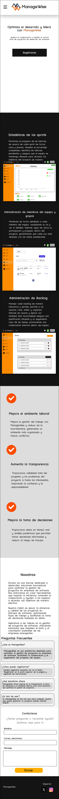
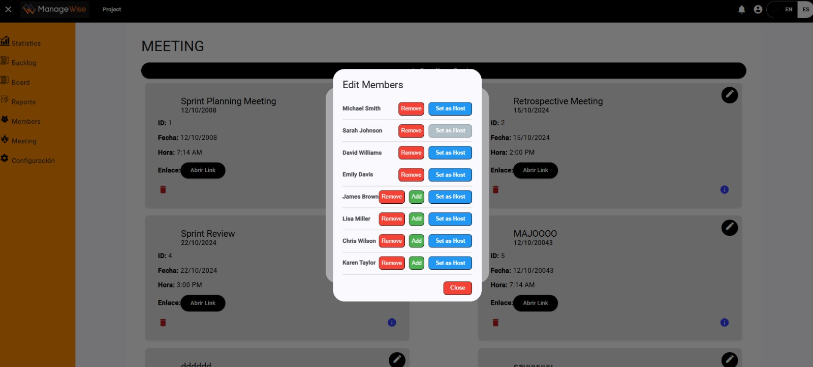
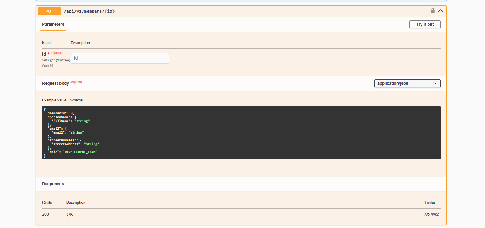
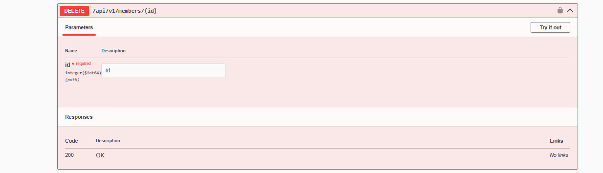

# Horizon

Product: ManageWise

# UNIVERSIDAD PERUANA DE CIENCIAS APLICADAS

<p align="center">
  
</p>

## Ingenieria de Software

## 5to ciclo

## Desarrollo de Aplicaciones Open Source

### **Sección:** WS53

### **Profesor:** Juan Antonio Flores Moroco

### Informe de Trabajo Final

### "Horizon"

### "ManageWise"

### **Integrantes:**

- Estefano Oscar Jaque Peña - u202225466
- Diego Rolin Acuña Tomas - u202221436
- John Telesforo Arevalo Meza - u202117377
- Valentino Sandoval Paiva - u20211a962
- Sergio André Gómez Vallejos - u20221d401

### Agosto, 2024

### Url del proyecto: https://github.com/Horizon-ManageWise/Horizon

## Registro de Versiones del Informe

| Version | Fecha      | Autor                    | Descripcion                                                                                                                                                                                                                                                                                 |
| ------- | ---------- | ------------------------ | ------------------------------------------------------------------------------------------------------------------------------------------------------------------------------------------------------------------------------------------------------------------------------------------- |
| TB1     | 26/08/2024 | Estefano Jaque           | Desarrollé el Lean UX Problem Statements,Lean UX Assumptions,Diseño de entrevistas,Coompetidores y Estrategias y tácticas frente a competidores                                                                                                                                             |
| TB1     | 05/09/2024 | Estefano Jaque           | Desarrollé las User Stories,Product Backlog, Class Diagrams, Class Dictionary, Database Diagram, Sprint Planning 1, Sprint Backlog 1                                                                                                                                                        |
| TB1     | 29/08/2024 | Valentino Sandoval Paiva | Desarrollé la Descripción de la Startup, Solution Profile, el regitro de una entrevista a un usuario del segmento 1 y 2, y realicé una entrevista.                                                                                                                                          |
| TB1     | 05/09/2024 | Valentino Sandoval Paiva | Desarrollé el Empathy Mapping, User Task Matrix, Style Guidelines y Software configuration Management                                                                                                                                                                                       |
| TB1     | 25/09/2024 | Diego Rolin Acuña Tomas  | Realice el Startup Profile. Completando los antecedentes y problematica                                                                                                                                                                                                                     |
| TB1     | 27/09/2024 | Diego Rolin Acuña Tomas  | Realice las entrevistas. Grabando y resumiendo para el Registro de entrevistas.                                                                                                                                                                                                             |
| TB1     | 1/09/2024  | Diego Rolin Acuña Tomas  | Complete el Ubiquitous Language. Realice el Domain-Driven Software Architecture al finalizar el Software Architecture Context Diagram, Software Architecture Container Diagrams y Software Architecture Components Diagrams.                                                                |
| TB1     | 6/09/2024  | Diego Rolin Acuña Tomas  | Desarrolle el Sprint 1, al desarrollar el Sprint Planning 1, Testing Suite Evidence for Sprint Review, Execution Evidence for Sprint Review, Services Documentation Evidence for Sprint Review, Software Deployment Evidence for Sprint Review y Team Collaboration Insights during Sprint. |
| TB1     | 8/09/2024  | Diego Rolin Acuña Tomas  | Desarrolle el Landing Page, cumpliendo los User Stories que me delegaron.                                                                                                                                                                                                                   |
| TB1     | 29/08/2024 | John Arévalo             | Desarrolle los as-is y to-be scenarios, además del registro de 1 entrevista por segmento objetivo.                                                                                                                                                                                          |
| TB1     | 6/09/2024  | John Arévalo             | Desarrolle los wireframes y mockups de la landing page, además de los wireframes, mockups, wireflows y user flows diagrams para la aplicación web.                                                                                                                                          |
| TB1     | 11/10/2024 | Sergio Gómez             | Desarrolle los mockups de la landing pagE, Landing Page Wireframe, conclusiones , Student Ourtcome.                                                                                                                                                                                         |
| TB1     | 8/09/2024  | John Arévalo             | Desarrolle el Landing Page, cumpliendo los User Stories que me delegaron.                                                                                                                                                                                                                   |
| TF1     | 16/10/2024 | Sergio Gómez             | Desarrolle el bounded context members del Backend, Landing Page Wireframe, Execution Evidence for Sprint Review , Student Ourtcome.                                                                                                                                                                                         |

## Project Report Collaboration Insights

|  URL de la organización del proyecto  |          URL del repositorio del reporte          |
| :-----------------------------------: | :-----------------------------------------------: |
| https://github.com/Horizon-ManageWise | https://github.com/Horizon-ManageWise/Horizon.git |

TP1: Se han realizado todas las tareas asignadas para la entrega del TP1, las cuales se encuentran registradas en el repositorio de Github de la organización del equipo bajo el enlace https://github.com/Horizon-ManageWise. Para elaborar el informe cada miembro corrigio y añadio puntos que se debian mejorar de la anterior entrega en el siguiente repositorio: https://github.com/Horizon-ManageWise/Horizon.git, de la misma manera para el desarrollo de la landing page se trabajo en este repositorio: https://github.com/Horizon-ManageWise/LandingPage.git . Sin embargo, para el desarollo de la Landing page tuvimos una modificaciones este último mes al integrarse un nuevo miembro al equipo y aportar con ideas nuevas para la landing page. Por ende, se muestran capturas de los commits del mes pasado y de este mes.

<br>**Vista de commits: Landing page:**  


- Estefano Oscar Jaque Peña: 1
- Diego Rolin Acuña Tomas: 1
- John Telesforo Arevalo Meza: 10
- Valentino Sandoval Paiva: 1
- Sergio André Gómez Vallejos: 8

<br>**Issues**


<br>**Report:**


- Estefano Oscar Jaque Peña: 55
- Diego Rolin Acuña Tomas: 52
- John Telesforo Arevalo Meza: 40
- Valentino Sandoval Paiva: 59
- Sergio André Gómez Vallejos: 13

TB1:<br>
|Integrante|Tarea Asignada|
|-|-|
|Jaque Peña, Estefano Oscar|Lean UX Problem Statements,Lean UX Assumptions,Diseño de entrevistas,Coompetidores,Estrategias y tácticas frente a competidores,User Stories,Product Backlog, Class Diagrams, Class Dictionary, Database Diagram, Sprint Planning 1, Sprint Backlog 1|
|Sandoval Paiva Valentino|Descripción de la Startup, 5w y 2h, Solution Profile, Antecedentes y problemática, el regitro de una entrevista , Empathy Mapping, User Task Matrix, Style Guidelines y Software configuration Management.|
| Diego Rolin Acuña Tomas | Startup Profile, Descripción de la Startup, Antecedentes y problemática, Entrevistas, Registro de entrevistas, User Personas, Ubiquitous Language, Domain-Driven Software Architecture, Software Architecture Context Diagram, Software Architecture Container Diagrams, Software Architecture Components Diagrams, Sprint 1, Sprint Planning 1, Testing Suite Evidence for Sprint Review, Execution Evidence for Sprint Review, Services Documentation Evidence for Sprint Review, Software Deployment Evidence for Sprint Review, Team Collaboration Insights during Sprint. |
| Arévalo Meza John | Segmentos objetivos, registro de entrevistas, as-is scenario mapping, to-be scenario mapping, landing page wireframes, landing page mockups, web application wireframes, web application mockups, web applications wireflow diagrams, web applications user flow diagrams, desarrollo de la landing page. |
| Sergio André Gómez Vallejos | Student outcome , conclusiones, Landing Page Wireframe, Landing Page Mock-up, Testing Suite Evidence for Sprint Review, landing page mockups, web application wireframes, web application mockups, wSoftware Deployment Evidence for Sprint Review |

## Contenido

### Tabla de contenidos

  - [Student Outcome](#student-outcome)
  - [Capítulo I: Introducción](#capítulo-i-introducción)
    - [1.1. Startup Profile](#11-startup-profile)
    - [1.1.1. Descripción de la Startup](#111-descripción-de-la-startup)
    - [1.1.2. Perfiles de integrantes del equipo](#112-perfiles-de-integrantes-del-equipo)
    - [1.2. Solution Profile](#12-solution-profile)
    - [1.2.1. Antecedentes y problemática](#121-antecedentes-y-problemática)
    - [1.2.2. Lean UX Process](#122-lean-ux-process)
    - [1.2.2.1. Lean UX Problem Statements](#1221-lean-ux-problem-statements)
    - [1.2.2.2. Lean UX Assumptions](#1222-lean-ux-assumptions)
    - [1.2.2.3. Lean UX Hypothesis Statements](#1223-lean-ux-hypothesis-statements)
    - [1.2.2.4. Lean UX Canvas](#1224-lean-ux-canvas)
    - [1.3. Segmentos objetivo](#13-segmentos-objetivo)
  - [Capítulo II: Requirements Elicitation \& Analysis](#capítulo-ii-requirements-elicitation--analysis)
    - [2.1. Competidores](#21-competidores)
    - [2.1.1. Análisis competitivo](#211-análisis-competitivo)
    - [2.1.2. Estrategias y tácticas frente a competidores](#212-estrategias-y-tácticas-frente-a-competidores)
    - [2.2. Entrevistas](#22-entrevistas)
    - [2.2.1. Diseño de entrevistas](#221-diseño-de-entrevistas)
    - [2.2.2. Registro de entrevistas](#222-registro-de-entrevistas)
    - [2.2.3. Análisis de entrevistas](#223-análisis-de-entrevistas)
    - [2.3. Needfinding](#23-needfinding)
    - [2.3.1. User Personas](#231-user-personas)
    - [2.3.2. User Task Matrix](#232-user-task-matrix)
    - [2.3.3. User Journey Mapping](#233-user-journey-mapping)
    - [2.3.4. Empathy Mapping](#234-empathy-mapping)
    - [2.3.5. As-is Scenario Mapping](#235-as-is-scenario-mapping)
    - [2.4. Ubiquitous Language](#24-ubiquitous-language)
  - [Capítulo III: Requirements Specification](#capítulo-iii-requirements-specification)
    - [3.1. To-Be Scenario Mapping](#31-to-be-scenario-mapping)
    - [3.2. User Stories](#32-user-stories)
    - [3.3. Impact Mapping](#33-impact-mapping)
    - [3.4. Product Backlog](#34-product-backlog)
  - [Capítulo IV: Product Design](#capítulo-iv-product-design)
    - [4.1. Style Guidelines.](#41-style-guidelines)
    - [4.1.1. General Style Guidelines.](#411-general-style-guidelines)
    - [4.1.2. Web Style Guidelines.](#412-web-style-guidelines)
    - [4.2. Information Architecture](#42-information-architecture)
      - [4.2.1. Organization Systems](#421-organization-systems)
      - [4.2.2. Labeling Systems](#422-labeling-systems)
      - [4.2.3. SEO Tags and Meta Tags](#423-seo-tags-and-meta-tags)
      - [4.2.4. Searching Systems](#424-searching-systems)
      - [4.2.5. Navigation Systems](#425-navigation-systems)
    - [4.3. Landing Page UI Design](#43-landing-page-ui-design)
      - [4.3.1. Landing Page Wireframe](#431-landing-page-wireframe)
        - [Desktop Web Browser:](#desktop-web-browser)
        - [Mobile Web Browser:](#mobile-web-browser)
      - [4.3.2. Landing Page Mock-up](#432-landing-page-mock-up)
        - [Desktop Web Browser:](#desktop-web-browser-1)
        - [Mobile Web Browser:](#mobile-web-browser-1)
    - [4.4. Web Applications UX/UI Design](#44-web-applications-uxui-design)
      - [4.4.1. Web Applications Wireframes](#441-web-applications-wireframes)
      - [4.4.2. Web Applications Wireflow Diagrams](#442-web-applications-wireflow-diagrams)
      - [4.4.3. Web Applications Mock-ups](#443-web-applications-mock-ups)
      - [4.4.4. Web Applications User Flow Diagrams](#444-web-applications-user-flow-diagrams)
    - [4.5. Web Applications Prototyping](#45-web-applications-prototyping)
    - [4.6. Domain-Driven Software Architecture](#46-domain-driven-software-architecture)
    - [4.6.1. Software Architecture Context Diagram](#461-software-architecture-context-diagram)
    - [4.6.2. Software Architecture Container Diagrams](#462-software-architecture-container-diagrams)
    - [4.6.3. Software Architecture Components Diagrams](#463-software-architecture-components-diagrams)
    - [4.7. Software Object-Oriented Design](#47-software-object-oriented-design)
      - [4.7.1. Class Diagrams](#471-class-diagrams)
    - [4.8. Database Design](#48-database-design)
    - [4.7.2. Database Dictionary](#472-database-dictionary)
      - [4.8.1. Database Diagram](#481-database-diagram)
  - [Capítulo V: Product Implementation, Validation \& Deploymentt](#capítulo-v-product-implementation-validation--deploymentt)
    - [5.1. Software Configuration Management.](#51-software-configuration-management)
    - [5.1.1. Software Development Environment Configuration.](#511-software-development-environment-configuration)
  - [Diseño y Desarrollo](#diseño-y-desarrollo)
    - [5.1.2. Source Code Management.](#512-source-code-management)
    - [5.1.3. Source Code Style Guide \& Conventions.](#513-source-code-style-guide--conventions)
    - [5.1.4. Software Deployment Configuration.](#514-software-deployment-configuration)
    - [5.2 Landing Page, Services \& Applications Implementation.](#52-landing-page-services--applications-implementation)
    - [5.2.1 . Sprint 1](#521--sprint-1)
      - [5.2.1.1 Sprint Planning 1.](#5211-sprint-planning-1)
      - [5.2.1.2 Sprint Backlog 1.](#5212-sprint-backlog-1)
      - [5.2.1.3 Development Evidence for Sprint Review](#5213-development-evidence-for-sprint-review)
      - [5.2.1.4 Testing Suite Evidence for Sprint Review.](#5214-testing-suite-evidence-for-sprint-review)
      - [5.2.1.5 Execution Evidence for Sprint Review.](#5215-execution-evidence-for-sprint-review)
      - [5.2.1.6 Services Documentation Evidence for Sprint Review.](#5216-services-documentation-evidence-for-sprint-review)
      - [5.2.1.7 Software Deployment Evidence for Sprint Review.](#5217-software-deployment-evidence-for-sprint-review)
      - [5.2.1.8 Team Collaboration Insights during Sprint.](#5218-team-collaboration-insights-during-sprint)
    - [5.2.2 . Sprint 2](#522--sprint-2)
      - [5.2.2.1 Sprint Planning 2.](#5221-sprint-planning-2)
      - [5.2.2.2 Sprint Backlog 2.](#5222-sprint-backlog-2)
      - [5.2.2.3 Development Evidence for Sprint Review](#5223-development-evidence-for-sprint-review)
      - [5.2.2.4 Testing Suite Evidence for Sprint Review.](#5224-testing-suite-evidence-for-sprint-review)
      - [5.2.2.5 Execution Evidence for Sprint Review.](#5225-execution-evidence-for-sprint-review)
      - [5.2.2.6 Services Documentation Evidence for Sprint Review.](#5226-services-documentation-evidence-for-sprint-review)
      - [5.2.2.7 Software Deployment Evidence for Sprint Review.](#5227-software-deployment-evidence-for-sprint-review)
      - [5.2.2.8 Team Collaboration Insights during Sprint.](#5228-team-collaboration-insights-during-sprint)
    - [5.2.3 . Sprint 3](#523--sprint-3)
      - [5.2.3.1 Sprint Planning 3.](#5231-sprint-planning-3)
      - [5.2.3.2 Sprint Backlog 3.](#5232-sprint-backlog-3)
      - [5.2.3.3 Development Evidence for Sprint Review](#5233-development-evidence-for-sprint-review)
      - [5.2.3.4 Testing Suite Evidence for Sprint Review.](#5234-testing-suite-evidence-for-sprint-review)
      - [5.2.3.5 Execution Evidence for Sprint Review.](#5235-execution-evidence-for-sprint-review)
      - [5.2.3.6 Services Documentation Evidence for Sprint Review.](#5236-services-documentation-evidence-for-sprint-review)
      - [5.2.3.7 Software Deployment Evidence for Sprint Review.](#5237-software-deployment-evidence-for-sprint-review)
      - [5.2.3.8 Team Collaboration Insights during Sprint.](#5238-team-collaboration-insights-during-sprint)
    - [5.2.4 . Sprint 4](#524--sprint-4)
      - [5.2.4.1 Sprint Planning 4.](#5241-sprint-planning-4)
      - [5.2.4.2 Sprint Backlog 4.](#5242-sprint-backlog-4)
      - [5.2.4.3 Development Evidence for Sprint Review](#5243-development-evidence-for-sprint-review)
      - [5.2.4.4 Testing Suite Evidence for Sprint Review.](#5244-testing-suite-evidence-for-sprint-review)
      - [5.2.4.5 Execution Evidence for Sprint Review.](#5245-execution-evidence-for-sprint-review)
      - [5.2.4.6 Services Documentation Evidence for Sprint Review.](#5246-services-documentation-evidence-for-sprint-review)
      - [5.2.4.7 Software Deployment Evidence for Sprint Review.](#5247-software-deployment-evidence-for-sprint-review)
      - [5.2.4.8 Team Collaboration Insights during Sprint.](#5248-team-collaboration-insights-during-sprint)
    - [5.3 Validation Interviews](#53-validation-interviews)
      - [5.3.1 Diseño de Entrevistas](#531-diseño-de-entrevistas)
      - [5.3.2 Registro de Entrevistas](#532-registro-de-entrevistas)
      - [5.3.3 Evaluaciones según Heurísticas](#533-evaluaciones-según-heurísticas)
    - [5.4 Video About-the-Product](#54-video-about-the-product)
    - [Conclusiones](#conclusiones)
    - [Bibliografia](#bibliografia)
    - [Anexos](#anexos)

## Student Outcome

_ABET – EAC - Student Outcome 3_  
**Criterio:** Capacidad de comunicarse efectivamente con un rango de audiencias.

En el siguiente cuadro se describen las acciones realizadas y enunciados de conclusiones por parte del grupo, que permiten sustentar el haber alcanzado el logro del ABET - EAC - Student Outcome 3.

| Criterio especifico | Acciones Realizadas| Conclusiones|
| :-- | :-- | -- |
| 1. Comunica oralmente con efectividad a diferentes rangos de audiencia   | TB1:<br>**Estefano Oscar Jaque Peña**<br>TB1: Realice el Lean UX Prolem statements y los assumptions luego de ello apoye con el diseño de la pregunta para las entrevistas .Para los siguientes capitulos realice el diagrama de base de dato y de diagrama de clase, asi como el database dictionary.Para finalizar con mi aporte en el grupo realice el Sprint planning y el Sprint Backlog<br>**Diego Rolin Acuña Tomas**<br> TB1: Durante mi participación en la creación del TB1, tuvimos muchas reuniones por Dioscord para separar tareas, elegir los user stories que implementaremos, además de elegir que herramientas usaremos en la jornada. Tuve que hablar claro y demostrar mis ideas. Además de practicar la comunicación para ayudar en la exposición del trabajo.**Valentino Sandoval Paiva** <br>TB1: Para esta entrega, realicé una matriz de tareas de usuario para entender mejor las necesidades y prioridades de nuestros usuarios. También desarrollé un mapa de empatía para identificar sus emociones y comportamientos clave. Establecí directrices de estilo generales y específicas para la web para garantizar una presentación coherente y efectiva. Configuré el entorno de desarrollo, gestioné el código fuente y definí normas para su estilo y convenciones. Finalmente, preparé la configuración para el despliegue del software, asegurando una implementación fluida y exitosa. <br>**John Arévalo Meza** <br>TB1: Para esta entrega realicé los segmentos objetivos, asis scenario mapping, tobe scenario mapping, landing page wireframes y mockups, web application wireframes, mockups, wireflow and user flow diagrams y el registro de 1 entrevista por cada segmento objetivo.<br>**Sergio André Gómez Vallejos**<br>TB1:Presenté de manera clara y adaptada los avances y resultados del proyecto, asegurándome de que todos los miembros del equipo y las audiencias externas comprendieran los aspectos técnicos y estratégicos, lo que facilitó la toma de decisiones informadas.<br>**Sergio André Gómez Vallejos**<br>TF: Durante la fase final del proyecto, me aseguré de comunicar de manera clara y técnica las actualizaciones realizadas en el backend, explicando cómo las optimizaciones en el código y la integración de servicios mejoraron el rendimiento del sistema. Además, expuse los ajustes finales necesarios para alinear el producto con los requerimientos establecidos, facilitando la validación por parte del equipo y asegurando su comprensión incluso para quienes no estaban familiarizados con los detalles técnicos.|**Estefano Oscar Jaque Peña**<br>TB1:Durante mi participación, comuniqué de manera clara los aspectos técnicos y estratégicos en reuniones y planificación. Presenté los diagramas y el Sprint Backlog adaptando mi lenguaje a audiencias con diferentes niveles de experiencia, asegurando que todos comprendieran la lógica del proyecto. <br>**John Telesforo Arevalo Meza**<br> TB1:<br> A lo largo de la TB1, la comnunicación oral fue de suma importancia, ya que gracias a esta pudimos empatizar con los segmentos objetivos, así como dar a conocer de manera correcta nuestras ideas, además logramos compenetrar mejor como equipo y así realizar un trabajo exitoso.<br>**Sergio André Gómez Vallejos**<br>TB1:Durante mi participación desarrollé de manera puntual y clara con algunas secciones del documento, como los Mockoups, testing, etc. Me asegure de cumplir y transmitir los avances del documento del TB1.<br>**Valentino Sandoval Paiva**<br>TB1:En esta TB1, durante la exposición de los resultados del desarrollo de Lean UX Hypothesis Statements, Lean UX Canvas, y el análisis de entrevistas, se demostró una habilidad sólida para comunicar oralmente con efectividad a diferentes audiencias. Para los líderes, se presentó el impacto estratégico del To-Be Scenario Mapping y el Impact Mapping, destacando cómo estos instrumentos contribuyen al éxito del proyecto. Con el equipo de desarrollo, se hizo énfasis en las User Stories y la Information Architecture, explicando su relevancia en términos técnicos y prácticos para la ejecución del proyecto.<br>**Diego Rolin Acuña Tomas**<br> TB1: Durante mi participación en la creación del TB1, tuvimos muchas reuniones por Dioscord para separar tareas, elegir los user stories que implementaremos, además de elegir que herramientas usaremos en la jornada. Tuve que hablar claro y demostrar mis ideas. Además de practicar la comunicación para ayudar en la exposición del trabajo.|
| 2. Comunica por escrito con efectividad a diferentes rangos de audiencia | TB1:<br> **Estefano Oscar Jaque Peña**<br>TB1: Realice el Lean UX Prolem statements y los assumptions luego de ello apoye con el diseño de la pregunta para las entrevistas .Para los siguientes capitulos realice el diagrama de base de dato y de diagrama de clase, asi como el database dictionary.Para finalizar con mi aporte en el grupo realice el Sprint planning y el Sprint Backlog<br>**Diego Rolin Acuña Tomas**<br> TB1: Durante mi participación comprendí la importancia de dejar un documento con las pruebas de tu trabajo en el primer sprint, también aprendí a usar herramienta para crear los modelos C4. Escribirlo para mis compañeros ayudara a una comunicación menos repetitiva, pues podrán conocer sin necesidad de esperar a las reuniones.<br>**Sergio André Gómez Vallejos**<br>TB1:Redacté el informe sobre el proyecto, ajustando el lenguaje y la estructura para que fueran accesibles tanto para compañeros técnicos como para audiencias no técnicas, garantizando la comprensión y utilidad de la información compartida.<br>**John Telesforo Arevalo Meza**<br> Para esta entrega realicé los segmentos objetivos, asis scenario mapping, tobe scenario mapping, landing page wireframes y mockups, web application wireframes, mockups, wireflow and user flow diagrams y el registro de 1 entrevista por cada segmento objetivo. Además de la creación de la landgin page en base a el us asignado<br>**Valentino Sandoval Paiva** <br>TB1: "Al abordar esta entrega, analicé las tareas y necesidades de los usuarios para optimizar la experiencia del software. Desarrollé directrices de estilo para asegurar una presentación coherente, configuré el entorno de desarrollo y gestioné el código fuente. Además, preparé la configuración necesaria para un despliegue exitoso del software.| <br> **Valentino Sandoval Paiva**<br> TB1:<br> En esta TB1, la comunicación escrita ha sido clave para asegurar que todas las partes involucradas, desde líderes hasta miembros del equipo, comprendan claramente los objetivos, estrategias y decisiones tomadas. Se utilizó un lenguaje claro y conciso en la planificación y documentación, ajustando el nivel de detalle según la audiencia: proporcionando explicaciones estratégicas para los líderes y directrices más técnicas para el equipo de desarrollo. Esto garantizó una alineación efectiva entre todos los participantes, fomentando la colaboración y facilitando la toma de decisiones informadas basadas en datos compartidos y análisis grupales.<br>**Estefano Oscar Jaque Peña**<br>TB1:A lo largo del proyecto, redacté documentación clara y precisa, como los problem statements, assumptions, y el database dictionary, ajustando el nivel de detalle según la audiencia. Esto garantizó la comprensión y alineación de todo el equipo para una ejecución eficiente del proyecto. <br>**Sergio André Gómez Vallejos**<br>TB1:Durante el proyecto coloque y redacté documentación de manera clara y efectiva, como el testing, landing page, entre muchas otras secciones. Con el fin de mejorar y asegurar al documento para un proceso garantizado del proyecto. <br> **John Telesforo Arevalo Meza**<br> TB1:<br> Durante la Tb1, la comunicación escrita ha se de suma importancia, puesto que gracias a esta pudimos reconocer las necesidades de nuestros segmentos objetivos ,además de mejorar el trabajo en grupo y la organización en general<br>**Diego Rolin Acuña Tomas**<br> TB1: Durante mi participación comprendí la importancia de dejar un documento con las pruebas de tu trabajo en el primer sprint, también aprendí a usar herramienta para crear los modelos C4. Escribirlo para mis compañeros ayudara a una comunicación menos repetitiva, pues podrán conocer sin necesidad de esperar a las reuniones.<br>**Sergio André Gómez Vallejos**<br> TF: Elaboré documentación técnica detallada sobre las funcionalidades implementadas en el backend, incluyendo diagramas y explicaciones claras que facilitaron su comprensión por parte del equipo técnico. Además, preparé reportes ejecutivos y resúmenes adaptados para audiencias no técnicas, destacando los impactos clave y las mejoras realizadas en el sistema, garantizando que cada grupo recibiera la información necesaria de manera precisa y comprensible.<br>|

## Capítulo I: Introducción

### 1.1. Startup Profile

### 1.1.1. Descripción de la Startup

Horizon es una startup innovadora creada por estudiantes de la Facultad de Ingeniería de la Universidad Privada de Ciencias Aplicadas (UPC).
Las empresas emergentes en el sector del desarrollo de software enfrentan una serie de desafíos únicos, entre los cuales se destaca la carencia de herramientas eficaces para gestionar proyectos e iniciativas.
Esta falta de recursos puede limitar el crecimiento y la capacidad de estas empresas para competir en un mercado cada vez más exigente.
Con el objetivo de proporcionar un apoyo significativo a estas startups, estamos desarrollando un software que no solo mejorará la eficiencia en la gestión de iniciativas, sino que también fomentará una cultura de innovación y adaptabilidad.
Este software integrará tecnologías avanzadas para ofrecer análisis predictivos y automatización de tareas, y bases de datos robustas para una gestión efectiva de la información. Además, nuestro software incluirá características personalizables para adaptarse a las necesidades específicas de cada empresa, permitiendo una integración fluida con sus procesos existentes y facilitando una colaboración más eficiente entre equipos.

Misión:
Nuestra misión es elevar la eficiencia, calidad y rentabilidad de los proyectos en startups pequeñas de desarrollo de software mediante la optimización de sus procesos de gestión de iniciativas. Buscamos ofrecer soluciones innovadoras que no solo simplifiquen y agilicen los flujos de trabajo, sino que también fomenten la colaboración efectiva y la toma de decisiones basada en datos.
Nuestra misión es no solo ser un proveedor de herramientas de gestión, sino un socio estratégico en el camino hacia el éxito y el crecimiento sostenido de nuestras empresas clientes.

Visión:
Aspiramos a convertirnos en el referente principal en la optimización de la gestión de proyectos para startups de desarrollo de software, siendo reconocidos no solo por nuestras soluciones innovadoras, sino también por nuestra capacidad de transformar y potenciar el éxito de las empresas emergentes. Queremos ser el socio estratégico preferido que permita a las startups no solo alcanzar sus metas, sino superar sus expectativas y mantenerse a la vanguardia en un entorno tecnológico en constante evolución.
Nuestro objetivo es liderar el mercado con herramientas que no sólo aborden las necesidades actuales, sino que también anticipen las tendencias futuras y adapten nuestras soluciones a los cambios del sector. Planeamos desarrollar capacidades adicionales como la integración con plataformas emergentes, el soporte para metodologías ágiles avanzadas y la incorporación de funciones de colaboración global para equipos distribuidos.

### 1.1.2. Perfiles de integrantes del equipo

- Estefano Oscar Jaque Peña - U202225466

| <p align="center"></p> | Soy Estefano Oscar Jaque Peña, tengo 23 años y soy estudiante de la carrera de Ingeniería de Software,<br> una disciplina enfocada en el diseño, desarrollo y gestión de software para solucionar problemas <br>complejos. Desde temprana edad, he sentido fascinación por la tecnología y he buscado aprender <br>constantemente sobre las últimas tendencias en programación. He ampliado mis conocimientos a <br>través de cursos en Python, SQL, y C++, así como también explorando otros lenguajes de programación <br>por mi cuenta. Además, tengo habilidades en el uso avanzado de Excel para análisis de datos y gestión<br> de información. Mi experiencia trabajando en equipos me ha brindado habilidades de comunicación y <br>colaboración que considero fundamentales para contribuir de manera efectiva a proyectos innovadores<br> en el área de la Ingeniería de Software. |
| --------------------------------------------------------------------------------------------- | :------------------------------------------------------------------------------------------------------------------------------------------------------------------------------------------------------------------------------------------------------------------------------------------------------------------------------------------------------------------------------------------------------------------------------------------------------------------------------------------------------------------------------------------------------------------------------------------------------------------------------------------------------------------------------------------------------------------------------------------------------------------------------------------------------------------------------------------------------------------------------------------- |

- Diego Rolin Acuña Tomas - U202221436

| <p align="center"></p> | Soy Diego Rolin Acuña Tomas, tengo 22 años y estoy cursando la carrera de Ingeniería de Software en la Universidad Peruana de Ciencias Aplicadas. Desde una temprana edad me han facinado las computadoras y como se mostraban en las peliculas los expertos en informatica. Hoy en dia entiendo la importancia de mi disciplina en el mundo y quisiera ser parte de las ventajas que pueden proveer los conocimientos en el campo de la informática y la ciencia de la computación. He llevado cursos para aprender lenguajes como Python, C++ y MATLAB, aprendiendo patrones de algoritmo para mi vida profecional. Tambien conosco los tipos de base de datos, aprendi sql server para la bases de datos relacional y mongo DB para bases de datos no relaciones. Quiero seguir mejorando mis habilidades y especializarme en DataScience y Gestión de proyectos. |
| ----------------------------------------------------------------------------------------- | :------------------------------------------------------------------------------------------------------------------------------------------------------------------------------------------------------------------------------------------------------------------------------------------------------------------------------------------------------------------------------------------------------------------------------------------------------------------------------------------------------------------------------------------------------------------------------------------------------------------------------------------------------------------------------------------------------------------------------------------------------------------------------------------------------------------------------------------------------------------- |

- Valentino Sandoval Paiva - U20211A962

| <p align="center"></p> | Mi nombre es Valentino Sandoval, tengo 19 años y soy estudiante de la carrera de Ingeniería de Software, cursando el 4to ciclo. Siempre he estado interesado en la tecnología, el software y hardware de las computadoras. Además, me gustan mucho los videojuegos, esto me llevo a decidirme a estudiar esta carrera. |
| ------------------------------------------------------------------------------------ | :--------------------------------------------------------------------------------------------------------------------------------------------------------------------------------------------------------------------------------------------------------------------------------------------------------------------- |

- John Telésforo Arévalo Meza - U202117377

| <p align="center"> </p> | Soy John Arévalo, tengo 20 años y soy estudiante de la carrera de Ingeniería de Software. Tengo conocimiento en lenguajes de programación como python y c++, y bases de datos como SQLServer y MongoDB. Desde pequeño me sentí atraído por la tecnología, por lo que me decidí a estudiar la carrera, además disfruto de jugar videojuegos con amigos en mi tiempo libre. |
| :---------------------------------------------------------------------------- | ------------------------------------------------------------------------------------------------------------------------------------------------------------------------------------------------------------------------------------------------------------------------------------------------------------------------------------------------------------------------- |

- Sergio André Gómez Vallejos – U20221d401

| <p align="center"> </p> | Soy una persona resiliente que, sin importar cuántas veces caiga, siempre encuentra la manera de levantarse. Tengo habilidades sociales sólidas y una amplia experiencia en la resolución de problemas de código. Suelo ser el miembro más activo de mi equipo de trabajo. Me apasionan los lenguajes de programación y la tecnología, y constantemente me esfuerzo por alcanzar mis objetivos y contribuir al desarrollo del startup. |
| :-------------------------------------------------------------------------------------- | -------------------------------------------------------------------------------------------------------------------------------------------------------------------------------------------------------------------------------------------------------------------------------------------------------------------------------------------------------------------------------------------------------------------------------------- |

### 1.2. Solution Profile

### 1.2.1. Antecedentes y problemática

Las empresas de desarrollo de software operan en un entorno de alta competencia e incertidumbre, donde es fundamental cumplir con proyectos que apoyen sus objetivos estratégicos. La gestión eficaz de estos proyectos requiere tanto habilidades especializadas como herramientas que permitan un seguimiento adecuado. Sin embargo, incluso los project managers más capacitados carecen a menudo de herramientas que les proporcionen una visibilidad clara del progreso. Esta falta de control incrementa el riesgo de fracaso en los proyectos y afecta negativamente el rendimiento y la capacidad de la organización para alcanzar sus objetivos.

**What?**

**¿Qué problema hay?**  
El principal problema radica en la falta de herramientas especializadas diseñadas para gestionar de manera eficaz proyectos de software que siguen metodologías ágiles como Scrum. Estas herramientas deben ser capaces de dar soporte a las dinámicas rápidas y cambiantes de estos proyectos, así como de ofrecer visibilidad en tiempo real sobre el progreso y los posibles obstáculos. La ausencia de estas soluciones lleva a una gestión ineficiente de proyectos, lo que se traduce en:

Retrasos en las entregas: Dificultad para cumplir con los plazos establecidos en cada sprint.
Baja calidad del producto: Mayor probabilidad de errores y defectos en el software desarrollado.
Desmotivación del equipo: La falta de herramientas adecuadas puede generar frustración y reducir la productividad del equipo de desarrollo.
Dificultad para tomar decisiones basadas en datos: La falta de visibilidad sobre el progreso del proyecto impide una toma de decisiones informada.

**¿Qué relación tiene el problema con el usuario/cliente?**  
Para las startups de desarrollo de software que utilizan Scrum, este problema se traduce en una pérdida de competitividad, mayor riesgo de fracaso de los proyectos y disminución de la satisfacción del cliente. Los equipos de desarrollo se ven afectados por la sobrecarga de trabajo, la falta de claridad en las tareas y la dificultad para adaptarse a los cambios constantes. Por otro lado, los clientes experimentan retrasos en la entrega del producto, una menor calidad del software y una comunicación poco efectiva con el equipo de desarrollo.

**When?**

**¿Cuándo sucede el problema?**  
El problema se manifiesta a lo largo de todo el ciclo de vida de un proyecto Scrum. Desde la planificación inicial, pasando por la ejecución de los sprints, hasta la revisión y adaptación del producto. La falta de herramientas adecuadas dificulta la gestión de cada una de estas etapas, generando cuellos de botella y retrasos.

**¿Cuándo utiliza el cliente el producto?**  
Los clientes utilizarán ManageWise a lo largo de todo el ciclo de vida de sus proyectos, desde la fase de planificación inicial hasta la implementación y revisión de tareas.

**Where?**

**¿Dónde ocurre el problema?**  
El problema se presenta en todos los entornos de trabajo donde se desarrollan proyectos de software, tanto en oficinas físicas como en entornos de trabajo remoto. La falta de una plataforma centralizada para la gestión del proyecto dificulta la colaboración entre los miembros del equipo y la visibilidad del progreso.

**¿Dónde está el cliente cuando usa el producto?**  
Los clientes pueden usar ManageWise en sus oficinas, espacios de trabajo remoto o durante reuniones virtuales de equipo.

**Who?**

**¿Quiénes son los involucrados en este problema?**  
Los principales actores involucrados son los equipos de desarrollo de software, los product owners y los scrum masters. También se ven afectados los inversores y los clientes, ya que los problemas en la gestión del proyecto pueden impactar directamente en el éxito del producto y la satisfacción del cliente.

**¿Quiénes están afectados por el problema?**  
Los equipos de desarrollo de software y los líderes de empresas de software son los principales afectados. Los desarrolladores enfrentan dificultades para completar tareas a tiempo y gestionar recursos, mientras que los líderes sufren por la falta de control, planificación ineficaz y dificultades para cumplir con los plazos.

**Why?**

**¿Por qué ocurre el problema?**  
El problema surge principalmente debido a la falta de adaptación de las herramientas de gestión de proyectos tradicionales a las necesidades específicas de los proyectos Scrum. Estas herramientas suelen estar diseñadas para proyectos más grandes y complejos, y no ofrecen las funcionalidades necesarias para gestionar de manera ágil y eficiente los proyectos de software.

**How?**

**¿En qué condiciones los clientes usan nuestro producto?**  
 Los ususarios-clientes utilizan el software en condiciones de alta demanda, donde la eficiencia y la capacidad de adaptación son cruciales para la gestión de proyectos. Además, los clientes lo emplearán durante todas las fases del ciclo de vida de un proyecto: planificación, ejecución, monitoreo y revisión.

**¿Cómo nos conocieron los compradores?**  
Los compradores potenciales conocen ManageWise a través de diversos canales, como recomendaciones de colegas en la industria del software, marketing digital, eventos de tecnología y conferencias, y a través de contenido relevante publicado en blogs y redes sociales.

**¿Qué llevó a la persona a llegar a esta situación?**  
Las personas llegaron a la situación de buscar una solución como ManageWise debido a los desafíos enfrentados con las herramientas de gestión de proyectos actuales, que no satisfacen las necesidades específicas de las startups de desarrollo de software. Estos desafíos incluyen la falta de características avanzadas, como análisis predictivos, automatización de tareas, y personalización. Los clientes buscan una solución que les permita mejorar la eficiencia, la colaboración y la gestión de proyectos para poder competir eficazmente en el mercado.

**How much?**

**¿Cuánto cuesta este problema?**  
La carencia de herramientas avanzadas para la gestión de proyectos en startups de desarrollo de software conlleva graves consecuencias.El Standish Group CHAOS Report 2020 revela que el 45% de los proyectos de software se retrasan significativamente, y aproximadamente el 19% se consideran fracasos completos debido a problemas en la gestión y falta de herramientas adecuadas.


Los costos operativos también se ven incrementados significativamente. Un análisis de Gartner indica que las empresas que no cuentan con herramientas adecuadas pueden enfrentar un aumento del 25% en sus costos operativos debido a ineficiencias. La insatisfacción con las herramientas actuales es alta, con un 40% de los equipos de desarrollo reportando descontento, según un estudio de Atlassian. Finalmente, un informe de Forrester revela que el 50% de las decisiones en proyectos de software se basan en datos insuficientes, lo que afecta la calidad de la toma de decisiones y el éxito general de los proyectos.

### 1.2.2. Lean UX Process

El proceso Lean UX se adapta especialmente bien a startups como Horizon que buscan crear soluciones innovadoras y efectivas en el mercado. Este enfoque se caracteriza por su agilidad y centrado en el usuario, lo que significa que estamos constantemente buscando validar nuestras ideas y prototipos con los usuarios para garantizar que estamos abordando sus necesidades de manera adecuada.

### 1.2.2.1. Lean UX Problem Statements

El objetivo es gestionar proyectos de software de manera eficiente, mejorando la planificación, la asignación de recursos y el monitoreo del progreso en tiempo real.
Actualmente, la falta de herramientas especializadas para la gestión de proyectos en el desarrollo de software está afectando la eficiencia y la capacidad de cumplir con los plazos. Las soluciones genéricas no abordan las complejidades particulares de este tipo de proyectos, lo que resulta en retrasos, recursos mal asignados y problemas no resueltos a tiempo.
Se requiere una mejora en la gestión de proyectos que permita optimizar la planificación y supervisión, brindando una mayor visibilidad del progreso y una asignación más eficiente de recursos, sin imponer una solución específica.

### 1.2.2.2. Lean UX Assumptions

Assumptions:

1. Creo que mis clientes necesitan una forma más eficiente de gestionar proyectos e iniciativas dentro de sus empresas emergentes de desarrollo de software.

2. Estas necesidades se pueden resolver con una herramienta de gestión de proyectos ágil(metologia Scrum) y adaptable que se integre fácilmente con los flujos de trabajo existentes.

3. Mis clientes iniciales serán startups emergentes de tecnología que buscan mejorar la eficiencia y la colaboración en sus equipos de desarrollo.

4. El valor que un cliente quiere de mi servicio que requieren los usuarios es una plataforma intuitiva que les permita planificar, seguir y adaptarse rápidamente a los cambios en sus proyectos.

5. El cliente también puede obtener estos beneficios adicionales en donde implementaremos integraciones con herramientas populares de desarrollo de software.

6. Voy a adquirir la mayoría de mis clientes a través de estrategias de marketing digital dirigidas a startups de tecnología y a través de referencias de clientes satisfechos.

7. Haré dinero a través de un modelo de suscripción mensual o anual, ofreciendo diferentes niveles de funcionalidad según las necesidades del cliente y mediante publicidad dentro de nuestra plataforma .

8. Mi competencia principal en el mercado serán Trello, Wrike y ClickUp.

9. Los venceremos debido a nuestra facilidad de uso, integraciones flexibles y enfoque en las necesidades específicas de las empresas emergentes de desarrollo de software.

10. Mi mayor riesgo de producto es la falta de adopción por parte de los equipos de desarrollo, debido a la resistencia al cambio o a la preferencia por soluciones existentes.

11. ¿Quién es el usuario?  
    Los usuarios son lideres o gerentes de proyectos de software en los que se encuetran el Product Owner y el Scrum master .Ademas, los equipos de desarrollo de software.

12. ¿Dónde encaja nuestra empresa en su trabajo o vida?  
    Nuestra empresa se posiciona como proveedora de herramientas de gestión de proyectos e iniciativas para facilitar el desarrollo de software en empresas emergentes.

13. ¿Qué problemas tiene nuestra empresa?  
    Nos enfrentamos a la falta de herramientas especializadas que se adapten a las necesidades únicas de las empresas emergentes de desarrollo de software, lo que dificulta la gestión eficiente de proyectos y recursos.

14. ¿Cuándo y cómo es nuestra empresa?  
    Nuestra empresa está en una etapa inicial, ofreciendo soluciones ágiles y flexibles que se ajustan a las demandas cambiantes del mercado de desarrollo de software.

15. ¿Qué características son importantes?  
    Las características importantes incluyen una interfaz intuitiva y fácil de usar, capacidades para la gestión de tareas y asignación de recursos, así como integraciones con herramientas populares de desarrollo de software.

16. ¿Cómo debe verse nuestra empresa y comportarse?  
    Nuestra empresa debe presentarse como un aliado confiable que simplifica y optimiza la gestión de proyectos de desarrollo de software, siendo receptiva a las sugerencias de los usuarios y comprometida con la innovación y la mejora continua.

Business Outcomes:

- Incrementar la base de usuarios activos en un 12% durante el primer semestre, enfocado principalmente en startups de desarrollo de software.
- Reducir los costos operativos relacionados con la gestión de proyectos en un 18% en los primeros 9 meses mediante la implementación de automatización de tareas y análisis predictivos.
- Aumentar la tasa de éxito de proyectos en un 25% en el primer año, optimizando la planificación y el monitoreo de avances en tiempo real.
- Mejorar la retención de clientes en un 20% dentro de los primeros 6 meses, proporcionando herramientas especializadas que aborden las necesidades únicas de los desarrolladores de software.
- Lograr que el 30% de los nuevos clientes provengan de recomendaciones de usuarios existentes mediante la creación de una experiencia positiva y diferenciada en la gestión de proyectos de software.

User Outcomes:

- Aumentar la eficiencia de los equipos de desarrollo, reduciendo el tiempo perdido en tareas repetitivas mediante la automatización de procesos.
- Mejorar la coordinación y visibilidad del proyecto al brindar reportes en tiempo real sobre el progreso y asignación de recursos.
- Facilitar la toma de decisiones estratégicas mediante análisis predictivos y reportes de avance automatizados.
- Proporcionar una plataforma intuitiva que permita a los usuarios planificar, ejecutar y monitorear proyectos sin depender de múltiples herramientas genéricas.
- Reducir los retrasos en los proyectos al facilitar la comunicación directa de problemas y necesidades del equipo a los líderes de software.

### 1.2.2.3. Lean UX Hypothesis Statements

- Hypothesis 1:

Creemos que brindar herramientas adecuadas para la gestión eficaz de proyectos e iniciativas en startups de desarrollo de software permitirá superar obstáculos y dificultades relacionados con plazos y recursos limitados.
Sabremos que hemos tenido exito cuando los usuarios informen un incremento del 35% en la claridad y seguimiento de tareas, junto con una mejora del 18% en la satisfacción del equipo respecto a la gestión de proyectos.

- Hypothesis 2:

Creemos que la implementacion de un software integral que simplifique el seguimiento y la gestión de proyectos en startups de desarrollo de software mejorará el trabajo en equipo y la suficiencia de entrega de productos a tiempo.
Sabremos que estamos en lo cierto cuando veamos con una reducción del 25% en los costos asociados a retrasos y una mejora del 15% en la capacidad de adaptación a cambios en los requisitos.

- Hypothesis 3:

Creemos que al brindar una herramienta tecnológica que favorezca la gestión de proyectos en startups de desarrollo de software, incrementaremos la capacidad de produccion del equipo y la capacidad de adaptarse rápidamente a cambios en los requisitos del proyecto.
Sabremos que hemos tenido éxito cuando veamos un aumento del 22% en la agilidad y una reduccion del 10% de tiempo de respuesta del equipo ante nuevas solicitudes y una reducción del 10% en los tiempos de comunicación y coordinación entre equipos.

- Hypothesis 4:

Creemos que la integración de herramientas de seguimiento y análisis de datos en nuestro software aumentará la transparencia y visibilidad del desarrollo de los proyectos para los líderes de equipo y supervisores en startups de desarrollo de software.
Sabremos que estamos en lo cierto cuando veamos un aumento del 25% en la capacidad de los líderes para tomar decisiones informadas basadas en datos y una mejora del 20% en la precisión de los estimados de tiempo y optimizacion de recursos.

- Hypothesis 5:

Creemos que al ofrecer una plataforma de facil uso y acceso desde múltiples dispositivos, aumentaremos la aceptacion y la eficacia del software por parte de los equipos de trabajo en startups de desarrollo de software.
Sabremos que hemos tenido exito cuando observemos en un incremento del 30% en la tasa de aceptacion del software y una mejora del 20% en la colaboración y participación entre equipos.

- Hypothesis 6:

Creemos que la implementación de un sistema automatizado de seguimiento de proyectos disminuira la carga administrativa y permitirá que los equipos se concentren en actividades más productivas durante el desarrollo de software.
Sabremos que hemos tenido exito cuando veamos una reducción del 10% en el tiempo destinado a tareas administrativas y una mejora del 22% en el tiempo invertido en actividades de desarrollo y despliegue de software.

- Hypothesis 7:

Creemos que al proveer herramientas de análisis predictivo para la gestionar riesgos, ayudaremos a aminorizar problemas potenciales y a mejorar la capacidad de anticipación en startups de desarrollo de software.
Sabremos que hemos tenido éxito cuando veamos una reducción del 12% en los riesgos identificados durante los proyectos y un incremento del 30% en la capacidad de respuesta ante riesgos críticos.

- Hypothesis 8:

Creemos que posibilitar la colaboración remota y la comunicación en tiempo real entre los equipo de trabajo incrementará la eficiencia operativa y la flexibilidad laboral en startups de desarrollo de software.
Sabremos que hemos tenido exito cuando veamos un aumento del 35% en la productividad de los equipos de trabajo y una reducción del 15% en los tiempos de respuesta al solucionar problemas y organizar actividades entre ubicaciones distantes.

### 1.2.2.4. Lean UX Canvas

| Seccion| Contenido|
| -- | -- |
| **Business Problem** | La falta de herramientas especializadas para la gestión de proyectos de software resulta en demoras en las entregas, sobrepaso de presupuestos y disminución de la satisfacción del cliente. Las soluciones genéricas no abordan las complejidades específicas de los proyectos de desarrollo de software, lo que lleva a una gestión ineficiente, retrasos en la entrega, recursos mal asignados y problemas no resueltos a tiempo.|
| **Business Outcomes**| Aumentar la productividad de la empresa. <br> Reducir el tiempo desde la planificación del proyecto hasta el lanzamiento del producto final.|
| **Users and Customers**| Identificación de los diferentes tipos de usuarios y clientes que interactuarán con el producto, sus necesidades, comportamientos y características.|
| **User Benefits**| Optimización del tiempo y recursos <br> Comunicación mejorada <br> Productos y servicios de excelente calidad.|
| **Solution Ideas**| Integrar herramientas de comunicación para facilitar la comunicación y colaboración entre equipos mediante la integración de herramientas de mensajería instantánea, como Slack o Microsoft Teams, directamente en la plataforma de gestión de proyectos. <br> Permitir planificar y monitorear funcionalidades específicas para la planificación detallada, la asignación de recursos y el monitoreo en tiempo real, adaptadas a las particularidades del desarrollo de software. <br> Implementar un dashboard que proporcione visibilidad clara del progreso del proyecto y permita la identificación rápida de problemas y desviaciones.<br>|
| **Hypotheses**| Creemos que brindar herramientas adecuadas para la gestión eficaz de proyectos e iniciativas en startups de desarrollo de software permitirá superar obstáculos y dificultades relacionados con plazos y recursos limitados.Sabremos que hemos tenido exito cuando los usuarios informen un incremento del 35% en la claridad y seguimiento de tareas, junto con una mejora del 18% en la satisfacción del equipo respecto a la gestión de proyectos. <br> Creemos que brindar herramientas adecuadas para la gestión eficaz de proyectos e iniciativas en startups de desarrollo de software permitirá superar obstáculos <br> y dificultades relacionados con plazos y recursos limitados. Sabremos que hemos tenido exito cuando los usuarios informen un incremento del 35% en la claridad y seguimiento de tareas, junto con una mejora del 18% en la satisfacción del equipo respecto a la gestión de proyectos. |
| **What's the most important <br> thing we need to learn first?**| Conocer las expectativas y deseos de los clientes. <br> Identificar los problemas que los clientes puedan enfrentar. <br> Descubrir qué actualizaciones esperan los futuros usuarios para mejorar la app.|
| **What's the least amount of <br> work we need to do to learn <br> the next most important thing?** | Realizar entrevistas para explorar cómo abordar el tema. <br> Tener como referencia una app similar que tenga algunas funciones, pero no idénticas. <br> Realizar encuestas a personas con experiencia y conocimientos.|

### 1.3. Segmentos objetivo

**Lider o gerente de empresa de desarrollo de software en crecimiento(Product Owner y Scrum Master):**  
Descripción: Líderes y gerentes de empresas de desarrollo de software que buscan adoptar o mejorar sus prácticas ágiles. Están comprometidos con la transformación digital y buscan herramientas y metodologías que les permitan entregar valor al cliente de manera más rápida y eficiente.

Necesidades: Requieren soluciones que les ayuden a implementar y escalar Scrum, Kanban o otras metodologías ágiles en sus organizaciones. Buscan herramientas que faciliten la gestión del backlog, la planificación de sprints, el seguimiento del progreso y la colaboración entre equipos distribuidos.

Aspiraciones: Desean convertirse en referentes en la adopción de metodologías ágiles en su sector, mejorar la productividad y la calidad de sus productos, y fomentar una cultura de innovación y mejora continua en sus equipos.

**Equipo de Desarrollo de Software:**  
Descripción: Profesionales técnicos que trabajan en equipos ágiles y colaborativos, dedicados a la creación y mantenimiento de software.

Necesidades: Buscan herramientas que les permitan optimizar su flujo de trabajo, mejorar la comunicación y aumentar su productividad. Necesitan plataformas que integren diversas herramientas de desarrollo y que les proporcionen una visión unificada de su trabajo.

Aspiraciones: Desean entregar software de alta calidad de manera más rápida y eficiente, reducir el tiempo dedicado a tareas repetitivas y aumentar su satisfacción laboral.

## Capítulo II: Requirements Elicitation & Analysis

### 2.1. Competidores

Wrike: Wrike es una plataforma de gestión de proyectos colaborativa que permite a los equipos planificar, rastrear y gestionar proyectos con alta eficiencia.

Trello:Trello es una herramienta de gestión de proyectos basada en tableros que permite organizar tareas de manera visual y sencilla.

ClickUp: ClickUp es una plataforma todo-en-uno de gestión de proyectos que incluye desde tareas simples hasta colaboración avanzada y gestión de tiempo.

### 2.1.1. Análisis competitivo

Competitive Analysis Landscape

¿Por qué llevar a cabo este análisis?  
Para poder tener un análisis completo sobre nuestro modelo de negocio además de poder comprender a nuestros competidores.

| Nombre de <br>los Startups <br> o Empresas | | Nuestra startup| Competidor 1| Competidor 2| Competidor 3|
| -- | -- | -- | -- | -- | -- |
| Perfil                                     | Overview                                                      | Horizon <br>                                                                                                                                                                                          | Wrike <br>                                                                                                                                                                                                                                                   | Trello <br>                                                                                                                                  | ClickUp <br>                                                                                                                                             |
|                                            | Ventaja competitiva:<br>¿Qué valor ofrece<br> a los clientes? | Proporciona una interfaz intuitiva <br>y fácil de usar, en la que Lo usan<br> antes, durante y después del<br> Ciclo de Vida del Desarrollo de<br> Software.                                                                                                     | ofrece análisis predictivos,<br> automatización avanzada y <br>herramientas de colaboración <br>que permiten a los equipos<br> mejorar la productividad y <br>la visibilidad del proyecto<br> en tiempo real.                                                                                                    | Proporciona una interfaz <br>intuitiva y fácil de usar,<br> ideal para equipos pequeños<br> y startups que buscan <br>simplicidad en la gestión <br>de tareas.                                     | Proporciona una solución <br>altamente personalizable <br>que puede adaptarse a <br>diferentes necesidades <br>empresariales, integrando <br>gestión de tareas, tiempo <br>y recursos en una sola <br>plataforma. |
| Perfil de Marketing                        | Mercado Objetivo                                              | Startups de tecnología que buscan<br> mejorar la eficiencia y la colaboración<br> en sus equipos de desarrollo                                                                                                                                                   | Empresas medianas a grandes,<br> así como equipos de proyectos <br>complejos que requieren <br>integración y colaboración <br>avanzadas.                                                                                                                                                                         | Equipos pequeños, startups<br> y empresas que necesitan <br>una herramienta <br>de gestión de proyectos <br>visual y simple.                                                                       | Startups, pequeñas y medianas <br>empresas que buscan una <br>herramienta flexible y completa <br>para la gestión de proyectos.                                                                                   |
|                                            | Estrategias de Marketing                                      | Uso de marketing digital dirigido<br> a comunidades tecnológicas, con <br> pruebas gratuitas y asociaciones<br> estratégicas                                                                                                                                     | Wrike se posiciona como una <br>herramienta robusta y flexible <br>para equipos que necesitan <br>mejorar la eficiencia operativa <br>y la gestión de proyectos. <br>Su estrategia incluye <br>demostraciones personalizadas <br>y un enfoque en las <br>integraciones con otras <br>herramientas empresariales. | Se enfoca en la simplicidad <br>y la accesibilidad, <br>promocionando su facilidad <br>de uso y la posibilidad de <br>integrarse con herramientas <br>populares como Slack y <br>Google Workspace. | Se posiciona como una alternativa<br> más económica y todo-en-uno a <br>las herramientas tradicionales de <br>gestión de proyectos, con un <br>fuerte enfoque en la personalización<br> y la escalabilidad.       |
| Perfil del producto                        | Productos y servicios                                         | Plataforma que ofrece un sistema <br>de colaboración en tiempo real <br>con características como edición <br>simultánea de documentos y un <br>espacio de trabajo unificado,<br> permitiendo a los equipos trabajar<br> de manera más eficiente y<br> conectada. | Ofrece un conjunto completo de <br>herramientas de gestión de <br>proyectos, desde la planificación <br>hasta la ejecución, incluyendo <br>paneles de control, cronogramas <br>de Gantt y flujos de trabajo<br> automatizados.                                                                                   | Ofrece tableros Kanban para<br> la gestión de proyectos, con<br> opciones de listas de tareas,<br> etiquetas y archivos adjuntos                                                                   | Ofrece una amplia gama de <br>herramientas para la gestión de <br>tareas, seguimiento del tiempo, <br>automatización de flujos de <br>trabajo y colaboración en equipo.                                           |
|                                            | Precios y Costos                                              | Planes escalables, comenzando <br>con versiones gratuitas para<br> atraer startups en etapas iniciales                                                                                                                                                           | Sus planes varían desde versiones <br>gratuitas limitadas hasta <br>suscripciones empresariales <br>premium, comenzando en<br>aproximadamente $9.80 por<br> usuario/mes.                                                                                                                                         | Ofrece una versión gratuita<br> con limitaciones y planes <br>premium que comienzan en <br>$5 por usuario/mes.                                                                                     | Plan gratuito robusto y planes <br>pagos que comienzan en $5 <br>por usuario/mes.                                                                                                                                 |
|                                            | Canales de distribución <br>(Web y/o Móvil)                   | La plataforma se ofrecerá <br>como un servicio web basado<br> en la nube (SaaS), accesible<br> desde cualquier navegador, <br>con integraciones clave como <br>Slack y Google Workspace.                                                                         | Se distribuye principalmente a <br>través de su sitio web oficial,<br> con soporte adicional en <br>aplicaciones móviles y a través<br> de integraciones con plataformas<br> como Microsoft Teams y <br>Salesforce.                                                                                              | Distribuido principalmente a <br>través de su sitio web oficial,<br> y también disponible en <br>aplicaciones móviles para iOS <br>y Android.                                                      | Se distribuye a través de su<br> sitio web y tiene aplicaciones<br> para dispositivos móviles,<br> además de extensiones <br>para navegadores.                                                                    |
| Análisis SWOT                              | Fortalezas                                                    | Innovación en colaboración<br> en tiempo real, enfoque en startups.                                                                                                                                                                                              | Funcionalidad robusta,<br> integración con otras herramientas<br> empresariales, análisis predictivo.                                                                                                                                                                                                            | Interfaz intuitiva, amplia <br>accesibilidad, integración<br> con múltiples herramientas.                                                                                                          | Altamente personalizable,<br> excelente relación calidad-precio,<br> fuerte integración.                                                                                                                          |
|                                            | Debilidades                                                   | Base de usuarios inicial limitada.                                                                                                                                                                                                                               | Curva de aprendizaje<br> pronunciada para nuevos usuarios.                                                                                                                                                                                                                                                       | Limitaciones en funciones <br>avanzadas para la gestión<br> de proyectos complejos.                                                                                                                | Puede ser abrumador para <br>usuarios nuevos debido<br> a su vasta cantidad de funciones.                                                                                                                         |
|                                            | Oportunidades                                                 | Expansión en mercados emergentes <br>y nuevas tecnologías.                                                                                                                                                                                                       | Expansión en mercados emergentes,<br> desarrollo de nuevas <br> funcionalidades de IA.                                                                                                                                                                                                                           | Expansión de integraciones <br>y nuevas funcionalidades<br> para grandes equipos.                                                                                                                  | Expansión en mercados globales, <br>mejoras continuas en <br>automatización y AI.                                                                                                                                 |
|                                            | Amenazas                                                      | Competencia con herramientas <br>más establecidas y la necesidad <br>de mantenerse al día con la<br> evolución tecnológica.                                                                                                                                      | Competencia creciente con <br>herramientas más accesibles <br>y económicas.                                                                                                                                                                                                                                      | Competencia con<br> herramientas que ofrecen <br>más funciones por un costo<br> similar.                                                                                                           | La competencia con<br> herramientas establecidas <br>que tienen una base de<br> usuarios leal.                                                                                                                    |

### 2.1.2. Estrategias y tácticas frente a competidores

Para enfrentarnos a la competencia, nuestra estrategia se centrará en maximizar nuestra ventaja competitiva mediante la oferta de una interfaz intuitiva que optimice la colaboración en tiempo real, dirigida a startups tecnológicas. Aprovecharemos tácticas de marketing digital segmentadas, destacando nuestras pruebas gratuitas y estableciendo asociaciones estratégicas con comunidades tecnológicas clave. Para competir con empresas como Wrike y ClickUp, que ofrecen herramientas robustas y personalizables, nos enfocaremos en nuestra simplicidad y eficiencia, adaptando nuestros precios de manera flexible para atraer a equipos en crecimiento. Además, desarrollaremos integraciones con plataformas populares como Slack y Google Workspace, facilitando la conectividad y colaboración entre equipos. Nuestro compromiso con la mejora continua incluirá no solo la automatización de tareas, sino también la incorporación de funcionalidades innovadoras basadas en la retroalimentación de los usuarios. Este enfoque proactivo nos permitirá no solo diferenciarnos en el mercado, sino también garantizar que nuestra propuesta evolucione y se mantenga relevante, ofreciendo un valor excepcional que responda a las necesidades cambiantes de nuestros clientes y fomente una experiencia de usuario excepcional.

### 2.2. Entrevistas

En esta sección del informe se realizará el diseño, registro y análisis de las entrevistas de nuestros segmentos objetivos

### 2.2.1. Diseño de entrevistas

Segmentos encontrados:

- Líder o Gerente de Empresa de Desarrollo de Software en Crecimiento(Product Owner y Scrum Master)

- Equipo de Desarrollo de Software

Antes de poder realizar las entrevistas, consideramos prudente poder concretar un análisis previo para poder realizar las entrevistas de una mejor manera. Es por ello, que para cada uno de nuestros segmentos proponemos estas preguntas para poder conocer un poco más sobre nuestro público objetivo.

Preguntas :
preguntas ordenadas para entrevistar a los dos segmentos objetivos de la startup "Horizon":

**Segmento: Líder o Gerente de Empresa de Desarrollo de Software en Crecimiento (Product Owner y Scrum Master)**

**Principales:**

1. **Introducción al Rol**: ¿Podría describir su rol en la empresa y las principales responsabilidades que tiene en el área de desarrollo de software?
2. **Contexto Empresarial**: ¿Cuál es el enfoque principal de su empresa en términos de productos o servicios de software?
3. **Crecimiento y Desafíos**: ¿Cuáles son los mayores desafíos que enfrenta su empresa actualmente en términos de crecimiento y gestión de proyectos?
4. **Experiencias Pasadas**: ¿Ha tenido alguna experiencia negativa con las herramientas actuales de gestión de proyectos que utiliza?
5. **Necesidades Específicas**: ¿Qué características considera esenciales en una herramienta de gestión de proyectos para apoyar el crecimiento y la eficiencia de su equipo?
6. **Colaboración y Comunicación**: ¿Cómo maneja actualmente la colaboración y la comunicación entre los diferentes equipos dentro de su empresa?
7. **Evaluación de Soluciones Actuales**: ¿Siente que las herramientas actuales limitan su capacidad para innovar y liderar en su sector?
8. **Visión Futura**: ¿Cómo imagina la evolución de sus procesos de gestión de proyectos en los próximos 5 años?
9. **Interés en Nuevas Soluciones**: ¿Qué tan abierto estaría a explorar y adoptar una nueva herramienta de gestión de proyectos que ofrezca características avanzadas y personalizables?
10. **Experiencia con Proveedores Externos**: ¿Cuál ha sido su experiencia al trabajar con proveedores externos de soluciones de software? ¿Qué busca en un socio estratégico?
11. **Expectativas a Largo Plazo**: ¿Qué expectativas tendría para una colaboración a largo plazo con una empresa que ofrezca soluciones de gestión de proyectos?
12. **Adaptabilidad y Personalización**: ¿Qué tan importante es para usted que una herramienta de gestión se adapte específicamente a las necesidades y procesos de su empresa?
13. **Consideraciones de Seguridad**: ¿Qué preocupaciones o requisitos de seguridad tiene al implementar nuevas herramientas de software?
14. **Disposición a Colaborar**: Si encuentra que una herramienta cumple con sus expectativas, ¿estaría dispuesto a colaborar con la empresa desarrolladora para ajustar la herramienta a las necesidades emergentes de su equipo?

**Complementarias:**

1. **Integración con Herramientas Existentes**: ¿Qué tan importante es para usted que la nueva herramienta de gestión de proyectos se integre sin problemas con las herramientas de software que ya utiliza su equipo?
2. **Medición del Éxito del Proyecto**: ¿Cuáles son los indicadores clave que utiliza para medir el éxito de un proyecto? ¿Cómo una nueva herramienta podría ayudar a mejorar estos indicadores?
3. **Gestión de Riesgos**: ¿Cómo maneja actualmente los riesgos en los proyectos de desarrollo de software? ¿Qué características le gustaría ver en una herramienta de gestión para facilitar este proceso?
4. **Personalización de Flujos de Trabajo**: ¿Qué tan crucial es para usted la capacidad de personalizar los flujos de trabajo dentro de una herramienta de gestión de proyectos?
5. **Soporte y Actualizaciones**: ¿Qué expectativas tiene respecto al soporte técnico y la frecuencia de actualizaciones de una herramienta de gestión de proyectos?

**Segmento: Equipo de Desarrollo de Software**

**Principales:**

1. **Introducción al Rol**: ¿Podría compartirnos un poco sobre su rol en el equipo de desarrollo y las tareas diarias que realiza?
2. **Contexto del Equipo**: ¿Cómo describiría la estructura de su equipo y el tipo de proyectos en los que trabajan habitualmente?
3. **Desafíos en el Desarrollo**: ¿Cuáles son los principales desafíos que enfrenta su equipo en la gestión del flujo de trabajo y la colaboración?
4. **Experiencias Pasadas**: ¿Han tenido alguna experiencia negativa con las herramientas actuales que utilizan para la gestión de proyectos?
5. **Necesidades Específicas**: ¿Qué funcionalidades cree que le facilitarían a su equipo la colaboración y la gestión del trabajo diario?
6. **Impacto en la Productividad**: ¿Cómo afecta la falta de herramientas adecuadas en la eficiencia y productividad del equipo?
7. **Visibilidad y Supervisión**: ¿Qué tan importante es para su equipo tener visibilidad sobre el progreso de los proyectos y el trabajo de cada miembro?
8. **Satisfacción con Soluciones Actuales**: ¿Sienten que las herramientas actuales limitan su capacidad de entregar proyectos de alta calidad en tiempo y forma?
9. **Visión Futura**: ¿Cómo imagina que podrían mejorar los procesos de desarrollo con una herramienta que optimice la gestión y la colaboración?
10. **Evaluación de Nuevas Soluciones**: ¿Qué factores considera cruciales al evaluar una nueva herramienta de gestión para su equipo?
11. **Experiencia con Proveedores Externos**: ¿Han trabajado anteriormente con proveedores de herramientas de software? ¿Cómo fue esa experiencia?
12. **Expectativas a Largo Plazo**: ¿Qué espera de una colaboración a largo plazo con un proveedor de soluciones de gestión de proyectos?
13. **Personalización y Flexibilidad**: ¿Qué tan importante es para su equipo que una herramienta de gestión sea flexible y personalizable según sus necesidades?
14. **Disposición a Adoptar Nuevas Herramientas**: Si una nueva herramienta satisface las necesidades del equipo, ¿estaría dispuesto a adoptarla y colaborar con la empresa desarrolladora para su mejora continua?

**Complementarias:**

1. **Interfaz de Usuario**: ¿Qué tan importante es para usted que la interfaz de la herramienta de gestión sea intuitiva y fácil de usar? ¿Cómo influiría esto en la adopción por parte del equipo?
2. **Colaboración entre Equipos**: ¿Cómo podría una nueva herramienta de gestión mejorar la colaboración no solo dentro de su equipo, sino también con otros departamentos de la empresa?
3. **Manejo de Prioridades**: ¿Cómo maneja actualmente su equipo las prioridades de tareas y proyectos? ¿Qué funcionalidades en una herramienta de gestión podrían facilitar este proceso?
4. **Capacitación y Adaptación**: ¿Qué tan fácil o difícil le resulta a su equipo adaptarse a nuevas herramientas? ¿Qué tipo de soporte o capacitación considera necesario para una transición exitosa?
5. **Retroalimentación Continua**: ¿Cómo se maneja actualmente la retroalimentación dentro del equipo? ¿Qué tan útil sería una herramienta que facilite la retroalimentación continua sobre el progreso y la calidad del trabajo?

Estas preguntas están diseñadas para llevar la conversación de manera lógica y ordenada, desde la comprensión del rol y desafíos actuales hasta la exploración de futuras colaboraciones y expectativas.

### 2.2.2. Registro de entrevistas

**Segmento 1: Líder o Gerente de Empresa de Desarrollo de Software en Crecimiento(Product Owner y Scrum Master)**

1. Entrevista 1: <br>
   Datos del entrevistado <br>
   Nombre: Juan <br>
   Apellidos: de la Cruz<br>
   Edad: 23 <br>
   Distrito: San Martin de Porres <br>


URL: [Link de entrevista](https://drive.google.com/file/d/1WrxFb_8KqRk6mWSrgUbvFpkfpjyIU0vI/view?usp=sharing)

Inicio: 0:00<br>
Duracion: 8:24

Resumen:<br>
La entrevista con Juan de la Cruz, lidel del Grupo JPSP, reveló aspectos clave sobre la gestión de proyectos y el impacto de las herramientas que existen actualmente. El destacó que su principal responsabilidad es supervisar al equipo de desarrollo para cumplir con los plazos y estándares de calidad, mientras maneja el crecimiento rápido y los desafíos de integración tecnológica. Aunque también menciono que ha tenido experiencias mixtas con las herramientas actuales, principalmente debido a problemas de integración y personalización, considera esencial que las nuevas soluciones ofrezcan flexibilidad, integración fluida y capacidades avanzadas. La incorporación de tecnologías emergentes es vista como crucial para mejorar la eficiencia y la toma de decisiones. Además, se busca una solución que facilite la colaboración y la comunicación centralizada, y que esté dispuesta a adaptarse a las necesidades cambiantes del equipo. El entrevistado enfatiza la importancia de la seguridad y prioriza a los proveedores que brindan soporte confiable y pueden adaptar sus soluciones a los requisitos individuales. En el futuro, se espera una evolución hacia mayor automatización y herramientas que se adapten rápidamente a los cambios en los proyectos.

2.  Entrevista 2: <br>
    Datos del entrevistado <br>
    Nombre: María<br>
    Apellidos: Gutiérrez<br>
    Edad: 26 <br>
    Distrito: San Isidro <br>


URL: [Link de entrevista](https://drive.google.com/file/d/1URH3QIgHteG1cNFRdPeFrunflBu3zA8j/view?usp=sharing "Entrevista 2")

Inicio: 0:18<br>
Duracion: 6:17

Resumen:<br>
La entrevista con María nos comenta que en su trabajo como líder de proyecto su principal responsabilidad es monitorear todas las operaciones y gestionarlas para lograr el óptimo desarrollo. Considera que las empresas deben empezar a utilizar nuevos programas para la gestión de proyecto, pues las que usan están quedando obsoletas. También nos cuenta de la importancia de que este nuevo programa debe ser intuitiva y fácil de usar, además de ser adaptable para cualquier dispositivo con acceso a internet. Nos comenta su interés de la IA en estos programas está relacionada con todos los logros que han logrado y que ella misma también usa cuando trabaja. Con su experiencia resalta que debe ser poner atención cuando busques una empresa que te ofrezca este producto, es importante que el software pueda adaptarse a sus necesidades y tenga la seguridad de que protegerá sus datos.

3.  Entrevista 3: <br>
    Datos del entrevistado <br>
    Nombre: Nora <br>
    Apellidos: Castro Manrique<br>
    Edad: 42 <br>
    Distrito: Pueblo Libre <br>


URL: [Link de entrevista](https://drive.google.com/file/d/11xswJuEZQy51WRqAmZDu0KfjyF-6rV-F/view?usp=sharing "Entrevista 3")

Inicio: 0:40<br>
Duracion: 5:39

Resumen:<br>
La entrevista con Nora reveló aspectos importantes sobre la gestión y flujo de trabajo. Se destacó que el trabajo en equipo es fundamental para el éxito de un proyecto, y que contar con herramientas de gestión y seguimiento efectivas es crucial para mantener la coordinación y el progreso del equipo. Además, se considera que, tecnologías emergentes serían de mucha ayuda. En un futuro, se espera que este tipo de tecnologías sumadas a herramientas existentes puedan ayudar a su adaptación para diferentes modelos de negocio y a agilizar el trabajo.

**Segmento 2: Equipo de Desarrollo de Software**

1.  Entrevista 1: <br>
    Datos del entrevistado <br>
    Nombre: Fabricio <br>
    Apellidos: Caysedo Salvador<br>
    Edad: 19 <br>
    Distrito: San Martin de Porres <br>


URL: [Link de entrevista](https://drive.google.com/file/d/1uXZ6G0zsHYuDO0gdae2g7U5mKxVTHGnG/view?usp=sharing "Entrevista 1")

Inicio: 0:38<br>
Duracion: 6:52

Resumen:<br>
La entrevista con Fabricio proporcionó información valiosa sobre como un integrante del equipo de desarrollo realiza sus actividades y sus principales desafios. Fabricio nos comenta que la diferencia de pensamientos es un gran problema para un flujo de trabajo continuo y la colaboración. El no ha tenido malas experiencias con otras herramientas gracias a la capacitacion de las mismas. Por otro lado, el considera que la falta de herramientas innovadoras limita el trabajo en equipo, ya que es fundamental conocer un registro de lo avanzado por cada miembro. Así mismo, El cree que las herramientas actualizadas que promueven la gestion y la colaboración deberian ser muy precisas y fiables , pues algunas herramientas tienen fallas. El espera que las herramientas de gestion sean flexibles para adaptarlas a cada modelo de negocio de cada empresa.

2.  Entrevista 2: <br>
    Datos del entrevistado <br>
    Nombre: Agustín<br>
    Apellidos: Aguilar Lindo<br>
    Edad: 21 <br>
    Distrito: San Borja <br>


URL: [Link de entrevista](https://drive.google.com/file/d/1GgzFpXSX2uaFr_GiZCo5utxRtd5Z-t24/view?usp=sharing "Entrevista 2")

Inicio: 0:10<br>
Duracion: 6:45

Resumen:<br>
La entrevista a Agustín nos cuenta de primera mano la experiencia como practicante y como las herramientas de gestión actuales influyen. Nos cuenta que su líder de proyecto, para seguir las metodologías Agiles, programa muchas reuniones donde en muchas se redunda en los mismos temas, y el preferiría otra forma de comunicación, problema que podría solucionarse con un programa de gestión. Menciona que una herramienta habitual es GitHub, pero lo considera poco intuitivo y difícil de dominar. Cree firmemente que es necesario una herramienta que ponga más atención en la interfaz de usuario, y a la facilidad de personalizarla.

3.  Entrevista 3: <br>
    Datos del entrevistado <br>
    Nombre: Rodrigo <br>
    Apellidos: Acosa Ramirez<br>
    Edad: 22 <br>
    Distrito: San Miguel <br>


URL: [Link de entrevista](https://drive.google.com/file/d/1aZ94C1wixcfQNa_dZCZSkIKiBnpPf91i/view?usp=sharing "Entrevista 3")

Inicio: 0:50<br>
Duracion: 10:19

Resumen:<br>
La entrevista con Rodrigo, reveló aspectos clave sobre cómo percibe su entorno de trabajo y los desafíos que enfrenta. Se destacó que herramientas poco intuitivas y sin seguimiente constante pueden ralentizar el trabajo, además que la flexiblidad y adaptabilidad son muy importantes a la hora de acelerar el mismo. Aunque ha logrado adaptarse a las herramientas disponibles, considera que lo detallado con aterioridad limita su eficiencia. Rodrigo espera que en el futuro se desarrollen herramientas que también ofrezcan la flexibilidad necesaria para ajustarse a diferentes entornos y metodologías de trabajo, y que implementen tecnologías emergentes.

### 2.2.3. Análisis de entrevistas

**Análisis Segmento 1: Líder o Gerente de Empresa de Desarrollo de Software en Crecimiento(Product Owner y Scrum Master)**

Las entrevistas con líderes de empresas de desarrollo de software destacan una urgente necesidad de modernizar las herramientas de gestión de proyectos. Un 75% de los entrevistados enfatiza la importancia de integrar tecnologías emergentes, mientras que 85% considera que estas herramientas deben ser intuitivas y adaptables a diversos dispositivos.

La mayoría de los líderes, aproximadamente 67%, ha tenido experiencias mixtas con las soluciones actuales, citando problemas de integración y personalización. La flexibilidad y una buena relación costo-beneficio son cruciales, con un 70% de los encuestados indicando que las nuevas soluciones deben adaptarse a las necesidades del equipo. Además, la seguridad de los datos es prioritaria para el 80%, quienes buscan proveedores confiables.

Los líderes están enfocados en encontrar herramientas modernas que no solo mejoren la eficiencia y la colaboración, sino que también respondan a las cambiantes demandas de los proyectos. La integración de la IA y la personalización de las herramientas son vistas como esenciales para el éxito futuro en sus organizaciones.

**Análisis Segmento 2: Equipo de Desarrollo de Software**

Las entrevistas con integrantes de equipos de desarrollo de software revelan desafíos significativos con las herramientas de gestión actuales. Un 78% menciona la falta de flexibilidad y adaptabilidad, lo que limita la colaboración y la eficiencia. Estas herramientas son a menudo percibidas como poco intuitivas y difíciles de personalizar.
Los entrevistados coinciden en que es crucial contar con herramientas innovadoras con una interfaz de usuario mejorada y seguimiento constante del progreso. Un 70% sostiene que las soluciones ideales deben ser precisas y adaptables a distintos modelos de negocio.
Fabricio destaca que la falta de herramientas innovadoras afecta la colaboración. Agustín señala que herramientas como GitHub son poco intuitivas y que la comunicación podría mejorar con mejores programas de gestión. Rodrigo menciona que la falta de seguimiento y flexibilidad ralentiza el trabajo y espera que futuras herramientas integren tecnologías emergentes.
En resumen, los equipos de desarrollo buscan soluciones que mejoren la eficiencia y la colaboración, priorizando la adaptabilidad y la facilidad de uso.

### 2.3. Needfinding

### 2.3.1. User Personas

**Segmento 1: Líder o Gerente de Empresa de Desarrollo de Software en Crecimiento(Product Owner y Scrum Master)**

<p align="center">

  

</p>

**Segmento 2: Equipo de Desarrollo de Software**

<p align="center">


</p>

### 2.3.2. User Task Matrix

En este apartado de la User Task Matrix se va a hacer un análisis de las tareas realizadas por dos perfiles clave en el ámbito del desarrollo de software: Líder o Gerente de Empresa de Desarrollo de Software (Leonardo) y Equipo de Desarrollo de Software (Oscar). A través de esta matriz, se identificarán las tareas críticas y su frecuencia e importancia según cada User Persona, lo que permitirá comprender mejor sus necesidades y aspiraciones en la gestión de proyectos.
| **Tarea** | **Leonardo Frecuencia** | **Leonardo Importancia** | **Oscar Frecuencia** | **Oscar Importancia** |
| ---------------------------------------------------------------------------- | ----------------------- | ------------------------ | -------------------- | --------------------- |
| Monitorear operaciones y gestionar proyectos | A menudo | Alta | A menudo | Alta |
| Evaluar y seleccionar software de gestión de proyectos | A menudo | Alta | A menudo | Alta |
| Verificar la adaptabilidad y facilidad de uso del software | A veces | Alta | A veces | Alta |
| Asegurarse de que el software tenga seguridad de datos | A veces | Alta | A veces | Alta |
| Investigar sobre nuevas tecnologías e IA aplicadas a la gestión de proyectos | Mensual | Media | Mensual | Media |
| Utilizar herramientas de desarrollo para colaboración | A menudo | Alta | A menudo | Alta |
| Conducir capacitaciones sobre nuevas herramientas | A veces | Media | A veces | Media |
| Evaluar la precisión y fiabilidad de las herramientas usadas | Mensual | Alta | Mensual | Alta |
| Adaptar herramientas a los modelos de negocio específicos | A veces | Alta | A veces | Alta |
| Mantener un registro del avance de cada miembro del equipo | A menudo | Alta | A menudo | Alta |
|

**Análisis de Tareas**

Al observar la matriz, podemos destacar que tanto Oscar como Leonardo consideran como tareas de alta frecuencia e importancia las siguientes:

**Monitorear operaciones y gestionar proyectos**: Es fundamental para garantizar el desarrollo óptimo y la coordinación del equipo.

**Evaluar y seleccionar software de gestión de proyectos**: Ambas User Personas están alineadas en la necesidad de herramientas efectivas que les ayuden a optimizar su flujo de trabajo.

**Utilizar herramientas de desarrollo para colaboración**: La colaboración efectiva es vital, especialmente para Leonardo, quien enfatiza que la falta de herramientas innovadoras limita el trabajo en equipo.

### 2.3.3. User Journey Mapping

**User Journey Mapping - Líder de Empresa de Desarrollo de Software(Product Owner y Scrum Master)**

1. End-to-End Journey: Líder o Gerente de Empresa() <br>

   El siguiente recorrido detalla el proceso completo que atraviesa un líder o gerente de empresa, desde la planificación inicial del proyecto hasta la evaluación y cierre. Este viaje abarca la supervisión estratégica y la toma de decisiones críticas para asegurar el éxito del proyecto y la alineación con los objetivos del negocio.

   1. Planificación del Proyecto:<br>

   El líder comienza identificando nuevas ideas para proyectos y definiendo objetivos claros para el equipo. Durante esta fase, se asegura de que los recursos sean asignados adecuadamente, pero también enfrenta ansiedad por la falta de visibilidad sobre los recursos disponibles y posibles retrasos en la planificación.

   2. Ejecución del Proyecto:<br>

   A medida que avanza el proyecto, el líder supervisa el progreso, revisa los reportes de rendimiento y participa en reuniones clave. Aquí, enfrenta estrés por la gestión de múltiples canales de información y frustración si los reportes de desempeño no son precisos. Es crucial que las herramientas de seguimiento sean automáticas y accesibles para evitar la incertidumbre sobre si el equipo está alineado con los plazos y presupuestos.

   3. Evaluación y Cierre:<br>

   En la etapa final, el líder revisa el rendimiento del proyecto en comparación con los objetivos y evalúa áreas de mejora para futuros proyectos. El cierre puede generar motivación si el proyecto es exitoso, pero también puede haber inseguridad si los informes de desempeño no fueron claros. El feedback del cliente es esencial para asegurar mejoras continuas en futuros proyectos.


**User Journey Mapping - Equipo de Desarrollo de Software**

1. End-to-End Journey: Integrante del Equipo de Desarrollo de Software<br>

Este recorrido muestra el proceso completo que experimenta un integrante del equipo de desarrollo de software, desde la recepción de tareas hasta la entrega final del proyecto. A lo largo del ciclo, el equipo de desarrollo enfrenta diversos retos, ajustes y expectativas, donde la eficiencia y la colaboración son claves para el éxito.

1.  Recibo de Tareas:<br>
    En esta fase inicial, el integrante recibe las asignaciones del proyecto y revisa los requerimientos. Su principal preocupación es obtener toda la información y los recursos necesarios para realizar su trabajo sin complicaciones. La confusión o la falta de acceso a estos recursos puede causar frustración y retrasos.

2.  Desarrollo y progreso:<br>
    Una vez que tiene las tareas claras, comienza el trabajo en las asignaciones. El desarrollador participa en reuniones de seguimiento para asegurar que su progreso esté alineado con las expectativas del cliente. Durante esta fase, la presión por cumplir con los plazos es constante, y la colaboración eficaz con herramientas adecuadas es fundamental para mantener el flujo de trabajo.

3.  Revisión y Entrega<br>
    En la fase final, el integrante revisa su código o entregables desarrollados y prueba las funcionalidades para asegurarse de que cumplen con los requisitos del cliente. Al finalizar la entrega, se siente alivio, aunque puede haber incertidumbre sobre si el resultado cumplirá con las expectativas del cliente o si surgirán problemas técnicos cerca del cierre.


### 2.3.4. Empathy Mapping

**Segmento 1: María (Líder/Gerente de Proyecto)**

| **¿Qué Piensa y Siente?**                                                                                                | **¿Qué Ve?**                                                                             |
| ------------------------------------------------------------------------------------------------------------------------ | ---------------------------------------------------------------------------------------- |
| Necesita garantizar que todos los proyectos se gestionen eficazmente y que el equipo alcance los objetivos establecidos. | Observa un entorno empresarial donde muchas empresas aún usan herramientas anticuadas.   |
| Está interesada en nuevas tecnologías y en cómo pueden mejorar la gestión de proyectos.                                  | Ve que la competencia está adoptando nuevas tecnologías y herramientas más avanzadas.    |
| Quiere un software intuitivo y adaptable que mejore la eficiencia del equipo y proteja los datos de la empresa.          | Nota una creciente integración de las tecnologias emergentes en la gestión de proyectos. |
| Lidiar con herramientas obsoletas y encontrar soluciones que se adapten a las necesidades cambiantes de la empresa.      |                                                                                          |

| **¿Qué Dice y Hace?**                                                                                     | **¿Qué Oye?**                                                                                                                   |
| --------------------------------------------------------------------------------------------------------- | ------------------------------------------------------------------------------------------------------------------------------- |
| Habla sobre la necesidad de modernizar el software y la importancia de la seguridad de los datos.         | Recibe comentarios de su equipo sobre la falta de funcionalidad en las herramientas actuales y las necesidades de capacitación. |
| Busca constantemente nuevas soluciones y herramientas que puedan integrarse y ser útiles para la empresa. | Escucha sobre nuevas tecnologías y herramientas que podrían ser beneficiosas para su empresa.                                   |

| **Dolores**                                                                                                                  | **Ganancias**                                                                                                    |
| ---------------------------------------------------------------------------------------------------------------------------- | ---------------------------------------------------------------------------------------------------------------- |
| Experimenta frustraciones con las herramientas obsoletas y la falta de opciones intuitivas que se adapten a sus necesidades. | Una solución moderna y segura que facilite la gestión de proyectos y mejore la colaboración del equipo.          |
| Preocupada por la seguridad de los datos y la posible falta de protección que puedan ofrecer las herramientas actuales.      | La implementación exitosa de un software eficiente que permita al equipo alcanzar sus metas con mayor facilidad. |

**Segmento 2: Fabricio (Equipo de Desarrollo de Software)**

| **¿Qué Piensa y Siente?**                                                                                                                 | **¿Qué Ve?**                                                                                                                 |
| ----------------------------------------------------------------------------------------------------------------------------------------- | ---------------------------------------------------------------------------------------------------------------------------- |
| Le preocupa que las herramientas actuales limiten la colaboración efectiva y el flujo de trabajo del equipo.                              | Observa que muchas herramientas están desactualizadas y no cumplen con las expectativas actuales del desarrollo de software. |
| Está interesado en herramientas que mejoren la eficiencia y precisión en el desarrollo de software.                                       | Ve que otras empresas están usando herramientas más avanzadas y adaptativas.                                                 |
| Desea trabajar con herramientas innovadoras que faciliten la colaboración y permitan un mejor seguimiento del progreso.                   | Nota una necesidad creciente de herramientas que promuevan una colaboración más efectiva y un registro preciso del trabajo.  |
| Enfrenta desafíos al trabajar con herramientas que no se adaptan bien a las necesidades del equipo y a la falta de capacitación adecuada. |                                                                                                                              |

| **¿Qué Dice y Hace?**                                                                                                   | **¿Qué Oye?**                                                                                                                        |
| ----------------------------------------------------------------------------------------------------------------------- | ------------------------------------------------------------------------------------------------------------------------------------ |
| Habla sobre la importancia de la precisión y fiabilidad de las herramientas y cómo estas impactan en su trabajo diario. | Escucha a sus compañeros expresar la necesidad de herramientas más actualizadas y la falta de eficacia de las herramientas actuales. |
| Participa en capacitaciones y busca herramientas que mejoren la colaboración y el seguimiento del progreso del equipo.  | Oye sobre nuevas soluciones y tecnologías que podrían ayudar a resolver problemas de colaboración y precisión.                       |

| **Dolores**                                                                                                                               | **Ganancias**                                                                                                    |
| ----------------------------------------------------------------------------------------------------------------------------------------- | ---------------------------------------------------------------------------------------------------------------- |
| **Frustraciones:** Frustrado por la falta de herramientas innovadoras que limiten la colaboración y el seguimiento del progreso.          | Herramientas de desarrollo que sean precisas, fiables, y que faciliten una colaboración efectiva.                |
| **Riesgos:** Preocupado por la falta de adaptación de las herramientas a los modelos de negocio y las necesidades específicas del equipo. | Un entorno de trabajo más colaborativo y eficiente con herramientas que se adaptan a las necesidades del equipo. |

### 2.3.5. As-is Scenario Mapping

**Segmento 1:** Lider o gerente de empresa de desarrollo de software en crecimiento(Product Owner y Scrum Master)


Anexo C

**Segmento 2:** Miembros de un equipo de Desarrollo de Software


Anexo D

### 2.4. Ubiquitous Language

| Término              | Definición                                                                                                                                                                                                                                                                                                                                                                                                                                                                                                                                   |
| -------------------- | -------------------------------------------------------------------------------------------------------------------------------------------------------------------------------------------------------------------------------------------------------------------------------------------------------------------------------------------------------------------------------------------------------------------------------------------------------------------------------------------------------------------------------------------- |
| **Proyecto**         | En el contexto del ciclo de vida de desarrollo de software, un proyecto es el uso de la mano de obra de programadores de manera estructurada y con planificación para el desarrollo de un producto de software especifico, para cumplir con objetivos, marco de tiempo y presupuesto definidos en reuniones con expertos en otras áreas.                                                                                                                                                                                                     |
| **Herramienta**      | En este contexto, una herramienta se refiere a un software, aplicación o recurso que se especializa en facilitar o automatizar aspectos de la gestión, desarrollo o comunicación en el proceso de desarrollo de un software especifico.                                                                                                                                                                                                                                                                                                      |
| **Opciones**         | En este contexto, las opciones son las diferentes características, funcionalidades, configuraciones que las herramientas que ayudan en la gestión de desarrollo de software ofrecen.                                                                                                                                                                                                                                                                                                                                                         |
| **Scrum**            | Scrum es un marco de gestión de proyectos de mitología ágil que es popular entre los desarrolladores de software. Facilita la gestión y ejecución de proyectos mediante reuniones recurrentes y tiempos específicos de entrega de avances, una ventaja significativa es su predisposición a ser flexible y permitir adaptarse a los cambios.                                                                                                                                                                                                 |
| **Product owner**    | Es un rol dentro del Scrum y miembro del Scrum Team, su función es ser el contacto entre los desarrolladores del proyecto y los clientes internos. Los últimos conocen las características que los clientes finales buscan, necesitan y utilizan, sin embargo, el Product owner debe filtrar por razones económicas, limitaciones tecnológicas o falta de experiencia del equipo de desarrollo para decidir qué características son aceptadas. Recordando que el Scrum pide la mayor cantidad de funcionalidades en el menor tiempo posible. |
| **Scrum Master**     | Es un rol dentro del Scrum y miembro del Scrum Team, sin embargo, no es un líder, él es un personal encargado en facilitar y corroborar el cumplimiento del Scrum de parte de todos los miembros del equipo de desarrollo. Entre sus responsabilidades esta la planificación de reuniones en todo el ciclo de tiempo de cada Sprint y estimar el tiempo para completar cada objetivo.                                                                                                                                                        |
| **Development Team** | En el Scrum se refiere al equipo de desarrollo del producto de software conformado por profesionales como los programadores, Frontends o Backends, y miembros del Scrum Team. Aquí se encuentran también los lideres del proyecto o los Project mánager, pues aquí se encuentran todos los que no tienen un rol especifico dentro del Scrum.                                                                                                                                                                                                 |
| **Customers**        | Es un rol en Scrum pero no son miembros del Scrum Team, son los clientes internos de la organización, ellos reconocen y comunican las características, apariencias o facilidades debe tener el software desarrollado. Aquí se encuentran los equipos de marketing, contabilidad, ventas todas las personas que pueden dar una opinión informada de otros campos, sin embargo, aquí no se encuentran los usuarios finales.                                                                                                                    |
| **Backlog**          | Dentro del Scrum es una lista de historias de usuario de donde se pueden sacar una o varias tareas filtradas por el Product owner y aprobadas por los Customers, pero solo el Development Team decide el orden y cantidad de objetivos desarrollados en cada sprint.                                                                                                                                                                                                                                                                         |
| **Sprint**           | El tiempo de desarrollo con Scrum se divide en Sprints, generalmente duran entre 1 y 4 semanas y se caracterizan en que terminado el tiempo estimado se espera que una parte funcional del proyecto este ya desarrollado.                                                                                                                                                                                                                                                                                                                    |

## Capítulo III: Requirements Specification

### 3.1. To-Be Scenario Mapping

**Segmento 1:** Lider o gerente de proyectos de software


Anexo A

**Segmento 2:** Miembro de un equipo de desarrollo de software


Anexo B

### 3.2. User Stories

EPICS:

|EPIC(ID)|Titulo|Descripcion|
|--------|------|-----------|
|EP01|Experiencia del Usuario en la Landing Page|Como usuario potencial, quiero tener una experiencia fluida y atractiva en la landing page de la plataforma, para que pueda entender fácilmente los beneficios y funcionalidades clave, y tomar una decisión informada sobre registrarme.|
|EP02|Gestión de backlog items| Como Scrum Master o Product Owner, quiero crear, actualizar y eliminar backlog items en un proyecto de manera organizada para definir claramente los requisitos, funcionalidades y especificaciones del producto, asegurando la alineación con los objetivos del equipo de desarrollo.|
|EP03|Gestión de artefactos|Como Scrum Master o Product Owner, quiero gestionar el sprint backlog y visualizar el product backlog en un tablero para reflejar de manera eficiente los requisitos y especificaciones del proyecto al equipo de desarrollo, facilitando así su comprensión y ejecución.|
|EP04|Gestión Eficiente de Videoconferencias del Equipo|Como Scrum Master o Product Owner, quiero gestionar videoconferencias a través de una plataforma que permita crear, editar, eliminar, visualizar y administrar grabaciones de reuniones, con el fin de organizar el trabajo del equipo de manera eficiente.|
|EP05|Administración de Colaboradores y Roles|Como Scrum Master, quiero invitar a nuevos usuarios, asignar roles específicos y permitir que los usuarios vean información personal para que pueda gestionar eficientemente el acceso al proyecto, garantizar que cada miembro del equipo tenga las autorizaciones adecuadas y asegurar que la información de contacto de todos esté actualizada.|
|EP06|Gestión de User Stories y Sprints en el Timeline|Como Scrum Master y Product Owner, quiero gestionar las User Stories y los Sprints en un timeline interactivo para facilitar la planificación y seguimiento del progreso del equipo. Esto permitirá organizar las tareas en columnas correspondientes a los Sprints, visualizar estadísticas del rendimiento del equipo y descargar gráficos en formato PNG, mejorando así la toma de decisiones y la comunicación.|
|EP07|Gestión de Incidencias|Como equipo de desarrollo, queremos implementar un sistema de gestión de incidencias completo y eficiente, para poder rastrear, priorizar y resolver los problemas y mejoras de manera colaborativa y transparente, mejorando así la calidad del producto y la satisfacción del cliente.|
|EP08|Desarrollo de Funcionalidades de la Aplicación|Como equipo de desarrollo, queremos implementar un sistema robusto para gestionar las funcionalidades de ManageWise Horizon, que incluya la creación, edición y eliminación de videoconferencias, la gestión de miembros y notificaciones, y el seguimiento del historial de eventos. Esto nos permitirá mejorar la colaboración y la comunicación dentro del equipo, garantizando un acceso eficiente y transparente a los recursos y asegurando una experiencia de usuario óptima.|


| User Storiy ID | Título| Descripción| Criterios de Aceptación| Relacionado con(Epic ID) |     
| -- | -- | -- | -- | -- |
| US01| Vista General de Beneficios y Funcionalidades| Como usuario potencial, quiero ver una descripción general de los beneficios y funcionalidades clave de la plataforma| Escenario: El usuario potencial visita la página principal.<br>Dado que el usuario potencial ha accedido a la página de inicio, Cuando navega hacia la sección de beneficios y funcionalidades, Entonces puede ver una descripción clara y visualmente destacada de las características clave de la plataforma.| EP01|
| US02| Enlaces Directos a Redes Sociales| Como usuario potencial, quiero tener enlaces directos a las redes sociales de la plataforma para seguir la empresa y estar al tanto de novedades.| Escenario: El usuario potencial busca información sobre la plataforma en redes sociales.<br>Dado que el usuario potencial navega a la página de inicio,Cuando se desplaza hasta el pie de página o la sección de contacto,Entonces puede hacer clic en enlaces directos a las redes sociales de la plataforma.| EP01|
| US03| Registro Rápido y Simple| Como usuario nuevo, quiero poder registrarme de una manera rápida y sin tantas complicaciones| Escenario: Un nuevo usuario desea registrarse.<br>Dado que el usuario nuevo accede a la página de registro,Cuando completa el formulario con los datos básicos,Entonces puede finalizar el registro sin complicaciones ni pasos adicionales innecesarios.| EP01|
| US04| Iniciar Sesión Rápido y Visible| Como usuario de la plataforma, quiero poder iniciar sesión desde un enlace visible en la página principal para acceder rápidamente a mi cuenta.| Escenario: Un usuario de la plataforma busca iniciar sesión.<br>Dado que el usuario accede a la página principal,Cuando localiza el enlace de inicio de sesión en la esquina superior derecha,Entonces puede hacer clic en el enlace e iniciar sesión fácilmente.| EP01|
| US05| Resumen de la Empresa, Misión y Visión| Como visitante, quiero ver un resumen de la empresa junto con la misión y visión para entender su enfoque y valores antes de registrarme.| Escenario: El visitante quiere conocer más sobre la empresa antes de registrarse.<br>Dado que el visitante navega por la sección "Acerca de" en la página principal,Cuando lee el contenido de la misión y visión,Entonces puede obtener un resumen claro y conciso sobre la empresa y sus valores.| EP01|
| US06| Navegación Clara y Directa en la Página| Como usuario potencial, quiero poder navegar de forma clara y directa entre las secciones de la página para encontrar la información que necesito rápidamente.| Escenario: El usuario potencial navega por las secciones de la página.<br>Dado que el usuario se encuentra en la página principal,Cuando interactúa con el menú de navegación principal,Entonces puede moverse fácilmente entre las secciones sin perderse o sentir confusión.| EP01|
| US07|Acceder a Preguntas Frecuentes | Como usuario, quiero poder acceder a una sección de preguntas frecuentes en la landing page para resolver mis dudas sobre el uso de la plataforma.| titulo: Visualización de la sección <br>Dado que el usuario accede a la landing page,Cuando el usuario busca la sección de "Preguntas Frecuentes",Entonces la sección debe estar visible en el menú o al final de la página.<br>titulo2:Mostrar preguntas frecuentes<br>Dado que el usuario está en la sección de "Preguntas Frecuentes",Cuando el usuario hace clic en una pregunta,Entonces debe desplegarse la respuesta asociada de forma dinámica (sin recargar la página).<br>titulo3: Ocultar respuesta<br>Dado que el usuario ha desplegado una respuesta de la sección de "Preguntas Frecuentes",Cuando el usuario hace clic nuevamente en la misma pregunta,Entonces la respuesta debe colapsarse, ocultándose de nuevo.| EP01|
| US08|Contactar via correo| Como usuario, quiero poder acceder a la sección de "Contáctanos" para poder contactar rápidamente en caso de que tenga algún problema.| titulo:Visualización de la sección "Contáctanos"<br>Dado que el usuario accede a la landing page,Cuando el usuario navega por la página,Entonces debe visualizar claramente un botón de enviar en la sección Contactanos <br>titulo2:Acceso a enviar algun mensaje<br>Dado que el usuario desea contactar a la plataforma,Cuando el usuario vizualize la sección,Entonces debe llenar el  formulario  para poder mandar algun mensaje que requiera.| EP01|
| US09 | Creación de user stories | Como Product Owner, quiero poder crear user stories dentro del backlog para detallar funcionalidades específicas que el equipo de desarrollo pueda implementar. | Escenario: Creación de Nueva User Story en el Backlog.<br>Dado que el Product Owner está en la sección "Backlog items", Cuando selecciona la opción "Crear User Story", Entonces puede ingresar el título, descripción, prioridad y criterios de aceptación de la historia, Y al guardar, la nueva user story aparece en la vista user stories y backlog. | EP02 |
| US10 | Modificación de user stories | Como Product Owner, quiero poder editar las user stories existentes para modificar su descripción, criterios de aceptación o prioridad según los cambios del proyecto. | Escenario: Edición de User Story en el Backlog.<br>Dado que el Product Owner está en la sección "Backlog items", Cuando selecciona una user story para editarla, Entonces puede modificar su título, descripción, prioridad y criterios de aceptación, Y al guardar, los cambios se reflejan en la vista user stories y el backlog con un mensaje de éxito. |EP02 |
| US11 | Eliminación de user stories | Como Product Owner, quiero poder eliminar user stories que ya no sean relevantes o necesarias para mantener el backlog limpio. | Escenario: Eliminación de User Story en el Backlog.<br>Dado que el Product Owner está en la sección "Backlog items", Cuando selecciona una user story para eliminarla, Entonces el sistema solicita confirmación, Y al confirmar, la user story es eliminada del backlog y la vista user stories, mostrándose un mensaje de éxito. |EP02 |
| US12 | Creación de user epics | Como Product Owner, quiero poder crear epics para agrupar funcionalidades grandes y organizarlas dentro del backlog. | Escenario: Creación de Nueva Épica en el Backlog.<br>Dado que el Product Owner está en la sección "Backlog Items", Cuando selecciona la opción "Crear Epic", Entonces puede ingresar el título, descripción y criterios de éxito de la epic, Y al guardar, la nueva epic aparece listada en la vista epics con un mensaje de éxito. |EP02 |
| US13 | Modificación de user epics | Como Product Owner, quiero poder editar las epics existentes para ajustar su descripción, criterios de éxito o desglosarlas en nuevas user stories. | Escenario: Edición de Épica en el Backlog.<br>Dado que el Product Owner está en la sección "Backlog Items", Cuando selecciona una epic para editarla, Entonces puede modificar el título, descripción y criterios de éxito, Y al guardar, los cambios se reflejan en la vista epics con un mensaje de éxito. |EP02 |
| US14 | Eliminación de user epics | Como Product Owner, quiero poder eliminar epics que ya no sean relevantes o que hayan sido completadas para mantener el backlog organizado. | Escenario: Eliminación de Épica en el Backlog.<br>Dado que el Product Owner está en la sección "Backlog Items", Cuando selecciona una epic para eliminarla, Entonces el sistema solicita confirmación, Y al confirmar, la epic es eliminada y se muestra un mensaje de éxito. |EP02 |
| US15 | Creación de tasks | Como Product Owner, quiero poder crear tasks para así informar a los desarrolladores sobre esta y en caso sea necesario relacionarla a una user story. | Escenario: Creación de Nueva Task en el Backlog.<br>Dado que el desarrollador está en la sección “Backlog Items”, Cuando selecciona la opción "Crear Task", Entonces puede ingresar el título, descripción de la task, user story relacionada y encargados, Y al guardar, la task aparece listada en la vista Tasks y en el product backlog con un mensaje de éxito. |EP02 |
| US16 | Modificación de tasks | Como Product Owner, quiero poder editar las tasks asociadas a una user story para actualizar detalles técnicos o modificar el estado de la tarea. | Escenario: Edición de Tasks en el Backlog.<br>Dado que el desarrollador está visualizando una task en la sección “Backlog Items”, Cuando selecciona la opción "Editar Task", Entonces puede modificar el título, descripción de la task, encargado, Y al guardar, los cambios se reflejan dentro de la vista Tasks y en el product backlog con un mensaje de éxito. |EP02 |
| US17 | Eliminación de tasks | Como Product Owner, quiero poder eliminar tasks completadas o irrelevantes para mantener el backlog de tareas organizado. | Escenario: Eliminación de Tasks en el Backlog.<br>Dado que el desarrollador está visualizando una task en la sección “Backlog Items”, Cuando selecciona la opción "Eliminar Task", Entonces el sistema solicita confirmación, Y al confirmar, la task es eliminada y se muestra un mensaje de éxito. |EP02 |
| US18 | Vista centrada en backlog items | Como usuario, quiero una vista centrada en los backlog items para poder gestionar de manera eficiente las epics, user stories y tasks. | Escenario: Gestión de Ítems en el Backlog.<br>Dado que el usuario está en la sección "Backlog", Cuando selecciona la opción "Backlog Items", Entonces puede ver todas las épicas, user stories y tasks agrupadas, Y realizar acciones como crear, editar o eliminar directamente desde la vista, Y al realizar cualquier acción, se muestra un mensaje de éxito. |EP02 |
| US19 | Visualización del product backlog | Como usuario, quiero poder visualizar todos los items del product backlog para tener una visión clara de las épicas, user stories y tasks pendientes. | Escenario: Visualización del Product Backlog y Estado de Ítems.<br>Dado que el usuario está en la sección principal del sistema, Cuando selecciona la opción "Backlog" en el sidebar, Entonces puede observar el product backlog con los diferentes backlog items existentes, Y cada se visualiza el estado de cada item. |EP03 |
| US20 | Asignación de backlog items a un sprint | Como Product Owner, quiero poder asignar backlog items a un sprint para planificar el trabajo que se va a realizar durante el sprint. | Escenario 1: Asignación de Ítems al Sprint Backlog.<br>Dado que el Product Owner está en la sección “Backlog”, Cuando selecciona add item en el sprint backlog, Entonces puede ingresar la identificación de item deseado, Y al confirmar, el sistema muestra un mensaje de éxito, Y los items asignados aparecen listados en el sprint backlog seleccionado. |EP03 |
| US21 | Gestión de sprints | Como Scrum Master, quiero poder gestionar los sprints para poder crear, editar o finalizar sprints según sea necesario durante el ciclo de desarrollo. | Escenario 1: Creación de Sprint.<br>Dado que el Scrum Master está en la sección de "Backlog", Cuando selecciona la opción "Crear Sprint", Entonces puede ingresar los detalles del sprint (nombre, duración, fechas de inicio y fin), Y agregar los items correspondientes, Y al guardar, el sistema muestra un mensaje de éxito y el nuevo sprint pasa a ser el actual.<br>Escenario 2: Edición de Sprint.<br>Dado que el Scrum Master está visualizando un sprint en progreso, Cuando selecciona la opción "Editar Sprint", Entonces puede modificar los detalles del sprint (nombre, fechas, duración), Y al guardar, los cambios se reflejan en el sistema y se muestra un mensaje de éxito.<br>Escenario 3: Finalización de Sprint.<br>Dado que el Scrum Master está visualizando un sprint activo, Cuando selecciona la opción "Finalizar Sprint", Entonces el sistema muestra una confirmación solicitando si se desea finalizar el sprint, Y al confirmar, el sprint se marca como completado y los backlog items no terminados se liberan para reasignación, mostrando un mensaje de éxito. |EP03|
| US22 | Gestión de nuevas videoconferencias desde la sección de Reuniones | Como Scrum Master, quiero poder agregar una nueva videoconferencia desde la sección de Reuniones, para gestionar las reuniones del equipo de manera eficiente. | - Escenario 1: Dado que el Scrum Master está en la sección de Reuniones, cuando haga clic en el botón "+", entonces se abrirá un formulario para agregar la videoconferencia.<br>- Escenario 2: Dado que el Scrum Master está completando el formulario, cuando ingrese el título, fecha, hora y enlace de la videoconferencia, entonces podrá guardarla. | EP04  |
| US23 | Edición de videoconferencias existentes | Como Product Owner, quiero poder editar los detalles de una videoconferencia existente, para asegurarme de que la información esté actualizada. | - Escenario 1: Dado que el Product Owner está en la lista de videoconferencias, cuando seleccione una videoconferencia, entonces se abrirá un modal con los detalles actuales.<br>- Escenario 2: Dado que el Product Owner está en el modal de edición, cuando modifique la fecha, hora o enlace de la videoconferencia, entonces podrá guardar los cambios. | EP04  |
| US24 | Eliminación de videoconferencias | Como Scrum Master, quiero poder eliminar una videoconferencia, para mantener la lista organizada y eliminar reuniones innecesarias. | - Escenario 1: Dado que el Scrum Master selecciona una videoconferencia para eliminar, cuando haga clic en el botón de eliminación, entonces se solicitará una confirmación.<br>- Escenario 2: Dado que el Scrum Master ha confirmado la eliminación, cuando lo haga, entonces la videoconferencia se eliminará de la lista permanentemente. | EP04 |
| US25 | Gestión de grabaciones de videoconferencias | Como Product Owner, quiero poder gestionar las grabaciones de las videoconferencias, para organizar y acceder fácilmente a los enlaces. | - Escenario 1: Dado que el Product Owner está en la sección de Grabaciones, cuando utilice el campo de búsqueda o los filtros de rango de fechas, entonces podrá filtrar las grabaciones.<br>- Escenario 2: Dado que el Product Owner selecciona una grabación, cuando edite el nombre o el enlace, entonces podrá guardar los cambios. | EP04  |
| US26 | Visualización de detalles de videoconferencias | Como Scrum Master, quiero poder visualizar los detalles de una videoconferencia desde la lista, para tener un resumen rápido de la información. | - Escenario 1: Dado que el Scrum Master está en la lista de videoconferencias, cuando haga clic en el título de una videoconferencia, entonces se mostrarán los detalles en un cuadro modal.<br>- Escenario 2: Dado que el modal de detalles está abierto, cuando el Scrum Master haga clic en el botón de cerrar, entonces el modal se cerrará y regresará a la lista. | EP04 |
| US27|Editar el acceso de miembros al proyecto| Como Scrum Master, Quiero agregar miembros al proyecto, Para que los miembros de mi equipo de desarrollo puedan colaborar en tiempo real, compartir sus ideas, sus reportes de errores y avances.|-Escenario 1:Enviar una invitación para unirse al proyecto<br>Dado que el usuario ya creó su proyecto Y se encuentra en la sección “Members/Users”.Cuando presionas el botón “Invite Users” para visualizar un cuadro de diálogo emergente Y colocas el correo electrónico del miembro que quieres invitar en un campo de entrada que pide un correo electrónico para invitar,Y presionas el botón “Send”.Entonces se envía una invitación para unirse al proyecto Y la invitación se guarda en una lista que se puede ver en el cuadro de diálogo emergente <br>- Escenario 2: Cancelar una invitación<br>Dado que el usuario ya creó su proyecto Y se encuentra en la sección “Members/Users”.Cuando presionas el botón “Invite Users” para visualizar un cuadro de diálogo emergente Y buscas un texto que dice “Invitation list” abajo se mostrará una lista de todas las invitaciones que mandaste y no fueron aceptadas.Y presionas el botón con el signo “X” a la izquierda de la invitación.Entonces la invitación se cancelara Y se borrará de la lista de invitaciones.<br>Escenario 3: Eliminar un miembro del proyecto<br>Dado que el usuario ya creó su proyecto Y se encuentra en la sección “Members/Users”,Y al menos un usuario acepto su invitación para unirse al proyecto Cuando ponga el nombre o el correo electrónico del usuario que busco en el campo de entrada que diga “Enter name or email address”,Y cuando aparezca en el formato tabular que contiene a los usuarios, apretar el botón “Remove”  Y en el cuadro de diálogo apretar el botón “OK”Entonces el miembro será eliminado Y perderá acceso al proyecto Y se borrará del formato tabular que contiene a los usuarios| EP05|
| US28| Ver la información de usuario de los miembros| Como Scrum Master, Quiero conocer la información de usuario de cada miembro del equipo de desarrollo,Para identificar habilidades técnicas y blandas que faciliten la asignación de roles (como Product Owner, Scrum Master o miembros del equipo de desarrollo), la formación de grupos y la asignación de su líder la toma de decisiones en tareas específicas.|- Escenario 1: Mostrar la información de usuario específico <br>Dado que el usuario ya creó su proyecto Y se encuentra en la sección “Members/Users”.Y al menos un usuario acepto su invitación para unirse al proyecto Cuando ponga el nombre o el correo electrónico del usuario que busco en el campo de entrada que diga “Enter name or email address”,Y cuando aparezca en el formato tabular que contiene a los usuarios, apretar el botón “Show details” Entonces aparecerá un cuadro de diálogo emergente que contiene toda la información de su perfil profesional, formación académica, experiencia, habilidades, entre otros.| EP05|
| US29 | Asignar roles a los miembros del equipo | Como Scrum Master, Quiero asignar roles específicos de la metodología SCRUM para cada miembro del equipo, Para asegurar una colaboración efectiva y un enfoque claro en las responsabilidades. | Escenario 1: Agregar rol a un miembro.<br>Dado que el usuario ya creó su proyecto Y se encuentra en la sección “Members/Users”, Y al menos un usuario aceptó su invitación para unirse al proyecto, Cuando ponga el nombre o el correo electrónico de un usuario que no tiene rol en el campo de entrada que diga “Enter name or email address”, Y presiona el botón de color verde “Edit”, aparece a la izquierda de cada miembro en formato tabular un cuadro de diálogo emergente, Y presiono el botón con el signo de suma, aparece un campo de entrada para agregar un rol específico (Product Owner, Scrum Master, Development Team) o más, Y después de agregar los roles presiono el botón “Apply” en el cuadro de diálogo emergente. Entonces el rol del usuario se guarda Y tiene los accesos que el rol le otorga.<br>Escenario 2: Cambiar el rol de un miembro.<br>Dado que el usuario ya creó su proyecto Y se encuentra en la sección “Members/Users”, Y al menos un usuario aceptó su invitación para unirse al proyecto, Cuando ponga el nombre o el correo electrónico de un usuario que tiene un rol en el campo de entrada que diga “Enter name or email address”, Y presiona el botón de color verde “Edit”, aparece a la izquierda de cada miembro en formato tabular un cuadro de diálogo emergente, Y presiono el botón con el signo de suma para agregar un rol o presiono el botón con un aspa al costado de cada rol para eliminar el rol, Y después de cambiar los roles presiono el botón “Apply” en el cuadro de diálogo emergente. Entonces el rol del usuario se guarda Y tiene los accesos que el rol le otorga. | EP05 |
| US30 | Conocer Información del Perfil de un Miembro | Como Scrum Master, Quiero poder acceder al perfil completo de un miembro del equipo, Para conocer mejor a mis colegas y fomentar relaciones interpersonales más fuertes. | Escenario 1: Acceso al perfil de un miembro.<br>Dado que el usuario ya creó su proyecto Y se encuentra en la sección lista de miembros del proyecto, Cuando ponga el nombre o el correo electrónico de un usuario en el campo de entrada que diga “Enter name or email address”, Y presione el botón “Show details”, Entonces se debe abrir su perfil personal, mostrando su foto, ubicación, intereses y pasatiempos.<br>Escenario 2: Miembro sin información compartida.<br>Dado que el usuario ya creó su proyecto Y se encuentra en la sección lista de miembros del proyecto, Cuando ponga el nombre o el correo electrónico de un usuario en el campo de entrada que diga “Enter name or email address”, Y presione el botón “Show details”, Entonces debo ver un mensaje que indique que no hay información disponible para ese miembro.<br>Escenario 3: Navegación entre perfiles.<br>Dado que estoy en un perfil personal a través de una ventana emergente, Cuando apriete el botón “X”, Entonces estaré en la lista de miembros del proyecto donde puedo buscar y ver otro perfil de usuario. | EP05 |
| US31 | Ver Habilidades de Cada Miembro | Como Scrum Master, Quiero poder acceder a la lista de habilidades de cada miembro del equipo, Para entender mejor sus capacidades y asignar tareas de manera más efectiva. | Escenario 1: Visualización de habilidades en el perfil.<br>Dado que el usuario ya creó su proyecto Y se encuentra en la sección lista de miembros del proyecto, Cuando ponga el nombre o el correo electrónico de un usuario en el campo de entrada que diga “Enter name or email address”, Y presione el botón “Show skills”, Entonces debo ver una lista de habilidades que el miembro ha registrado.<br>Escenario 2: Manejo de miembros sin habilidades registradas.<br>Dado que el usuario ya creó su proyecto Y se encuentra en la sección lista de miembros del proyecto, Cuando ponga el nombre o el correo electrónico de un usuario en el campo de entrada que diga “Enter name or email address”, Y presione el botón “Show skills”, Entonces debo ver un mensaje que indique que no hay habilidades disponibles. | EP05 |
| US32| Visualización de User Stories en el Timeline | Como Scrum Master, quiero visualizar las User Stories en el timeline, para seguir el progreso del equipo y gestionar mejor las tareas. | - Escenario 1: Visualización de User Stories en las estadísticas<br>Dado que el Scrum Master está en la vista del timeline, cuando visualice el timeline, entonces debe ver las columnas representando los sprints y las User Stories asociadas en cada columna.<br>- Escenario 2: Detalles de User Stories en el Timeline<br>Dado que el Scrum Master está revisando el timeline, cuando visualice la tabla debajo del timeline, entonces aparecerá en la parte inferior un cuadro con su color correspondiente al timeline, que mostrará solo el título de la User Story y su estimación. | EP06 |
| US33| Estimación de Esfuerzo en User Stories | Como Desarrollador, quiero ver la estimación de esfuerzo asociada a cada User Story, para gestionar mejor el tiempo y recursos del equipo. | - Escenario 1: Visualización de estimaciones de esfuerzo<br>Dado que hay User Stories en el timeline, cuando el Desarrollador visualice una User Story, entonces debe ver la estimación de esfuerzo asociada.<br>- Escenario 2: Estimación de esfuerzo con color correspondiente<br>Dado que hay varias User Stories disponibles, cuando el Desarrollador acceda a la tabla de User Stories, entonces debe ver la estimación de esfuerzo mostrada en el mismo color que la User Story correspondiente. | EP06 |
| US34| Visualización de Estadísticas del Rendimiento del Equipo | Como Product Owner, quiero visualizar estadísticas del rendimiento del equipo, para evaluar el progreso de las User Stories y tomar decisiones informadas sobre la gestión del proyecto. | - Escenario 1: Visualización de estadísticas del equipo<br>Dado que el Product Owner está en la sección de estadísticas, cuando seleccione la opción para ver estadísticas, entonces deberá visualizar un panel con las estadísticas de rendimiento del equipo, incluyendo la cantidad de User Stories completadas y pendientes.<br>- Escenario 2: Estado de las User Stories con colores<br>Dado que hay User Stories en la sección de estadísticas, cuando el Product Owner visualice las User Stories, entonces deberá verlas representadas con colores: verde para las completadas (Done) y rojo para las que están en progreso.<br>- Escenario 3: Detalles de las User Stories al pasar el cursor<br>Dado que el Product Owner está revisando el panel de estadísticas, cuando pase el cursor sobre una User Story, entonces se mostrará un cuadro de información con los detalles relevantes, incluyendo el número de historias de usuarios que falta completar o que ya estén completas. | EP06 |
| US35 | Crear una nueva incidencia | Como miembro del equipo, quiero crear una nueva incidencia, para reportar un problema o sugerir una mejora en el sistema. | Escenario 1: Creación de una nueva incidencia.<br>Dado que estoy en la sección de Issues, cuando relleno el formulario de creación de una incidencia con todos los campos obligatorios, entonces la incidencia se crea y se muestra en la lista de incidencias.<br>Escenario 2: Asignación de incidencia.<br>Dado que he creado una nueva incidencia, cuando selecciono un miembro del equipo para asignarla, entonces la incidencia se asigna automáticamente a ese miembro. | EP07 |
| US36 | Visualizar las incidencias | Como miembro del equipo, quiero visualizar una lista de todas las incidencias, para tener una visión general de los problemas y su estado. | Escenario 1: Lista de incidencias.<br>Dado que estoy en la sección de Issues, cuando accedo a la lista de incidencias, entonces se muestra una tabla con todas las incidencias, incluyendo su título, estado, prioridad, asignado y fecha de creación.<br>Escenario 2: Filtrado de incidencias.<br>Dado que estoy visualizando la lista de incidencias, cuando aplico un filtro (por estado, prioridad, asignado, etc.), entonces se muestran solo las incidencias que cumplen con los criterios del filtro. | EP07 |
| US37 | Editar una incidencia | Como miembro del equipo, quiero editar una incidencia existente, para actualizar su información o cambiar su estado. | Escenario 1: Edición de una incidencia.<br>Dado que estoy visualizando una incidencia, cuando hago clic en el botón de edición, entonces se muestra un formulario precargado con los datos de la incidencia, permitiendo realizar cambios.<br>Escenario 2: Actualización de estado.<br>Dado que he editado una incidencia y cambiado su estado, cuando guardo los cambios, entonces el estado de la incidencia se actualiza en la lista. | EP07 |
| US38 | Eliminar una incidencia | Como miembro del equipo, quiero eliminar una incidencia, cuando ya ha sido resuelta y no es necesaria. | Escenario 1: Confirmación de eliminación.<br>Dado que estoy visualizando una incidencia, cuando hago clic en el botón de eliminar, entonces se eliminará la incidencia. | EP07 |
| US39 | Ver reporte de una incidencia | Como miembro del equipo, quiero ver un reporte detallado de una incidencia específica, para comprender completamente su contexto, resolución y acciones tomadas. | Escenario 1: Reporte completo.<br>Dado que el usuario selecciona una incidencia de la lista, cuando accede al reporte de dicha incidencia, entonces se muestra un reporte completo que incluye una descripción detallada del problema, el historial completo de cambios de la incidencia, el estado actual de la incidencia y las asignaciones de la incidencia a diferentes miembros del equipo con sus respectivas fechas de asignación. | EP07 |
| US40 | Ver historial de una incidencia | Como miembro del equipo, quiero ver un historial completo de una incidencia, incluyendo todos los cambios, comentarios y archivos adjuntos, para entender su evolución y resolución. | Escenario 1: Visualización del Historial de Eventos del Issue.<br>Dado que soy un miembro del equipo con acceso a un issue, cuando visualizo el detalle del issue, entonces puedo ver un historial de todos los eventos asociados, incluyendo quién los creó, la fecha y una descripción. | EP07 |
| US41 | Creación automática de los eventos creación y asignación del issue | Como miembro del equipo, quiero que automáticamente al llenar el reporte del issue que quiero agregar, automáticamente se añadan los eventos creación y asignación del issue. | Escenario 1: Creación automática del evento de creación del issue.<br>Dado que soy un miembro del equipo, cuando creo un nuevo issue, entonces se genera automáticamente un evento de creación, registrando la fecha, el creador y una descripción.<br>Escenario 2: Creación automática del evento de asignación del issue.<br>Dado que soy un miembro del equipo, cuando asigno el issue a otro miembro, entonces se genera automáticamente un evento de asignación, registrando la fecha, el miembro asignado y una descripción. | EP07 |
| US42 | Filtrar incidencias por Sprint y Prioridad | Como miembro del equipo, quiero poder filtrar las incidencias por el Sprint al que están asociadas y por su Prioridad, para poder visualizar solo aquellas que son relevantes para mi trabajo. | Escenario 1: Filtro por Sprint.<br>Dado que estoy en la sección de Issues, cuando selecciono un Sprint en el filtro de búsqueda, entonces solo se muestran las incidencias que están asociadas a ese Sprint en la lista de incidencias.<br>Escenario 2: Filtro por Prioridad.<br>Dado que estoy en la sección de Issues, cuando selecciono un nivel de Prioridad en el filtro de búsqueda (Alta, Media, Baja), entonces solo se muestran las incidencias con esa prioridad en la lista de incidencias.<br>Escenario 3: Filtro combinado.<br>Dado que estoy en la sección de Issues, cuando selecciono tanto un Sprint como un nivel de Prioridad en el filtro de búsqueda, entonces solo se muestran las incidencias que cumplen ambos criterios en la lista de incidencias. | EP07 || TS-43   | Configurar Entorno de Desarrollo para ManageWise Horizon   | Como desarrollador, quiero configurar un entorno de desarrollo para ManageWise Horizon, para asegurar que todos los miembros del equipo tengan un ambiente consistente y funcional para trabajar en el proyecto.                                                        | Given que se dispone de la documentación del entorno, when se realiza la configuración, then todos los miembros del equipo deben poder clonar el repositorio y ejecutar la aplicación sin errores. Además, se debe verificar la instalación de las dependencias necesarias y la configuración correcta del sistema.               | EP-08     |
| US43 | Iniciar sesión (Sign In) | Como miembro del equipo, quiero poder iniciar sesión en la aplicación con una cuenta ya creada, para así tener acceso a todos los recursos. | **Escenario 1: Inicio de sesión exitoso**<br> - **Dado** que estoy en la pantalla de inicio de sesión<br> - **Cuando** ingreso una cuenta ya creada con credenciales válidas y hago clic en "Iniciar sesión"<br> - **Entonces** debo ser redirigido a la página principal con acceso a los recursos disponibles en la plataforma.<br>**Escenario 2: Credenciales incorrectas**<br> - **Dado** que estoy en la pantalla de inicio de sesión<br> - **Cuando** ingreso credenciales incorrectas y hago clic en "Iniciar sesión"<br> - **Entonces** debo recibir un mensaje de error indicando que las credenciales son inválidas. | EP-05 |
| US44 | Registro de usuario (Sign Up) | Como miembro del equipo, quiero poder crear una cuenta en la plataforma, para así poder guardar datos importantes y acceder al inicio de sesión. | **Escenario 1: Registro exitoso**<br> - **Dado** que estoy en la pantalla de registro<br> - **Cuando** ingreso un correo electrónico único y una contraseña válida y hago clic en "Registrarse"<br> - **Entonces** debo recibir una confirmación de registro y ser redirigido a la página de inicio de sesión.<br>**Escenario 2: Correo ya registrado**<br> - **Dado** que estoy en la pantalla de registro<br> - **Cuando** ingreso un correo electrónico que ya está registrado en la plataforma<br> - **Entonces** debo recibir un mensaje de error indicando que el correo ya está en uso. | EP-05 |


### Technical Stories

| Story ID | Título | Descripción | Criterios de Aceptación con Escenarios | EPIC |
|----------|--------|-------------|----------------------------------------|-----------------|
| TS001    | Endpoint para visualizar Miembros del equipo | Como Developer, quiero implementar un endpoint para mostrar los miembros de un proyecto, facilitando el seguimiento del equipo. | **E01: Visualización exitosa de miembros**  <br> - **Dado** que el Developer implementa el endpoint "/api/team/members"  <br> - **Cuando** un usuario envía una solicitud GET para obtener los miembros del equipo  <br> - **Entonces** la respuesta debe ser 200 OK con una lista de miembros del equipo. <br> **Escenario 2: Equipo vacío **  <br> - **Dado** que el Developer implementa el endpoint "/api/team/members"  <br> - **Cuando** no hay miembros en el equipo  <br> - **Entonces** la respuesta debe ser 200 OK con una lista vacía. | EP-08 |
| TS002    | Endpoint para eliminación de miembro | Como Admin, quiero poder eliminar a un miembro del equipo para mantener actualizado el equipo en el sistema. | **E01: Eliminación exitosa de miembro **  <br> - **Dado** que el Admin implementa el endpoint "/api/team/members/{id}"  <br> - **Cuando** un usuario envía una solicitud DELETE para eliminar un miembro por su ID  <br> - **Entonces** la respuesta debe ser 200 OK con un mensaje confirmando la eliminación <br> **Escenario 2: Miembro no encontrado  **  <br> - **Dado** que el Admin implementa el endpoint "/api/team/members/{id}"   <br> - **Cuando** el ID del miembro no existe   <br> - **Entonces** la respuesta debe ser 404 Not Found con un mensaje indicando que el miembro no fue encontrado. | EP-08 |
| TS003    | Endpoint para gestión de videoconferencias | Como Developer, quiero implementar un endpoint para gestionar videoconferencias, permitiendo crear, editar y eliminar videoconferencias del equipo. | **E01: Creación exitosa de videoconferencia**  <br> - **Dado** que el Developer implementa el endpoint "/api/meetings" <br> - **Cuando** un usuario envía una solicitud POST con datos válidos de videoconferencia (título, fecha, hora y enlace) <br> - **Entonces** la respuesta debe ser 201 Created con el encabezado 'Location' que enlace a "/api/meetings/{id}" <br> - Y la videoconferencia debe ser registrada en el sistema.  <br> **Escenario 2: Eliminación de videoconferencia**  <br> - **Dado** el endpoint "/api/meetings/{id}" <br> - **Cuando** un usuario envía una solicitud DELETE con un ID de videoconferencia válido <br> - **Entonces** la respuesta debe ser 204 No Content <br> - Y la videoconferencia debe ser eliminada del sistema. | EP-08 |
| TS004    | Endpoint para gestión de grabaciones de videoconferencias | Como Developer, quiero implementar un endpoint para gestionar las grabaciones de las videoconferencias, facilitando el acceso y edición de enlaces de grabaciones. | **E01: Filtrado exitoso de grabaciones**  <br> - **Dado** que el Developer implementa el endpoint "/api/meetings/recordings" <br> - **Cuando** un usuario envía una solicitud GET con parámetros de filtro válidos (nombre, rango de fechas) <br> - **Entonces** la respuesta debe ser 200 OK con una lista de grabaciones que coinciden con los filtros aplicados.  <br> **Escenario 2: Edición de enlaces de grabación**  <br> - **Dado** el endpoint "/api/meetings/recordings/{recordingId}" <br> - **Cuando** un usuario envía una solicitud PUT con datos válidos para actualizar el enlace de una grabación <br> - **Entonces** la respuesta debe ser 200 OK y el enlace de grabación debe reflejar los cambios realizados. | EP-08 |
| TS005    | Endpoint para creación de User Stories en el Backlog | Como Developer, quiero implementar un endpoint para crear User Stories en el backlog, organizando las funcionalidades específicas del proyecto. | **E01: Creación exitosa de User Story**  <br> - **Dado** que el Developer implementa el endpoint "/api/backlog/user-stories" <br> - **Cuando** un usuario envía una solicitud POST con datos válidos de la User Story (título, descripción, prioridad) <br> - **Entonces** la respuesta debe ser 201 Created con el encabezado 'Location' que enlace a "/api/backlog/user-stories/{id}" <br> - Y la User Story debe estar registrada en el sistema.  <br> **Escenario 2: Datos de User Story faltantes o inválidos**  <br> - **Dado** que el Developer implementa el endpoint "/api/backlog/user-stories" <br> - **Cuando** un usuario envía una solicitud POST con datos de User Story faltantes o inválidos <br> - **Entonces** la respuesta debe ser 400 Bad Request con un mensaje que indique los campos requeridos o el formato incorrecto. | EP-08 |
| TS006    | Endpoint para modificación de User Stories | Como Developer, quiero implementar un endpoint para modificar User Stories en el backlog, ajustando la información según los cambios del proyecto. | **E01: Modificación exitosa de User Story**  <br> - **Dado** el endpoint "/api/backlog/user-stories/{id}" <br> - **Cuando** un usuario envía una solicitud PUT con datos válidos para modificar la User Story <br> - **Entonces** la respuesta debe ser 200 OK y la User Story debe reflejar las actualizaciones realizadas.  <br> **Escenario 2: User Story no encontrada**  <br> - **Dado** el endpoint "/api/backlog/user-stories/{id}" <br> - **Cuando** un usuario envía una solicitud PUT o DELETE con un ID de User Story que no existe <br> - **Entonces** la respuesta debe ser 404 Not Found indicando que la User Story no fue encontrada. | EP-08 |
| TS007    | Endpoint para creación de incidencias | Como Developer, quiero implementar un endpoint para crear incidencias en el sistema, permitiendo reportar problemas o sugerencias de mejora. | **E01: Creación exitosa de incidencia**  <br> - **Dado** que el Developer implementa el endpoint "/api/issues" <br> - **Cuando** un usuario envía una solicitud POST con datos válidos de incidencia <br> - **Entonces** la respuesta debe ser 201 Created con el encabezado 'Location' que enlace a "/api/issues/{id}" <br> - Y la incidencia debe estar registrada en el sistema.  <br> **Escenario 2: Datos de incidencia faltantes o inválidos**  <br> - **Dado** que el Developer implementa el endpoint "/api/issues" <br> - **Cuando** un usuario envía una solicitud POST con datos de incidencia faltantes o inválidos <br> - **Entonces** la respuesta debe ser 400 Bad Request con un mensaje que indique los campos requeridos o el formato incorrecto. | EP-08 |
| TS008    | Endpoint para actualización de incidencias | Como Developer, quiero implementar un endpoint para actualizar incidencias existentes en el sistema, facilitando su seguimiento y resolución. | **E01: Actualización exitosa de incidencia**  <br> - **Dado** el endpoint "/api/issues/{id}" <br> - **Cuando** un usuario envía una solicitud PUT con datos válidos para modificar la incidencia <br> - **Entonces** la respuesta debe ser 200 OK y la incidencia debe reflejar los cambios realizados.  <br> **Escenario 2: Incidencia no encontrada**  <br> - **Dado** el endpoint "/api/issues/{id}" <br> - **Cuando** un usuario envía una solicitud PUT o DELETE con un ID de incidencia que no existe <br> - **Entonces** la respuesta debe ser 404 Not Found indicando que la incidencia no fue encontrada. | EP-08 |
| TS009    | Endpoint para registro de usuarios (sign up) | Como Developer, quiero implementar un endpoint para registrar nuevos usuarios en el sistema, permitiendo la creación de una cuenta. | **E01: Registro exitoso**  <br> - **Dado** el endpoint "/api/auth/signup" <br> - **Cuando** un usuario envía una solicitud POST con datos válidos para crear una nueva cuenta <br> - **Entonces** la respuesta debe ser 201 Created y el usuario debe ser registrado correctamente.  <br> **Escenario 2: Usuario ya existe**  <br> - **Dado** el endpoint "/api/auth/signup" <br> - **Cuando** un usuario envía una solicitud POST con un correo electrónico ya registrado <br> - **Entonces** la respuesta debe ser 409 Conflict indicando que el usuario ya existe. | EP-09 |
| TS010    | Endpoint para inicio de sesión (sign in) | Como Developer, quiero implementar un endpoint para iniciar sesión, validando si la cuenta ingresada existe en el sistema y autenticando al usuario. | **E01: Inicio de sesión exitoso**  <br> - **Dado** el endpoint "/api/auth/signin" <br> - **Cuando** un usuario envía una solicitud POST con credenciales válidas <br> - **Entonces** la respuesta debe ser 200 OK y se debe proporcionar un token de acceso al usuario.  <br> **Escenario 2: Credenciales incorrectas**  <br> - **Dado** el endpoint "/api/auth/signin" <br> - **Cuando** un usuario envía una solicitud POST con credenciales incorrectas o inexistentes <br> - **Entonces** la respuesta debe ser 401 Unauthorized indicando que las credenciales son incorrectas. | EP-10 |


# Epic 01: Experiencia del Usuario en la Landing Page

| Story ID | Título                                   |
|----------|-------------------------------------------|
| US-01    | Vista General de Beneficios y Funcionalidades |
| US-02    | Enlaces Directos a Redes Sociales         |
| US-03    | Registro Rápido y Simple                  |
| US-04    | Iniciar Sesión Rápido y Visible           |
| US-05    | Resumen de la Empresa, Misión y Visión    |
| US-06    | Navegación Clara y Directa en la Página   |
| US-07    | Acceder a Preguntas Frecuentes            |
| US-08    | Contactar vía Correo                      |

# Epic 02: Gestión de backlog items

| Story ID | Título                                   |
|----------|-------------------------------------------|
| US-09    | Creación de User Stories                  |
| US-10    | Modificación de User Stories              |
| US-11    | Eliminación de User Stories               |
| US-12    | Creación de User Epics                    |
| US-13    | Modificación de User Epics                |
| US-14    | Eliminación de User Epics                 |
| US-15    | Creación de Tasks                         |
| US-16    | Modificación de Tasks                     |
| US-17    | Eliminación de Tasks                      |

# Epic 03: Gestión de artefactos

| Story ID | Título                                   |
|----------|-------------------------------------------|
| US-18    | Visualización del Product Backlog         |
| US-19    | Asignación de Backlog Items a un Sprint   |
| US-20    | Gestión de Sprints                        |

# Epic 04: Gestión Eficiente de Videoconferencias del Equipo

| Story ID | Título                                   |
|----------|-------------------------------------------|
| US-21    | Gestión de Nuevas Videoconferencias       |
| US-22    | Edición de Videoconferencias Existentes   |
| US-23    | Eliminación de Videoconferencias          |
| US-24    | Gestión de Grabaciones de Videoconferencias |
| US-25    | Visualización de Detalles de Videoconferencias |

# Epic 05: Administración de Colaboradores y Roles

| Story ID | Título                                   |
|----------|-------------------------------------------|
| US-26    | Editar el Acceso de Miembros al Proyecto  |
| US-27    | Ver Información de Usuario de los Miembros |
| US-28    | Asignar Roles a los Miembros del Equipo   |
| US-29    | Conocer Información del Perfil de un Miembro |
| US-30    | Ver Habilidades de Cada Miembro           |
| US-42    | Sign In |
| US-43    | Sign Up |

# Epic 06: Gestión de User Stories y Sprints en el Timeline

| Story ID | Título                                   |
|----------|-------------------------------------------|
| US-31    | Visualización de User Stories en el Timeline |
| US-32    | Estimación de Esfuerzo en User Stories    |
| US-33    | Visualización de Estadísticas del Rendimiento del Equipo |

# Epic 07: Gestión de Incidencias

| Story ID | Título                                   |
|----------|-------------------------------------------|
| US-34    | Crear una Nueva Incidencia                |
| US-35    | Visualizar las Incidencias                |
| US-36    | Editar una Incidencia                     |
| US-37    | Eliminar una Incidencia                   |
| US-38    | Ver Reporte de una Incidencia             |
| US-39    | Ver Historial de una Incidencia           |
| US-40    | Creación Automática de Eventos de Creación y Asignación |
| US-41    | Filtrar Incidencias por Sprint y Prioridad |

# Epic 08: Desarrollo de Funcionalidades de la Aplicación


| Story ID | Título                                                                                           |
|----------|--------------------------------------------------------------------------------------------------|
| TS001    | Endpoint para visualizar Miembros del equipo                                             |
| TS002    | Endpoint para eliminacion de miembro                           |
| TS003    | Endpoint para gestión de videoconferencias                                                       |
| TS004    | Endpoint para gestión de grabaciones de videoconferencias                                        |
| TS005    | Endpoint para creación de User Stories en el Backlog                                             |
| TS006    | Endpoint para modificación de User Stories                                                       |
| TS007    | Endpoint para creación de incidencias                                                            |
| TS008    | Endpoint para actualización de incidencias                                                       |
| TS009    | Endpoint para sign up                                                       |
| TS010    | Endpoint para sign in                                                       |


### 3.3. Impact Mapping


Anexo E

### 3.4. Product Backlog

| #Orden | User Story ID | Título                                                  | Descripción                                                                                                 | Story Points <br> (1/2/3/5/8) |
| ------ | ------------- | ------------------------------------------------------- | ----------------------------------------------------------------------------------------------------------- | :---------------------------: |
| 1| US01| Vista General de Beneficios y Funcionalidades| Como usuario potencial, quiero ver una descripción general de los beneficios y funcionalidades clave de la plataforma|2 | 
| 2| US02|Enlaces Directos a Redes Sociales| Como usuario potencial, quiero tener enlaces directos a las redes sociales de la plataforma para seguir la empresa y estar al tanto de novedades.| 2|
| 3|US03| Registro Rápido y Simple| Como usuario nuevo, quiero poder registrarme de una manera rápida y sin tantas complicaciones| 3|
| 4| US04| Iniciar Sesión Rápido y Visible| Como usuario de la plataforma, quiero poder iniciar sesión desde un enlace visible en la página principal para acceder rápidamente a mi cuenta.| 3 |
| 5| US05|Resumen de la Empresa, Misión y Visión| Como visitante, quiero ver un resumen de la empresa junto con la misión y visión para entender su enfoque y valores antes de registrarme.| 2|
| 6| US06|Navegación Clara y Directa en la Página| Como usuario potencial, quiero poder navegar de forma clara y directa entre las secciones de la página para encontrar la información que necesito rápidamente.|  2|
| 7|US07|Acceder a Preguntas Frecuentes | Como usuario, quiero poder acceder a una sección de preguntas frecuentes en la landing page para resolver mis dudas sobre el uso de la plataforma.| 2|
| 8|US08|Contactar via correo| Como usuario, quiero poder acceder a la sección de "Contáctanos" para poder contactar rápidamente en caso de que tenga algún problema.| 3|
| 9 | US09|Creación de user stories | Como Product Owner, quiero poder crear user stories dentro del backlog para detallar funcionalidades específicas que el equipo de desarrollo pueda implementar. | 5 |
| 10 | US10|Modificación de user stories | Como Product Owner, quiero poder editar las user stories existentes para modificar su descripción, criterios de aceptación o prioridad según los cambios del proyecto. | 3 |
| 11 | US11|Eliminación de user stories | Como Product Owner, quiero poder eliminar user stories que ya no sean relevantes o necesarias para mantener el backlog limpio. |3 |
| 12 | US12|Creación de user epics | Como Product Owner, quiero poder crear epics para agrupar funcionalidades grandes y organizarlas dentro del backlog. |2 |
| 13 | US13|Modificación de user epics | Como Product Owner, quiero poder editar las epics existentes para ajustar su descripción, criterios de éxito o desglosarlas en nuevas user stories. |2|
| 14 | US14|Eliminación de user epics | Como Product Owner, quiero poder eliminar epics que ya no sean relevantes o que hayan sido completadas para mantener el backlog organizado. |2 |
| 15 | US15|Creación de tasks | Como Product Owner, quiero poder crear tasks para así informar a los desarrolladores sobre esta y en caso sea necesario relacionarla a una user story. | 3|
| 16 | US16|Modificación de tasks | Como Product Owner, quiero poder editar las tasks asociadas a una user story para actualizar detalles técnicos o modificar el estado de la tarea. |3 |
| 17 | US17|Eliminación de tasks | Como Product Owner, quiero poder eliminar tasks completadas o irrelevantes para mantener el backlog de tareas organizado. | 2 |
| 18 | US18|Vista centrada en backlog items | Como usuario, quiero una vista centrada en los backlog items para poder gestionar de manera eficiente las epics, user stories y tasks. |2 |
| 19 | US19|Visualización del product backlog | Como usuario, quiero poder visualizar todos los items del product backlog para tener una visión clara de las épicas, user stories y tasks pendientes. | 3 |
| 20 | US20|Asignación de backlog items a un sprint | Como Product Owner, quiero poder asignar backlog items a un sprint para planificar el trabajo que se va a realizar durante el sprint. | 5|
| 21| US21 | Gestión de sprints | Como Scrum Master, quiero poder gestionar los sprints para poder crear, editar o finalizar sprints según sea necesario durante el ciclo de desarrollo. | 5|
| 22 | US22|Gestión de nuevas videoconferencias desde la sección de Reuniones | Como Scrum Master, quiero poder agregar una nueva videoconferencia desde la sección de Reuniones, para gestionar las reuniones del equipo de manera eficiente. | 3 |
| 23 | US23|Edición de videoconferencias existentes | Como Product Owner, quiero poder editar los detalles de una videoconferencia existente, para asegurarme de que la información esté actualizada. | 2 |
| 24 | US24|Eliminación de videoconferencias | Como Scrum Master, quiero poder eliminar una videoconferencia, para mantener la lista organizada y eliminar reuniones innecesarias. |  2|
| 25 | US25|Gestión de grabaciones de videoconferencias | Como Product Owner, quiero poder gestionar las grabaciones de las videoconferencias, para organizar y acceder fácilmente a los enlaces. |5|
| 26 | US26|Visualización de detalles de videoconferencias | Como Scrum Master, quiero poder visualizar los detalles de una videoconferencia desde la lista, para tener un resumen rápido de la información. | 3|
| 27| US27|Editar el acceso de miembros al proyecto| Como Scrum Master, Quiero agregar miembros al proyecto, Para que los miembros de mi equipo de desarrollo puedan colaborar en tiempo real, compartir sus ideas, sus reportes de errores y avances.| 5|
| 28| US28|Ver la información de usuario de los miembros| Como Scrum Master, Quiero conocer la información de usuario de cada miembro del equipo de desarrollo,Para identificar habilidades técnicas y blandas que faciliten la asignación de roles (como Product Owner, Scrum Master o miembros del equipo de desarrollo), la formación de grupos y la asignación de su líder la toma de decisiones en tareas específicas.| 2|
| 29 | US29 |Asignar roles a los miembros del equipo | Como Scrum Master, Quiero asignar roles específicos de la metodología SCRUM para cada miembro del equipo, Para asegurar una colaboración efectiva y un enfoque claro en las responsabilidades. | 3 |
| 30 | US30|Conocer Información del Perfil de un Miembro | Como Scrum Master, Quiero poder acceder al perfil completo de un miembro del equipo, Para conocer mejor a mis colegas y fomentar relaciones interpersonales más fuertes. |3 |
| 31 | US31|Ver Habilidades de Cada Miembro | Como Scrum Master, Quiero poder acceder a la lista de habilidades de cada miembro del equipo, Para entender mejor sus capacidades y asignar tareas de manera más efectiva. | 3 |
| 32| US22|Visualización de User Stories en el Timeline | Como Scrum Master, quiero visualizar las User Stories en el timeline, para seguir el progreso del equipo y gestionar mejor las tareas. |  5 |
| 33| US33|Estimación de Esfuerzo en User Stories | Como Desarrollador, quiero ver la estimación de esfuerzo asociada a cada User Story, para gestionar mejor el tiempo y recursos del equipo. | 5 |
| 34| US34|Visualización de Estadísticas del Rendimiento del Equipo | Como Product Owner, quiero visualizar estadísticas del rendimiento del equipo, para evaluar el progreso de las User Stories y tomar decisiones informadas sobre la gestión del proyecto. |5|
| 35 | US35|Crear una nueva incidencia | Como miembro del equipo, quiero crear una nueva incidencia, para reportar un problema o sugerir una mejora en el sistema. |  3 |
| 36 | US36|Visualizar las incidencias | Como miembro del equipo, quiero visualizar una lista de todas las incidencias, para tener una visión general de los problemas y su estado. |  3 |
| 37 | US37|Editar una incidencia | Como miembro del equipo, quiero editar una incidencia existente, para actualizar su información o cambiar su estado. | 3 |
| 38 | US38|Eliminar una incidencia | Como miembro del equipo, quiero eliminar una incidencia, cuando ya ha sido resuelta y no es necesaria. | 2 |
| 39 | US39|Ver reporte de una incidencia | Como miembro del equipo, quiero ver un reporte detallado de una incidencia específica, para comprender completamente su contexto, resolución y acciones tomadas. | 3 |
| 40 | US40|Ver historial de una incidencia | Como miembro del equipo, quiero ver un historial completo de una incidencia, incluyendo todos los cambios, comentarios y archivos adjuntos, para entender su evolución y resolución. | 3 |
| 41 | US41|Creación automática de los eventos creación y asignación del issue | Como miembro del equipo, quiero que automáticamente al llenar el reporte del issue que quiero agregar, automáticamente se añadan los eventos creación y asignación del issue. | 3 |
| 42 | US42|Filtrar incidencias por Sprint y Prioridad | Como miembro del equipo, quiero poder filtrar las incidencias por el Sprint al que están asociadas y por su Prioridad, para poder visualizar solo aquellas que son relevantes para mi trabajo. | 2 |
| 43 | US42|Sign In | Como miembro del equipo, quiero poder iniciar sesion en la aplicacion con una cuenta ya creada, para asi tener acceso a todos los recursos. | 3 |
| 44 | US42|Sign up | Como miembro del equipo, quiero poder crear una cuenta en la plataforma, para de esta forma poder guardar datos importante y acceder al inicio de sesión. | 3 |
| 45     | TS001          | Endpoint para visualizar Miembros del equipo | Crear un endpoint que permita visualizar todos los miembros.    | 3                               |
| 46     | TS002          | Endpoint para eliminacion de miembro | Crear un endpoint que permita eliminar a un miembro especifico.  | 5                               |
| 47     | TS003          | Endpoint para gestión de videoconferencias         | Crear un endpoint para crear, editar y eliminar videoconferencias.             | 5                               |
| 48     | TS004          | Endpoint para gestión de grabaciones de videoconferencias | Crear un endpoint para gestionar grabaciones de videoconferencias.             | 5                               |
| 49     | TS005          | Endpoint para creación de User Stories en el Backlog | Crear un endpoint para permitir la creación de nuevas User Stories.            | 3                               |
| 50     | TS006          | Endpoint para modificación de User Stories         | Crear un endpoint que permita modificar User Stories existentes.                | 3                               |
| 51     | TS007          | Endpoint para creación de incidencias              | Crear un endpoint que permita crear nuevas incidencias.                        | 3                               |
| 52     | TS008          | Endpoint para actualización de incidencias         | Crear un endpoint que permita actualizar incidencias existentes.                | 2                               |
| 53     | TS009          | Endpoint para sign up         | Crear un endpoint que permita crear una nueva cuenta.                | 5                               |
| 54     | TS010          | Endpoint para sign in         | Crear un endpoint que permita iniciar sesión validando si existe la cuenta ingresada.                | 5                               |


LINK PIVOTAL TRACKER : https://www.pivotaltracker.com/projects/2716327

## Capítulo IV: Product Design

### 4.1. Style Guidelines.

En este capítulo se mostrará el desarrollo de las interfaces y procesos relacionados a la aplicación. Se tiene como objetivo ser llamativa y simple para el usuario. Para ello, se usaron colores atractivos, uso del espacio de manera dinámica independiente del dispositivo enfocado, uso de imágenes y texto que no sobrecarga de información al usuario y la separación de las herramientas según su grupo determinado.

### 4.1.1. General Style Guidelines.

**Colors:**

Para los colores de la aplicación “MANAGEWISE” utilizamos una corta variedad de colores vivos, enfocado en los caminos que brinda nuestro logo. Hubo variaciones en PC, ya que se decidió darle espacio a la interfaz y a la simplicidad de está. Además, utilizamos colores importantes para llamar la atención del usuario. Esto se debe a que el mayor público se encuentra en estos dispositivos y se necesita de mayor visibilidad de la app.


**Logo:**


**Tipografía:**

**Escala:**

En formato general se utiliza 30px y Sulphur point como tipografía del programa. Estas medidas tendrán variaciones según el dispositivo. A continuación, se presentará la tipografía elegida para el diseño de la app web.

**• Base:** 30 px

**• Ratio:** 2,05

**• Tipografía:** Sulphur Point

**• Interlineado:** 1,1


**Weights:**


**Nomenclature:**


**Example:**

**• Título:** Sulphur Point

**• Cuerpo:** Sulphur Point

**• Tamaño:** 30 letra y 60 título

**Elementos Gráficos:**

La principal estética tanto de la página web como de la aplicación será minimalista, enfocándose en mantener una paleta de colores limitada y resaltando el producto por encima del diseño de la interfaz.

### 4.1.2. Web Style Guidelines.

**Diseño de Página:**

- La página contará con una barra de navegación, en donde se encontrarán los apartados de: Descripción general, Beneficios y FAQ. Así mismo, contará con un footer en donde habrán links a diferentes redes como por ejemplo instagram.  
  Se emplearán animaciones simples y básicas para mostrar diferentes imágenes y texto que ayude al usuario a conocer más acerca del servicio. Si este se encuentra en una laptop o pc, bastará con scrollear para poder visualizar toda la página.

**Diseño Responsive:**

- Para permitir que la página se adapte a diferentes pantallas o el usuario cambie el tamaño de la ventana para que el contenido siga pudiéndose entender y visualizar de manera correcta, se utilizará CSS3 y media queries para definir estilos según el tamaño de la pantalla. Los elementos clave, como la barra de navegación y el footer, se ajustarán automáticamente en diferentes dispositivos mediante unidades de medida relativas.

**Imágenes**

- Los formatos de imagen sugeridos son JPEG y PNG para asegurar una alta calidad. Se establecerán tamaños recomendados y se aplicarán normas de compresión para mejorar el rendimiento del sitio web.

**Interacción del Usuario**

- Se utilizarán animaciones sencillas para presentar imágenes y textos que informen al usuario sobre el servicio. En laptops o PCs, basta con hacer scroll para ver toda la página y disfrutar de estas interacciones.

**Navegación:**

- La barra de navegación y el pie de página tendrán márgenes y espaciado apropiados para garantizar una visualización óptima en distintos dispositivos. El menú de navegación será intuitivo y fácil de usar, incluyendo una opción de menú tipo hamburguesa para dispositivos más pequeños. Los enlaces a las redes sociales en el footer serán fácilmente accesibles y se ajustarán al diseño responsive.

**Recursos:**

- Se facilitarán enlaces a recursos visuales, como imágenes de marca y gráficos, para que el equipo pueda acceder a ellos de manera sencilla. Además, se incluirán enlaces de descarga para las fuentes y archivos de diseño utilizados en el sitio web.

### 4.2. Information Architecture

#### 4.2.1. Organization Systems

Tenemos como objetivo proporcionar una experiencia de usuario coherente y eficiente tanto en nuestra página web como en nuestra aplicación móvil. A continuación, podemos ver la estructura visual, la cual fue diseñada para adaptarse a nuestros dos segmentos objetivos.

Aunque ambos segmentos tienen acceso a las mismas secciones, la diferencia clave radica en los permisos. Mientras que el Scrum Master o Product Owner puede gestionar y editar múltiples aspectos del proyecto, los miembros del equipo solo pueden visualizar el contenido y acceder a los enlaces, sin posibilidad de modificar la información.

**Scrum Master/Product Owner:**  
Se inicia accediendo a la plataforma "ManageWise" desde la landing page, donde se presenta una lista de todos los proyectos en los que el usuario está involucrado. El usuario puede seleccionar un proyecto específico para gestionar o crear nuevos proyectos. Una vez dentro de un proyecto, se despliegan las siguientes secciones clave:

- Statistics: Aquí, el Scrum Master/Product Owner puede ver métricas clave sobre el proyecto, como el número de backlog items completados. También puede acceder a la Timeline del proyecto, donde se muestra un flujo visual de las tareas y eventos a lo largo del tiempo.

- Backlog: En esta sección, el usuario puede gestionar tanto el product backlog como el sprint backlog. Tiene la opción de agregar items al sprint backlog y comenzar un nuevo sprint. Además, hay un botón para acceder a la gestión de items (user stories, epics y tasks).

- Board: Este espacio ofrece un Scrum Board donde el Scrum Master puede actualizar el estado de los items de trabajo (to-do, in progress, done), facilitando el monitoreo del flujo de trabajo.

- Meeting: Aquí, el usuario puede gestionar las reuniones de Scrum (planning, daily scrum, review, retrospective). Si tiene los permisos adecuados, puede agregar enlaces a herramientas externas (ej. Google Meet) y visualizar grabaciones externas de las reuniones.

- Members: El Scrum Master/Product Owner puede invitar o agregar nuevos miembros al equipo, así como ver y gestionar los roles de los usuarios actuales.

- Issues: En esta sección, el usuario puede crear nuevos reportes de issues (problemas o errores) y añadir un historial para monitorear el progreso de cada problema a lo largo del tiempo.


**Miembro del equipo de desarrollo:**  
Este segmento tiene acceso a las mismas secciones de la plataforma, pero su capacidad se limita a la visualización de información. Puede acceder a las estadísticas del proyecto, ver la timeline, consultar el product y sprint backlog, revisar el Scrum Board y los issues, pero no puede editar ni gestionar ningún aspecto del proyecto, a exepción de actualizar el historial en issues. En la sección de Meeting, puede unirse a reuniones y acceder a los enlaces proporcionados por el Scrum Master, pero no puede agregar o modificar enlaces.

#### 4.2.2. Labeling Systems

El equipo de "ManageWise" opto por usar etiquetas simples, claras y que están diseñadas para minimizar la confusión, garantizando una navegación intuitiva y fluida para todos los usuarios de la plataforma "ManageWise". Acontinuacion las mencionaremos y sus relaciones:

- Proyectos: <br>
  La sección de Proyectos en ManageWise es el punto de partida de la aplicación. Aquí, los usuarios pueden crear, visualizar y administrar proyectos de manera integral.

- Statistics: <br>
  La sección de Statistics proporciona diferentes métricas clave del proyecto y es a través de esta se puede acceder a la timeline.

- Backlog: <br>
  La sección de Backlog permite visualizar el product backlog y gestionar el sprint backlog, además se cuenta con acceso a backlog items, en donde se puede gestionar estos.

- Board: <br>
  La sección de Board permite visualizar el estado de los diferentes items, ademas de modificar este dependiendo del avance en los mismos.

- Meeting: <br>
  Meeting es la sección dedicada a la gestión de reuniones y sus enlaces.

- Members: <br>
  La sección de Members permite visualizar los diferentes miembros de un proyecto, además de agregar o invitar a nuevos.

- Issues: <br>
  La sección de Issues permite a los usuarios gestionar reportes sobre incidencias y seguir el historial de estas, además de modificarlo según sea necesario.

#### 4.2.3. SEO Tags and Meta Tags

Para mejorar la visibilidad de "ManageWise" en los motores de búsqueda y atraer a los usuarios adecuados se ha optado por definir los siguientes datos:

- Landing Page

  - Title :<br>
    ManageWise - Plataforma de Gestión de Proyectos para Startups de Software <br>
  - Meta Description: ManageWise es una plataforma integral diseñada para startups de desarrollo de software. Mejora la eficiencia, calidad y rentabilidad de tus proyectos con herramientas avanzadas de gestión, seguimiento de progreso y colaboración en equipo.<br>
  - Keywords :
    gestión de proyectos, plataforma para startups, administración de tareas, herramientas de colaboración, software de gestión, productividad de equipos.<br>
  - Author: ManageWise Team

- Statistics

  - Title :<br>
    Estadísticas de Proyecto <br>
  - Meta Description: Revisa las métricas clave de tus proyectos y accede a la timeline para monitorear el progreso de principio a fin.<br>
  - Keywords :
    estadísticas de proyecto, timeline, progreso de proyecto, backlog completado.<br>
  - Author: ManageWise Team

- Backlog

  - Title :<br>
    Product Backlog y Sprint Backlog<br>
  - Meta Description: Gestiona tus items de backlog y organiza sprints efectivos con ManageWise.<br>
  - Keywords :
    product backlog, sprint backlog, gestión de tareas, sprints ágiles.<br>
  - Author: ManageWise Team

- Board

  - Title :<br>
    Scrum Board <br>
  - Meta Description: Visualiza y actualiza el estado de tus tareas en el Scrum Board interactivo de ManageWise.<br>
  - Keywords :
    Scrum Board, gestión de tareas, flujo de trabajo ágil.<br>
  - Author: ManageWise Team

- Meeting

  - Title :<br>
    Gestión de Reuniones Scrum<br>
  - Meta Description: Accede a tus reuniones Scrum, agenda enlaces y consulta grabaciones de las sesiones pasadas.<br>
  - Keywords :
    reuniones Scrum, planificación de sprint, daily scrum, enlaces de reunión.<br>
  - Author: ManageWise Team

- Members

  - Title :<br>
    Gestión de Miembros y Roles<br>
  - Meta Description: Administra los roles y permisos de los miembros de tu equipo en ManageWise.<br>
  - Keywords :
    gestión de miembros, roles de equipo, administración de equipo ágil.<br>
  - Author: ManageWise Team

- Issues

  - Title :<br>
    Gestión de Issues y Reportes <br>
  - Meta Description: Crea y monitorea issues en tus proyectos de software para mejorar la calidad y el rendimiento.<br>
  - Keywords :
    gestión de issues, reporte de errores, seguimiento de problemas.<br>
  - Author: ManageWise Team

#### 4.2.4. Searching Systems

1. Búsqueda en Issues<br>
   Objetivo: Facilitar la localización de reportes de incidencias específicos dentro de los proyectos.

   - Ubicación: En la sección de Issues.

   - Funcionalidad: Permite buscar por nombre de incidencia, descripción, encargado.

   - Vista de Resultados: Muestra los reportes de incidencias correspondientes.

#### 4.2.5. Navigation Systems

1. **Página Principal (Proyectos)**

   - **Estructura**:
     - Muestra todos los proyectos en los que el usuario está involucrado.
     - Botones de acción para crear, editar o gestionar los proyectos existentes.
   - **Acción del Usuario**:
     - **Scrum Master/Product Owner**: Puede gestionar proyectos, crear nuevos y editar los existentes.
     - **Miembro del equipo de desarrollo**: Solo puede visualizar los proyectos en los que participa.

2. **Sección de Statistics**

   - **Estructura**:
     - Visualización de estadísticas sobre el proyecto: backlog items completados, tareas pendientes, entre otros.
     - Submenú para acceder a la vista **Timeline**.
   - **Acción del Usuario**:
     - **Scrum Master/Product Owner**: Puede interactuar con las estadísticas y ver la **Timeline** del proyecto.
     - **Miembro del equipo de desarrollo**: Solo puede visualizar las estadísticas y la **Timeline**.

3. **Sección de Backlog**

   - **Estructura**:
     - Dividido en **Product Backlog** y **Sprint Backlog**.
     - Botón de acceso a la gestión de **User Stories, Epics y Tasks** mediante la opción **Items**.
   - **Acción del Usuario**:
     - **Scrum Master/Product Owner**: Puede gestionar el backlog, agregar items y comenzar el sprint.
     - **Miembro del equipo de desarrollo**: Solo puede visualizar los items del backlog y acceder a la sección de items sin editar.

4. **Sección de Board**

   - **Estructura**:
     - Un Scrum Board que muestra los items del sprint en categorías como **To Do**, **In Progress** y **Done**.
   - **Acción del Usuario**:
     - **Scrum Master/Product Owner**: Puede cambiar el estado de los items en el board.
     - **Miembro del equipo de desarrollo**: Solo puede visualizar el estado de los items.

5. **Sección de Meetings**

   - **Estructura**:
     - Acceso a las reuniones Scrum del proyecto, como **Daily Standup**, **Sprint Planning**, etc.
     - Los usuarios con permisos pueden agregar enlaces a reuniones externas (como Google Meet) y ver grabaciones.
   - **Acción del Usuario**:
     - **Scrum Master/Product Owner**: Puede agregar o modificar enlaces a las reuniones.
     - **Miembro del equipo de desarrollo**: Solo puede visualizar las reuniones y acceder a los enlaces agregados.

6. **Sección de Members**

   - **Estructura**:
     - Gestión de miembros del equipo, incluyendo invitaciones y roles asignados.
   - **Acción del Usuario**:
     - **Scrum Master/Product Owner**: Puede agregar nuevos miembros e invitar usuarios al proyecto, además de gestionar roles.
     - **Miembro del equipo de desarrollo**: Solo puede visualizar la lista de miembros y los roles.

7. **Sección de Issues**

   - **Estructura**:
     - Permite la creación de reportes de issues o errores detectados en el proyecto.
     - Los usuarios pueden añadir un historial para ver el progreso de resolución de cada issue.
   - **Acción del Usuario**:
     - **Scrum Master/Product Owner**: Puede gestionar el historial y editar los reportes.
     - **Miembro del equipo de desarrollo**: Puede crear nuevos issues, pero no modificar los existentes.

8. **Sistema de Navegación Condicional por Roles**

   - **Scrum Master/Product Owner**: Tienen acceso completo a todas las opciones de navegación y pueden realizar acciones en todas las secciones mencionadas.
   - **Miembro del equipo de desarrollo**: Solo puede visualizar la información disponible en las secciones, sin opciones de edición o gestión.

### 4.3. Landing Page UI Design

#### 4.3.1. Landing Page Wireframe

**Introducción a las decisiones de diseño y arquitectura de información**:  
El diseño de la landing page se realizó con el objetivo de optimizar la experiencia del usuario, asegurando una navegación clara y accesible en dispositivos de distintos tamaños. Se optó por una estructura de navegación sencilla y eficiente, permitiendo a los usuarios desplazarse fácilmente por las secciones más importantes. Se priorizó un diseño responsive que se adapta a diferentes dispositivos, desde computadoras de escritorio hasta teléfonos móviles. Además, la arquitectura de información asegura que el contenido más relevante esté destacado, facilitando la interacción con el usuario.

Se estructuró la landing page para facilitar la navegación y claridad del contenido, con un navbar con links que redirigen al usuario a la sección deseada. El diseño es responsive, adaptándose a un hamburger menu en pantallas pequeñas. En el hero, se ubica el eslogan y un call-to-action, al igual que en la sección Nosotros, para redirigir así a los usuarios al formulario de registro. El footer contiene enlaces a redes sociales, manteniendo la coherencia visual.

##### Desktop Web Browser:

<p align="center">

La landing page cuenta con diferentes secciones:

- Hero o header: Se encuentra la barra de navegación, además del eslogan de la aplicación e imagen referencial.
- Descripción general: Se muestran las principales características de la aplicación al usuario.
- Beneficios: El usuario puede ver los beneficios de usar la aplicación.
- Nosotros: Se muestran la visión, misión y un breve resumen sobre la empresa detrás del proyecto. Además se incentiva al usuario a registrarse.
- Footer: Enlaces a las redes sociales de la plataforma.
- Preguntas Frecuentes: Se muestra las preguntas frecuentes que suelen hacernos al momento de utilizar nuestra aplicación web
  <br>
  
  <br>

Apartado de registro:  
<br>

<br>

Apartado de inicio de sesión:  
<br>

<br>

</p>

##### Mobile Web Browser:

<p align="center">
Se cuenta con un hamburger menu, el cual puede ser desplegado por el usuario y en donde se ecuentran los links de navegación.<br>


<br>

Se cuenta con las mismas secciones que para desktop web browser (Hero o header, Descripción general, Beneficios, Nosotros, preguntas frecuentes), las cuales tienen la misma finalidad, pero en este caso se adaptan a la pantalla; permitiendo así acceso óptimo a la información.
<br>

<br>

El formulario de registro se adapta a la pantalla<br>

<br>

El formulario de inicio de sesión se adapta a la pantalla<br>

<br>

</p>

#### 4.3.2. Landing Page Mock-up

Los mock-ups proporcionan una representación visual de la estructura final de la landing page, tanto para la versión de escritorio como para dispositivos móviles. En el diseño de escritorio (Desktop Web Browser), se priorizó una disposición clara y organizada, mientras que en la versión móvil (Mobile Web Browser), se implementó un diseño responsive para asegurar una experiencia de usuario fluida y óptima en cualquier tamaño de pantalla.

##### Desktop Web Browser:

<p align="center">

La landing page cuenta con diferentes secciones:

- Hero o header: Se encuentra la barra de navegación, además del eslogan de la aplicación e imagen referencial.
- Descripción general: Se muestran las principales características de la aplicación al usuario, junto con una imagen referente.
- Beneficios: El usuario puede ver los beneficios de usar la aplicación.
- Nosotros: Se muestran la visión, misión y un breve resumen sobre la empresa detrás del proyecto. Además, se incentiva al usuario a registrarse.
- Preguntas Frecuentes: Se muestra las preguntas mas recurrentes de la aplicación lo cual le da a saber al usuario algunas respuestas de lo que es nuestra aplicación y lo facil de usar.
- Footer: Enlaces a las redes sociales de la plataforma.
  <br>
  
  <br>

Apartado de registro, en donde el usuario deberá ingresar los datos necesarios de la manera que vea conveniente.  
<br>

<br>

Apartado de inicio de sesión, en donde el usuario ingresa el correo y contraseña asociados a la cuenta.  
<br>

<br>

</p>

##### Mobile Web Browser:

<p align="center">

Se cuenta con un hamburger menu, el cual puede ser desplegado por el usuario y en donde se encuentran los links de navegación.  
<br>

<br>

Se cuenta con las mismas secciones que para desktop web browser (Hero o header, Descripción general, Beneficios, Nosotros, Preguntas Frecuentes), las cuales tienen la misma finalidad, pero en este caso se adaptan a la pantalla, permitiendo así un acceso óptimo a la información.  
<br>

<br>

El formulario de registro se adapta a la pantalla del dispositivo, permitiendo de esta manera una navegación fluida.  
<br>

<br>

El formulario de inicio de sesión se adapta a la pantalla del dispositivo, permitiendo de esta manera una navegación fluida.  
<br>

<br>

</p>

### 4.4. Web Applications UX/UI Design

#### 4.4.1. Web Applications Wireframes

En esta parte se explorará el diseño de la experiencia que tendrán los usuarios al interactuar con la aplicación web. Tanto la ubicación de elementos, como las fuentes y colores, están pensados para ofrecer al usuario una experiencia visualmente atractia y fluida.

<p align="center">

La sección de Proyectos es la principal, en donde el usuario podrá visualizar los diferentes proyectos que ha creado y en caso desearlo, crear uno nuevo. Además de contar con una breve descripción de la app general.  

<br>
<br>

En la sección Backlog, el usuario podrá visualizar el product backlog y puede crear un sprint backlog, añadiendo backlog items a este. Además cuenta con una vista Backlog items, en donde en caso tener permisos, puede gestionar estos.

<br>
Vista Backlog Items

<br>
<br>

En la sección Members, el usuario visualiza a los diferentes miembros del equipo, puediendo añadir mas en caso desearlo. Además en caso seleccionar Groups, podrá gestionar estos.

<br>
Vista Groups

<br>
<br>

En la sección de Statistics, el usuario podrá visualizar diferentes datos estadísticos sobre el proyecto y en caso seleccionar Timeline, podra ver el cronograma de este.

<br>
Vista Timeline

<br>
<br>

En la sección Meeting el usuario podrá visualizar si se encuentra activa alguna reunión e ingresar a esta.

<br>
<br>

En la sección Issues, el usuario crear reportes sobre incidencias, además de visualizar los ya existentes.Ademas ,puede añadir eventos dentro del historial de eventos de cambios para el issue , de esta manera mantiene informado a los miembros.

<br>
<br>

En la sección Board, el usuario será capaz visualizar un tablero scrum, en donde podrá visualizar quién es el encargado de cada item, además de, en caso de tener permisos, poder editar el estado de los items.

<br>
Vista de Miembros asignados

<br>

</p>

#### 4.4.2. Web Applications Wireflow Diagrams

##### User goal: Registrar un nuevo usuario

<p align="center"></p>

##### User goal: Iniciar sesión

<p align="center"></p>

##### User goal: Acceso a meeting

<p align="center"></p>

##### User goal: Agregar un nuevo miembro

<p align="center"></p>

##### User goal: Crear un nuevo grupo

<p align="center"></p>

##### User goal: Crear un nuevo backlog item

<p align="center"></p>

##### User goal: Editar un backlog item

<p align="center"></p>

##### User goal: Eliminar un backlog item

<p align="center"></p>

##### User goal: Crear un sprint

<p align="center"></p>

##### User goal: Acceder a metricas del proyecto

<p align="center"></p>

##### User goal: Acceder a la timeline del proyecto

<p align="center"></p>

##### User goal: Acceder al tablero scrum

<p align="center"></p>

##### User goal: Acceder a Issues

<p align="center"></p>

##### User goal: Eliminar un backlog item

<p align="center"></p>

#### 4.4.3. Web Applications Mock-ups

Los siguientes mockups ofrecen una vista previa del diseño y estructural visual de la aplicación web antes de su desarrollo final. Gracias a estos mockups podemos visualizar como se dispondrán los diferentes elementos en la interaz, garantizando que el diseño sea claro e intuitivo.

<p align="center">

La sección de Statistics es fundamental, en donde el product Owner y Scrum Master podrá visualizar las estadisticas en base a los sprints de las historias de usuario. Tanto tambien se podrá saber si el sprint se esta elaborando bien en temas de avance.
<br>

<br>
En en el apartado Estado de TimeLine, en lo cual el product Owner y Scrum Master podrá colocar en que tiempo se completo las historias de usuario en en esquema del tiempo por sprints.

<br>
En la sección Backlog permite gestionar y mover historias de usuario entre el product backlog y el sprint backlog, con la opción de iniciar sprints una vez las historias estén listas.

<br>
En la sección Board permite gestionar visualmente las User Stories, moviéndolas entre las columnas TO DO, IN PROGRESS, y DONE, con opciones para agregar, editar, eliminar y filtrar las tareas por prioridad.

<br>

<br>
<br>
En en el apartado Meeting, el Scrum Master o el Product Owner se registrara las reuniones y se podra planificar a que dia y hora estara dicha reunion.

<br>
<br>

La sección Members permite al project manager gestionar el equipo de desarrollo, invitando, removiendo miembros y asignándolos a grupos de trabajo, facilitando la colaboración en tareas específicas.

<br>
<br>

<br>
<br>

</p>

#### 4.4.4. Web Applications User Flow Diagrams

##### User goal: Como usuario quiero poder iniciar sesión en ManageWise. Para lograrlo, completar el formulario, en caso de usar datos válidos, podre iniciar sesión, caso contrario, el formulario se reinicia.

<p align="center"></p>

##### User goal: Como usuario quiero poder registrarme en ManageWise. Para lograrlo, ingreso mi usuario y contraseña en el formulario, en caso sean válidos, ingresaré a la plataforma, de lo contrario, el formulario se reinicia.

<p align="center"></p>

##### User goal: Como scrum master o product owner, quiero poder agregar backlog items al sprint backlog. Para logralo selcciono add items en el sprint backlog, ingreso el id de este y selecciono add, en caso ingrese un dato incorrecto, el formulario se reiniciara.

<p align="center"></p>

##### User goal: Como miembro product owner, quiero poder crear backlog items para reflejar los requisitos y necesidades del cliente. Para lograrlo, dentro de la sección backlog, selecciono backlog items, y en en el item deseado, selecciono create. En caso llene el formulario de forma correcta y seleccione create, el item se creara y en caso contrario, el formulario se cerrará.

<p align="center"></p>

##### User goal: Como miembro product owner, quiero poder editar backlog items para ajustar los requisitos. Para lograrlo, dentro de la sección backlog, selecciono backlog items, y en en el item deseado, selecciono edit. En caso llene el formulario de forma correcta y seleccione save, el item se actualizara y en caso contrario, el formulario se cerrará.

<p align="center"></p>

##### User goal: Como miembro product owner, quiero poder eliminar backlog items para no tener requisitos innecesarios. Para lograrlo, dentro de la sección backlog, selecciono backlog items, y en en el item deseado, selecciono delete. En caso llene el formulario de forma correcta y seleccione delete, el item se eliminará y en caso contrario, el formulario se cerrará.

<p align="center"></p>

##### User goal: Como miembro del equipo de desarrollo quiero poder acceder a las reuniones, para asi contribuír con el equipo. Para lograrlo, selecciono Meetings en el menu lateral izquierdo e ingreso al meeting deseado, en caso no este disponible, se mostrará un mensaje.

<p align="center"></p>

##### User goal: Como miembro de equipo de desarrollo, quiero poder eliminar un reporte de incidencias. Para lograrlo, estando en la sección issues, selecciono el boton de eliminar en el reporte deseado y posteriormente confirmo, en caso no lo haga, se cancelará la acción.

<p align="center"></p>

##### User goal: Como miembro de equipo de desarrollo, quiero poder editar un reporte de incidencias. Para lograrlo, estando en la sección issues, selecciono el boton de editar en el reporte deseado y posteriormente relleno el formulario de forma correcta y selecciono update, en caso no lo haga, se cancelará la acción.

<p align="center"></p>

##### User goal: Como miembro de equipo de desarrollo, quiero poder crear un reporte de incidencias. Para lograrlo, estando en la sección issues, selecciono el boton de crear reporte de incidencias y posteriormente relleno el formulario y confirmo, en caso no lo haga, se cancelará la acción.

<p align="center"></p>

##### User goal: Como scrum master o product owner, quiero poder agregar nuevos miembros al equipo. Para lograrlo, estando en la sección members, selecciono invite member y paso a la persona el link de invitación o simplemenente ingreso el user name de esta.

<p align="center"></p>

##### User goal: Como scrum master o product owner, quiero poder crear subgrupos para así separar a los miembros según el perfil de cada uno. Para lograrlo, estando en la sección members, selecciono groups y posteriormente create group, relleno el formulario y confirmo, caso contrario se cancelará la acción.

<p align="center"></p>

##### User goal: Como miembro de equipo de desarrollo, quiero observar el tablero scrum del proyecto. Para lograrlo, selecciono board en el menu lateral izquierdo.

<p align="center"></p>

##### User goal: Como miembro de equipo de desarrollo quiero poder observar metricas sobre el proyecto. Para lograrlo, selecciono statistics en el menu lateral izquierdo.

<p align="center"></p>

##### User goal: Como miembro de equipo de desarrollo, quiero poder observar la timeline del proyecto, para asi estar al tanto de límites. Para lograrlo, selecciono Statistics en el menu lateral izquierdo y posteriormente selecciono Timeline.

<p align="center"></p>

### 4.5. Web Applications Prototyping

El prototipo de la aplicación busca ofrecer una experiencia intuitiva para la gestión de proyectos. Las principales decisiones de interacción se centraron en la accesibilidad, permitiendo a usuarios seleccionados, en este caso los líderes, crear, editar y visualizar tareas fácilmente. Además, secciones como Proyectos, Herramientas, Seguridad y Reportes están diseñadas para asegurar una navegación clara y eficiente, optimizando la colaboración y el seguimiento del progreso en tiempo real.

Link del prototipo: https://www.figma.com/proto/mz9XRI1PRFgIvEPIuqHzgd/webapp-managewis?page-id=571%3A4620&node-id=593-8064&node-type=canvas&viewport=322%2C241%2C0.19&t=y2voS4erht03K4To-1&scaling=scale-down&content-scaling=fixed&starting-point-node-id=593%3A8064
<br>
Link del video: https://drive.google.com/drive/folders/12NAEuYcQpbOkQ6pO8YS2SoGiv-g4CQp4?usp=sharing

<br>


### 4.6. Domain-Driven Software Architecture

### 4.6.1. Software Architecture Context Diagram


### 4.6.2. Software Architecture Container Diagrams


### 4.6.3. Software Architecture Components Diagrams

#### **Component: Backlog management**


### 4.7. Software Object-Oriented Design

#### 4.7.1. Class Diagrams


LINK diagrama de clases:
https://lucid.app/lucidchart/a8574ee7-c46c-4f80-ab16-b2b91cd5abde/edit?viewport_loc=941%2C706%2C2376%2C1266%2CHWEp-vi-RSFO&invitationId=inv_aaac668a-b1fb-479d-93c9-5c7af375894a

### 4.8. Database Design

### 4.7.1. Database Dictionary

Este es el formato que deberán seguir nuestras colecciones en MongoDB para replicar nuestras entidades de la base de datos.

**User**  
Descripción: Colección que representa a los empleados o usuarios del sistema.
| Campo | Tipo de dato | Descripción |
|-----------|----------------|------------------------------------------|
| id | int | Identificador único del usuario |
| email | nvarchar(150) | Correo electronico del usuario |
| phone | nvarchar(50) | Numero telefonico del usuario |
| password | nvarchar(150) | Contraseña del usuario |

**Issue**  
Descripción: Colección que representa los reportes de errores de un proyecto creado por un desarrollador.
| Campo | Tipo de dato | Descripción |
|------------|----------------|------------------------------------------|
| id | int | Identificador del reporte de issue |
| title | varchar(150) | Titulo del reporte de issue |
| description | varchar(500) | Descripcion del issue |
| status | varchar(50) | Estado del issue |
| priority | varchar(50) | Prioridad del issue |
| creationDate | date | Fecha de creacion del reporte de issue |
| resolutionDate | date | Fecha de resolucion del issue |
| sprintId | int | Identificador del sprint asociado al issue |
| madeBy | varchar(150) | Nombre del creador del reporte de issue|
| assignedId | int | Identificador del miembro asignado a resolver el reporte |

**Event**  
Descripción: Colección que representa los eventos para el historial eventos de cambios dentro de un issue .
| Campo | Tipo de dato | Descripción |
|--------------|----------------|------------------------------------------|
| issueId | int | Identificador del reporte asociado |
| id | int | Identificador único del evento |
| creationDate | date | Fecha de creacion del evento |
| madeBy | varchar(150) | Nombre del creador del evento |
| description | varchar(500) | Descripcion del evento |

**Sprint**  
Descripción: Colección que representa los sprint de un proyecto.
| Campo | Tipo de dato | Descripción |
|--|--|--|
| id | int | Identificador único del sprint |
| name | varchar(150) | Nombre del sprint |
| status | varchar(50) | Estado del sprint |
| startDate | date | Fecha de inicio del sprint |
| endDate | date | Fecha de cierre del sprint |
| projectId | int | Identificador del proyecto asociado al sprint |

**Meeting**  
Descripción: Colección que representa las reuniones de un proyecto.
| Campo | Tipo de dato | Descripción |
|--------------|----------------|------------------------------------------|
| id | int | Identificador de la reunion |
| title | varchar(150) | Titulo de la reunion |
| date | date | Fecha de la reunion |
| time | time | Duracion de la reunion |
| link | varchar(150) | Link de la reunion |
| recordingLink | varchar(150) | Link de la grabacion de la reunion |
| hostId | int | Identificador del creador de la reunion |

**Statistic**  
Descripción: Colección que representa las estadisticas de un sprint.
| Campo | Tipo de dato | Descripción |
|-------------|----------------|------------------------------------------|
| id | int | Identificador unico de las estadisticas |
| sprintId | int | Identificador del sprint |

**Member**  
Descripción: Colección que almacena los miembros de un proyecto.
| Campo | Tipo de dato | Descripción |
|---------------|----------------|------------------------------------------|
| userId | int | Identificador único del miembro y identificador del User que hereda sus atributos |
| roleId | int | Identificador del rol del miembro |
| biography | varchar(500) | Biografia del miembro |
| lastname | varchar(150) | Apellido del miembro |
| firstname | nvarchar(150) | Nombre del miembro |

**Project**  
Descripción: Colección que los proyectos que el sistema guarda.
| Campo | Tipo de dato | Descripción |
|--------------|----------------|------------------------------------------|
| id | int | Identificador del proyecto asociado |
| name | nvarchar(255)| Nombre del proyecto |
| description | datetime | Descripcion del proyecto |
| startDate | int | Fecha de inicio del proyecto |
| status | int | Estado del proyecto |
| companyId | int | Identificador de la compañia asociada |

**Company**  
Descripción: Colección que representa los usuarios Compañia que pueden crear proyectos.
| Campo | Tipo de dato | Descripción |
|------------|----------------|------------------------------------------|
| name | varchar(150) | Nombre de la compañia |
| userId | int | Identificador único de la compañia y identificador del User que hereda sus atributos |

**Task**  
Descripción: Colección que almacena las tareas de un user story.
| Campo | Tipo de dato | Descripción |
|------------|----------------|------------------------------------------|
| id | int | Identificador de la tarea |
| name | int | Nombre de la tarea |
| description | int | Descripcion de la tarea |
| status | int | Estado de la tarea |
| startDate | int | Fecha de inicio de la tarea |
| endDate | int | Fecha de cierre de la tarea |
| userStorieId | int | Identificador del user storie asociado a la tarea |
| memberId | int | Identificador del miembro que hara la tarea |

**UserStorie**  
Descripción: Colección de los user stories relacionados a las epicas de un proyecto.
| Campo | Tipo de dato | Descripción |
|--------------|----------------|------------------------------------------|
| id | int | Identificador unico del user storie |
| title | varchar(150) | Titulo del User Storie |
| description | varchar(500) | Descripcion del user storie |
| status | varchar(150) | Estado del user storie |
| epicId | int | Identificador de la epica asociada |
| backlogId | int | Identificador del backlog asociado |
| effort | varchar(150) | Explicacion del esfuerzo para cumplirlo |

**Backlog**  
Descripción: Colección del backlog para los user stories en un sprint.
| Campo | Tipo de dato | Descripción |
|--------------|----------------|------------------------------------------|
| id | int | Identificador unico del backlog |
| projectId | int | Identificador del projecto asociado |
| sprintId | int | Identificador del sprint asociado |

**Role**  
Descripción: Colección de los roles que un miembro del equipo puede tener.
| Campo | Tipo de dato | Descripción |
|--------------|----------------|------------------------------------------|
| id | int | Identificador unico del rol |
| name | varchar(150) | Nombre del rol |

**Epic**  
Descripción: Colección de los epicas de un proyecto.
| Campo | Tipo de dato | Descripción |
|--------------|----------------|------------------------------------------|
| id | int | Identificador unico de la epica |
| name | varchar(150) | Nombre de la epica |
| description | varchar(500) | Descripcion de la epica |

**Participation**  
Descripción: Colección de los participantes de una reunion.
| Campo | Tipo de dato | Descripción |
|--------------|----------------|------------------------------------------|
| meetingId | int | Identificador unico de una reunion |
| memberId | varchar(150) | Identificador unico de un miembro |

**MembersInProject**  
Descripción: Colección de los miembros de un proyecto.
| Campo | Tipo de dato | Descripción |
|--------------|----------------|------------------------------------------|
| projectId | int | Identificador unico de un proyecto |
| memberId | varchar(150) | Identificador unico de un miembro |

#### 4.8.2. Database Diagram

Para la elección de cómo relacionar las entidades, primero nos basamos en buscar tablas principales. Por ejemplo, en el sistema de gestión de proyectos, las entidades principales incluyen Clientes, Empleados, Proyectos, Tareas y Requisitos. Basándonos en ellas como punto de partida es que se nos hizo más sencillo y lógico la relación con las otras entidades. Esto nos ayudó a modelar eficazmente los datos y asegurar la coherencia de la información en nuestra aplicación.


## Capítulo V: Product Implementation, Validation & Deploymentt

### 5.1. Software Configuration Management.

La Gestión de Configuración de Software (SCM, por sus siglas en inglés) es una disciplina en el desarrollo de software encargada de identificar, controlar y rastrear los componentes del software a lo largo de su ciclo de vida. Esta metodología facilita la administración organizada de cambios en documentos, códigos y otros elementos durante el proceso de desarrollo, garantizando así una gestión eficiente y ordenada. Su objetivo principal es mejorar la eficiencia del equipo de desarrollo y minimizar los errores. (Martin, 2023)

### 5.1.1. Software Development Environment Configuration.

**Directrices de Desarrollo para Horizon**

En esta sección, presentaremos las convenciones y prácticas recomendadas que hemos adoptado en HTML, CSS y JavaScript para el desarrollo de Horizon, nuestro software innovador dirigido a startups del sector del desarrollo de software. Estas directrices están orientadas a asegurar una estructura coherente, facilitar la mantenibilidad del código y optimizar la funcionalidad de nuestra plataforma para la gestión de proyectos e iniciativas. A continuación, detallaremos cómo aplicamos estas prácticas en cada una de las tecnologías utilizadas.

**Definición de Requisitos**

Antes de iniciar el desarrollo, es crucial definir claramente los requisitos de Horizon. Estos requisitos incluyen las funcionalidades clave que deseamos proporcionar, tales como:

- **Automatización de Tareas:** Implementación de herramientas que optimicen y automaticen tareas repetitivas para mejorar la eficiencia.
- **Gestión de Información Robusta:** Uso de bases de datos para una administración efectiva de la información del proyecto.
- **Características Personalizables:** Opciones adaptables a las necesidades específicas de cada startup.
- **Colaboración Eficiente:** Funcionalidades que faciliten la colaboración efectiva entre equipos, incluyendo soporte para metodologías ágiles.

**Elección de la Tecnología**

Con base en los requisitos, hemos seleccionado las siguientes tecnologías para Horizon:

- **Frontend:** Angular para una interfaz de usuario dinámica y receptiva, que permita una interacción fluida con las herramientas de gestión y análisis.

- **Configuración del Entorno de Desarrollo** ItelliJ IDEA

  - **Editor de Código**: IntelliJ IDEA.
  - **Propósito**: Desarrollo de software y edición de código.
  - **Ruta de descarga**: https://www.jetbrains.com/idea/download/

- **Editor de Código:** Visual Studio Code

  - **Propósito:** Desarrollo y edición de código con soporte extensivo para JavaScript y herramientas de desarrollo.
  - **Ruta de descarga:** https://code.visualstudio.com/

- **Control de Versiones:** Git, con repositorios en GitHub.
  - **Propósito:** Gestión de versiones y colaboración en el código.
  - **Ruta de descarga:** https://git-scm.com/
  - **Repositorio:** https://github.com/Firtness/Horizon.git

**Product UX/UI Design**

- **UI/UX:** Crear una interfaz amigable y accesible para los usuarios.
  - **Herramienta:** Figma
  - **Propósito:** Diseño de prototipos y interfaces de usuario.
  - **Ruta del Figma**: https://www.figma.com/design/PQMlg7QzupwYT1ef3eXdEG/LandingPage-WireFrame-ManageWise?node-id=15-131&node-type=canvas&t=PXmYxR9lGN4kX4l0-0


**Software Development**
**HTML:**

- **Descripción:** El lenguaje base de etiquetado para aplicaciones web sera empleado en este proyecto.
- **Enlace:** https://www.w3schools.com/html/default.asp
  **CSS:**
- **Descripción:** Cascade Styles Sheet maneja el diseño visual de la landing page.
- **Enlace:** https://www.w3schools.com/css/default.asp

Con Horizon, buscamos no solo ofrecer herramientas de gestión de proyectos eficientes, sino también actuar como un socio estratégico para las startups, facilitando su crecimiento y éxito en el competitivo mercado tecnológico.

### 5.1.2. Source Code Management.

**Gestión de Cambios en el Código Fuente con GitHub**

En esta sección, nuestro equipo detalla los métodos y la estructura organizativa para gestionar los cambios en el código fuente utilizando GitHub como plataforma de control de versiones. Hemos configurado un repositorio remoto en GitHub para almacenar el código fuente y facilitar la colaboración entre los miembros del equipo. Los URLs de los repositorios son los siguientes:

- **Landing Page**: https://github.com/Horizon-ManageWise/LandingPage.git
- **Frontend Web Applications**: https://github.com/Horizon-ManageWise/Frontend-Web-Applications.git
- **Backend Web Applications**: https://github.com/Horizon-ManageWise/Backend-Web-Applications.git

**Estructura del Repositorio**

Hemos organizado el repositorio en ramas específicas para diferentes etapas del desarrollo, garantizando un flujo de trabajo ordenado y eficiente. La estructura de ramas es la siguiente:

- **Main branch (rama principal):** Contiene la versión estable y lista para producción del software.
- **Develop branch:** Contiene el código en desarrollo que se integrará en la rama principal después de ser probado y validado.

Además, para el desarrollo de nuevas funcionalidades, creamos ramas específicas siguiendo las convenciones de nomenclatura:

- **Feature branches:** Ramas dedicadas al desarrollo de nuevas características. La nomenclatura para estas ramas es `feature/nueva-funcionalidad`.

Implementamos GitFlow, un modelo de ramificación diseñado por Vincent Driessen, que incluye las siguientes ramas:

- **Main branch:** Rama principal que alberga el código estable y preparado para producción.
- **Develop branch:** Rama de desarrollo donde se integran nuevas funcionalidades y correcciones antes de ser fusionadas a la rama principal.
- **Feature branches:** Creadas a partir de `develop` para añadir nuevas características, siguiendo la nomenclatura `feature/nueva-funcionalidad`.
- **Release branches:** Preparadas para la liberación de nuevas versiones, permitiendo pruebas finales y corrección de errores antes del despliegue a producción.
- **Hotfix branches:** Utilizadas para corregir errores críticos en producción, siguiendo la nomenclatura `hotfix/correccion-critica`.

**Mensajes de Commits**

Adoptamos el estándar Conventional Commits para los mensajes de nuestros commits, lo que facilita la comprensión del historial de cambios y la automatización de versiones. Ejemplos de mensajes son:

- **feat:** Añadir nueva funcionalidad, por ejemplo, `feat: implementar sistema de notificaciones`.
- **fix:** Corregir errores, por ejemplo, `fix: solucionar problema con la validación de datos`.
- **docs:** Actualizar documentación, por ejemplo, `docs: actualizar guía de instalación`.
- **style:** Aplicar formato, por ejemplo, `style: ajustar estilo de código según las pautas`.
- **refactor:** Mejorar el código sin cambiar su funcionalidad, por ejemplo, `refactor: optimizar el rendimiento del módulo de usuario`.
- **test:** Añadir o modificar pruebas, por ejemplo, `test: añadir pruebas para la funcionalidad de autenticación`.

**Documentación**

La documentación del proyecto se encuentra en el archivo `README.md` dentro del repositorio. Este archivo proporciona detalles sobre la configuración, el uso del software y las guías para contribuir al proyecto.

### 5.1.3. Source Code Style Guide & Conventions.

En el _Source Code Style Guide_, presentaremos las convenciones, estilos, diseños y principios aplicados en los lenguajes utilizados durante el desarrollo de nuestro producto. Los lenguajes y herramientas empleados incluyen:

**LENGUAJES UTILIZADOS**

- **_HTML_** : Estructura del contenido en la web, utilizando etiquetas semánticas para mejorar la accesibilidad.
- **_CSS_**: Estilos y diseño visual del software, garantizando una experiencia de usuario óptima.
- **_JavaScript_**: Lógica y funcionalidad interactiva, permitiendo la automatización y personalización del software.
- **_TypeScript_**: Superset de JavaScript que añade tipado estático y otras características para mejorar la mantenibilidad y la detección de errores en tiempo de compilación.

**HTML**

- **Nombres Descriptivos:** Utiliza nombres de clases e IDs que sean descriptivos y significativos, facilitando la comprensión del propósito de cada elemento. Por ejemplo, en lugar de `box`, usa `project-card`.

- **Indentación:** Indenta correctamente el código HTML para mejorar la legibilidad y mantener una estructura clara.

- **Etiquetas Semánticas:** Emplea etiquetas semánticas apropiadas, como `<header>`, `<nav>`, `<main>`, y `<footer>`, para mejorar la accesibilidad y el SEO del sitio.
- **Comentarios:** Usa comentarios para explicar secciones complejas o partes importantes del código HTML, facilitando la comprensión para otros desarrolladores.

**CSS**

- **Nombres Descriptivos:** Utiliza nombres de clases y selectores que sean descriptivos y coherentes para facilitar la identificación y el mantenimiento de los estilos. Por ejemplo, usa `btn-submit` en lugar de `btn`.
- **Agrupación y Comentarios:** Agrupa propiedades relacionadas y separa secciones de CSS con comentarios claros, como /_ Estilos de botones _/. Esto organiza el código y facilita su navegación.
- **Preferencia por Clases:** Prefiere el uso de clases en lugar de IDs para estilos reutilizables y más flexibles.
- **Compatibilidad y Prefijos:** Utiliza prefijos de vendedor y asegúrate de que el código sea compatible con diferentes navegadores cuando sea necesario.
- **Medidas Relativas:** Usa medidas relativas como `em`, `rem`, y `%` en lugar de medidas absolutas para mejorar la flexibilidad y la accesibilidad del diseño.

**JavaScript**

- **Nombres Descriptivos:** Usa nombres de variables y funciones que sean descriptivos y significativos para que el código sea autoexplicativo, `fetchProjectData` en lugar de `getData`..
- **Comentarios:** Incluye comentarios para explicar la lógica compleja o el propósito de las funciones. Esto facilita la comprensión y el mantenimiento del código.
- **Espacios y Sangrías:** Utiliza espacios en blanco y sangrías para mejorar la legibilidad del código. Sigue un estilo consistente en todo el código.
- **Modularidad:** Evita la creación de funciones globales. Utiliza módulos o patrones de diseño para modularizar el código y evitar conflictos de nombres.
- **Convención de Nombres:** Emplea `camelCase` para nombrar variables y funciones, siguiendo una convención consistente.

**TypeScript**

- **Tipado Estático:** Utiliza el tipado estático de TypeScript para definir los tipos de variables, parámetros de funciones y retornos. Esto ayuda a detectar errores de manera anticipada. Por ejemplo, en lugar de `let age = "25"`, define el tipo correctamente: `let age: number = 25`.

- **Interfaces y Tipos Personalizados:** Define interfaces y tipos personalizados para describir la forma de los objetos y otros datos complejos. Esto mejora la claridad del código y facilita su mantenimiento. Ejemplo:

  ```typescript
  interface Project {
    id: number;
    name: string;
    description: string;
  }
  ```

- **Decoradores y Clases:** Emplea clases y decoradores para aprovechar las características orientadas a objetos de TypeScript, facilitando la organización del código, especialmente en Angular. Ejemplo de clase:

  ```typescript
  class User {
    constructor(public name: string, public age: number) {}
  }
  ```

- **Manejo de Errores en Tiempo de Compilación:** TypeScript permite identificar errores en tiempo de compilación, lo que reduce problemas en tiempo de ejecución. Aprovecha este control para escribir código más seguro.

- **Convención de Nombres:** Sigue las mismas convenciones de JavaScript, utilizando `camelCase` para variables y funciones, pero aplicando también la convención `PascalCase` para clases e interfaces.

- **Convenciones y Nomenclaturas:** Es necesario definir las convenciones y nomenclaturas que se utilizarán en el proyecto. Esto incluye el uso de `camelCase` para variables y funciones, `PascalCase` para clases e interfaces, y nombres de métodos descriptivos para mejorar la legibilidad del código.

**Comentarios**

- **Propósito y Complejidad:** Utiliza comentarios para explicar el propósito de bloques de código, funciones o partes complejas del código. Asegúrate de que añadan valor y contexto.
- **Actualización de Comentarios:** Mantén los comentarios actualizados a medida que el código evoluciona para evitar información desactualizada.
- **Evita Comentarios Redundantes:** Evita comentarios obvios o redundantes que no añaden información útil. Los comentarios deben proporcionar claridad y contexto adicional.

**Convenciones y Nomenclaturas**

- **Referencias de Nomenclatura:** Para la nomenclatura de elementos, adoptaremos convenciones inspiradas en **BEM (Block Element Modifier)** y **OOCSS (Object-Oriented CSS)**, promoviendo claridad y reutilización.

- **Estructura de Nombres:** Los nombres de las clases deben ser compuestos por tres partes: bloque, elemento y modificador. Por ejemplo, un botón de envío puede llamarse `btn--primary`, donde `btn` es el bloque y `primary` es el modificador.

### 5.1.4. Software Deployment Configuration.

En los siguientes pasos se explicará cómo llevar a cabo la implementación de nuestro sitio web utilizando GitHub Pages

**Deploy con GitHub Pages:**
En primer lugar, accedemos al repositorio de GitHub donde se encuentra nuestro proyecto y luego navegamos hacia la configuración del repositorio.


Dentro del menú de ajustes, elegimos la opción "Pages".


**Control de Versiones**

- **Uso de Git:** Mantén un historial completo de cambios y facilita el manejo de diferentes versiones del código.

En la sección de GitHub Pages, escogemos la rama principal (main) en el menú desplegable de la sección "Branch" y guardamos la configuración presionando el botón "Save".
Después de unos momentos, recibiremos el enlace a nuestro sitio web publicado en GitHub Pages.

### 5.2 Landing Page, Services & Applications Implementation.

El desarrollo, testeo y despliegue de nuestra landing page es importante para que nuestros clientes puedan acceder a la información sobre nuestra empresa y producto a través de una interfaz con diseño responsivo, navegación intuitiva y solo con información relevante. Esta primera etapa nos permite crear un diseño conceptual sobre la estética que nuestra aplicación completa y lista para su uso. Estas etapas nos ayudaran a dar una primera impresión a los clientes para validar ideas e identificar problemas que se deben solucionar.

### 5.2.1 . Sprint 1

El primer sprint es una etapa importante en nuestro marco de gestión de proyectos de metodología ágil Scrum. En este periodo, agendamos reuniones con el objetivo de conocer mejor las características de cada integrante, y delegamos tareas para materializar el diseño y funcionalidades ya establecidas, para transformarlos en un landing page funcional y que cumple las heurísticas.

#### 5.2.1.1 Sprint Planning 1.

El sprint planning es una reunion antes de cada sprint en la metodologia Scrum donde el equipo elige las user stories que va a transformar en un producto tangible. Tambien define que como se van a separar los trabajos y quien sera responsable. Nuestro objetivo sera construir un plan resolubre en un tiempo determinado que sera lo que dure el sprint, para crearlo fomentaremos la colaboracion para que todos sepan y entiendas los objetivos y prioridades.

| Sprint #| Sprint 1|
| -- | -- |
| **Sprint Planning Background**||
| **Date**| 06/09/2024|
| **Time**| 12:00 AM|
| **Location**| Discord (Reunión virtual)|
| **Prepared By**| Jaque Peña, Estefano Oscar|
| **Attendees (to planning meeting)** | Acuña Tomás, Diego Rolin, Alejo Cárdenas, José Antonio, Arevalo Meza, John Telesforo, Sandoval Paiva, Valentino, Jaque Peña, Estefano Oscar|
| **Sprint Goal & User Stories**||
| **Sprint 1 Goal**| Nuestro enfoque está en finalizar el informe y desplegar nuestra Landing Page desde el repositorio de GitHub. Creemos que esto entrega una experiencia de usuario optimizada a nuestros clientes. Esto se confirmará cuando todas las tareas se muevan a la columna "Terminado" en Trello. |
| **Sprint 1 Velocity**| ------ |
| **Sum of Story Points**| 18 |

#### 5.2.1.2 Sprint Backlog 1.

Para el primer sprint backlog, recopilamos historias de usuario relacionadas con la página de inicio (landing page) . Para organizar y administrar estas historias de usuario, las dividimos en tareas fáciles de realizar y las asignamos a los miembros del equipo de manera efectiva, utilizamos la herramienta Trello. Nos concentramos en completar las historias de usuario durante este sprint, con el objetivo principal de crear una landing page completa con un diseño atractivo y fácil de usar. Gracias a Trello, pudimos colaborar efectivamente y seguir el progreso de las tareas, lo que nos permitió abordar y resolver


| sprint #| Sprint 1|||||||
| -- | -- | -- | -- | -- | -- | -- | -- |
| User<br>Story || Work-Item /Task ||||||
| ID| Title| ID| Title| Description| Estimation<br>(Hours) | Assigned<br>To| Status<br>(To-do <br>/InProcess<br>/ To-Review <br>/Done) |
| US01| Vista General de Beneficios y Funcionalidades | TA001| Implementación de Sección de Beneficios| Crear y diseñar la sección de la página principal que destaque los beneficios clave de la plataforma.| 1 hora| Arevalo Meza, John Telesforo | Done|
| | | TA002|crear componente angular|| 1 horas| Arevalo Meza, John Telesforo | Done|
| | | TA003|Integración con el repositorio|| 1 horas| Arevalo Meza, John Telesforo | Done|
| US02| Enlaces Directos a Redes Sociales| TA003| Implementación de Enlaces a Redes Sociales| Agregar enlaces visuales y funcionales a las redes sociales en la página principal.                                        | 1 horas| Sandoval Paiva, Valentino| Done|
| | | TA004|crear componente angular|| 1 horas| Sandoval Paiva, Valentino | Done|
| | | TA005|Integración con el repositorio|| 1 horas| Sandoval Paiva, Valentino | Done|
| US03| Registro Rápido y Simple| TA006| Diseño e Implementación del Registro de Usuario| Crear el formulario de registro optimizado para facilitar la creación de nuevas cuentas de usuario.| 1 horas| Jaque Peña, Estefano Oscar| Done|
| | | TA007|crear componente angular|| 1 horas| Jaque Peña, Estefano Oscar | Done|
| | | TA008|Integración con el repositorio|| 1 horas| Jaque Peña, Estefano Oscar| Done|
| US04| Iniciar Sesión Rápido y Visible| TA004| Implementación de Enlace de Inicio de Sesión| Agregar un enlace visible para iniciar sesión en la esquina superior de la página.                                         | 1 horas| Jaque Peña, Estefano Oscar| Done|
| | | TA007|crear componente angular|| 1 horas| Jaque Peña, Estefano Oscar | Done|
| | | TA008|Integración con el repositorio|| 1 horas| Jaque Peña, Estefano Oscar | Done|
| US05| Resumen de la Empresa, Misión y Visión| TA009| Creación de Sección "Acerca de Nosotros"| Desarrollar la sección "Acerca de Nosotros" con la misión, visión y valores de la empresa.| 1 horas| Arevalo Meza, John Telesforo | Done |
| | | TA010|crear componente angular|| 1 horas| Arevalo Meza, John Telesforo | Done|
| | | TA011|Integración con el repositorio || 1 horas| Arevalo Meza, John Telesforo | Done|
| US06| Navegación Clara y Directa en la Página| TA012| Diseño del Menú de Navegación| Implementar un menú de navegación intuitivo que permita a los usuarios moverse fácilmente por las secciones de la página.| 1 horas| Jaque Peña, Estefano Oscar| Done|
| | | TA013|crear componente angular||1 horas| Jaque Peña, Estefano Oscar | Done|
| | | TA014|Integración con el repositorio|| 1 horas| Jaque Peña, Estefano Oscar | Done|
| US07| Acceder a Preguntas Frecuentes| TA015| Implementación de Sección de Preguntas Frecuentes | Crear y diseñar la sección de preguntas frecuentes en la página principal para ayudar a los usuarios a resolver sus dudas. | 1 horas| Sergio André Gómez Vallejos  | Done|
| | | TA016|crear componente angular|| 1 horas|Sergio André Gómez Vallejos | Done|
| | | TA017|Añadir funcionalidad de desplazo al toolbar con respecto a las preguntas (FAQ)  || 1 horas| Sergio André Gómez Vallejos | Done|
| | | TA018|Verificar si al darle click se ve la respuesta|| 1 horas| Sergio André Gómez Vallejos | Done|
| | | TA019|Implementar el diseño a las preguntas|| 1 horas| Sergio André Gómez Vallejos | Done|
| US08| Contactar via correo| TA020| Implementación de Sección de Contacto| Crear y diseñar la sección "Contáctanos" para que los usuarios puedan contactar rápidamente en caso de problemas. | 1 horas| Arevalo Meza, John Telesforo  | Done|
| | | TA021|crear componente angular|| 1 horas| Arevalo Meza, John Telesforo | Done|
| | | TA022|Integración con el repositorio|| 1 horas| Arevalo Meza, John Telesforo | Done|


Link Trello: https://trello.com/invite/b/66ddd34a3a8f75b32fbdaa52/ATTI22d7710f322c2ce38799efbb188aa9556839E153/si729-2402-ws53-grupo-4-horizon-managewise 

#### 5.2.1.3 Development Evidence for Sprint Review

| Repository   | Branch | Commit Id                                | Commit Message                                                              | Commit Message Body                                                                                      | Committed on (Date)     |
| ------------ | ------ | ---------------------------------------- | --------------------------------------------------------------------------- | -------------------------------------------------------------------------------------------------------- | ----------------------- |
| Landing-page | main   | 1b462d3                                  | Initial commit                                                              | Created the README file.                                                                                 | 08/09/2024              |
| Landing-page | main   | 3cd1ffc                                  | Feat: added navbar and header                                               | Feat: added navbar and header                                                                            | 08/09/2024              |
| Landing-page | main   | 2fb452a                                  | feat: added descripcion general and beneficios sections                     | feat: added descripcion general and beneficios sections                                                  | 08/09/2024              |
| Landing-page | main   | 7fe0bdd                                  | Feat: Add nosotros                                                          | Feat: Add nosotros                                                                                       | 08/09/2024              |
| Landing-page | main   | 47d2070                                  | Feat: Add nosotros                                                          | Feat: Add nosotros                                                                                       | 08/09/2024              |
| Landing-page | main   | 280c80e                                  | nojotros add                                                                | nojotros add                                                                                             | 08/09/2024              |
| Landing-page | main   | ec30e3f                                  | AÑADIENDO MI PARTE                                                          | AÑADIENDO MI PARTE                                                                                       | 09/09/2024              |
| Landing-page | main   | 5d497e7                                  | AÑADI MI PARTE                                                              | AÑADI MI PARTE                                                                                           | 09/09/2024              |
| Landing-page | main   | c4a4795db0aa611aa25fc3f3dea4d0d9f5574ed1 | feat: Add files and update                                                  | Se añade archivos al repositorio                                                                         | 10/09/2024              |
| Landing-page | main   | 1dd9e3e004dc828fd9134f631738121951dd1cba | feat: Add funcionalidades                                                   | Se añade funcionalidades al .js                                                                          | 10/09/2024              |
| Landing-page | main   | a6dde725b27df498b1d2a3e182e6ec2ac55541d4 | feat: Agregación de estilos para un sección                                 | Se implementa estilos al landing page                                                                    | 10/09/2024              |
| Landing-page | main   | 220f08f437e7a7d9904371c4a59b488f39b8455c | feat: Añadir Preguntas frecuentes, actualización de imagenes y contactanos  | Se añade una seccion de preguntas y respuestas, la actualización de imagenes y la sección de contactanos | 10/09/2024              |


#### 5.2.1.4 Testing Suite Evidence for Sprint Review.

| Repository                                                            | Branch             | Commit Id                                | Commit Message           | Commit Message Body                         | Committed on (Date)     |
| --------------------------------------------------------------------- | ------------------ | ---------------------------------------- | ------------------------ | ------------------------------------------- | ----------------------- |
| https://github.com/Horizon-ManageWise/Testing                         | feature/tb1-Estefano  | 4823259                                  | Initial commit           | Created the README file.                    | 19/09/2024              |
| https://github.com/Horizon-ManageWise/Testing                         | feature/tb1-Estefano  | a58791b                                  | feat: added US43 gherkin | feat: added US43 gherkin                    | 19/09/2024              |
| https://github.com/Horizon-ManageWise/Testing                         | feature/tb1-Valentino  | 29d0d8e                                  | feat: added US44 gherkin | feat: added US44 gherkin                    | 19/09/2024              |
| https://github.com/Horizon-ManageWise/Testing                         | feature/tb1-Valentino  | 9c68a0f                                  | feat: added US45 gherkin | feat: added US45 gherkin                    | 19/09/2024              |
| https://github.com/Horizon-ManageWise/Testing                         | feature/tb1-Jhon  | 92ff505                                  | feat: added US46 gherkin | feat: added US46 gherkin                    | 19/09/2024              |
| https://github.com/Horizon-ManageWise/Testing                         | feature/tb1-Jhon  | 6d40835                                  | feat: added US47 gherkin | feat: added US47 gherkin                    | 19/09/2024              |
| https://github.com/Horizon-ManageWise/Testing                         | feature/tb1-Diego  | ab19556                                  | feat: added US48 gherkin | feat: added US48 gherkin                    | 19/09/2024              |
| https://github.com/Horizon-ManageWise/Testing/tree/feature/tb1-Sergio | feature/tb1-Sergio | 0813c9549f96710be687e9a3c1f1d8913b3d3c57 | feat: added US07 gherkin | Se añade la sección de Preguntas Frecuentes | 16/09/2024              |
| https://github.com/Horizon-ManageWise/Testing/tree/feature/tb1-Sergio | feature/tb1-Sergio | 451cf0957cd87a511014c1b35adc4b82a80ef9f4 | feat: added US08 gherkin | Se añade la sección de Contactanos          | 16/09/2024              |

#### 5.2.1.5 Execution Evidence for Sprint Review.

En este Sprint, los miembros del equipo de desarrollo de software de Horizon han completado y desplegado la Landing Page. A continuación, mostramos imágenes que demuestran cómo nuestra página presenta de manera clara e intuitiva la información sobre nuestro producto y nuestra empresa.

<p align="center">
  
  <br>
  Vista general de la Landing Page, destacando el diseño limpio y moderno que permite a los usuarios navegar fácilmente por la información.
</p>

<p align="center">
  
  <br>
  Sección de beneficios clave del producto, mostrando cómo se presentan de manera atractiva y accesible para atraer a los usuarios.
</p>

<p align="center">
  
  <br>
  Sección de preguntas frecuentes, organizada por categorías, donde los usuarios pueden encontrar respuestas rápidas a sus dudas sobre el uso de la plataforma y área de contacto, mostrando el formulario que permite a los usuarios enviar mensajes directamente al equipo de soporte, facilitando la comunicación.
</p>

<p align="center">
  
  <br>
  Diseño del formulario de iniciar sesión, que garantiza de forma sencilla acceder a la aplicación web.
</p>

<p align="center">
  
  <br>
  Diseño del formulario de registro, que enfatiza la simplicidad y la facilidad de uso, asegurando que los nuevos usuarios puedan registrarse sin complicaciones.
</p>

#### 5.2.1.7 Software Deployment Evidence for Sprint Review.

**Resumen**
Durante este Sprint, nos hemos enfocado en el despliegue de la landing page. Las actividades realizadas incluyen la configuración del entorno de desarrollo y el despliegue inicial del sitio. A continuación, se detalla el proceso seguido para el despliegue de la landing page.

**Actividades Realizadas**

- Creación de Cuentas y Configuración de Recursos:

Proveedor de Hosting: Selección y configuración de la cuenta en el proveedor de hosting para desplegar la landing page.
Configuración del Entorno: Establecimiento del entorno de desarrollo y producción para la landing page.

- Configuración de Proyectos para Integración:

Repositorio de Código: Configuración del repositorio en GitHub para la integración continua y despliegue automático.
Automatización: Configuración de scripts y herramientas para la automatización del despliegue.

- Despliegue de la Landing Page:

Subida de Archivos: Transferencia de archivos y recursos al servidor de hosting.
Verificación: Comprobación de que la landing page se despliega correctamente y está accesible en la web.

**Deploy del Landing Page**

**Capturas de Pantalla**

- Repositorio de Landing Page:
  

**Enlace al Repositorio**: https://github.com/Rampart-SaboresCercanos/Landing-page

#### 5.2.1.8 Team Collaboration Insights during Sprint.

En esta sección, se presenta un análisis detallado de la colaboración del equipo durante el Sprint. Durante este sprint, las actividades de implementación se organizaron siguiendo una metodología ágil, garantizando una colaboración fluida entre los miembros del equipo. Se exponen capturas de los analíticos de colaboración y de los commits realizados en GitHub, lo que permite visualizar la contribución individual de cada miembro del equipo.

- Diseño y Desarrollo:
  Diseño de la Landing Page: Desarrollo y diseño completo de la landing page, incluyendo la creación de secciones y funcionalidad.
  Implementación: Realización de las tareas de codificación, pruebas y ajustes necesarios para completar la página.
- Documentación y Despliegue:
  Documentación: Creación de documentación relevante para la landing page, incluyendo capturas de pantalla y descripciones.
  Despliegue: Configuración del entorno de despliegue y transferencia de archivos al servidor.

**Landing Page**


- Estefano Oscar Jaque Peña: 2
- Diego Rolin Acuña Tomas: 1
- John Telesforo Arevalo Meza: 10
- Valentino Sandoval Paiva: 1
- Sergio André Gómez Vallejos: 8

**Report:**


- Estefano Oscar Jaque Peña: 55
- Diego Rolin Acuña Tomas: 52
- John Telesforo Arevalo Meza: 40
- Valentino Sandoval Paiva: 59
- Sergio André Gómez Vallejos: 13


### 5.2.2 Sprint 2

Durante el Sprint 2, nuestro enfoque principal fue el desarrollo de la primera aplicación web del proyecto Horizon utilizando Angular, además de mejorar la landing page previamente desarrollada. Este sprint fue fundamental para implementar las primeras funcionalidades de la aplicación, asegurando también la inclusión de la funcionalidad de internacionalización (i18n).

#### 5.2.2.1 Sprint Planning 2.

En este Sprint 2, durante la reunión de planificación, el equipo seleccionará las historias de usuario que se convertirán en resultados concretos. Además, se definirá cómo se distribuirán las tareas y quién se encargará de cada una. Nuestro objetivo será construir un plan viable que se pueda completar dentro del tiempo establecido para este sprint. Para ello, fomentaremos la colaboración, asegurándonos de que todos conozcan y comprendan tanto los objetivos como las prioridades del trabajo.


| Sprint #                            | Sprint 2                                                                                                                                                                                                                                                                                   |
| ----------------------------------- | ------------------------------------------------------------------------------------------------------------------------------------------------------------------------------------------------------------------------------------------------------------------------------------------ |
| **Sprint Planning Background**      |                                                                                                                                                                                                                                                                                            |
| **Date**                            | 10/10/2024                                                                                                                                                                                                                                                                                 |
| **Time**                            | 12:00 AM                                                                                                                                                                                                                                                                                   |
| **Location**                        | Discord (Reunión virtual)                                                                                                                                                                                                                                                                  |
| **Prepared By**                     | Jaque Peña, Estefano Oscar                                                                                                                                                                                                                                                                 |
| **Attendees (to planning meeting)** | Alejo Cárdenas, José Antonio, Arevalo Meza, John Telesforo, Sandoval Paiva, Valentino, Jaque Peña, Estefano Oscar, Sergio Gómez                                                                                                                                                |
| **Sprint Goal & User Stories**      |                                                                                                                                                                                                                                                                                            |
| **Sprint 2 Goal**                   | Nuestro enfoque está en finalizar el informe y desplegar nuestra Aplicación Web desde firebase. Creemos que esto entrega una experiencia de usuario optimizada a nuestros clientes. Esto se confirmará cuando todas las tareas se muevan a la columna "Terminado" en Trello. |
| **Sprint 2 Velocity**               | 8 |
| **Sum of Story Points**             | 18 |

#### 5.2.2.2 Sprint Backlog 2.

Para el segundo sprint backlog, recopilamos historias de usuario relacionadas a la aplicación web. Para organizar y administrar estas historias de usuario, las dividimos en tareas fáciles de realizar y las asignamos a los miembros del equipo de manera efectiva, utilizamos la herramienta Trello. Nos concentramos en completar las historias de usuario durante este sprint, con el objetivo principal de crear una aplicación web mas concreta y completa con un diseño atractivo y fácil de usar. Gracias a Trello, pudimos colaborar efectivamente y seguir el progreso de las tareas, lo que nos permitió abordar y resolver.


| Sprint #  | Sprint 2|||||||
|--|--|--|--|--|--|--|--|
| User<br>Story || Work-Item / Task ||||||
| ID        | Title| ID| Title| Description| Estimation<br>(Hours) | Assigned<br>To| Status<br>(To-do <br>/InProcess<br>/ To-Review <br>/Done) |
| US09      | Creación de user stories| TA001| Implementación en frontend| Crear funcionalidad para agregar user stories en el frontend| 6 horas| Arevalo Meza, John Telesforo| Done|
||| TA002| Integración con el repositorio| Subir cambios al repositorio en GitHub para la funcionalidad de creación de user stories| 4 horas| Arevalo Meza, John Telesforo   | Done|
||| TA003| Crear component en angular| Crear component en angular| 1 hora| Arevalo Meza, John Telesforo   | Done|
||| TA004| Verificar la correcta creacion mediante un mensaje en consola 1h|Verificar la correcta creacion mediante un mensaje en consola | 1 hora| Arevalo Meza, John Telesforo   | Done|
| US10| Modificación de user stories| TA005| Implementación en frontend | Crear funcionalidad para modificar user stories en el frontend| 6 horas| Arevalo Meza, John Telesforo| Done|
||| TA006| Integración con el repositorio | Integración con el repositorio| 1 horas| Arevalo Meza, John Telesforo| Done|
||| TA007| Crear component en angular | Crear component en angular| 1 hora| Arevalo Meza, John Telesforo| Done|
||| TA008| Verificar correcta modificacion mediante mensaje en consola |Verificar correcta modificacion mediante mensaje en consola | 1 hora| Arevalo Meza, John Telesforo| Done|
| US11| Eliminación de user stories| TA009| Implementación en frontend| Crear funcionalidad para eliminar user stories en el frontend| 5 horas| Arevalo Meza, John Telesforo | Done|
||| TA010| Integración con el repositorio| Subir cambios al repositorio en GitHub para la funcionalidad de eliminación de user stories| 6 horas| Arevalo Meza, John Telesforo| Done|
||| TA011| Crear component en angular | Crear component en angular | 1 hora| Arevalo Meza, John Telesforo| Done|
||| TA012| Verificar correcta eliminación mediante mensaje en consola | Verificar correcta eliminación mediante mensaje en consola | 1 hora| Arevalo Meza, John Telesforo| Done|
| US12| Creación de user epics| TA013| Implementación en frontend| Crear funcionalidad para agregar epics en el frontend| 5 horas| Arevalo Meza, John Telesforo| Done|
||| TA014| Integración con el repositorio| Subir cambios al repositorio en GitHub para la funcionalidad de creación de epics| 5 horas| Arevalo Meza, John Telesforo   | Done|
||| TA015| Crear component en angular |Crear component en angular | 1 hora| Arevalo Meza, John Telesforo   | Done|
||| TA016| Verificar correcta creacion mediante mensaje en consola | Verificar correcta creacion mediante mensaje en consola | 1 hora| Arevalo Meza, John Telesforo   | Done|
|US13| Modificación de user epics| TA017| Implementación en frontend| Crear funcionalidad para modificar epics en el frontend| 5 horas| Arevalo Meza, John Telesforo| Done|
||| TA018| Integración con el repositorio| Subir cambios al repositorio en GitHub para la funcionalidad de modificación de epics| 6 horas| Arevalo Meza, John Telesforo| Done|
||| TA019| Verificar correcta modificacion mediante mensaje en consola | Verificar correcta modificacion mediante mensaje en consola | 1 hora| Arevalo Meza, John Telesforo| Done|
||| TA020| Crear component en angular | Crear component en angular | 1 hora| Arevalo Meza, John Telesforo| Done|
| US14| Eliminación de user epics| TA021| Implementación en frontend| Crear funcionalidad para eliminar epics en el frontend| 5 horas| Arevalo Meza, John Telesforo| Done|
||| TA022| Integración con el repositorio| Subir cambios al repositorio en GitHub para la funcionalidad de eliminación de epics| 7 horas| Arevalo Meza, John Telesforo   | Done|
||| TA023| Verificar correcta eliminacion mediante mensaje en consola | Verificar correcta eliminacion mediante mensaje en consola | 1 hora| Arevalo Meza, John Telesforo   | Done|
||| TA024| Crear component | Crear component | 1 hora| Arevalo Meza, John Telesforo   | Done|
| US15| Creación de tasks| TA025| Implementación en frontend| Crear funcionalidad para agregar tasks en el frontend| 1 horas| Arevalo Meza, John Telesforo | Done|
||| TA026| Integración con el repositorio| Subir cambios al repositorio en GitHub para la funcionalidad de creación de tasks| 5 horas| Arevalo Meza, John Telesforo| Done|
||| TA027| Creacion de component | Creacion de component | 1 hora| Arevalo Meza, John Telesforo| Done|
||| TA028| Verificar correcta creacion mediante mensaje en consola | Verificar correcta creacion mediante mensaje en consola | 1 hora| Arevalo Meza, John Telesforo| Done|
|US35| Crear una nueva incidencia|TA0529| Implementación en frontend| Crear funcionalidad para crear nuevas incidencias en el frontend|6 horas|Jaque Peña, Estefano Oscar| Done|
||| TA031| Integración con el repositorio| Subir cambios al repositorio en GitHub para la funcionalidad de creación de incidencias|5 horas| Jaque Peña, Estefano Oscar| Done|
||| TA032| Creacion de component | Creacion de component |1 hora| Jaque Peña, Estefano Oscar| Done|
||| TA033| Verificar correcta creacion mediante mensaje en consola | Verificar correcta creacion mediante mensaje en consola |1 hora| Jaque Peña, Estefano Oscar| Done|
| US36|Visualizar las incidencias|TA034|Implementación en frontend|Crear funcionalidad para ver incidencias en el frontend|7 hora|Jaque Peña, Estefano Oscar| Done|
|||TA035|Integración con el repositorio| Subir cambios al repositorio en GitHub para la funcionalidad de visualización de incidencias| 5 hora| Jaque Peña, Estefano Oscar| Done|
|||TA036|Crear component en angular | Crear component en angular | 1 hora| Jaque Peña, Estefano Oscar| Done|
| US37| Editar una incidencia| TA037| Implementación en frontend| Crear funcionalidad para editar incidencias en el frontend| 8 hora| Jaque Peña, Estefano Oscar|Done|
||| TA038|Integración con el repositorio|Subir cambios al repositorio en GitHub para la funcionalidad de edición de incidencias| 5 hora| Jaque Peña, Estefano Oscar   | Done|
||| TA039|Crear component en angular |Crear component en angular | 1 hora| Jaque Peña, Estefano Oscar   | Done|
||| TA040|Verificar correcta modificacion mediante mensaje en consola |Verificar correcta modificacion mediante mensaje en consola | 1 hora| Jaque Peña, Estefano Oscar   | Done|
|US38|Eliminar una incidencia|TA041|Implementación en frontend| Crear funcionalidad para eliminar incidencias en el frontend| 7 hora| Jaque Peña, Estefano Oscar|Done|
|||TA042|Integración con el repositorio|Subir cambios al repositorio en GitHub para la funcionalidad de eliminación de incidencias| 5 hora| Jaque Peña, Estefano Oscar|Done|
|||TA043|Crear component en angular |Crear component en angular | 1 hora| Jaque Peña, Estefano Oscar|Done|
|||TA044|Verificar correcta eliminacion mediante mensaje en consola |Verificar correcta eliminacion mediante mensaje en consola | 1 hora| Jaque Peña, Estefano Oscar|Done|
|US27|Editar el acceso de miembros al proyecto|TA045|Implementación en frontend| Implementación en frontend| 3 hora| Sergio Gomez|Done|
|||TA046|Integración con el repositorio|Subir cambios al repositorio en GitHub para la funcionalidad| 1 hora| Sergio Gomez|Done|
|||TA047|Crear component en angular |Crear component en angular | 1 hora| Jaque Peña, Sergio Gomez|Done|
|||TA048|Verificar correcta eliminacion mediante mensaje en consola |Verificar correcta eliminacion mediante mensaje en consola | 1 hora| Sergio Gomez|Done|
|US28|Ver la información de usuario de los miembros|TA049|Implementación en frontend| Implementación en frontend| 3 hora| Sergio Gomez|Done|
|||TA050|Integración con el repositorio|Subir cambios al repositorio en GitHub para la funcionalidad| 1 hora| Sergio Gomez|Done|
|||TA051|Crear component en angular |Crear component en angular | 1 hora| Jaque Peña, Sergio Gomez|Done|
|US29|EdAsignar roles a los miembros del equipo|TA052|Implementación en frontend| Implementación en frontend| 3 hora| Sergio Gomez|Done|
|||TA053|Integración con el repositorio|Subir cambios al repositorio en GitHub para la funcionalidad| 1 hora| Sergio Gomez|Done|
|||TA054|Crear component en angular |Crear component en angular | 1 hora| Jaque Peña, Sergio Gomez|Done|
|US30|Conocer Información del Perfil de un Miembro|TA055|Implementación en frontend| Implementación en frontend| 3 hora| Sergio Gomez|Done|
|||TA056|Integración con el repositorio|Subir cambios al repositorio en GitHub para la funcionalidad| 1 hora| Sergio Gomez|Done|
|||TA057|Crear component en angular |Crear component en angular | 1 hora| Jaque Peña, Sergio Gomez|Done|
|US31|Ver Habilidades de Cada Miembro|TA058|Implementación en frontend| Implementación en frontend| 3 hora| Sergio Gomez|Done|
|||TA059|Integración con el repositorio|Subir cambios al repositorio en GitHub para la funcionalidad| 1 hora| Sergio Gomez|Done|
|||TA060|Crear component en angular |Crear component en angular | 1 hora| Jaque Peña, Sergio Gomez|Done|

Link Trello: https://trello.com/invite/b/66ddd34a3a8f75b32fbdaa52/ATTI22d7710f322c2ce38799efbb188aa9556839E153/si729-2402-ws53-grupo-4-horizon-managewise


#### 5.2.2.3 Development Evidence for Sprint Review.

| Repository   | Branch | Commit Id                                | Commit Message                                                              | Commit Message Body                                                                                      | Committed on (Date)     |
| ------------ | ------ | ---------------------------------------- | --------------------------------------------------------------------------- | -------------------------------------------------------------------------------------------------------- | ----------------------- |
| Frontend-Web-Application| tp1/Sergio-Gómez   | 4414741cd8540f7c729a524faf2f27e85e011fb2                | feat: add files   |Se añade los archivos al github | 27/09/2024  |
| Frontend-Web-Application| tp1/Sergio-Gómez   | f742ac5c292376710b9fe719260090f7e3d31efd         | feat: fix a error  | Se arregla un error  | 27/09/2024   |
| Frontend-Web-Application | tp1/Sergio-Gómez   | 341fced91af0e0632ad2bd4b5249e075c1e12faf          | fead: add section Timeline  | Se añade la sección Timeline con cada detaller y historias de usuario    | 27/09/2024   |
| Frontend-Web-Application | tp1/Sergio-Gómez   | 530b500fddfe8d2c252f76443404057d398b3737     | Feat:add section Statistic   | Se añade la sección de estadistica con un diagrama de barras por cada sprint | 27/09/2024  |

#### 5.2.2.4 Testing Suite Evidence for Sprint Review.


| Repository                                                            | Branch             | Commit Id                                | Commit Message           | Commit Message Body                         | Committed on (Date)     |
| --------------------------------------------------------------------- | ------------------ | ---------------------------------------- | ------------------------ | ------------------------------------------- | ----------------------- |
| https://github.com/Horizon-ManageWise/Testing                         | feature/tb1-Estefano  | 4823259                                  | Initial commit           | Created the README file.                    | 19/09/2024              |
| https://github.com/Horizon-ManageWise/Testing                         | feature/tb1-Estefano  | a58791b                                  | feat: added US43 gherkin | feat: added US43 gherkin                    | 19/09/2024              |
| https://github.com/Horizon-ManageWise/Testing                         | feature/tb1-Valentino  | 29d0d8e                                  | feat: added US44 gherkin | feat: added US44 gherkin                    | 19/09/2024              |
| https://github.com/Horizon-ManageWise/Testing                         | feature/tb1-Valentino  | 9c68a0f                                  | feat: added US45 gherkin | feat: added US45 gherkin                    | 19/09/2024              |
| https://github.com/Horizon-ManageWise/Testing                         | feature/tb1-Jhon  | 92ff505                                  | feat: added US46 gherkin | feat: added US46 gherkin                    | 19/09/2024              |
| https://github.com/Horizon-ManageWise/Testing                         | feature/tb1-Jhon  | 6d40835                                  | feat: added US47 gherkin | feat: added US47 gherkin                    | 19/09/2024              |
| https://github.com/Horizon-ManageWise/Testing                         | feature/tb1-Diego  | ab19556                                  | feat: added US48 gherkin | feat: added US48 gherkin                    | 19/09/2024              |
| https://github.com/Horizon-ManageWise/Testing/tree/feature/tb2-Sergio | feature/tb2-Sergio | 0813c9549f96710be687e9a3c1f1d8913b3d3c57 | feat: added US13 gherkin | Se añade el db Timeline | 27/10/2024              |
| https://github.com/Horizon-ManageWise/Testing/tree/feature/tb2-Sergio | feature/tb2-Sergio | 451cf0957cd87a511014c1b35adc4b82a80ef9f4 | feat: added US14 gherkin | Se añade el db Statistic | 27/10/2024              |

Link del repositorio del testing: https://github.com/Horizon-ManageWise/Testing

### 5.2.2.5. Execution Evidence for Sprint Review.
Durante este segundo sprint los integrantes del equipo desarrollaron los diferentes bounded context del dominio de ManageWise, con ayuda del framework Angular y los componentes de Angular Material.

* John Arevalo 
<br>


<br>


<br>

Link Video: https://drive.google.com/drive/folders/1rvTZbtVs2qm98oGLgsAnPNa0LdZUxVGQ?usp=drive_link

* Jose Alejo 
<br>


<br>


<br>

Link Video: https://drive.google.com/file/d/1v8EwJOrF5gchaASTJghXZPNo3dXT1mUW/view?usp=sharing

* Estefano Jaque - bounded context Reportes
<br>


Link Video: https://drive.google.com/file/d/11q8YnRJGMzfx-n6AbBIfxvugxmS4xuVw/view?usp=sharing

* Valentino Sandoval - bounded context Reportes
<br>


Link Video: https://drive.google.com/file/d/1EGZlBOQEw8RfEzKQKlg4hFatObwWQRFM/view?usp=sharing 

- Diego Acuña - bounded context Members
  <br>


Link Video: https://drive.google.com/file/d/13PZa8b2W9nk5ZUygtHGwDKG9wxmd99qW/view?usp=sharing

### 5.2.2.6. Services Documentation Evidence for Sprint Review. 
**Introducción:**
Durante este Sprint, se logró la documentación y despliegue de varios Endpoints correspondientes a los diferentes *bounded contexts* implementados por el equipo. Se utilizó OpenAPI para describir de forma estructurada los servicios Web desarrollados. A continuación, se presenta la relación de los Endpoints, las acciones soportadas y la respectiva documentación disponible.

Esta documentación incluye los verbos HTTP utilizados, sintaxis de llamadas, parámetros, ejemplos de respuesta, así como capturas de la interacción con los Web Services utilizando datos de muestra. También se proporciona el URL del repositorio de los Web Services y los *commit IDs* correspondientes al trabajo realizado en la documentación durante este Sprint.

### Tabla de Endpoints Documentados

| Bounded Context   | Endpoint                     | Acción    | Verbo HTTP | Parámetros               | Ejemplo de Respuesta | Documentación/URL     |
|-------------------|------------------------------|-----------|------------|--------------------------|----------------------|-----------------------|
| Herramientas      | `/api/tools`                  | Obtener lista de herramientas | GET | `?category={string}`     | `[{"id": 1, "name": "Tool A"}]` |Herramientas: https://managewise-7c633.web.app/tool/tools|
| Calendar          | `/api/calendar/events`        | Crear evento | POST       | `{"title": string, "date": string}` | `{"id": 1, "title": "Event A"}` | Calendar: https://managewisecalendar.web.app/calendar/activities |
| Reportes          | `/api/reports`                | Obtener reportes generados | GET  | `?type={string}`          | `[{"id": 1, "type": "weekly"}]` | Reportes: https://managewise-reports.web.app/reports |
| Tareas            | `/api/tasks/{id}`             | Eliminar tarea | DELETE   | `{id: int}`               | `{"message": "Task deleted"}` | Tareas:https://daos-2402-managewise-tasks.web.app/tasks |
| Miembros          | `/api/members`                | Listar miembros | GET    | `?role={string}`          | `[{"id": 1, "name": "Member A"}]` | Miembros:https://managewise-si729-team-manage.web.app/member/members |

### Ejemplos de Respuesta y Explicación

#### **GET** `/api/tools`
**Descripción**: Obtiene una lista de herramientas filtradas por categoría (opcional).

**Parámetros**:
- `category`: Filtro opcional para la categoría de la herramienta (string).

**Ejemplo de Llamada**:

GET /api/tools?category=software

**Ejemplo de Respuesta**:
db.json:<br>

 {<br>
      "id": 2,<br>
      "projectName": "Proyecto 2",<br>
      "transmitter": "Desarrollador",<br>
      "issuerName": "Carlos Ramírez",<br>
      "title": "Problemas con la base de datos",<br>
      "Summary": "El servidor de base de datos se ha caído durante varias horas.",<br>
      "detailedDescription": "El servidor de base de datos ha estado inactivo desde las 8:00 AM, afectando la disponibilidad de la plataforma.",<br>
      "dateTime": "24 de septiembre-11:15 AM",<br>
      "assignedTo": "Equipo de Infraestructura",<br>
      "priority": "Alta",<br>
      "suggestedActions": "Reiniciar el servidor y revisar la configuración de la base de datos."<br>
    },<br>

### Capturas de Pantalla

A continuación, se presentan algunas capturas de pantalla que muestran la interacción con los servicios Web, utilizando datos de muestra:

**Captura 1**: Visualización de la lista de reportes `/api/tools`.


### Repositorio y Commits

- **Repositorio de Web Services**: 

- GitHub - Proyecto Web Services: https://github.com/Horizon-ManageWise/Horizon

- **Commits relacionados con la documentación**:
  - Managewise-Herramientas: https://github.com/SoyValzzz/Managewise-tools 
  - Managewise-Calendar https://github.com/Firtness/ManageWiseCalendar
  - Managewise-Reportes: (https://github.com/estefanojaque/Managewise-reportes)
  - Managewise-Tareas: https://github.com/JohnArvlo/my-json-server-tareas 
  
   Documentación de Tareas

### Resumen de Acciones del Equipo

| Integrante        | Acciones Realizadas                            |
|-------------------|------------------------------------------------|
| Valentino Sandoval | Diseño e implementación de bounded context herramientas |
| Jose Alejo        | Diseño e implementación de bounded context Calendar |
| Estefano Jaque    | Diseño e implementación de bounded context Reportes |
| John Arevalo      | Diseño e implementación de bounded context Tareas |
| Diego Acuña       | Diseño e implementación de bounded context Miembros |

Este Sprint se centró en mejorar la documentación de los Web Services desarrollados para cada uno de los bounded contexts, facilitando su integración y uso en futuras iteraciones.

### 5.2.2.7. Software Deployment Evidence for Sprint Review. 

Para la entrega del segundo sprint, se desplego la landing page, de manera completamente funcional y mejorada. Cumpliendo los user stories relacionados a la misma. De la misma forma se desplego la web application de manera parcial, pues faltan algunas secciones que se implementarán en el siguiente sprint.

Link landing page: https://horizon-managewise.github.io/LandingPage/


<br>

#### Web Application:

* John Arevalo  


Link: https://daos-2402-managewise-tasks.web.app/tasks

* Estefano Oscar Jaque Peña  
**Internacionalización:**  
English:

Español:

**ADD Reports:**


**EDIT Reports:**


**DELETE Reports**  
Se eliminara el report que tiene todas las partes con PRUEBA EDIT


**Link:**  
https://managewise-reports.web.app

* Jose Alejo  


Link: https://managewisecalendar.web.app/calendar/activities


* Valentino Sandoval
**ADD Tools:**


**EDIT Tools:**


**DELETE Tools**  
Se eliminara el report que tiene todas las partes con PRUEBA EDIT


Link: 

https://managewise-vsp.web.app


- Diego Acuña - bounded context Members
  <br>


Link : https://managewise-si729-member.web.app/member/members

### 5.2.2.8. Team Collaboration Insights during Sprint.

|Integrante|Acciones realizadas durante el sprint|
|-|-|
| Valentino Sandoval|Diseño e implementacion de bounded context herramientas|
| Jose Alejo|Diseño e implementacion de bounded context Calendar|
| Estefano Jaque|Diseño e implementacion de bounded context Reportes|
| John Arevalo| Diseño e implementacion de bounded context Tareas|
| Diego Acuña|Diseño e implementacion de bounded context Miembros|


### 5.2.3 Sprint 3

Durante el Sprint 3, nuestro enfoque principal fue el desarrollo del BackEnd de Horizon utilizando java, además de mejorar el FrontEnd. Este sprint fue fundamental para implementar las primeras funcionalidades del BackEnd.

#### 5.2.3.1 Sprint Planning 3.

En este Sprint 3, durante la reunión de planificación, el equipo seleccionará las historias de usuario que se convertirán en resultados concretos. Además, se definirá cómo se distribuirán las tareas y quién se encargará de cada una. Nuestro objetivo será construir un plan viable que se pueda completar dentro del tiempo establecido para este sprint. Para ello, fomentaremos la colaboración, asegurándonos de que todos conozcan y comprendan tanto los objetivos como las prioridades del trabajo.

| Sprint #| Sprint 3                                                                                                                                                                                                                                                                                   |
| ----------------------------------- | ------------------------------------------------------------------------------------------------------------------------------------------------------------------------------------------------------------------------------------------------------------------------------------------ |
| **Sprint Planning Background**      |                                                                                                                                                                                                                                                                                            |
| **Date**| 27/10/2024 |                                                                                                                                                                                                                                                                                |
| **Time**                            | 12:00 AM                                                                                                                                                                                                                                                                                   |
| **Location**                        | Discord (Reunión virtual)                                                                                                                                                                                                                                                                  |
| **Prepared By**                     | Jaque Peña, Estefano Oscar                                                                                                                                                                                                                                                                 |
| **Attendees (to planning meeting)** |  José Antonio, Arevalo Meza, John Telesforo, Sandoval Paiva, Valentino, Jaque Peña, Estefano Oscar, Sergio Gómez                                                                                                                                                |
| **Sprint Goal & User Stories**      |                                                                                                                                                                                                                                                                                            |
| **Sprint 3 Goal**                   | Nuestro enfoque está en finalizar el BackEnd individual, cada uno con su Bounded Context lanzarlo localmente. Creemos que esto, nos ayudara a mejorar y a entender el BackEnd. Esto se confirmará cuando todas las tareas se muevan a la columna "Terminado" en Trello. |
| **Sprint 3 Velocity**               | 65 |
| **Sum of Story Points**             | 92 |

#### 5.2.3.2 Sprint Backlog 3.
Para el tercer sprint backlog, recopilamos historias de usuario relacionadas al Backend. Para organizar y administrar estas historias de usuario, las dividimos en tareas fáciles de realizar y las asignamos a los miembros del equipo de manera efectiva, utilizamos la herramienta Trello. Nos concentramos en completar las historias de usuario durante este sprint. Gracias a Trello, pudimos colaborar efectivamente y seguir el progreso de las tareas, lo que nos permitió abordar y resolver.


| Sprint # | Sprint 3|||||||
|--|--|--|--|--|--|--|--|
| User Story || Work-Item / Task||||||
|ID |Title|ID|Title|Description|Estimation (Hours)|Assigned To|Status|
| TS001| Endpoint para visualizar Miembros del equipo    | TA001| implementar el endpoint "/api/members"  | implementar el endpoint "/api/members"  | 2 horas     | Sergio Gómez       | Done    |
||| TA002| realizar pruebas de respuesta del endpoint | realizar pruebas de respuesta del endpoint. | 2 horas| Sergio Gómez| Done|
||| TA003| creacion de queries | creacion de queries. | 1 hora| Sergio Gómez| Done|
||| TA004| definir e implementar query service y service impls  | definir e implementar query service y service impls. | 1 hora| Sergio Gómez| Done|
||| TA005| creacion de aggregates | creacion de aggregates. | 1 hora| Sergio Gómez| Done|
||| TA006| implementar controller | implementar controller. | 1 hora| Sergio Gómez| Done|
| TS002| Endpoint para eliminacion de miembro | TA007| implementar el endpoint "/api/members/member-id" | implementar el endpoint "/api/members/member-id"  | 3 horas| Sergio Gómez| Done|
||| TA008| realizar pruebas de respuesta del endpoint | realizar pruebas de respuesta del endpoint. | 1 hora| Sergio Gómez| Done|
||| TA009| creacion de queries y aggregates | creacion de queries y aggregates  | 2 hora| Sergio Gómez| Done|
||| TA010| definir e implementar query service y service impls | definir e implementar query service y service impls. | 1 hora| Sergio Gómez| Done|
||| TA011| implementar controller | implementar controller | 1 hora| Sergio Gómez| Done|
| TS003| Endpoint para gestión de videoconferencias | TA012| implementar el endpoint "/api/meeting" | implementar el endpoint "/api/meeting"  | 5 horas| Valentino Sandoval| Done|
||| TA013| realizar pruebas de respuesta endpoints | realizar pruebas de respuesta endpoints | 3 horas| Valentino Sandoval| Done|
||| TA014| Crear y definir los aggregates| Crear y definir los aggregates | 1 hora| Valentino Sandoval| Done|
||| TA015| Crear y definir resources y commands | Crear y definir resources y commands  | 2 horas| Valentino Sandoval| Done|
||| TA016| crear y definir queryservice | crear y definir queryservice  | 1 hora| Valentino Sandoval| Done|
||| TA017| crear y definir repositories | crear y definir repositories  | 1 hora| Valentino Sandoval| Done|
||| TA018| crear e implementar commandserviceimpls | crear e implementar commandserviceimpls | 1 hora| Valentino Sandoval| Done|
||| TA019| crear e implementar queryserviceimpls  | crear e implementar queryserviceimpls   | 1 hora| Valentino Sandoval| Done|
||| TA020| crear controller | crear controller  | 1 hora| Valentino Sandoval| Done|
| TS004| Endpoint para gestión de grabaciones de videoconferencias | TA021| Implementar el endpoint "/api/meetings/recordings" | Implementar el endpoint "/api/meetings/recordings" | 5 horas| Valentino Sandoval| Done|
||| TA022| Probar filtrado de grabaciones | Probar filtrado de grabaciones | 1 hora| Valentino Sandoval| Done|
||| TA023| Validar edición de enlaces de grabación | Validar edición de enlaces de grabación  | 1 hora| Valentino Sandoval| Done|
||| TA024| realizar pruebas de respuesta endpoints | realizar pruebas de respuesta endpoints  |3 horas| Valentino Sandoval| Done|
||| TA025| Crear y definir los aggregates | Crear y definir los aggregates  | 1 hora| Valentino Sandoval| Done|
||| TA026| Crear y definir resources y commands | Crear y definir resources y commands  | 2 horas| Valentino Sandoval| Done|
||| TA027| crear y definir queryservice | crear y definir queryservice | 1 hora| Valentino Sandoval| Done|
||| TA028| crear y definir repositories | crear y definir repositories | 1 hora| Valentino Sandoval| Done|
||| TA029| crear e implementar commandserviceimpls | crear e implementar commandserviceimpls | 1 hora| Valentino Sandoval| Done|
||| TA030| crear e implementar queryserviceimpls | crear e implementar queryserviceimpls  | 1 hora| Valentino Sandoval| Done|
||| TA031| crear controller | crear controller | 1 hora| Valentino Sandoval| Done|
| US26| Visualización de detalles de videoconferencias | TA032| Implementacion en frontend | Implementacion en frontend | 3 horas| Valentino Sandoval| Done|
||| TA033| Itegracion con el repositorio | Itegracion con el repositorio | 2 horas| Valentino Sandoval| Done|
||| TA034| Crear Componenten angular | Crear Componenten angular  | 1 hora| Valentino Sandoval| Done|
||| TA035| Verificar la correcta visualizacion de detalles | Verificar la correcta visualizacion de detalles  | 1 hora| Valentino Sandoval| Done|
| US25| Gestión de grabaciones de videoconferencias | TA036| Implementacion en frontend | Implementacion en frontend | 1 hora| Valentino Sandoval| Done|
||| TA037| Itegracion con el repositorio | Itegracion con el repositorio  | 1 hora| Valentino Sandoval| Done|
||| TA038| Crear Componenten angular | Crear Componenten angular  | 1 hora| Valentino Sandoval| Done|
||| TA039| Verificar lectura de datos | Verificar lectura de datos  | 1 hora| Valentino Sandoval| Done|
| TS005| Endpoint para creación de User Stories en el Backlog | TA040| Implementar el endpoint "/api/backlog/user-stories/" | Implementar el endpoint "/api/backlog/user-stories/"  | 3 horas| John Arevalo| Done|
||| TA041| realizar pruebas de respuesta endpoint | realizar pruebas de respuesta endpoint  |2 horas| John Arevalo| Done|
||| TA042| Crear y definir los aggregates | Crear y definir los aggregates  | 1 hora| John Arevalo| Done|
||| TA043| Crear y definir commands  | Crear y definir commands |1 horas| John Arevalo| Done|
||| TA044| crear y definir repositories | crear y definir repositories | 1 hora| John Arevalo| Done|
||| TA045| crear e implementar commandserviceimpls | crear e implementar commandserviceimpls | 1 hora| John Arevalo| Done|
||| TA046| crear controller | crear controller  | 1 hora| John Arevalo| Done|
||| TA047| Crear y definir resources | Crear y definir resources | 1 hora| John Arevalo| Done|
| TS006| Endpoint para modificación de User Stories | TA048| Implementar el endpoint "/api/backlog/user-stories/{id}" | Implementar el endpoint "/api/backlog/user-stories/{id}" | 3 horas| John Arevalo| Done|
||| TA049| Crear y definir los aggregates | Crear y definir los aggregates  | 1 hora| John Arevalo| Done|
||| TA050| Crear y definir commands y resources | Crear y definir commands y resources  |2 horas| John Arevalo| Done|
||| TA051| Implementacion de CommandService | Implementacion de CommandService  | 1 hora| John Arevalo| Done|
||| TA052| crear e implementar commandserviceimpls | crear e implementar commandserviceimpls  | 1 hora| John Arevalo| Done|
||| TA053| crear controller | crear controller  | 1 hora| John Arevalo| Done|
| TS007| Endpoint para creación de incidencias | TA054| Implementar el endpoint "/api/issues" | Implementar el endpoint "/api/issues"  |2 horas| Estefano Jaque| Done|
||| TA055| Probar creación de incidencias | Probar creación de incidencias | 1 hora| Estefano Jaque| Done|
||| TA056| Validar manejo de datos de incidencia faltantes | Validar manejo de datos de incidencia faltantes | 1 hora| Estefano Jaque| Done|
||| TA057| Crear y definir ValueObjects | Crear y definir ValueObjects  | 1 hora| Estefano Jaque| Done|
||| TA058| Crear y definir Aggregate | Crear y definir Aggregate. | 1 hora| Estefano Jaque| Done|
||| TA059| Crear Commands y Resources | Crear Commands y Resources | 1 hora| Estefano Jaque| Done|
||| TA060| Crear y definir CommandService | Crear y definir CommandService | 1 hora| Estefano Jaque| Done|
||| TA061| Crear y definir Repository | Crear y definir Repository  | 1 hora| Estefano Jaque| Done|
||| TA062| Crear e implementar CommandServiceImpls | Crear e implementar CommandServiceImpls  | 1 hora| Estefano Jaque| Done|
||| TA063| Implementacion en Controller | Implementacion en Controller  |2 horas| Estefano Jaque| Done|
| TS008| Endpoint para actualización de incidencias | TA064| Implementar el endpoint "/api/issues/{id}" | Implementar el endpoint "/api/issues/{id}" |2 horas| Estefano Jaque| Done|
||| TA065| Probar actualización de incidencias | Probar actualización de incidencias  | 1 hora| Estefano Jaque| Done|
||| TA066| Validar manejo de incidencias no encontradas | Validar manejo de incidencias no encontradas  | 1 hora| Estefano Jaque| Done|
||| TA067| Crear Command | Crear Command  | 1 hora| Estefano Jaque| Done|
||| TA068| Definir CommandService | Definir CommandService  | 1 hora| Estefano Jaque| Done|
||| TA069| Implementar CommandSeviceIpmls | Implementar CommandSeviceIpmls | 1 hora| Estefano Jaque| Done|
||| TA070| Implementar en Controller | Implementar en Controller  | 2 horas| Estefano Jaque| Done|
| US16| Modificación de tasks | TA071| Implementación en frontend | Implementación en frontend | 2 horas| John Arevalo| Done|
||| TA072| Integración con el repositorio | Integración con el repositorio | 1 hora| John Arevalo| Done|
||| TA073| Creacion de component en agular | Creacion de component en agular  | 2 horas| John Arevalo| Done|
||| TA074| Verificar que se modificara la task mediante confirmacion | Verificar que se modificara la task mediante confirmacion | 1 hora| John Arevalo| Done|
| US17| Eliminación de tasks | TA075| Implementación en frontend | Implementación en frontend  |2 horas| John Arevalo| Done|
||| TA076| Integración con el repositorio  Integración con el repositorio | 2 horas| John Arevalo| Done|
||| TA077| Creacion de component en agular | Creacion de component en agular  | 1 hora| John Arevalo| Done|
||| TA078| Actualizar el service | Actualizar el service  | 1 hora| John Arevalo| Done|
| US18| Vista centrada en backlog items | TA079| Implementación en frontend | Implementación en frontend  | 2 horas| John Arevalo| Done|
||| TA080| Integración con el repositorio | Integración con el repositorio  | 1 hora| John Arevalo| Done|
||| TA081| Creacion de component en agular | Creacion de component en agular  |2 horas| John Arevalo| Done|
||| TA082| validar que se muestren los datos de los items correctamente | validar que se muestren los datos de los items correctamente  | 1 hora| John Arevalo| Done|
||| TA083| agregar secciones para task , epic, user story | agregar secciones para task , epic, user story  | 1 hora| John Arevalo| Done|
| US19| Visualización del product backlog| TA084| Implementación en frontend | Implementación en frontend  | 2 horas| John Arevalo| Done|
||| TA085| Integración con el repositorio | Integración con el repositorio  | 1 hora| John Arevalo| Done|
||| TA086| Creacion de component en agular | Creacion de component en agular | 1 hora| John Arevalo| Done|
||| TA087| validar que se visualiza en seccion backlog | validar que se visualiza en seccion backlog  | 1 hora| John Arevalo| Done|
| US20| Asignación de backlog items a un sprint | TA088| Implementación en frontend | Implementación en frontend  | 2 horas| John Arevalo| Done|
||| TA089| Integración con el repositorio | Integración con el repositorio | 1 hora| John Arevalo| Done|
||| TA090| Creacion de component en agular | Creacion de component en agular | 1 hora| John Arevalo| Done|
||| TA091| Implementar logica para asignar spinrt id a user story | Implementar logica para asignar spinrt id a user story  | 1 hora| John Arevalo| Done|
||| TA092| verificar correcta asignacion a sprint | verificar correcta asignacion a sprint  | 1 hora| John Arevalo| Done|
| US21| Gestión de sprints | TA093| Implementación en frontend | Implementación en frontend |2 horas| John Arevalo| Done|
||| TA094| Integración con el repositorio | Integración con el repositorio  | 1 hora| John Arevalo| Done|
||| TA095| Creacion de component en agular | Creacion de component en agular | 1 hora| John Arevalo| Done|
||| TA096| Validar gestion | Validar gestion  | 1 hora| John Arevalo| Done|
| US22| Gestión de nuevas videoconferencias desde la sección de Reuniones | TA097| Implementación en frontend | Implementación en frontend  | 2 horas| Valentino Sandoval| Done|
||| TA098| Integración con el repositorio | Integración con el repositorio  | 1 hora| Valentino Sandoval| Done|
||| TA099| Creacion de component en agular | Creacion de component en agular  | 1 hora| Valentino Sandoval| Done|
||| TA100| Verificar correacta creacion | Verificar correacta creacion  | 1 hora| Valentino Sandoval| Done|
| US23| Edición de videoconferencias existentes | TA101| Implementación en frontend | Implementación en frontend  | 2 horas| Valentino Sandoval| Done|
||| TA102| Integración con el repositorio | Integración con el repositorio | 1 hora| Valentino Sandoval| Done|
||| TA103| Creacion e implementacion de component en agular | Creacion e implementacion de component en agular  | 1 hora| Valentino Sandoval| Done|
||| TA104| verificar que las videoconferencias se editen correctamente | verificar que las videoconferencias se editen correctamente  | 1 hora| Valentino Sandoval| Done|
| US24| Eliminación de videoconferencias | TA105| Implementación en frontend | Implementación en frontend  |2 horas| Valentino Sandoval| Done|
||| TA106| Integración con el repositorio | Integración con el repositorio  | 1 hora| Valentino Sandoval| Done|
||| TA107| Creacion e implementacion de component en agular | Creacion e implementacion de component en agular | 1 hora| Valentino Sandoval| Done|
||| TA108| verificar que la videoconferencia se elimine correctamente | verificar que la videoconferencia se elimine correctamente  | 1 hora| Valentino Sandoval| Done|
| US32| Visualización de User Stories en el Timeline | TA109| Implementación en frontend | Implementación en frontend | 2 horas| Sergio Gómez| Done|
||| TA110| Integración con el repositorio | Integración con el repositorio | 1 hora| Sergio Gomez| Done|
||| TA111| Creacion e implementacion de component en agular | Creacion e implementacion de component en agular  | 1 hora| Sergio Gomez| Done|
||| TA112| verificar que las user stories se muestren en la timeline | verificar que las user stories se muestren en la timeline | 1 hora| Sergio Gomez| Done|
| US33| Estimación de Esfuerzo en User Stories | TA113| Implementación en frontend | Implementación en frontend. | 2 horas| Sergio Gómez| Done|
||| TA114| Integración con el repositorio | Integración con el repositorio | 1 hora| Sergio Gomez| Done|
||| TA115| Creacion e implementacion de component en agular | Creacion e implementacion de component en agular | 1 hora| Sergio Gomez| Done|
||| TA116| Verificar que se visualice correctamente la estimación | Verificar que se visualice correctamente la estimación  | 1 hora| Sergio Gomez| Done|
| US34| Visualización de Estadísticas del Rendimiento del Equipo | TA117| Implementación en frontend | Implementación en frontend  | 2 horas| Sergio Gómez| Done|
||| TA118| Integración con el repositorio | Integración con el repositorio  | 1 hora| Sergio Gomez| Done|
||| TA119| Creacion e implementacion de component en agular | Creacion e implementacion de component en agular  | 1 hora| Sergio Gomez| Done|
||| TA120| Verificar que se visualicen las user stories completadas y no | Verificar que se visualicen las user stories completadas y no | 1 hora| Sergio Gomez| Done|
| US39| Ver reporte de una incidencia | TA121| Implementación en frontend | Implementación en frontend | 2 horas| Estefano Jaque| Done|
||| TA122| Integración con el repositorio | Integración con el repositorio  | 1 hora| Estefano Jaque| Done|
||| TA123| Creacion e implementacion de component en agular | Creacion e implementacion de component en agular | 1 hora| Estefano Jaque| Done|
||| TA124| Verificar que se acceda a informacion detallada del reporte | Verificar que se acceda a informacion detallada del reporte  | 1 hora| Estefano Jaque| Done|
| US40| Ver historial de una incidencia | TA125| Implementación en frontend | Implementación en frontend | 2 horas| Estefano Jaque| Done|
||| TA126| Integración con el repositorio | Integración con el repositorio  | 1 hora| Estefano Jaque| Done|
||| TA127| Creacion e implementacion de component en agular | Creacion e implementacion de component en agular  | 1 hora| Estefano Jaque| Done|
||| TA128| Verificar que todos los cambios se guarden en el historial | Verificar que todos los cambios se guarden en el historial | 1 hora| Estefano Jaque| Done|
| US41| Creación automática de los eventos creación y asignación del issue | TA129| Implementación en frontend | Implementación en frontend | 2 horas| Estefano Jaque| Done|
||| TA130| Integración con el repositorio | Integración con el repositorio | 1 hora| Estefano Jaque| Done|
||| TA131| Creacion e implementacion de component en agular | Creacion e implementacion de component en agular | 1 hora| Estefano Jaque| Done|
||| TA132| Validar creacion automatica | Validar creacion automatica  | 1 hora| Estefano Jaque| Done|
| US42| Filtrar incidencias por Sprint y Prioridad | TA133| Implementación en frontend | Implementación en frontend. | 2 horas| Estefano Jaque| Done|
||| TA134| Integración con el repositorio | Integración con el repositorio  | 1 hora| Estefano Jaque| Done|
||| TA135| Creacion e implementacion de component en agular | Creacion e implementacion de component en agular | 1 hora| Estefano Jaque| Done|
||| TA136| Validar filtrado | Validar filtrado  | 1 hora| Estefano Jaque| Done|


Link Trello: https://trello.com/invite/b/66ddd34a3a8f75b32fbdaa52/ATTI22d7710f322c2ce38799efbb188aa9556839E153/si729-2402-ws53-grupo-4-horizon-managewise 


#### 5.2.3.3 Development Evidence for Sprint Review.

Para el backend, optamos por genrar un .jar del proyecto, con ayuda del comando mvn clean package, para posteriormente subir este proyecto a un repositorio y conectarlo con microsoft azure mediate github.

String connector para ingresar a la base de datos de postgress


Dominio del servicio, asi como el repositorio del mismo


Repositorio con los comandos en workflows.yml


| Repository   | Branch | Commit Id                                | Commit Message                                                              | Commit Message Body                                                                                      | Committed on (Date)     |
| ------------ | ------ | ---------------------------------------- | --------------------------------------------------------------------------- | -------------------------------------------------------------------------------------------------------- | ----------------------- |
| Backend-Web-Applications | dev   | 1b462d3                                  | feat: add dates of timeline  |Se añade los datos para el db timeline  | 27/09/2024  |
| Backend-Web-Applications | dev   | 3cd1ffc                                  | feat: add dates of statistic              | Se añade los datos para el db statistic  | 27/09/2024   |
| Backend-Web-Applications | dev   | 2fb452a                                  | feat: added descripcion general and beneficios sections                     | feat: added descripcion general and beneficios sections                                                  | 27/09/2024   |
| Backend-Web-Applications | dev   | 7fe0bdd                                  | Feat: Add nosotros                                                          | Feat: Add nosotros                                                                                       | 27/09/2024  |
| Backend-Web-Applications | dev   | 47d2070                                  | Feat: Add nosotros                                                          | Feat: Add nosotros                                                                                       |27/09/2024   |
| managewise-backend       | dev   | 922ad0f| feat: add members bd backend  |feat: add members bd backend   | 02/11/2024  |
|  managewise-backend | dev   | 3cd1ffc| feat: add meetingController| feat: add meetingController.| 02/11/2024   |
|  managewise-backend | dev   | f48083d| feat: Add issues bounded context| feat: Add issues bounded context| 02/11/2024|
|  managewise-backend | dev   | 00a082d| feat: added task list controller| feat: added task list controller| 02/11/2024  |
|  managewise-backend | dev   | 90d1dfa| feat: added backlog items entities and lists| feat: added backlog items entities and lists|01/11/2024   |

#### 5.2.3.4 Testing Suite Evidence for Sprint Review.


| Repository                                                            | Branch             | Commit Id                                | Commit Message           | Commit Message Body                         | Committed on (Date)     |
| --------------------------------------------------------------------- | ------------------ | ---------------------------------------- | ------------------------ | ------------------------------------------- | ----------------------- |
| https://github.com/Horizon-ManageWise/Testing                         | feature/tb1-Estefano  | 4823259                                  | Initial commit           | Created the README file.                    | 19/09/2024              |
| https://github.com/Horizon-ManageWise/Testing                         | feature/tb1-Estefano  | a58791b                                  | feat: added US43 gherkin | feat: added US43 gherkin                    | 19/09/2024              |
| https://github.com/Horizon-ManageWise/Testing                         | feature/tb1-Valentino  | 29d0d8e                                  | feat: added US44 gherkin | feat: added US44 gherkin                    | 19/09/2024              |
| https://github.com/Horizon-ManageWise/Testing                         | feature/tb1-Valentino  | 9c68a0f                                  | feat: added US45 gherkin | feat: added US45 gherkin                    | 19/09/2024              |
| https://github.com/Horizon-ManageWise/Testing                         | feature/tb1-Jhon  | 92ff505                                  | feat: added US46 gherkin | feat: added US46 gherkin                    | 19/09/2024              |
| https://github.com/Horizon-ManageWise/Testing                         | feature/tb1-Jhon  | 6d40835                                  | feat: added US47 gherkin | feat: added US47 gherkin                    | 19/09/2024              |
| https://github.com/Horizon-ManageWise/Testing                         | feature/tb1-Diego  | ab19556                                  | feat: added US48 gherkin | feat: added US48 gherkin                    | 19/09/2024              |
| https://github.com/Horizon-ManageWise/Testing/tree/feature/tb2-Sergio | feature/tb2-Sergio | 0813c9549f96710be687e9a3c1f1d8913b3d3c57 | feat: added US13 gherkin | Se añade el db Timeline | 27/10/2024              |
| https://github.com/Horizon-ManageWise/Testing/tree/feature/tb2-Sergio | feature/tb2-Sergio | 451cf0957cd87a511014c1b35adc4b82a80ef9f4 | feat: added US14 gherkin | Se añade el db Statistic | 27/10/2024              |

Link del repositorio del testing: https://github.com/Horizon-ManageWise/Testing

#### 5.2.3.5 Execution Evidence for Sprint Review.

- Acontinuación se entrega el enlace a la landing page desplegada, actualizada y la última version: https://horizon-managewise.github.io/LandingPage/


- **INICIO DE SESION**


- **REGISTRO DE USUARIO**


## FrontEnd

- **Bounded Context: Stadistics**


- **Bounded Context: Backlog**


- **Bounded Context: Issues**

Alumno: Estefano Oscar Jaque Peña - U202225466


video explicativo: En el About the product 
https://drive.google.com/drive/folders/11fY4sH9mdNNPkHBJyJAXibVjLx6tnq7-?usp=sharing

Link repositorio Issues: https://github.com/estefanojaque/Managewise-FrontEnd-issues 

link deploy: https://managewise-reports-f0302.web.app/issues

- **Bounded Context: Meeting**





#### 5.2.3.6 Services Documentation Evidence for Sprint Review.

Link al repositorio de backend: https://github.com/Horizon-ManageWise/managewise-backend

<h3>Backlog Bounded Context</h3>

**MembersController**

|Tag| Http Verbs | Endpoint| Summary| Description| OperationId|
|-|-|-|-|-|-|
| Epics | GET| /api/v1/members| Get all members| Retrieve all embers| GetAllMembers|
| Epics | GET| /api/v1/members/{id}| Get members by members ID  | Get an epic by its id | GetMembersById |
| Epics | POST | /api/v1/members/| Create a new Member| Create a new Member| CreateMember|
| Epics | DELETE| /api/v1/members/{id}| Delete an Member| Remove an specific Member| DeleteMember|
| Epics | PUT| /api/v1/members/{id}| Update an Member| Update an specific Member| UpdateMember|


**EpicsController**

|Tag| Http Verbs | Endpoint| Summary| Description| OperationId|
|-|-|-|-|-|-|
| Epics | GET| /api/v1/epics| Get all recordings| Retrieve all epics| GetAllEpics|
| Epics | GET| /api/v1/epics/{id}| Get epics by epic ID  | Get an epic by its id | GetEpicById |
| Epics | POST| /api/v1/epics| Create a new epic| Create a new epic| CreateEpic|
| Epics | DELETE| /api/v1/epics/{id}| Delete an epic| Remove an specific epic| DeleteEpic|

<br>

**SprintsController**

|Tag| Http Verbs | Endpoint| Summary| Description| OperationId|
|-|-|-|-|-|-|
| Sprints | GET| /api/v1/sprint| Get all sprints| Retrieve all sprints| GetAllSprints|
| Sprints | GET| /api/v1/sprint/{id}| Get sprint by sprint Id  | Get a sprint by its id | GetSprintById |
| Sprints | POST| /api/v1/sprint| Create a new sprint| Create a new sprint| CreateSprint|
| Sprints | DELETE| /api/v1/sprint/{id}| Delete an sprint| Remove an specific sprint| DeleteSprint|

<br>

**UserStoriesController**

| Tag| HTTP Verb | Endpoint| Summary| Description| OperationId|
|-|-|-|-|-|-|
| User Stories  | GET| /api/v1/user-stories| Get all user stories| Retrieve all user stories| GetAllUserStories|
| User Stories  | GET| /api/v1/user-stories/{id}| Get user story by ID| Get a user story by its ID| GetUserStoryById|
| User Stories  | POST| /api/v1/user-stories| Create a new user story| Create a new user story| CreateUserStory|
| User Stories  | PUT| /api/v1/user-stories/{id}| Update user story| Update an existing user story| UpdateUserStory|
| User Stories  | DELETE| /api/v1/user-stories/{id}| Delete user story| Remove a specific user story| DeleteUserStory|
| User Stories  | POST| /api/v1/user-stories/{id}/task-items/{taskid} | Create a new task| Add a new task to a specific user story | CreateTaskInUserStory |


<h3> Meeting Bounded Context</h3>

**MeetingController**

| Tag      | Http Verbs | Endpoint                   | Summary                  | Description                | OperationId               |
|----------|------------|----------------------------|--------------------------|----------------------------|---------------------------|
| Meetings | POST       | /api/v1/meetings           | Create a new meeting     | Create a new meeting       | CreateMeeting             |
| Meetings | GET        | /api/v1/meetings           | Get all meetings         | Retrieve all meetings      | GetAllMeetings            |
| Meetings | GET        | /api/v1/meetings/{meetingId} | Get meeting by id        | Retrieve a meeting by ID   | GetMeetingById            |
| Meetings | PUT        | /api/v1/meetings/{meetingId} | Update a meeting         | Update an existing meeting  | UpdateMeeting             |
| Meetings | DELETE     | /api/v1/meetings/{meetingId} | Delete a meeting         | Remove a meeting           | DeleteMeeting             |

**RecordingController**

| Tag        | Http Verbs | Endpoint                              | Summary                        | Description                          | OperationId             |
|------------|------------|---------------------------------------|--------------------------------|--------------------------------------|-------------------------|
| Recordings | GET        | /api/recordings                       | Get all recordings             | Retrieve all recordings              | GetAllRecordings        |
| Recordings | GET        | /api/recordings/meeting/{meetingId}  | Get recordings by meeting ID   | Retrieve recordings for a specific meeting | GetRecordingsByMeetingId |
| Recordings | GET        | /api/recordings/meeting/name/{meetingTitle} | Get recordings by meeting title | Retrieve recordings for meetings by title | GetRecordingsByMeetingTitle |
| Recordings | POST       | /api/recordings                       | Create a new recording         | Create a new recording               | CreateRecording         |
| Recordings | DELETE     | /api/recordings/{recordingId}        | Delete a recording             | Remove a specific recording          | DeleteRecording         |


<h3> Issue Bounded Context</h3>

**IssueController**

|Tag|Http Verbs|Endpoint|Summary|Description|OperationId|
|--|--|--|--|--|--|
| Issues | GET       | /api/v1/issues/{issueId}             | Get issue by ID           | Retrieve a specific issue         | GetIssueById      |
| Issues | PUT       | /api/v1/issues/{issueId}             | Update an issue           | Modify an existing issue          | updateIssue       |
| Issues | DELETE    | /api/v1/issues/{issueId}             | Delete an issue           | Remove a specific issue           | deleteIssue       |
| Issues | GET       | /api/v1/issues                       | Get all issues            | Retrieve all issues               | getAllIssues      |
| Issues | POST      | /api/v1/issues                       | Create a new issue        | Add a new issue                   | createIssue       |
| Issues | GET       | /api/v1/issues/{issueId}/events      | Get issue events          | Retrieve events for a specific issue | getAllEventsByIssueId |
| Issues | POST      | /api/v1/issues/{issueId}/events      | Create a new event        | Add a new event to a specific issue | createEvent     |


 


#### 5.2.3.7 Software Deployment Evidence for Sprint Review.

- Para poder realizar la sección del Sprint Se decidió usar la plataforma de Figma donde se realizaron los mockups, wireframes y demás de manera colaborativa por parte del equipo y, con esta misma plataforma, se realizó el prototipo de la aplicacion.

- Para poder entrar al figma del grupo es necesario contar con una cuenta ya registrada y haber iniciado sesión en la plataforma mencionada.


- En este Sprint, hemos llevado a cabo diversas actividades relacionadas con el despliegue (Deployment) de nuestra plataforma, asegurando que todos los componentes estén correctamente configurados y listos para su uso. Las actividades de despliegue abarcan múltiples productos, incluyendo la Landing Page, aplicaciones web y servicios web. A continuación, se detallan los pasos realizados, junto con capturas de pantalla que ilustran el proceso y brindan una visión clara de cada etapa.

Landing Page Para la Landing Page se ha implementado utilizando GitHub Pages, lo que facilita su acceso y gestión.


- En la seccion pages, dentro de la configuracion del repositorio, escoger la rama deseada y seleccionar save para hacer el deploy de esta.


- Pasados unos minutos se generará el link para acceder a la landing page.


- Adicionalmente Podemos seleccionar use your GitHub pages website en las opciones de about del repositorio, para poder acceder de una manera mas rapida al link.

Finalmente nos dará un link directo a la Landing page desplegada: https://horizon-managewise.github.io/LandingPage/

Link de explicacion del FrontEnd: https://drive.google.com/drive/folders/11fY4sH9mdNNPkHBJyJAXibVjLx6tnq7-?usp=sharing 

Link 

Para el backend, optamos por genrar un .jar del proyecto, con ayuda del comando mvn clean package, para posteriormente subir este proyecto a un repositorio y conectarlo con microsoft azure mediate github.


#### 5.2.3.8 Team Collaboration Insights during Sprint.

En esta sección, el equipo detalla el proceso de implementación de las actividades realizadas durante el Sprint, destacando la colaboración y el esfuerzo conjunto en la creación de los productos. Se presentan capturas de pantalla de los analíticos de colaboración y los commits en GitHub, que reflejan la participación activa de cada miembro del equipo.

Participación del Equipo Todos los miembros del equipo han contribuido de manera significativa en la implementación de los siguientes productos:

Landing Page: Cada integrante aportó en diferentes aspectos del diseño y desarrollo de la landing page, asegurando que la interfaz sea atractiva y funcional. En esta ultima versión de la landing page no se realizo ningun gran cambio significativo en las ultimas semanas.

**Landing Page**


- Estefano Oscar Jaque Peña: 2
- John Telesforo Arevalo Meza: 10
- Valentino Sandoval Paiva: 1
- Sergio André Gómez Vallejos: 8

**Report:**


- Estefano Oscar Jaque Peña: 
- John Telesforo Arevalo Meza: 
- Valentino Sandoval Paiva: 
- Sergio André Gómez Vallejos: 

## Frontend:


- Estefano Oscar Jaque Peña: 3
- John Telesforo Arevalo Meza: 5
- Valentino Sandoval Paiva: 1
- Sergio André Gómez Vallejos: 5

**Backend:**

- Estefano Oscar Jaque Peña: 
- John Telesforo Arevalo Meza: 
- Valentino Sandoval Paiva: 
- Sergio André Gómez Vallejos: 

## 5.2.4. Sprint 4

Durante el Sprint 4, nuestro enfoque principal fue el desarrollo del BackEnd Y FronEnd de Horizon utilizando java y angular. Este sprint fue fundamental y primordial para implementar las ultimas funcionalidades del BackEnd y FronEnd, además de lograr la unión y deploy de la última version de ambos servicios.

### 5.2.4.1.  Sprint Planning 4

En este Sprint 4, durante la reunión de planificación, el equipo seleccionará las historias de usuario restantes, para convertirlas en resultados concretos. Además, se distribuirán las tareas de manera equitativa para poder culminar con estas en el tiempo establecido. Para ello, se fomentará la colaboración, asegurandonos que todos tengan un nivel similar de conocimiento en las diferentes áreas, teniendo siempre en cuenta los objetivos del trabajo.

| Sprint # | Sprint 4 |
|-|-|
| **Sprint Planning Background**| |
| **Date**| 13/11/2024 | |
| **Time**| 3:00 PM |
| **Location** | Discord (Reunión virtual)|
| **Prepared By**| Jaque Peña, Estefano Oscar|
| **Attendees (to planning meeting)** |Arevalo Meza, John, Sandoval Paiva, Valentino, Jaque Peña, Estefano, Sergio Gómez|
| **Sprint Goal & User Stories** | |
| **Sprint 4 Goal** | Nuestro meta culminar detalles en el backlog, para unir todos los bounded contexts con los patrones necesarios y posteriormente hacer el deploy del servicio final, para hacer lo mismo con el frontend y unir ambas partes. Creemos que esto nos ayudará a comprender como se relacionan ambos servicios. Lo mencionado se confirmará cuando todas las tareas del sprint 4 en el trello grupal se encuentren con el tag "Done"|
| **Sprint 4 Velocity** | X |
| **Sum of Story Points** | X |

### 5.2.4.2. Sprint Backlog 4


| Sprint # | Sprint 4 |||||||
|----------|----------|---------|----------------------------|-----------------------------------------------|------------------|------------------|--------|
| User Story | | Work-Item / Task | |||||||
| ID | Title | ID | Title | Description | Estimation (Hours) | Assigned To | Status |
| US43 | Iniciar sesión (Sign In) | TA001 | Crear componente de inicio de sesión en Angular | Crear el componente en Angular para gestionar el inicio de sesión de los usuarios | 2 horas | Sandoval Paiva, Valentino | Done |
| US43 | Iniciar sesión (Sign In) | TA002 | Implementar formulario de ingreso de credenciales (usuario y contraseña) | Implementar un formulario en Angular para la entrada de usuario y contraseña | 3 horas | Arevalo Meza, John Telesforo | Done |
| US43 | Iniciar sesión (Sign In) | TA003 | Implementar lógica de validación de credenciales en el frontend | Validar las credenciales ingresadas en el frontend antes de enviarlas al servidor | 4 horas | Sergio Gomez | Done |
| US43 | Iniciar sesión (Sign In) | TA004 | Redirigir al usuario a la página principal al iniciar sesión exitosamente | Después de un inicio de sesión exitoso, redirigir al usuario a la página principal | 3 horas | Sandoval Paiva, Valentino | Done |
| US43 | Iniciar sesión (Sign In) | TA005 | Mostrar mensaje de error si las credenciales son incorrectas | Mostrar un mensaje de error si el usuario ingresa credenciales incorrectas | 2 horas | Arevalo Meza, John Telesforo | Done |
| US43 | Iniciar sesión (Sign In) | TA006 | Implementar manejo de sesión para persistencia del estado de login | Implementar un sistema de manejo de sesión para mantener al usuario autenticado | 3 horas | Arevalo Meza, John Telesforo | Done |
| US43 | Iniciar sesión (Sign In) | TA007 | Validar campos de entrada para asegurar que el correo electrónico y la contraseña sean válidos | Asegurar que el correo electrónico y la contraseña ingresados sean válidos antes de enviarlos al servidor | 2 horas | Sandoval Paiva, Valentino | Done |
| US44 | Registro de usuario (Sign Up) | TA008 | Crear componente de registro en Angular | Crear el componente en Angular para el registro de nuevos usuarios | 2 horas | Arevalo Meza, John Telesforo | Done |
| US44 | Registro de usuario (Sign Up) | TA009 | Implementar formulario de registro (correo electrónico, contraseña, confirmación de contraseña) | Implementar el formulario para la entrada de datos de registro, incluyendo correo electrónico, contraseña y confirmación de contraseña | 3 horas | Sergio Gomez | Done |
| US44 | Registro de usuario (Sign Up) | TA010 | Implementar lógica de validación de correo electrónico único | Asegurar que el correo electrónico ingresado no esté ya registrado en la base de datos | 4 horas | Arevalo Meza, John Telesforo | Done |
| US44 | Registro de usuario (Sign Up) | TA011 | Validar la fortaleza de la contraseña y su coincidencia con la confirmación | Validar que la contraseña tenga la fortaleza adecuada y que coincida con la confirmación | 3 horas | Sandoval Paiva, Valentino | Done |
| US44 | Registro de usuario (Sign Up) | TA012 | Redirigir al usuario a la página de inicio de sesión después de un registro exitoso | Después de un registro exitoso, redirigir al usuario a la página de inicio de sesión | 3 horas | Arevalo Meza, John Telesforo | Done |
| US44 | Registro de usuario (Sign Up) | TA013 | Mostrar mensaje de error si el correo electrónico ya está registrado | Mostrar un mensaje de error si el correo electrónico ya está registrado | 2 horas | Arevalo Meza, John Telesforo | Done |
| US44 | Registro de usuario (Sign Up) | TA014 | Implementar lógica para manejar el registro en la base de datos | Implementar la lógica para registrar un nuevo usuario en la base de datos | 4 horas | Sergio Gomez | Done |
| TS009 | Endpoint para registro de usuarios (sign up) | TA015 | Implementar el endpoint "/api/auth/signup" | Implementar el endpoint "/api/auth/signup" para el registro de nuevos usuarios | 2 horas | Estefano Jaque | Done |
| TS009 | Endpoint para registro de usuarios (sign up) | TA016 | Validación de datos de entrada | Validar la solicitud POST con los datos de registro (correo electrónico, contraseña) | 2 horas | Sandoval Paiva, Valentino | Done |
| TS009 | Endpoint para registro de usuarios (sign up) | TA017 | Validación de correo y contraseña | Asegurar que los datos de entrada sean correctos (validación de correo electrónico único y contraseña válida) | 3 horas | Estefano Jaque | Done |
| TS009 | Endpoint para registro de usuarios (sign up) | TA018 | Lógica para registrar usuario | Implementar la lógica para registrar un nuevo usuario en la base de datos | 3 horas | Estefano Jaque | Done |
| TS009 | Endpoint para registro de usuarios (sign up) | TA019 | Respuesta exitosa | Responder con un código 201 Created cuando el registro sea exitoso | 1 hora | Estefano Jaque | Done |
| TS009 | Endpoint para registro de usuarios (sign up) | TA019 | Manejo de error usuario ya registrado | Implementar manejo de errores para cuando el correo electrónico ya esté registrado, respondiendo con código 409 Conflict | 2 horas | Estefano Jaque | Done |
| TS009 | Endpoint para registro de usuarios (sign up) | TA020 | Probar registro de usuario | Probar el endpoint de registro de usuario con datos válidos e inválidos | 2 horas | Estefano Jaque | Done |
| TS010 | Endpoint para inicio de sesión (sign in) "/api/auth/signin" | TA021 | Implementar el endpoint "/api/auth/signin" | Implementar el endpoint "/api/auth/signin" para el inicio de sesión de usuarios | 2 horas | Estefano Jaque | Done |
| TS010 |Endpoint para inicio de sesión (sign in) | TA022 | Validación de credenciales | Validar la solicitud POST con las credenciales de inicio de sesión (usuario y contraseña) | 2 horas | Estefano Jaque | Done |
| TS010 | Endpoint para inicio de sesión (sign in) | TA023 | Verificación de usuario y contraseña | Verificar que el usuario exista en la base de datos y que las credenciales sean correctas | 3 horas | Sandoval Paiva, Valentino | Done |
| TS010 | Endpoint para inicio de sesión (sign in) | TA024 | Generación de token de acceso | Implementar la lógica de autenticación y generación de un token de acceso | 3 horas | Estefano Jaque | Done |
| TS010 | Endpoint para inicio de sesión (sign in) | TA025 | Respuesta exitosa | Responder con un código 200 OK y el token de acceso cuando el inicio de sesión sea exitoso | 2 horas | Sergio Gomez | Done |
| TS010 | Endpoint para inicio de sesión (sign in) | TA026 | Manejo de error credenciales incorrectas | Implementar manejo de errores para credenciales incorrectas, respondiendo con código 401 Unauthorized | 2 horas | Estefano Jaque | Done |
| TS010 | Endpoint para inicio de sesión (sign in) | TA027 | Probar inicio de sesión | Probar el endpoint de inicio de sesión con credenciales correctas e incorrectas | 2 horas | Estefano Jaque | Done |


Link Trello: https://trello.com/invite/b/66ddd34a3a8f75b32fbdaa52/ATTI22d7710f322c2ce38799efbb188aa9556839E153/si729-2402-ws53-grupo-4-horizon-managewise 

### 5.2.4.3. Development Evidence for Sprint Review


| Repository   | Branch | Commit Id                                | Commit Message                                                              | Commit Message Body                                                                                      | Committed on (Date)     |
| ------------ | ------ | ---------------------------------------- | --------------------------------------------------------------------------- | -------------------------------------------------------------------------------------------------------- | ----------------------- |
| managewise-backend | dev   | 1b462d3                                  | feat: add dates of timeline  |Se añade los datos para el db timeline  | 10/11/2024  |
| managewise-backends | dev   | 3cd1ffc                                  | feat: add dates of statistic              | Se añade los datos para el db statistic  | 10/11/2024   |
| managewise-backend | dev   | 2fb452a                                  | feat: added descripcion general and beneficios sections                     | feat: added descripcion general and beneficios sections                                                  | 10/11/2024   |
| managewise-backend | dev   | 7fe0bdd                                  | Feat: Add nosotros                                                          | Feat: Add nosotros                                                                                       | 10/11/2024  |
| managewise-backend | dev   | 47d2070                                  | Feat: Add nosotros                                                          | Feat: Add nosotros                                                                                       |10/1/2024   |
| managewise-backend       | dev   | 922ad0f| feat: add members bd backend  |feat: add members bd backend   | 14/11/2024  |
|  managewise-backend | dev   | 3cd1ffc| feat: add meetingController| feat: add meetingController.| 14/11/2024   |
|  managewise-backend | dev   | f48083d| feat: Add issues bounded context| feat: Add issues bounded context| 14/11/2024|
|  managewise-backend | dev   | 00a082d| feat: added task list controller| feat: added task list controller| 14/11/2024  |
|  managewise-backend | dev   | 90d1dfa| feat: added backlog items entities and lists| feat: added backlog items entities and lists|14/11/2024   |

### 5.2.4.4. Testing Suite Evidence for Sprint Review


| Repository                                                            | Branch             | Commit Id                                | Commit Message           | Commit Message Body                         | Committed on (Date)     |
| --------------------------------------------------------------------- | ------------------ | ---------------------------------------- | ------------------------ | ------------------------------------------- | ----------------------- |
| https://github.com/Horizon-ManageWise/Testing/tree/feature/TF                         | feature/TF  | 1ffda47a4cd0b4bbb26ea2b3e94dae52c554c12d                                  | Initial commit           | Created the README file.                    | 14/11/2024              |
| https://github.com/Horizon-ManageWise/Testing/tree/feature/TF                         | feature/TF  | 1ffda47a4cd0b4bbb26ea2b3e94dae52c554c12d                                  | feat: added US43 gherkin | feat: added US43 gherkin                    | 14/11/2024              |
| https://github.com/Horizon-ManageWise/Testing/tree/feature/TF                        | feature/TF  | 1ffda47a4cd0b4bbb26ea2b3e94dae52c554c12d                                  | feat: added US44 gherkin | feat: added US44 gherkin                    | 14/11/2024               |
| https://github.com/Horizon-ManageWise/Testing/tree/feature/TF                        | feature/TF  | 1ffda47a4cd0b4bbb26ea2b3e94dae52c554c12d                                  | feat: added TS009 gherkin | feat: added TS009 gherkin                    | 14/11/2024               |
|https://github.com/Horizon-ManageWise/Testing/tree/feature/TF                        | feature/TF  | 1ffda47a4cd0b4bbb26ea2b3e94dae52c554c12d                                  | feat: added TS010 gherkin | feat: added TS010 gherkin                    | 14/11/2024  |


Link del repositorio del testing: https://github.com/Horizon-ManageWise/Testing

### 5.2.4.5. Execution Evidence for Sprint Review


--- EN ESTA SECCION SE ADJUNTARA EVIDENCIA DEL DESARROLLO PARA EL SPRINT-----

## **MEMBERS BOUNDED CONTEXT**

En este bounded context members se muestra una lista donde se puede editar o eliminar, incluso agregar un nuevo miembro con su rol correspondiente.

**FRONTEND**


**BACKEND**


**FRONTEND**


**BACKEND**



**FRONTEND**


**BACKEND**


**BACKEND**




## **MEETING BOUNDED CONTEXT**

En este bounded context meeting, se conecta con el bounded context Members al mostrar una lista de todos los miembros agregados en dicho bounded context.

**FRONTEND**


**BACKEND**


**FRONTEND**


**BACKEND**


**FRONTEND**


**BACKEND**


### 5.2.4.6. Services Documentation Evidence for Sprint Review

---DOCUMENTACION CON IMAGENES DEL SPRINT SOBRE EL BACK---

## **MEMBERS BOUNDED CONTEXT**

Se muestra la ultima version del Backend del bounded context Members, en donde se muestra cada acción del BackEnd de Members:

**BACKEND**


## **MEETING BOUNDED CONTEXT**

Se muestra la ultima version del Backend del bounded context Meeting, en donde se conecta con el bounded context Members:

**BACKEND**


### 5.2.4.7. Software Deployment Evidence for Sprint Review

--LANDING PAGE EVIDENCE DEPLOY------

### 5.2.4.8. Team Collaboration Insights during Sprint


En esta sección, el equipo detalla el proceso de implementación de las actividades realizadas durante el Sprint, destacando la colaboración y el esfuerzo conjunto en la creación de los productos. Se presentan capturas de pantalla de los analíticos de colaboración y los commits en GitHub, que reflejan la participación activa de cada miembro del equipo.

Participación del Equipo Todos los miembros del equipo han contribuido de manera significativa en la implementación de los siguientes productos:

Landing Page: Cada integrante aportó en diferentes aspectos del diseño y desarrollo de la landing page, asegurando que la interfaz sea atractiva y funcional. En esta ultima versión de la landing page no se realizo ningun cambio.

**Landing Page**


- Estefano Oscar Jaque Peña: 2
- John Telesforo Arevalo Meza: 10
- Valentino Sandoval Paiva: 1
- Sergio André Gómez Vallejos: 8


## Frontend:


- Estefano Oscar Jaque Peña: 3
- John Telesforo Arevalo Meza: 5
- Valentino Sandoval Paiva: 1
- Sergio André Gómez Vallejos: 5

**Backend:**


- Estefano Oscar Jaque Peña: 
- John Telesforo Arevalo Meza: 
- Valentino Sandoval Paiva: 
- Sergio André Gómez Vallejos: 


### 5.3 Validation Interviews

Esta parte del informe presentará la parte objetiva de las entrevistas junto con el análisis relevante de cada una de ellas.

Preguntas principales: ¿Se te hace facil encontrar lo que buscas? ¿Siente que es facil de usar? ¿Qué te parece la aplicación web? ¿Siente que la aplicación web satisfacerá tus necesidades como futur@ usuario?

### 5.3.1. Diseño de Entrevistas.

Preguntas para los dos segmentos objetivos:

1. ¿Consideras que la forma en que está organizada la información en el sistema facilita que encuentres lo que buscas? ¿Hay alguna sección o etiqueta que podríamos mejorar para que sea más intuitiva?

2. ¿Sientes que el sistema te mantiene al tanto de lo que está ocurriendo con cada acción que realizas, como cargar o guardar datos? ¿Hay algún momento en que te gustaría ver una confirmación adicional?

3. ¿Crees que el diseño permite que cualquier persona, independientemente de sus habilidades, pueda usar el sistema cómodamente? ¿Qué ajustes agregarías para hacer la experiencia más accesible?

4. ¿Notas algún paso donde podrías cometer un error fácilmente al introducir datos? ¿Te gustaría que hubiera más opciones para deshacer acciones?

5. ¿Qué tan sencillo te resulta usar los filtros de búsqueda para encontrar un apartado específico, en este caso issues? ¿Agregarías alguna opción o filtro adicional?

6. ¿Percibes consistencia en los elementos de interfaz y acciones en todas las pantallas? ¿Hay algún aspecto que te resulta confuso o que cambia entre secciones?

7. ¿Sientes que el contenido más importante es fácil de ver y está bien destacado en cada pantalla? ¿Cambiarías la disposición de alguna información para que sea más visible?

8. ¿Encuentras útiles los mensajes de error y las confirmaciones que recibes al interactuar con el sistema? ¿Qué detalles te gustaría que se agregaran o mejoraran en estos mensajes?

#### 5.3.2. Registro de Entrevistas.

**Segmento objetivo 1: Líder o Gerente de Empresa de Desarrollo de Software en Crecimiento (Product Owner y Scrum Master)**

**Entrevista 1**


<br>

Link de entrevista: https://acortar.link/uRvayO


| Nombres     | Apellidos       | Edad | Distrito   | Inicio | Duración |
|-------------|------------------|------|------------|--------|----------|
| Daniel  | Mamani | 23   | Lima, Lima | 0:00   | 4:07     |

Descripción: Daniel, trabajador de Interbank de proyectos agiles, comenta que la aplicación web en la sección de Statistic que en la parte de members este un poco más detallado de cada Miembro, ya que solo se muestra el nombre y su rol, sin embargo todo lo demas sobre el diagrama de barras y la informacion de esta , le parece agradable y didactico para el rendimiento de cada sprint. En la sección de TimeLine, observa la linea de tiempo y la lista de user stories debajo de esta, comenta que le parece bien la sección ya que cumple con sus espectativas al momento de ver la linea de tiempo de cada sprint, visualize  que le hace facil encontrar lo que busca en una aplicación web para proyectos agiles.<br>

**Entrevista 2**


Link de entrevista: https://upcedupe-my.sharepoint.com/:v:/g/personal/u20211a962_upc_edu_pe/ETp--oNNCMFJrlkuaOLrETcBhNihuWwdEYy-9cwQN_QZLw?e=MnJYup&nav=eyJyZWZlcnJhbEluZm8iOnsicmVmZXJyYWxBcHAiOiJTdHJlYW1XZWJBcHAiLCJyZWZlcnJhbFZpZXciOiJTaGFyZURpYWxvZy1MaW5rIiwicmVmZXJyYWxBcHBQbGF0Zm9ybSI6IldlYiIsInJlZmVycmFsTW9kZSI6InZpZXcifX0%3D

| Nombres | Apellidos | Edad | Distrito         | Inicio | Duración |
|---------|-----------|------|------------------|--------|----------|
| Verónica  | Paredes     | 29   | Miraflores, Lima | 0:00   | 7:30     |

Descripción: Verónica Paredes, gerente de proyectos en una empresa de desarrollo de software (Grupo JPSP), considera que la aplicación facilita la navegación gracias a su organización, aunque sugiere etiquetas más intuitivas y jerarquías claras en secciones de alto uso. Valora el feedback visual en cada acción, especialmente en procesos de carga y guardado, y ve útil añadir notificaciones adicionales. Recomienda mejorar la accesibilidad con opciones para ajustar el tamaño de texto y contraste, además de una función para deshacer en pasos clave. Sugiere filtros personalizados, consistencia en botones, y un diseño móvil más adaptativo, así como opciones de personalización según el rol, lo que aumentaría la satisfacción y productividad del equipo.<br>

**Segmento objetivo 2: Equipo de Desarrollo de Software**

**Entrevista 3**


Link de entrevista: https://upcedupe-my.sharepoint.com/:v:/g/personal/u202117377_upc_edu_pe/Eag6qkayGchJg_ZbkkIuD8YB-xIlWf2UnIK2Q0bHAWHG4A?nav=eyJyZWZlcnJhbEluZm8iOnsicmVmZXJyYWxBcHAiOiJPbmVEcml2ZUZvckJ1c2luZXNzIiwicmVmZXJyYWxBcHBQbGF0Zm9ybSI6IldlYiIsInJlZmVycmFsTW9kZSI6InZpZXciLCJyZWZlcnJhbFZpZXciOiJNeUZpbGVzTGlua0NvcHkifX0&e=ck5ywT


| Nombres     | Apellidos       | Edad | Distrito   | Inicio | Duración |
|-------------|------------------|------|------------|--------|----------|
| Rodrigo  | Acosta |  21  | San Borja, Lima | 0:00   | 07:41     |


Descripción: 
Rodrigo Acosta,miembro de un equipo de desarrollo de software, considera que la aplicación ayuda a mejorar el flujo de trabajo y la organización, sugiere una mejor distribución del contenido la misma. Tiene en gran consideración el hecho de contar una interfáz sencilla y amigable, aunque recomienda cuidar mas la estética. Sugiere agregar más opciones que faciliten la comunicación entre secciones, lo que aumentaría el flujo entre estas.<br>


**Entrevista 4**


Link de entrevista: https://upcedupe-my.sharepoint.com/:v:/g/personal/u202117377_upc_edu_pe/EVEYapnve1VIioPVnF-sbf8BUjm5g79MM0cykRFXY7nEyg?nav=eyJyZWZlcnJhbEluZm8iOnsicmVmZXJyYWxBcHAiOiJPbmVEcml2ZUZvckJ1c2luZXNzIiwicmVmZXJyYWxBcHBQbGF0Zm9ybSI6IldlYiIsInJlZmVycmFsTW9kZSI6InZpZXciLCJyZWZlcnJhbFZpZXciOiJNeUZpbGVzTGlua0NvcHkifX0&e=Wsp8dA

| Nombres     | Apellidos       | Edad | Distrito   | Inicio | Duración |
|-------------|------------------|------|------------|--------|----------|
| Nora  | Castro | 38   | Lince, Lima | 0:00   | 5:53     |


Descripción: 
Nora Castro, ex lider de un equipo de desarrollo de software, aprecia cómo la aplicación facilita la colaboración y organización. Destaca la simplicidad de la interfaz, la cual facilita la navegación. Sin embargo, algunas secciones se muestran confusas, lo que afectan la comprensión e interés por el uso de las mismas. Recomienda tener en cuenta la usabilidad, sugeriendo optimizar el diseño visual para clarificar la información y mejorar la experiencia del usuario.

<br>

**Entrevista 5**


 
Link de entrevista: https://drive.google.com/drive/folders/1p2jdkr7SQGiYPJ_uFR3mbG-xpH33JxCm?usp=sharing 


| Nombres     | Apellidos       | Edad | Distrito   | Inicio | Duración |
|-------------|------------------|------|------------|--------|----------|
| Pamela  | Vela | 21   | Lima, Callao | 0:00   | 15:20 |


Descripción:   
La entrevistada, quien trabaja en BCP en el desarrollo de aplicaciones bancarias internas y externas, evaluó la usabilidad y arquitectura de información de la plataforma ManageWise. Destacó que la estructura de secciones es clara e intuitiva, facilitando la navegación en áreas clave como issues y backlog. Aunque la interfaz es accesible y consistente, señaló áreas de mejora en la retroalimentación del sistema y la claridad de los mensajes de error. También sugirió opciones adicionales de filtro y la posibilidad de deshacer ciertas acciones, lo que podría optimizar la experiencia de usuario en el manejo de datos.<br>

#### 5.3.3. Evaluaciones según heurísticas.

# Evaluación de Heurísticas y Principios de UX para ManageWise

## Información General

- *Carrera:* Ingeniería de Software
- *Curso:* Desarrollo de Aplicaciones Open Source
- *Sección:* WS53
- *Profesor:* Juan Antonio Flores Moroco
- *Site o App a Evaluar:* ManageWise

## Tareas a Evaluar

### Segmento Encargados
1. *Navegación entre funcionalidades de la aplicación:*
   - Evaluar la facilidad para navegar entre las distintas secciones, como estadísticas de barras, línea de tiempo de user stories, y backlog de sprints.

2. *Actualización de datos:*
   - Evaluar la funcionalidad y facilidad para actualizar información en el backlog, así como los detalles de los issues y las user stories.

3. *Registro de entidades:*
   - Evaluar la funcionalidad y facilidad para registrar nuevos miembros y sus roles, así como la creación de user stories y epics.

### Segmento Distribuidores
1. *Visualización de datos:*
   - Evaluar la facilidad para acceder a las estadísticas de los sprints y los historiales de los issues.

2. *Reuniones y conferencias:*
   - Evaluar la facilidad para programar reuniones y almacenar la información de las conferencias.

## Escala de Severidad

Los errores serán puntuados tomando en cuenta la siguiente escala de severidad:

| Nivel | Descripción |
|-------|-------------|
| 1     | Problema superficial: puede ser fácilmente superado por el usuario o ocurre con muy poca frecuencia. No necesita ser arreglado a no ser que exista disponibilidad de tiempo. |
| 2     | Problema menor: puede ocurrir un poco más frecuentemente o es un poco más difícil de superar para el usuario. Se le debería asignar una prioridad baja para resolverlo de cara al siguiente lanzamiento. |
| 3     | Problema mayor: ocurre frecuentemente o los usuarios no son capaces de resolverlo. Es importante que sea corregido y se le debe asignar una prioridad alta. |
| 4     | Problema muy grave: un error de gran impacto que impide al usuario continuar con el uso de la herramienta. Es imperativo que sea corregido antes del lanzamiento. |

## Tabla de Resumen de Problemas

| #  | Problema                                                      | Escala de Severidad | Heurística/Principio violado(a)                      |
|----|--------------------------------------------------------------|---------------------|-----------------------------------------------------|
| 1  | Dificultad para navegar entre las secciones (estadísticas, backlog) | 3                   | Usability: Libertad y control del usuario           |
| 2  | Actualizaciones de datos no se reflejan inmediatamente en la interfaz | 2                   | Usability: Visibilidad del estado del sistema        |
| 3  | Registro de nuevos miembros es confuso y no tiene validaciones adecuadas | 3                   | Inclusive Design: Proporciona experiencias comparables |
| 4  | Información de las reuniones no se almacena correctamente | 4                   | Usability: Prevención de errores                     |
| 5  | Duplicación de user stories en el backlog                   | 1                   | Usability: Libertad y control del usuario           |
| 6  | Falta de confirmación visible al cargar o guardar datos      | 3                   | Usability: Visibilidad del estado del sistema        |
| 7  | Opción de deshacer acciones irreversibles no disponible      | 4                   | Usability: Prevención de errores                     |
| 8  | Mensajes de error no son claros ni orientan a la solución    | 2                   | Usability: Reconocimiento y diagnóstico de errores   |
| 9  | Navegación entre secciones es intuitiva pero puede mejorarse | 2                   | Usability: Libertad y control del usuario           |
| 10  | Filtros de búsqueda efectivos pero carecen de opciones avanzadas | 2                   | Usability: Flexibilidad y eficiencia de uso         |
| 11  | Jerarquía visual adecuada, pero requiere pruebas de usuario   | 1                   | Usability: Visibilidad del contenido clave           |
| 12  | Consistencia en la interfaz es sólida, pero necesita revisión | 1                   | Usability: Consistencia y estándares                 |


## Descripción de Problemas

### Problema #1:
- *Tarea Evaluada:* Navegación entre funcionalidades de la aplicación.
- *Recomendación:* Implementar una barra de navegación más clara y accesible, con etiquetas que indiquen el contenido de cada sección.

### Problema #2:
- *Tarea Evaluada:* Actualización de datos.
- *Recomendación:* Introducir un sistema de actualización automática o un botón visible de "Actualizar" para reflejar los cambios en tiempo real.

### Problema #3:
- *Tarea Evaluada:* Registro de entidades.
- *Recomendación:* Agregar validaciones en los formularios de registro de miembros para evitar la introducción de datos incorrectos o incompletos.

### Problema #4:
- *Tarea Evaluada:* Reuniones y conferencias.
- *Recomendación:* Asegurar que la información de las reuniones se almacene correctamente, con opciones para editar y eliminar reuniones previas.

### Problema #5:
- *Tarea Evaluada:* Registro de user stories.
- *Recomendación:* Implementar una validación que impida la creación de user stories duplicadas y notifique al usuario cuando una historia ya existe en el backlog.

### Problema #6:
Tarea Evaluada: Confirmación al cargar o guardar datos.
Recomendación: Incorporar un mensaje de confirmación visible y claro tras cargar o guardar datos, para que los usuarios tengan seguridad de que sus acciones han sido exitosas.

### Problema #7:
Tarea Evaluada: Posibilidad de deshacer acciones.
Recomendación: Introducir una funcionalidad que permita deshacer acciones irreversibles, como la eliminación de eventos o registros, brindando a los usuarios un margen de error.

### Problema #8:
Tarea Evaluada: Mensajes de error y confirmaciones.
Recomendación: Mejorar la claridad de los mensajes de error para que los usuarios comprendan mejor qué salió mal y cómo solucionarlo, proporcionando sugerencias claras y específicas.

### Problema #9:
Tarea Evaluada: Navegación intuitiva.
Recomendación: Realizar pruebas de usuario para identificar áreas en las que la navegación podría mejorarse y ajustar la organización de las secciones según las necesidades de los usuarios.

### Problema #10:
Tarea Evaluada: Efectividad de los filtros de búsqueda.
Recomendación: Ampliar las opciones de los filtros de búsqueda para incluir criterios más avanzados, facilitando así la búsqueda de información específica dentro de los issues.

### Problema #11:
Tarea Evaluada: Jerarquía visual del contenido.
Recomendación: Evaluar y ajustar la jerarquía visual de los elementos en la interfaz para asegurarse de que los usuarios puedan identificar rápidamente el contenido más relevante, quizás mediante pruebas de usabilidad.

### Problema #12:
Tarea Evaluada: Consistencia en la interfaz.
Recomendación: Realizar revisiones periódicas de la interfaz para asegurar que todos los elementos sean consistentes en diseño y funcionalidad, evitando confusiones y mejorando la experiencia general del usuario.


### 5.4. Video About-the-Product.

Link del video de FrontEnd: https://drive.google.com/drive/folders/11fY4sH9mdNNPkHBJyJAXibVjLx6tnq7-?usp=sharing 


### Conclusiones

- Valentino Sandoval:<br>
  Horizon se presenta como una solución innovadora para las startups de desarrollo de software, abordando la carencia de herramientas especializadas en la gestión de proyectos. Al integrar tecnologías avanzadas y ofrecer características personalizables, nuestra plataforma no solo optimiza la eficiencia y calidad en la gestión de iniciativas, sino que también fomenta una cultura de innovación y adaptabilidad. Con un enfoque en mejorar la colaboración y la toma de decisiones basadas en datos, Horizon está bien posicionada para ayudar a las startups a superar sus desafíos, aumentar su competitividad y alcanzar un crecimiento sostenido en un mercado cada vez más exigente.<br>

- Estefano Oscar Jaque Peña:<br>
  En el desarrollo del proyecto , se utilizaron varias metodologías y herramientas de gestión de proyectos, incluido Lean UX, a lo largo del proyecto, lo que permitió definir claramente los problemas y las hipótesis a validar. Para garantizar que los requerimientos del usuario se alinearan con las soluciones propuestas, se debieron desarrollar User Stories, Product Backlog y Sprints. Los diagramas de clases y las bases de datos también brindaron una base sólida para la implementación del sistema. Este proceso permitió optimizar la organización y el flujo de trabajo dentro del equipo, lo que permitió la entrega de un producto eficiente y adaptable a las necesidades del mercado.

- John Arévalo:<br>
  El desarrollo de Horizon nos enseñó la importancia de crear sistemas bien estructurados como el Navigation System, Labeling System, y Searching System para garantizar una experiencia de usuario fluida. A lo largo del proyecto, aprendimos cómo la integración de tecnologías avanzadas puede no solo optimizar la gestión de proyectos, sino también facilitar la colaboración y la toma de decisiones informadas. De esta manera se promovió una cultura de innovación y a su vez, se logró profundizar en nuevas áreas.
  <br>

- Sergio Gómez: <br>
  En el desarrollo del proyecto Horizon, aprendimos la importancia de la visualización interactiva y su impacto en la planificación y seguimiento de tareas en un equipo ágil. Al integrar un timeline que permite gestionar User Stories y Sprints, así como descargar gráficos de rendimiento, Horizon nos mostró cómo la organización clara y visual del trabajo puede mejorar significativamente la colaboración y la toma de decisiones. Este proyecto también nos enseñó la relevancia de contar con herramientas que faciliten la comunicación entre roles clave, como el Scrum Master y el Product Owner, lo que contribuye al éxito general del equipo.
 <br>
- Sergio Gómez: <br>
  Durante la fase final del proyecto Horizon, consolidé la funcionalidad del backend, garantizando la correcta integración entre los módulos clave, como la gestión de User Stories y Sprints. Este proceso permitió optimizar el rendimiento del sistema y asegurar la fiabilidad de las operaciones críticas. Además, se implementaron ajustes finales para mejorar la experiencia de usuario, como la generación de reportes personalizables y la optimización de consultas para datos complejos. Este proyecto reforzó la importancia de la colaboración efectiva entre el equipo técnico y la visión estratégica, asegurando la entrega de una solución robusta y adaptada a las necesidades del mercado.


### Bibliografia

- Biblioteca UPC. (2024). _Biblioteca virtual de la Universidad Peruana de Ciencias Aplicadas_. https://biblioteca.upc.edu.pe
- Miro. (2024). _Miro_. Miro Corporation. https://miro.com
- LucidChart. (2024). _LucidChart_. Lucid Software Inc. https://www.lucidchart.com
- Cohn, M. (2006). Historias de usuario: Un enfoque ágil. Pearson Educación.https://www.scrummanager.com/files/scrum_manager_historias_usuario.pdf
- Pressman, R. S. (2010). Ingeniería de Software: Un enfoque práctico. McGraw-Hill.https://www.javier8a.com/itc/bd1/ld-Ingenieria.de.software.enfoque.practico.7ed.Pressman.PDF
- The C4 model for visualising software architecture. (2024). https://c4model.com/
- Structurizr. (2024). https://www.structurizr.com/

### Anexos

Anexo A:<br>https://miro.com/welcomeonboard/NHhiOEg2U2ZETmc0SnFSTG10R3djVFdBdGVCMGQwQkVoakZxcnZNRWhpUU44d0xjMGFBWFF6dUtUTXRuNDl1eXwzNDU4NzY0NTQzNjk5MTEyMTEwfDI=?share_link_id=979016695371

Anexo B:<br>https://miro.com/welcomeonboard/NHhiOEg2U2ZETmc0SnFSTG10R3djVFdBdGVCMGQwQkVoakZxcnZNRWhpUU44d0xjMGFBWFF6dUtUTXRuNDl1eXwzNDU4NzY0NTQzNjk5MTEyMTEwfDI=?share_link_id=979016695371

Anexo C:<br>https://miro.com/welcomeonboard/NHhiOEg2U2ZETmc0SnFSTG10R3djVFdBdGVCMGQwQkVoakZxcnZNRWhpUU44d0xjMGFBWFF6dUtUTXRuNDl1eXwzNDU4NzY0NTQzNjk5MTEyMTEwfDI=?share_link_id=979016695371

Anexo D:<br>https://miro.com/welcomeonboard/NHhiOEg2U2ZETmc0SnFSTG10R3djVFdBdGVCMGQwQkVoakZxcnZNRWhpUU44d0xjMGFBWFF6dUtUTXRuNDl1eXwzNDU4NzY0NTQzNjk5MTEyMTEwfDI=?share_link_id=979016695371

Anexo E:<br>https://miro.com/welcomeonboard/RTA3b0ZrRzFmckk5Z3BneTVwc3d5Z1BBYko4c3d4SmpUaVMwTG93c0JjUmc2cERSNzJ5ZkxjOTZDWG5CbThHd3wzNDU4NzY0NTQzNjk5MTEyMTEwfDI=?share_link_id=839908059772

Anexo F:<br>https://drive.google.com/file/d/1AQQxatIfwUWjgvnbWb-nLQKARzIHEPDS/view?usp=sharing

Anexo G:<br>https://drive.google.com/file/d/1mH4Wulu81QrwmgZ2DWM8nT87ZtzNcduh/view?usp=sharing

Anexo H:<br>https://www.figma.com/design/PQMlg7QzupwYT1ef3eXdEG/LandingPage-WireFrame-ManageWise?node-id=15-131&t=DZEsag5WhuvjGmZk-1

Anexo I:<br>https://www.figma.com/design/mz9XRI1PRFgIvEPIuqHzgd/webapp-managewis?node-id=1-2&t=YdZHXwLmNin9xC6s-1

Anexo J:<br>https://lucid.app/lucidchart/1e63a43a-a627-478b-a4e2-397bbd5407b9/edit?viewport_loc=-24225%2C-5250%2C27750%2C11925%2C0_0&invitationId=inv_2dbf5bda-cf33-4d4a-bbc1-c27a42d84ac8

Anexo J:<br>https://www.figma.com/proto/mz9XRI1PRFgIvEPIuqHzgd/webapp-managewis?page-id=1%3A2&node-id=118-122&node-type=CANVAS&viewport=-385%2C681%2C0.08&t=grI8nuvCu1Ox92G5-1&scaling=scale-down&content-scaling=fixed&starting-point-node-id=118%3A122
