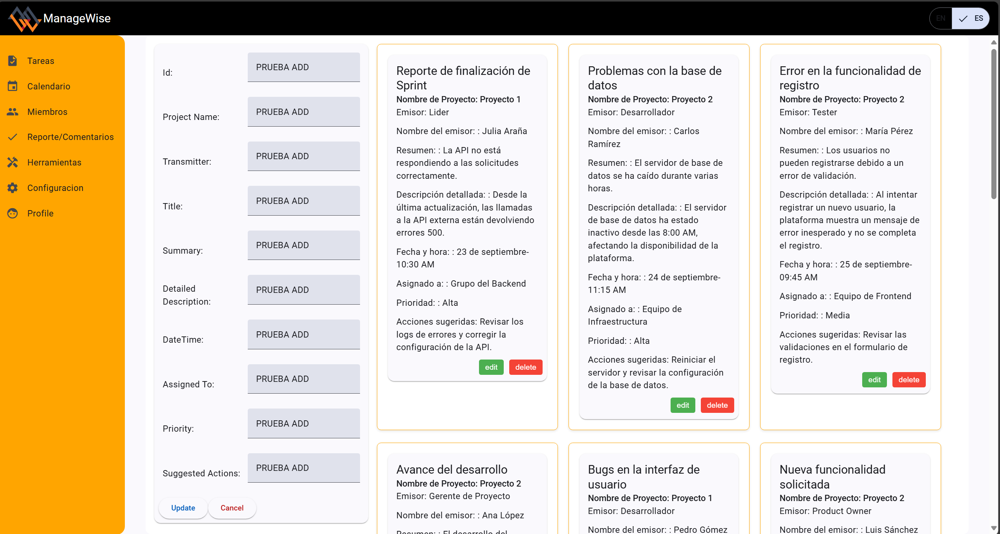

# Horizon

Product: ManageWise

# UNIVERSIDAD PERUANA DE CIENCIAS APLICADAS

  

## Ingenieria de Software

## 5to ciclo

## Desarrollo de Aplicaciones Open Source

### **Sección:** WS53

### **Profesor:** Juan Antonio Flores Moroco

### Informe de Trabajo Final

### "Horizon"

### "ManageWise"

### **Integrantes:**

- Estefano Oscar Jaque Peña - u202225466
- Diego Rolin Acuña Tomas - u202221436
- Jose Antonio Alejo Cardenas - u202122484
- John Telesforo Arevalo Meza - u202117377
- Valentino Sandoval Paiva - u20211a962

### Agosto, 2024

## Registro de Versiones del Informe

| Version | Fecha|Autor| Descripcion|
|--|--|--|---|
|TP|24/09/2024|Valentino Sandoval|Diseño e implementacion de bounded context herramientas.|
|TP|24/09/2024|Jose Alejo|Diseño e implementacion de bounded context Calendar.|
|TP|24/09/2024|Estefano Jaque|Diseño e implementacion de bounded context Reportes.|
|TP|24/09/2024|John Arévalo|Diseño e implementacion de bounded context Tareas.|
|TP|24/09/2024|Diego Acuña|Diseño e implementacion de bounded context Miembros.|
|TP|24/09/2024|Estefano Jaque|Sprint Planning 2.|
|TP|24/09/2024|Estefano Jaque | Sprint Backlog 2.|
|TP|24/09/2024|Jose Alejo|Development Evidence for Sprint Review.|
|TP|24/09/2024|Valentino Sandoval|Testing Suite Evidence for Sprint Review.|
|TP|24/09/2024|Jose Alejo|Execution Evidence for Sprint Review.|
|TP|24/09/2024|Valentino Sandoval|Services Documentation Evidence for Sprint Review|
|TP|24/09/2024|John Arévalo|Software Deployment Evidence for Sprint Review|
|TP|24/09/2024|Diego Acuña|Team Collaboration Insights during Sprint|

## Project Report Collaboration Insights
**TP:** 
|Integrante|Tarea Asignada|
|-|-|
|Alejo Cárdenas, Jose Antonio|Development Evidence for Sprint Review: Preparar y presentar las evidencias de las funcionalidades desarrolladas durante el sprint, mostrando avances y cómo se ajustan a los requerimientos.  Execution Evidence for Sprint Review: Demostrar la ejecución de las tareas y funcionalidades dentro del entorno, incluyendo la integración y funcionalidad en producción o entornos de prueba.|
|Jaque Peña, Estefano Oscar|Sprint Planning 2: Planificación de las tareas y objetivos para el segundo sprint, asegurando que el equipo tenga claro qué se debe priorizar.  Sprint Backlog 2: Organización y refinamiento del backlog del sprint, detallando las historias de usuario que se trabajarán en este ciclo.|
|Sandoval Paiva Valentino|Testing Suite Evidence for Sprint Review: Crear y documentar los resultados de las pruebas realizadas durante el sprint, mostrando la cobertura de tests y validación del software. Services Documentation Evidence for Sprint Review: Documentar los servicios implementados o modificados, proporcionando evidencia clara de su funcionamiento y detalles técnicos.|
| Diego Rolin Acuña Tomas | Software Deployment Evidence for Sprint Review: Preparar la evidencia de despliegue del software, mostrando los entornos en los que se ha implementado y los resultados de estas acciones.  |
| Arévalo Meza John | Team Collaboration Insights during Sprint: Recopilar y presentar información sobre la colaboración del equipo durante el sprint, destacando los procesos de comunicación, desafíos y cómo se superaron. |

## Contenido

### Tabla de contenidos

  - [Student Outcome](#student-outcome)
  - [5.2.2. Sprint 2](#522-sprint-2)
    - [5.2.2.1. Sprint Planning 2](#2-5221-sprint-planning-2)
    - [5.2.2.2. Sprint Backlog 2](#25222-sprint-backlog-2)
    - [5.2.2.3. Development Evidence for Sprint Review.](#25223-development-evidence-for-sprint-review)
    - [5.2.2.4. Testing Suite Evidence for Sprint Review.](#5224-testing-suite-evidence-for-sprint-review)
    - [5.2.2.5. Execution Evidence for Sprint Review.](#5225-execution-evidence-for-sprint-review)
    - [5.2.2.6. Services Documentation Evidence for Sprint Review.](#5226-services-documentation-evidence-for-sprint-review)
    - [5.2.2.7. Software Deployment Evidence for Sprint Review.](#5227-software-deployment-evidence-for-sprint-review)
    - [5.2.2.8. Team Collaboration Insights during Sprint.](#5228-team-collaboration-insights-during-sprint)
  - [Conclusiones](#conclusiones)
  - [Bibliografia](#bibliografia)
  - [Anexos](#anexos)

## Student Outcome

_ABET – EAC - Student Outcome 3_  
**Criterio:** Capacidad de comunicarse efectivamente con un rango de audiencias.

En el siguiente cuadro se describen las acciones realizadas y enunciados de conclusiones por parte del grupo, que permiten sustentar el haber alcanzado el logro del ABET - EAC - Student Outcome 3.

| Criterio especifico| Acciones Realizadas|Conclusiones|
|:-|:-|:-|
| 1. Comunica oralmente con efectividad a diferentes rangos de audiencia|**Estefano Oscar Jaque Peña** TP1:Realice los bounded context de el apartado de reportes.| **Estefano Oscar Jaque Peña** TP1: Durante el avance se pudo realizar una gran parte de los bounded context y se mejoro la comunicacion en equipo  el trabajo en grupo |
| 2. Comunica por escrito con efectividad a diferentes rangos de audiencia |**Estefano Oscar Jaque Peña** TP1:Realice los bounded context de el apartado de reportes   |**Estefano Oscar Jaque Peña** TP1: Durante el avance se pudo realizar una gran parte de los bounded context y se mejoro la comunicacion en equipo el trabajo en grupo  |

### 5.2.2. Sprint 2
### 2 5.2.2.1. Sprint Planning 2
El sprint planning es una reunion antes de cada sprint en la metodologia Scrum donde el equipo elige las user stories que va a transformar en un producto tangible. Tambien define que como se van a separar los trabajos y quien sera responsable. Nuestro objetivo sera construir un plan resolubre en un tiempo determinado que sera lo que dure el sprint, para crearlo fomentaremos la colaboracion para que todos sepan y entiendas los objetivos y prioridades.

| Sprint #| Sprint 2|
| --|--|
| **Sprint Planning Background**| |
| **Date**| 23/09/2024 |
| **Time**| 12:00 AM|
| **Location**|Discord (Reunión virtual)|
| **Prepared By**|Jaque Peña, Estefano Oscar|
| **Attendees (to planning meeting)** | Acuña Tomás, Diego Rolin, Alejo Cárdenas, José Antonio, Arevalo Meza, John Telesforo, Sandoval Paiva, Valentino, Jaque Peña, Estefano Oscar|
| **Sprint Goal & User Stories**||
| **Sprint 1 Goal**|Nuestro enfoque está en finalizar el informe y e implementar cada uno su bounded context lo cual separamos el dia de la reunion |
| **Sprint 1 Velocity**|El velocity establecido para el Sprint 1 es de **14 Story Points**, que es la capacidad que el equipo ha acordado aceptar para este Sprint. - US14 (2 puntos) - US19 (2 puntos) - US29 (3 puntos) - US25 (3 puntos) - US10 (3 puntos) - US24 (3 puntos) - US37 (3 puntos) |
| **Sum of Story Points**| 19|

### 2.5.2.2.2. Sprint Backlog 2
### Introducción
En el Sprint 2, el objetivo principal fue realizar cada alumno un bounded context que tenga relacion con la logica de negocio, que cada parte de la pagina web que cada integrante realice tenga una navegación sencilla y . Para lograr este objetivo, dividimos las User Stories en tareas más pequeñas (Work-Items/Tasks) y las asignamos a los miembros del equipo utilizando Trello, asegurándonos de una estimación adecuada y seguimiento efectivo.

| Sprint #|||| Sprint 2||||
|--|--|--|--|-- |--|--|--|
| **User Story** |                                                     | **Work-Item /Task** |                                                 |                                                                                                                          | **Estimation (Hours)** | **Assigned To**            | **Status (To-do  /InProcess / To-Review  /Done)** |
| **ID**        | **Title**                                             | **ID**          | **Title**                                       | **Description**                                                                                                          |                       |                              |                                                            |
| **US19**       | Integración de cronogramas                     | **TA001**       | Añadir actividades al calendario           | Facilitar la creación de nuevas actividades en el calendario, donde los usuarios pueden definir el nombre.                 | 2 horas               | Alejo Cardenas,Jose    | Done                                                       |
| **US19**     | Integración de cronogramas                              | **TA002**        | Mostrar actividades del calendario                  | Mostrar todas las actividades programadas en el calendario en una vista clara y organizada.       | 4 horas               | Alejo Cardenas,Jose   | Done     
| **US14**     | Herramienta de seguimiento de tareas en tiempo real | **TA003**  | Implementar estados de tareas   | Agregar la funcionalidad de cambiar el estado de las tareas, asegurando asi seguimiento constante por parte del líder   | 5 horas | Arevalo Meza, John Telesforo   | Done    |
| **US24** | Reportes de tareas atrasadas    | **TA004**       | Implementar aspectos visuales, para resaltar las tareas atrasadas          | Agregar un cambio de color a las tareas que se encuentren atrasadas    | 3 horas  | Arevalo Meza, John Telesforo   | Done |
| **US25**      | Gestión de dependencias de tareas       | **TA005**       | Agregar un apartado para ver las dependencias de una tarea            | Agregar atributos y hacerlos visibles, para asi ver cuales son las condiciones de estas           | 4 horas               | Arevalo Meza, John Telesforo | Done  |
| **US37**      | Reporte de eficiencia del equipo  | **TA006** |Añadir reportes de eficiencia del proyecto por parte del desarrollador| Programar la funcionalidad del menú de navegación asegurando que las rutas sean correctas y rápidas.  | 3 horas               | Jaque Peña, Estefano Oscar     | Done      
| **US37**      | Reporte de eficiencia del equipo  | **TA007** | Eliminar reportes de Lider y desarrollares | Desarrollar la eliminacion de reportes generados por los trabajadores del proyecto | 3 horas | Jaque Peña, Estefano Oscar | Done                                                       |
| **US37**      | Reporte de eficiencia del equipo | **TA008**  | Actualizar reportes generadoros por trabajadores y lideres del equipo | Implementar la actualizacion de reportes generador por los trabajores del proyecto.| 3 horas               | Jaque Peña, Estefano Oscar     | Done |
| **US37**      | Reporte de eficiencia del equipo  | **TA009** |Añadir reportes de observacion de la tarea por parte de lideres- gerentes| Programar la agregacion de reportes en el bounded context Reportes/Comentarios por parte de los lideres.| 2 horas| Jaque Peña, Estefano Oscar | Done |
| **US24**      | Reporte de tareas atrasadas  | **TA010** |Añadir reportes de tareas atrasadas por parte de desarrolladores| Programar la funcionalidad del bounded context reportes para una mayor  |2 horas  | Jaque Peña, Estefano Oscar     | Done  |
| **US10** | Sincronización con herramientas externas | **TA011** | Iniciar sincronización | Se configura la integración para que las tareas y eventos se sincronicen automáticamente entre la plataforma y las herramientas seleccionadas. | 2 horas | Valentino Sandoval |
| **US10** | Sincronización con herramientas externas | **TA012** | Reflejar cambios en ambas plataformas | Los cambios realizados tanto en las herramientas externas como en la plataforma se reflejan en tiempo real. | 3 horas | Valentino Sandoval |
| **US29** | Integración con herramientas de videollamadas | **TA013** | Iniciar videollamada integrada | Se implementa la funcionalidad para iniciar videollamadas directamente desde la plataforma, usando herramientas como Zoom o Google Meet. | 2 horas | Valentino Sandoval |

### 2.5.2.2.3. Development Evidence for Sprint Review.
| Repository                                    | Branch            | Commit Id | Commit Message           | Commit Message Body      | Committed on (Date)     |
| --------------------------------------------- | ----------------- | --------- | ------------------------ | ------------------------ | ----------------------- |
| https://github.com/Horizon-ManageWise/Testing | feature/tb1-Diego | 4823259   | Initial commit           | Created the README file. | 19/09/2024              |
| https://github.com/Horizon-ManageWise/Testing | feature/tb1-Diego | a58791b   | feat: added US43 gherkin | feat: added US43 gherkin | 19/09/2024              |
| https://github.com/Horizon-ManageWise/Testing | feature/tb1-Diego | 29d0d8e   | feat: added US44 gherkin | feat: added US44 gherkin | 19/09/2024              |
| https://github.com/Horizon-ManageWise/Testing | feature/tb1-Diego | 9c68a0f   | feat: added US45 gherkin | feat: added US45 gherkin | 19/09/2024              |
| https://github.com/Horizon-ManageWise/Testing | feature/tb1-Diego | 92ff505   | feat: added US46 gherkin | feat: added US46 gherkin | 19/09/2024              |
| https://github.com/Horizon-ManageWise/Testing | feature/tb1-Diego | 6d40835   | feat: added US47 gherkin | feat: added US47 gherkin | 19/09/2024              |
| https://github.com/Horizon-ManageWise/Testing | feature/tb1-Diego | ab19556   | feat: added US48 gherkin | feat: added US48 gherkin | 19/09/2024              |

### 5.2.2.4. Testing Suite Evidence for Sprint Review. 

### 5.2.2.5. Execution Evidence for Sprint Review.
Durante este segundo sprint los integrantes del equipo desarrollaron los diferentes bounded context del dominio de ManageWise, con ayuda del framework Angular y los componentes de Angular Material.

* John Arevalo 
 

 

 

* Jose Alejo 
 

 

 

* Estefano Jaque - bounded context Reportes
 

### 5.2.2.6. Services Documentation Evidence for Sprint Review. 
**Introducción:**
Durante este Sprint, se logró la documentación y despliegue de varios Endpoints correspondientes a los diferentes *bounded contexts* implementados por el equipo. Se utilizó OpenAPI para describir de forma estructurada los servicios Web desarrollados. A continuación, se presenta la relación de los Endpoints, las acciones soportadas y la respectiva documentación disponible.

Esta documentación incluye los verbos HTTP utilizados, sintaxis de llamadas, parámetros, ejemplos de respuesta, así como capturas de la interacción con los Web Services utilizando datos de muestra. También se proporciona el URL del repositorio de los Web Services y los *commit IDs* correspondientes al trabajo realizado en la documentación durante este Sprint.

### Tabla de Endpoints Documentados

| Bounded Context   | Endpoint                     | Acción    | Verbo HTTP | Parámetros               | Ejemplo de Respuesta | Documentación/URL     |
|-------------------|------------------------------|-----------|------------|--------------------------|----------------------|-----------------------|
| Herramientas      | `/api/tools`                  | Obtener lista de herramientas | GET | `?category={string}`     | `[{"id": 1, "name": "Tool A"}]` |Herramientas: https://managewise-7c633.web.app/tool/tools|
| Calendar          | `/api/calendar/events`        | Crear evento | POST       | `{"title": string, "date": string}` | `{"id": 1, "title": "Event A"}` | Calendar: https://managewisecalendar.web.app/calendar/activities |
| Reportes          | `/api/reports`                | Obtener reportes generados | GET  | `?type={string}`          | `[{"id": 1, "type": "weekly"}]` | Reportes: https://managewise-reports.web.app/reports |
| Tareas            | `/api/tasks/{id}`             | Eliminar tarea | DELETE   | `{id: int}`               | `{"message": "Task deleted"}` | Tareas:https://daos-2402-managewise-tasks.web.app/tasks |
| Miembros          | `/api/members`                | Listar miembros | GET    | `?role={string}`          | `[{"id": 1, "name": "Member A"}]` | Miembros:https://managewise-si729-team-manage.web.app/member/members |

### Ejemplos de Respuesta y Explicación

#### **GET** `/api/tools`
**Descripción**: Obtiene una lista de herramientas filtradas por categoría (opcional).

**Parámetros**:
- `category`: Filtro opcional para la categoría de la herramienta (string).

**Ejemplo de Llamada**:

GET /api/tools?category=software

**Ejemplo de Respuesta**:
db.json: 

 { 
      "id": 2, 
      "projectName": "Proyecto 2", 
      "transmitter": "Desarrollador", 
      "issuerName": "Carlos Ramírez", 
      "title": "Problemas con la base de datos", 
      "Summary": "El servidor de base de datos se ha caído durante varias horas.", 
      "detailedDescription": "El servidor de base de datos ha estado inactivo desde las 8:00 AM, afectando la disponibilidad de la plataforma.", 
      "dateTime": "24 de septiembre-11:15 AM", 
      "assignedTo": "Equipo de Infraestructura", 
      "priority": "Alta", 
      "suggestedActions": "Reiniciar el servidor y revisar la configuración de la base de datos." 
    }, 

### Capturas de Pantalla

A continuación, se presentan algunas capturas de pantalla que muestran la interacción con los servicios Web, utilizando datos de muestra:

**Captura 1**: Visualización de la lista de reportes `/api/tools`.

### Repositorio y Commits

- **Repositorio de Web Services**: 

- GitHub - Proyecto Web Services: https://github.com/Horizon-ManageWise/Horizon

- **Commits relacionados con la documentación**:
  - Managewise-Herramientas: https://github.com/SoyValzzz/Managewise-tools - Documentación de Herramientas
  - [Managewise-Calendar](https://github.com/Firtness/ManageWiseCalendar) - Documentación de Calendar
  - [Managewise-Reportes](https://github.com/estefanojaque/Managewise-reportes) - Documentación de Reportes
  - Managewise-Tareas:https://github.com/JohnArvlo/my-json-server-tareas -
  
   Documentación de Tareas

### Resumen de Acciones del Equipo

| Integrante        | Acciones Realizadas                            |
|-------------------|------------------------------------------------|
| Valentino Sandoval | Diseño e implementación de bounded context herramientas |
| Jose Alejo        | Diseño e implementación de bounded context Calendar |
| Estefano Jaque    | Diseño e implementación de bounded context Reportes |
| John Arevalo      | Diseño e implementación de bounded context Tareas |
| Diego Acuña       | Diseño e implementación de bounded context Miembros |

Este Sprint se centró en mejorar la documentación de los Web Services desarrollados para cada uno de los bounded contexts, facilitando su integración y uso en futuras iteraciones.

### 5.2.2.7. Software Deployment Evidence for Sprint Review. 

Para la entrega del segundo sprint, se desplego la landing page, de manera completamente funcional y mejorada. Cumpliendo los user stories relacionados a la misma. De la misma forma se desplego la web application de manera parcial, pues faltan algunas secciones que se implementarán en el siguiente sprint.

Link landing page: https://horizon-managewise.github.io/LandingPage/

 

#### Web Application:
* John Arevalo  

Link: https://daos-2402-managewise-tasks.web.app/tasks

* Estefano Oscar Jaque Peña  
**Internacionalización:**

**ADD Reports:**
  
  
**EDIT Reports:**
  

Link: https://managewise-reports.web.app

### 5.2.2.8. Team Collaboration Insights during Sprint.

|Integrante|Acciones realizadas durante el sprint|
|-|-|
| Valentino Sandoval|Diseño e implementacion de bounded context herramientas|
| Jose Alejo|Diseño e implementacion de bounded context Calendar|
| Estefano Jaque|Diseño e implementacion de bounded context Reportes|
| John Arevalo| Diseño e implementacion de bounded context Tareas|
| Diego Acuña|Diseño e implementacion de bounded context Miembros|

### Conclusiones

- Jose Alejo:
  La creación y diseño de ManageWise han sido un esfuerzo integral enfocado en optimizar la gestión de proyectos para startups de desarrollo de software. A través de una serie de sistemas bien estructurados, como el Navigation System, Labeling System, y Searching System, se ha buscado proporcionar una experiencia fluida y centrada en las necesidades de los usuarios, tanto para líderes o gerentes de empresas como para equipos de desarrollo.

- Valentino Sandoval:
  Horizon se presenta como una solución innovadora para las startups de desarrollo de software, abordando la carencia de herramientas especializadas en la gestión de proyectos. Al integrar tecnologías avanzadas como inteligencia artificial y ofrecer características personalizables, nuestra plataforma no solo optimiza la eficiencia y calidad en la gestión de iniciativas, sino que también fomenta una cultura de innovación y adaptabilidad. Con un enfoque en mejorar la colaboración y la toma de decisiones basadas en datos, Horizon está bien posicionada para ayudar a las startups a superar sus desafíos, aumentar su competitividad y alcanzar un crecimiento sostenido en un mercado cada vez más exigente.

- Estefano Oscar Jaque Peña: 
  En el desarrollo del proyecto , se utilizaron varias metodologías y herramientas de gestión de proyectos, incluido Lean UX, a lo largo del proyecto, lo que permitió definir claramente los problemas y las hipótesis a validar. Para garantizar que los requerimientos del usuario se alinearan con las soluciones propuestas, se debieron desarrollar User Stories, Product Backlog y Sprints. Los diagramas de clases y las bases de datos también brindaron una base sólida para la implementación del sistema. Este proceso permitió optimizar la organización y el flujo de trabajo dentro del equipo, lo que permitió la entrega de un producto eficiente y adaptable a las necesidades del mercado.

- John Arévalo:  
  El desarrollo de Horizon nos enseñó la importancia de crear sistemas bien estructurados como el Navigation System, Labeling System, y Searching System para garantizar una experiencia de usuario fluida. A lo largo del proyecto, aprendimos cómo la integración de tecnologías avanzadas puede no solo optimizar la gestión de proyectos, sino también facilitar la colaboración y la toma de decisiones informadas. De esta manera se promovió una cultura de innovación y a su vez, se logró profundizar en nuevas áreas.
    

### Bibliografia

- Biblioteca UPC. (2024). _Biblioteca virtual de la Universidad Peruana de Ciencias Aplicadas_. https://biblioteca.upc.edu.pe
- Miro. (2024). _Miro_. Miro Corporation. https://miro.com
- LucidChart. (2024). _LucidChart_. Lucid Software Inc. https://www.lucidchart.com
- Cohn, M. (2006). Historias de usuario: Un enfoque ágil. Pearson Educación.https://www.scrummanager.com/files/scrum_manager_historias_usuario.pdf
- Pressman, R. S. (2010). Ingeniería de Software: Un enfoque práctico. McGraw-Hill.https://www.javier8a.com/itc/bd1/ld-Ingenieria.de.software.enfoque.practico.7ed.Pressman.PDF
- The C4 model for visualising software architecture. (2024). https://c4model.com/
- Structurizr. (2024). https://www.structurizr.com/

### Anexos

Anexo A: https://miro.com/welcomeonboard/NHhiOEg2U2ZETmc0SnFSTG10R3djVFdBdGVCMGQwQkVoakZxcnZNRWhpUU44d0xjMGFBWFF6dUtUTXRuNDl1eXwzNDU4NzY0NTQzNjk5MTEyMTEwfDI=?share_link_id=979016695371

Anexo B: https://miro.com/welcomeonboard/NHhiOEg2U2ZETmc0SnFSTG10R3djVFdBdGVCMGQwQkVoakZxcnZNRWhpUU44d0xjMGFBWFF6dUtUTXRuNDl1eXwzNDU4NzY0NTQzNjk5MTEyMTEwfDI=?share_link_id=979016695371

Anexo C: https://miro.com/welcomeonboard/NHhiOEg2U2ZETmc0SnFSTG10R3djVFdBdGVCMGQwQkVoakZxcnZNRWhpUU44d0xjMGFBWFF6dUtUTXRuNDl1eXwzNDU4NzY0NTQzNjk5MTEyMTEwfDI=?share_link_id=979016695371

Anexo D: https://miro.com/welcomeonboard/NHhiOEg2U2ZETmc0SnFSTG10R3djVFdBdGVCMGQwQkVoakZxcnZNRWhpUU44d0xjMGFBWFF6dUtUTXRuNDl1eXwzNDU4NzY0NTQzNjk5MTEyMTEwfDI=?share_link_id=979016695371

Anexo E: https://miro.com/welcomeonboard/RTA3b0ZrRzFmckk5Z3BneTVwc3d5Z1BBYko4c3d4SmpUaVMwTG93c0JjUmc2cERSNzJ5ZkxjOTZDWG5CbThHd3wzNDU4NzY0NTQzNjk5MTEyMTEwfDI=?share_link_id=839908059772

Anexo F: https://drive.google.com/file/d/1AQQxatIfwUWjgvnbWb-nLQKARzIHEPDS/view?usp=sharing

Anexo G: https://drive.google.com/file/d/1mH4Wulu81QrwmgZ2DWM8nT87ZtzNcduh/view?usp=sharing

Anexo H: https://www.figma.com/design/PQMlg7QzupwYT1ef3eXdEG/LandingPage-WireFrame-ManageWise?node-id=15-131&t=DZEsag5WhuvjGmZk-1

Anexo I: https://www.figma.com/design/mz9XRI1PRFgIvEPIuqHzgd/webapp-managewis?node-id=1-2&t=YdZHXwLmNin9xC6s-1

Anexo J: https://lucid.app/lucidchart/1e63a43a-a627-478b-a4e2-397bbd5407b9/edit?viewport_loc=-24225%2C-5250%2C27750%2C11925%2C0_0&invitationId=inv_2dbf5bda-cf33-4d4a-bbc1-c27a42d84ac8

Anexo J: https://www.figma.com/proto/mz9XRI1PRFgIvEPIuqHzgd/webapp-managewis?page-id=1%3A2&node-id=118-122&node-type=CANVAS&viewport=-385%2C681%2C0.08&t=grI8nuvCu1Ox92G5-1&scaling=scale-down&content-scaling=fixed&starting-point-node-id=118%3A122
