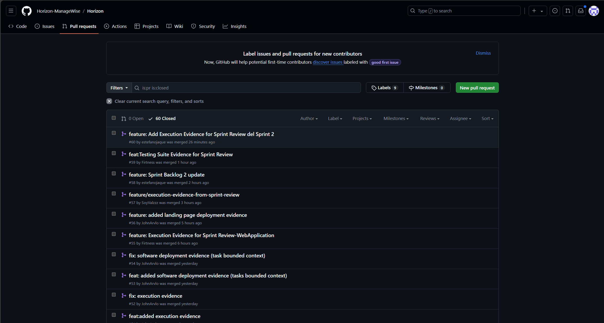
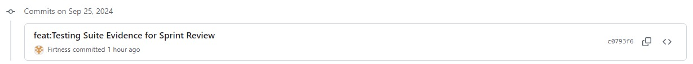
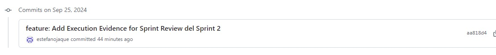
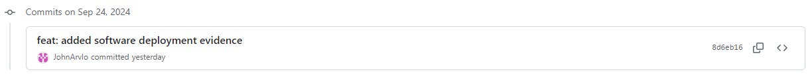
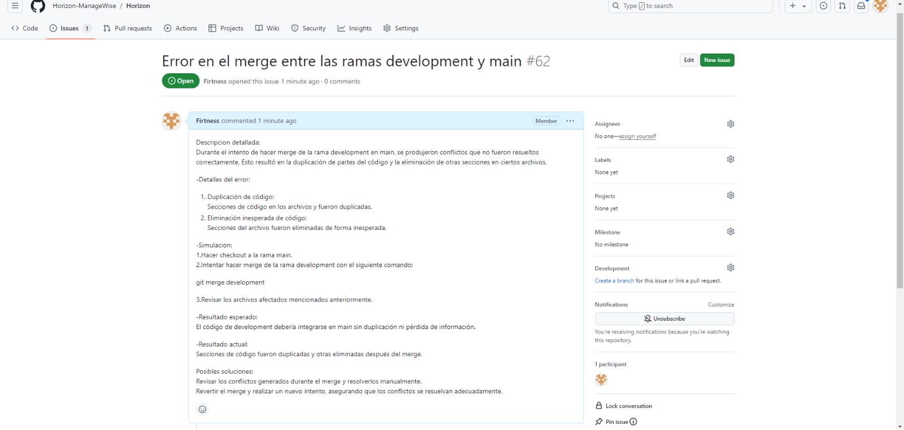
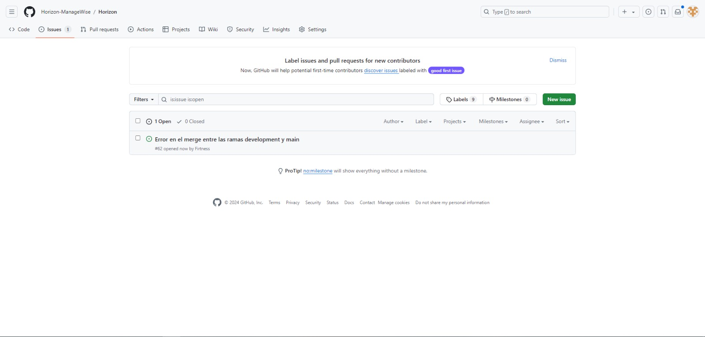
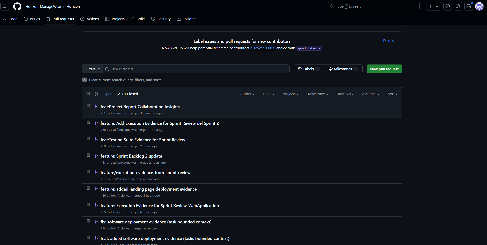

      # Horizon

Product: ManageWise

# UNIVERSIDAD PERUANA DE CIENCIAS APLICADAS

  

## Ingenieria de Software

## 5to ciclo

## Desarrollo de Aplicaciones Open Source

### **Sección:** WS53

### **Profesor:** Juan Antonio Flores Moroco

### Informe de Trabajo Final

### "Horizon"

### "ManageWise"

### **Integrantes:**

- Estefano Oscar Jaque Peña - u202225466
- Diego Rolin Acuña Tomas - u202221436
- Jose Antonio Alejo Cardenas - u202122484
- John Telesforo Arevalo Meza - u202117377
- Valentino Sandoval Paiva - u20211a962

### Agosto, 2024

## Registro de Versiones del Informe

| Version | Fecha|Autor| Descripcion|
|--|--|--|---|
|TP|24/09/2024|Valentino Sandoval|Diseño e implementacion de bounded context herramientas.|
|TP|24/09/2024|Jose Alejo|Diseño e implementacion de bounded context Calendar.|
|TP|24/09/2024|Estefano Jaque|Diseño e implementacion de bounded context Reportes.|
|TP|24/09/2024|John Arévalo|Diseño e implementacion de bounded context Tareas.|
|TP|24/09/2024|Diego Acuña|Diseño e implementacion de bounded context Miembros.|
|TP|24/09/2024|Estefano Jaque|Sprint Planning 2.|
|TP|24/09/2024|Estefano Jaque | Sprint Backlog 2.|
|TP|24/09/2024|Jose Alejo|Development Evidence for Sprint Review.|
|TP|24/09/2024|Valentino Sandoval|Testing Suite Evidence for Sprint Review.|
|TP|24/09/2024|Jose Alejo|Execution Evidence for Sprint Review.|
|TP|24/09/2024|Valentino Sandoval|Services Documentation Evidence for Sprint Review|
|TP|24/09/2024|John Arévalo|Software Deployment Evidence for Sprint Review|
|TP|24/09/2024|Diego Acuña|Team Collaboration Insights during Sprint|

## Project Report Collaboration Insights
URL : https://github.com/Horizon-ManageWise/Horizon  

**TP:** 
|Integrante|Tarea Asignada|
|-|-|
|Alejo Cárdenas, Jose Antonio|Development Evidence for Sprint Review: Preparar y presentar las evidencias de las funcionalidades desarrolladas durante el sprint, mostrando avances y cómo se ajustan a los requerimientos.  Execution Evidence for Sprint Review: Demostrar la ejecución de las tareas y funcionalidades dentro del entorno, incluyendo la integración y funcionalidad en producción o entornos de prueba.|
|Jaque Peña, Estefano Oscar|Sprint Planning 2: Planificación de las tareas y objetivos para el segundo sprint, asegurando que el equipo tenga claro qué se debe priorizar.  Sprint Backlog 2: Organización y refinamiento del backlog del sprint, detallando las historias de usuario que se trabajarán en este ciclo.|
|Sandoval Paiva Valentino|Testing Suite Evidence for Sprint Review: Crear y documentar los resultados de las pruebas realizadas durante el sprint, mostrando la cobertura de tests y validación del software. Services Documentation Evidence for Sprint Review: Documentar los servicios implementados o modificados, proporcionando evidencia clara de su funcionamiento y detalles técnicos.|
| Diego Rolin Acuña Tomas | Software Deployment Evidence for Sprint Review: Preparar la evidencia de despliegue del software, mostrando los entornos en los que se ha implementado y los resultados de estas acciones.  |
| Arévalo Meza John | Team Collaboration Insights during Sprint: Recopilar y presentar información sobre la colaboración del equipo durante el sprint, destacando los procesos de comunicación, desafíos y cómo se superaron. |

*Pull requests evidence:*

*Commits evidence:*

*Issues evidence:*

## Contenido

### Tabla de contenidos

  - [Student Outcome](#student-outcome)
    - [5.2.2. Sprint 2](#522-sprint-2)
    - [5.2.2.1. Sprint Planning 2](#5221-sprint-planning-2)
    - [5.2.2.2. Sprint Backlog 2](#5222-sprint-backlog-2)
    - [5.2.2.3. Development Evidence for Sprint Review.](#5223-development-evidence-for-sprint-review)
    - [5.2.2.4. Testing Suite Evidence for Sprint Review.](#5224-testing-suite-evidence-for-sprint-review)
    - [5.2.2.5. Execution Evidence for Sprint Review.](#5225-execution-evidence-for-sprint-review)
    - [5.2.2.6. Services Documentation Evidence for Sprint Review.](#5226-services-documentation-evidence-for-sprint-review)
    - [5.2.2.7. Software Deployment Evidence for Sprint Review.](#5227-software-deployment-evidence-for-sprint-review)
    - [5.2.2.8. Team Collaboration Insights during Sprint.](#5228-team-collaboration-insights-during-sprint)
    - [Conclusiones](#conclusiones)
    - [Bibliografia](#bibliografia)
    - [Anexos](#anexos)

## Student Outcome

_ABET – EAC - Student Outcome 3_  
**Criterio:** Capacidad de comunicarse efectivamente con un rango de audiencias.

En el siguiente cuadro se describen las acciones realizadas y enunciados de conclusiones por parte del grupo, que permiten sustentar el haber alcanzado el logro del ABET - EAC - Student Outcome 3.

| Criterio especifico| Acciones Realizadas|Conclusiones|
|:-|:-|:-|
  | 1. Comunica oralmente con efectividad a diferentes rangos de audiencia|**Estefano Oscar Jaque Peña** TP1:Realice los bounded context de el apartado de reportes.Para hacerlo se crearon reuniones de trabajo para decidir que estilos y componentes crearíamos para que todos los usen al crear sus Bounded Context. El Team Leader aviso en el grupo que se podían programar reuniones en Discord para ayudar a solucionar alguna duda, por ello tuvimos reuniones para solucionar problemas relacionadas a la creación de las páginas web.  **Valentino Sandoval Paiva :**  TP: 1. Me encargué de los puntos del informe, así como del desarrollo frontend de nuestra plataforma. Además, implementé el "bounded context de herramientas"  **Jose Antonio Alejo Cardenas**  TP: Para esta TP, realicé actividades como el Development Evidence for Sprint Review, preparando las evidencias a presentar concentradas en el core especificamente las funcionalidades desarrolladas durante el sprint, y el Execution Evidence for Sprint Review, demostrando la ejecucion de cada tarea funcional implementada por cada integrante del trabajo a integrarse proximamente en otros ambientes como produccion o QA. **Diego Rolin Acuña Tomas**  TP: Realice el Bounded Context del apartado de miembros. Para hacerlo se crearon reuniones de trabajo para decidir que estilos y componentes crearíamos para que todos los usen al crear sus Bounded Context. El Team Leader aviso en el grupo que se podían programar reuniones en Discord para ayudar a solucionar alguna duda, por ello tuvimos reuniones para solucionar problemas relacionadas a la creación de las páginas web.  **John Arevalo Meza:**   Para esta entrega, realicé el bounded context relacionado a la sección de tareas en la aplicación web. Además, agregué la sección de "Contáctanos" a la landing page, analizando las necesidades de comunicación de los usuarios. También participé en la creación de parte del Sprint Backlog en grupo, donde organizamos las tareas basadas en los user stories definidos. Por último, documenté el proceso de actualización y las decisiones tomadas, lo que facilitó la colaboración y comprensión entre los miembros del equipo.|**Estefano Oscar Jaque Peña** TP1: Durante el avance se pudo realizar una gran parte de los bounded context y se mejoro la comunicacion en equipo  el trabajo en grupo , comparti parte de mi codigo para que todos puedan tener la misma visualizacion para el toolbar y sidebar  **Valentino Sandoval Paiva :**  TP: En esta entrega, aprendí a gestionar tanto el desarrollo frontend como la creación de informes técnicos de manera eficiente. Al implementar el "bonded context" en la aplicación, profundicé en la integración de componentes y la optimización de la comunicación entre ellos. Esto me permitió mejorar mis habilidades en arquitectura de aplicaciones y comprensión de la lógica que conecta diferentes partes del sistema, asegurando una experiencia de usuario más fluida y coherente. Además, adquirí una visión más amplia sobre la importancia de mantener la consistencia entre el diseño y la funcionalidad. **Jose Antonio Alejo Cardenas**  TP: En esta TP, presente de las evidencias y la ejecución de las tareas, adapté mi comunicación para asegurarme de que fuera clara y comprensible para todos, desde mis compañeros de equipo mas experimentados hasta el menos experimentado. Me esforcé en hacer que los avances fueran entendidos por todos los integrantes, destacando su importancia y el valor del trabajo realizado. Esto me ayudo a clarificar mis ideas para llegar a distintos grupos de personas. **Diego Rolin Acuña Tomas**  TP: Para la correcta creación de los Bounded Context se tienen que compartir aspectos como estilos y componentes que se usaran, pues son partes de la misma página web. También se debe motivar a cada miembro del equipo a compartir sus dudas, ya que más rápidamente podremos solucionarlo como equipo.  **John Arevalo Meza:**   En esta entrega, la habilidad de comunicar oralmente fue crucial para el trabajo en equipo. Al realizar el bounded context tasks y la adición de la sección de "Contáctanos", pude expresar claramente las necesidades de los usuarios, lo que permitió al grupo comprender la importancia de estas partes. Por otro lado, la participación en la creación del Sprint Backlog fomentó un diálogo abierto y colaborativo, asegurando que cada miembro del equipo estuviera alineado en las tareas a realizar.|
| 2. Comunica por escrito con efectividad a diferentes rangos de audiencia |**Jose Antonio Alejo Cardenas**  TP: Para esta TP, realicé actividades como el Development Evidence for Sprint Review, preparando las evidencias a presentar concentradas en el core especificamente las funcionalidades desarrolladas durante el sprint, y el Execution Evidence for Sprint Review, demostrando la ejecucion de cada tarea funcional implementada por cada integrante del trabajo a integrarse proximamente en otros ambientes como produccion o QA. **Estefano Oscar Jaque Peña** TP1:Realice los bounded context de el apartado de reportes   **Valentino Sandoval Paiva:**  TP: 1. Me encargué de los puntos del informe, así como del desarrollo frontend de nuestra plataforma. Además, implementé el "bounded context de herramientas"  **Diego Rolin Acuña Tomas**  TP: Realice el Bounded Context del apartado de miembros. Las reuniones en Discord eran frecuentes para ponernos de acuerdo, pero solo si la duda no podía ser solucionada por escrito en nuestro grupo de WhatsApp, por escrito se solucionaron dudas sobre el código del Bounded Context y el código de MarkDown, también lo usamos para enviar links del Figma o un Word online para tener una lista de actividades separadas por cada miembro del grupo.  **John Arevalo Meza:**    Para esta entrega, realicé el bounded context de la sección de tareas, analizando las necesidades y expectativas de los usuarios. Desarrollé la sección de tareas utilizando Angular y Angular Material, asegurando una interfaz intuitiva y responsiva. Implementé la funcionalidad para agregar, editar y eliminar tareas, lo que optimizó la gestión de tareas dentro de la aplicación.|**Estefano Oscar Jaque Peña** TP1: Durante el avance se pudo realizar una gran parte de los bounded context y se mejoro la comunicacion en equipo el trabajo en grupo  **Valentino Sandoval Paiva:**  TP:  A lo largo de esta entrega, desarrollé mi capacidad para comunicarme de manera efectiva con diferentes rangos de audiencia. Al gestionar tanto el informe como el desarrollo frontend, tuve que adaptar mi lenguaje técnico para asegurar que todos, desde los desarrolladores hasta los miembros no técnicos del equipo, comprendieran el avance del proyecto. La implementación del "bonded context" me brindó la oportunidad de explicar conceptos complejos de una manera clara y accesible, ajustando el nivel de detalle según el público, lo que facilitó la colaboración y la toma de decisiones informadas. **Jose Antonio Alejo Cardenas**  TP: En esta TP, Redacte las evidencias de desarrollo y ejecución, me enfoqué en escribir de manera clara y sencilla, facilitando que la información técnica fuera entendida por diferentes personas, desde miembros del equipo hasta quienes no conocen muchos tecnicismos. Esto me ayudó a mejorar mi capacidad de transmitir detalles técnicos de forma efectiva, al redactarlos de una manera comprensible para un publico general. **Diego Rolin Acuña Tomas**  TP: Para el desarrollo de este sprint comprendí que muchas dudas pueden solucionarse enviando mensajes escritos, y que es la mejor manera de pasar links y guardarlos para futuras presentaciones.  **John Arevalo Meza:**  : La capacidad de comunicar por escrito fue algo esencial en esta entrega, especialmente al documentar el bounded context y las funcionalidades implementadas en la sección de tareas. Al analizar las necesidades y expectativas de los usuarios y desarrollar las partes correspondientes en Angular, aseguré que la documentación fuera clara y precisa. Esto no solo optimizó la gestión de tareas dentro de la aplicación, sino que también proporcionó a los miembros del equipo una referencia clara y comprensible.|

### 5.2.2. Sprint 2
### 5.2.2.1. Sprint Planning 2
El sprint planning es una reunion antes de cada sprint en la metodologia Scrum donde el equipo elige las user stories que va a transformar en un producto tangible. Tambien define que como se van a separar los trabajos y quien sera responsable. Nuestro objetivo sera construir un plan resolubre en un tiempo determinado que sera lo que dure el sprint, para crearlo fomentaremos la colaboracion para que todos sepan y entiendas los objetivos y prioridades.

| Sprint #| Sprint 2|
| --|--|
| **Sprint Planning Background**| |
| **Date**| 23/09/2024 |
| **Time**| 12:00 AM|
| **Location**|Discord (Reunión virtual)|
| **Prepared By**|Jaque Peña, Estefano Oscar|
| **Attendees (to planning meeting)** | Acuña Tomás, Diego Rolin, Alejo Cárdenas, José Antonio, Arevalo Meza, John Telesforo, Sandoval Paiva, Valentino, Jaque Peña, Estefano Oscar|
| **Sprint Goal & User Stories**||
| **Sprint 2 Goal**|Nuestro enfoque está en separar las tareas para cada integrante respecto al bounded context que elijan y finalizar el informe detallando el trabajo realizado por cada integrante|
| **Sprint 2 Velocity**|El velocity establecido para el Sprint 1 es de **14 Story Points**, que es la capacidad que el equipo ha acordado aceptar para este Sprint. - US14 (2 puntos) - US19 (2 puntos) - US29 (3 puntos) - US10 (3 puntos) - US24 (3 puntos) - US37 (3 puntos) - US18 (5 puntos) - US34 (5 puntos) |
| **Sum of Story Points**|26|

### 5.2.2.2. Sprint Backlog 2
### Introducción
En el Sprint 2, el objetivo principal fue realizar cada alumno un bounded context que tenga relacion con la logica de negocio y que cada parte de la pagina web que cada integrante realice tenga una navegación sencilla en los que se pueda apreciar lo trabajado en la clase. Para lograr este objetivo, dividimos los bounded context en Tareas, Calendarios, Miembros ,Reporte/Comentarios y Herramientas.Ademas se realizo la actualizacion de la landing page.

| Sprint #|||| Sprint 2||||
|--|--|--|--|-- |--|--|--|
| **User Story** |                                                     | **Work-Item /Task** |                                                 |                                                                                                                          | **Estimation (Hours)** | **Assigned To**            | **Status (To-do  /InProcess / To-Review  /Done)** |
| **ID**        | **Title**                                             | **ID**          | **Title**                                       | **Description**                                                                                                          |                       |                              |                                                            |
| **US19**| Integración de cronogramas| **TA001**| Añadir actividades al calendario| Facilitar la creación de nuevas actividades en el calendario, donde los usuarios pueden definir el nombre.| 2 horas| Alejo Cardenas,Jose | Done|
| **US19**| Integración de cronogramas|**TA002**| Mostrar actividades del calendario| Mostrar todas las actividades programadas en el calendario en una vista clara y organizada.| 4 horas| Alejo Cardenas,Jose|Done|
| **US14**| Herramienta de seguimiento de tareas en tiempo real|**TA003**|Implementar estados de tareas|Agregar la funcionalidad de cambiar el estado de las tareas, asegurando asi seguimiento constante por parte del líder | 5 horas | Arevalo Meza, John Telesforo |Done|
| **US25**| Gestión de dependencias de tareas|**TA005**| Agregar un apartado para ver las dependencias de una tarea| Agregar atributos y hacerlos visibles, para asi ver cuales son las condiciones de estas| 4 horas| Arevalo Meza, John Telesforo | Done  |
| **US37**| Reporte de eficiencia del equipo  | **TA006** |Añadir reportes de eficiencia del proyecto por parte del desarrollador| Programar la funcionalidad del menú de navegación asegurando que las rutas sean correctas y rápidas.  | 3 horas               | Jaque Peña, Estefano Oscar| Done      
| **US37**| Reporte de eficiencia del equipo  | **TA007** | Eliminar reportes de Lider y desarrollares | Desarrollar la eliminacion de reportes generados por los trabajadores del proyecto | 3 horas | Jaque Peña, Estefano Oscar | Done|
| **US37**| Reporte de eficiencia del equipo | **TA008**  | Actualizar reportes generadoros por trabajadores y lideres del equipo | Implementar la actualizacion de reportes generador por los trabajores del proyecto.| 3 horas| Jaque Peña, Estefano Oscar     | Done |
| **US37**| Reporte de eficiencia del equipo  | **TA009** |Añadir reportes de observacion de la tarea por parte de lideres- gerentes| Programar la agregacion de reportes en el bounded context Reportes/Comentarios por parte de los lideres.| 2 horas| Jaque Peña, Estefano Oscar | Done |
| **US24**| Reporte de tareas atrasadas  | **TA010** |Añadir reportes de tareas atrasadas por parte de desarrolladores| Programar la funcionalidad del bounded context reportes para una mayor  |2 horas  | Jaque Peña, Estefano Oscar     | Done  |
| **US10**| Sincronización con herramientas externas | **TA011** | Iniciar sincronización | Se configura la integración para que las tareas y eventos se sincronicen automáticamente entre la plataforma y las herramientas seleccionadas. | 2 horas | Valentino Sandoval |
| **US10**| Sincronización con herramientas externas | **TA012** | Reflejar cambios en ambas plataformas | Los cambios realizados tanto en las herramientas externas como en la plataforma se reflejan en tiempo real. | 3 horas | Valentino Sandoval |
| **US29**| Integración con herramientas de videollamadas | **TA013** | Iniciar videollamada integrada | Se implementa la funcionalidad para iniciar videollamadas directamente desde la plataforma, usando herramientas como Zoom o Google Meet. | 2 horas | Valentino Sandoval |
| **US18**|Integración de gráfico radial de habilidades|**TA014**|Separar los miembros en equipos de trabajo por sus habilidades|Se implementa la capacidad de asignar un miembro a un equipo de trabajo que los separa por especialidad|2 horas|Diego Acuña |
| **US34**|Sistema de evaluación automática de productividad|**TA015**| Mostrar con una grafica el avance| Se implementa una grafica en la seccion de miembros que permite conocer el avance respecto al total de tareas asignadas| 2 horas |Diego Acuña|

### 5.2.2.3. Development Evidence for Sprint Review.

| Repository                                    | Branch            | Commit Id | Commit Message           | Commit Message Body      | Committed on (Date)     |
| --------------------------------------------- | ----------------- | --------- | ------------------------ | ------------------------ | ----------------------- |
| https://github.com/Horizon-ManageWise/Horizon/pull/60 |feature/Sprint2-sprintBacklog-services_Documentation_Evidence|75c0c75| Se realizo la agregacion de los videos y paginas| Created the README file.|25/09/2024|
| https://github.com/Horizon-ManageWise/Horizon/pull/59 | development | 6548432   | feat:Testing Suite Evidence for Sprint Review  | feat:Testing Suite Evidence for Sprint Review  | 25/09/2024|
| https://github.com/Horizon-ManageWise/Horizon/pull/58 |development|a19b6ac |feature:Sprint Backlog 2 update|Se realizo una actualizacion del product backlog | 25/09/2024|
| https://github.com/Horizon-ManageWise/Horizon/pull/57 | development | 29ca9f3 i   | feature/execution-evidence-from-sprint-review|feature/execution-evidence-from-sprint-review | 24/09/2024              |
| https://github.com/Horizon-ManageWise/Horizon/pull/56 | docs/landingpage-deployment-evidence | 7fe8f1f   | feature: added landing page deployment evidence | feature: added landing page deployment evidence | 24/09/2024              |
| https://github.com/Horizon-ManageWise/Horizon/pull/50 | fix/diagrama-clases | 6e41532 | feature: Add bounded context Reports images and Information | feature: Add bounded context Reports images and Information | 24/09/2024              |

link: https://github.com/Horizon-ManageWise/Horizon/pulls?q=is%3Apr+is%3Aclosed

### 5.2.2.4. Testing Suite Evidence for Sprint Review. 

Durante este sprint, se realizaron la implementación del Web Aplication. A continuación, se detallan los commits relevantes que reflejan las pruebas realizadas:

| **Repository**| **Branch**| **Commit Id**| **Commit Message** | **Commit Message Body**| **Committed on (Date)** |
|-|-|-|-|-|-|
| Horizon-ManageWise/Testing | feature/TP | 48232594b722a6d3b1948c723cf903655a12bd35 |Initial commit  | Initial commit | 24/09/2024|
| Horizon-ManageWise/Testing | feature/TP | 98bb0d238d4305c241a5e31f5bd0f658915553be |feature: added US10 gherkin  | feature: added US10 gherkin | 24/09/2024|
| Horizon-ManageWise/Testing | feature/TP | 4fe61f01bd7f0d6f19c3df562a72f05ff993746e |feature: added US14 gherkin  | feature: added US14 gherkin | 24/09/2024|
| Horizon-ManageWise/Testing | feature/TP | c2252a761dd1a44b745c583c443ba1dd10928c26 |feature: added US18 gherkin  | feature: added US18 gherkin | 24/09/2024|
| Horizon-ManageWise/Testing | feature/TP | b02f2bb10c47d255857145e96eb54f72cb66d383 |feature: added US19 gherkin  | feature: added US19 gherkin | 24/09/2024|
| Horizon-ManageWise/Testing | feature/TP | 9db14c0bd4735c9c0495d405d35f9c87f75109fe |feature: added US24 gherkin  | feature: added US24 gherkin | 24/09/2024|
| Horizon-ManageWise/Testing | feature/TP | a86f36565e3d66d635b71333d123cca9d9486dc8 |feature: added US25 gherkin  | feature: added US25 gherkin | 24/09/2024|
| Horizon-ManageWise/Testing | feature/TP | 903934c1d941c27b8a37108320411a5b322ffaa0 |feature: added US29 gherkin  | feature: added US29 gherkin | 24/09/2024|
| Horizon-ManageWise/Testing | feature/TP | c2252a761dd1a44b745c583c443ba1dd10928c26 |feature: added US34 gherkin  | feature: added US34 gherkin | 24/09/2024|
| Horizon-ManageWise/Testing | feature/TP | f8db7186ad943db1e5c671242d00aec94ab6eec0 |feature: added US37 gherkin  | feature: added US37 gherkin | 24/09/2024|

 
Link del repositorio Commints: https://github.com/Horizon-ManageWise/Testing/tree/feature/TP

### 5.2.2.5. Execution Evidence for Sprint Review.
Durante este segundo sprint los integrantes del equipo desarrollaron los diferentes bounded context del dominio de ManageWise, con ayuda del framework Angular y los componentes de Angular Material.

* John Arevalo 
 

 

 

Link Video: https://drive.google.com/drive/folders/1rvTZbtVs2qm98oGLgsAnPNa0LdZUxVGQ?usp=drive_link

* Jose Alejo 
 

 

 

Link Video: https://drive.google.com/file/d/1v8EwJOrF5gchaASTJghXZPNo3dXT1mUW/view?usp=sharing

* Estefano Jaque - bounded context Reportes
 

Link Video: https://drive.google.com/file/d/11q8YnRJGMzfx-n6AbBIfxvugxmS4xuVw/view?usp=sharing

* Valentino Sandoval - bounded context Reportes
 

Link Video: https://drive.google.com/file/d/1EGZlBOQEw8RfEzKQKlg4hFatObwWQRFM/view?usp=sharing 

- Diego Acuña - bounded context Members
   

Link Video: https://drive.google.com/file/d/13PZa8b2W9nk5ZUygtHGwDKG9wxmd99qW/view?usp=sharing

### 5.2.2.6. Services Documentation Evidence for Sprint Review. 
**Introducción:**
Durante este Sprint, se logró la documentación y despliegue de varios Endpoints correspondientes a los diferentes *bounded contexts* implementados por el equipo. Se utilizó OpenAPI para describir de forma estructurada los servicios Web desarrollados. A continuación, se presenta la relación de los Endpoints, las acciones soportadas y la respectiva documentación disponible.

Esta documentación incluye los verbos HTTP utilizados, sintaxis de llamadas, parámetros, ejemplos de respuesta, así como capturas de la interacción con los Web Services utilizando datos de muestra. También se proporciona el URL del repositorio de los Web Services y los *commit IDs* correspondientes al trabajo realizado en la documentación durante este Sprint.

### Tabla de Endpoints Documentados

| Bounded Context   | Endpoint                     | Acción    | Verbo HTTP | Parámetros               | Ejemplo de Respuesta | Documentación/URL     |
|-------------------|------------------------------|-----------|------------|--------------------------|----------------------|-----------------------|
| Herramientas      | `/api/tools`                  | Obtener lista de herramientas | GET | `?category={string}`     | `[{"id": 1, "name": "Tool A"}]` |Herramientas: https://managewise-7c633.web.app/tool/tools|
| Calendar          | `/api/calendar/events`        | Crear evento | POST       | `{"title": string, "date": string}` | `{"id": 1, "title": "Event A"}` | Calendar: https://managewisecalendar.web.app/calendar/activities |
| Reportes          | `/api/reports`                | Obtener reportes generados | GET  | `?type={string}`          | `[{"id": 1, "type": "weekly"}]` | Reportes: https://managewise-reports.web.app/reports |
| Tareas            | `/api/tasks/{id}`             | Eliminar tarea | DELETE   | `{id: int}`               | `{"message": "Task deleted"}` | Tareas:https://daos-2402-managewise-tasks.web.app/tasks |
| Miembros          | `/api/members`                | Listar miembros | GET    | `?role={string}`          | `[{"id": 1, "name": "Member A"}]` | Miembros:https://managewise-si729-team-manage.web.app/member/members |

### Ejemplos de Respuesta y Explicación

#### **GET** `/api/tools`
**Descripción**: Obtiene una lista de herramientas filtradas por categoría (opcional).

**Parámetros**:
- `category`: Filtro opcional para la categoría de la herramienta (string).

**Ejemplo de Llamada**:

GET /api/tools?category=software

**Ejemplo de Respuesta**:
db.json: 

 { 
      "id": 2, 
      "projectName": "Proyecto 2", 
      "transmitter": "Desarrollador", 
      "issuerName": "Carlos Ramírez", 
      "title": "Problemas con la base de datos", 
      "Summary": "El servidor de base de datos se ha caído durante varias horas.", 
      "detailedDescription": "El servidor de base de datos ha estado inactivo desde las 8:00 AM, afectando la disponibilidad de la plataforma.", 
      "dateTime": "24 de septiembre-11:15 AM", 
      "assignedTo": "Equipo de Infraestructura", 
      "priority": "Alta", 
      "suggestedActions": "Reiniciar el servidor y revisar la configuración de la base de datos." 
    }, 

### Capturas de Pantalla

A continuación, se presentan algunas capturas de pantalla que muestran la interacción con los servicios Web, utilizando datos de muestra:

**Captura 1**: Visualización de la lista de reportes `/api/tools`.

### Repositorio y Commits

- **Repositorio de Web Services**: 

- GitHub - Proyecto Web Services: https://github.com/Horizon-ManageWise/Horizon

- **Commits relacionados con la documentación**:
  - Managewise-Herramientas: https://github.com/SoyValzzz/Managewise-tools 
  - Managewise-Calendar https://github.com/Firtness/ManageWiseCalendar
  - Managewise-Reportes: (https://github.com/estefanojaque/Managewise-reportes)
  - Managewise-Tareas: https://github.com/JohnArvlo/my-json-server-tareas 
  
   Documentación de Tareas

### Resumen de Acciones del Equipo

| Integrante        | Acciones Realizadas                            |
|-------------------|------------------------------------------------|
| Valentino Sandoval | Diseño e implementación de bounded context herramientas |
| Jose Alejo        | Diseño e implementación de bounded context Calendar |
| Estefano Jaque    | Diseño e implementación de bounded context Reportes |
| John Arevalo      | Diseño e implementación de bounded context Tareas |
| Diego Acuña       | Diseño e implementación de bounded context Miembros |

Este Sprint se centró en mejorar la documentación de los Web Services desarrollados para cada uno de los bounded contexts, facilitando su integración y uso en futuras iteraciones.

### 5.2.2.7. Software Deployment Evidence for Sprint Review. 

Para la entrega del segundo sprint, se desplego la landing page, de manera completamente funcional y mejorada. Cumpliendo los user stories relacionados a la misma. De la misma forma se desplego la web application de manera parcial, pues faltan algunas secciones que se implementarán en el siguiente sprint.

Link landing page: https://horizon-managewise.github.io/LandingPage/

 

#### Web Application:

* John Arevalo  

Link: https://daos-2402-managewise-tasks.web.app/tasks

* Estefano Oscar Jaque Peña  
**Internacionalización:**  
English:

Español:

**ADD Reports:**

**EDIT Reports:**

**DELETE Reports**  
Se eliminara el report que tiene todas las partes con PRUEBA EDIT

**Link:**  
https://managewise-reports.web.app

* Jose Alejo  

Link: https://managewisecalendar.web.app/calendar/activities

* Valentino Sandoval
**ADD Tools:**

**EDIT Tools:**

**DELETE Tools**  
Se eliminara el report que tiene todas las partes con PRUEBA EDIT

Link: 

https://managewise-vsp.web.app

- Diego Acuña - bounded context Members
   

Link : https://managewise-si729-member.web.app/member/members

### 5.2.2.8. Team Collaboration Insights during Sprint.

|Integrante|Acciones realizadas durante el sprint|
|-|-|
| Valentino Sandoval|Diseño e implementacion de bounded context herramientas|
| Jose Alejo|Diseño e implementacion de bounded context Calendar|
| Estefano Jaque|Diseño e implementacion de bounded context Reportes|
| John Arevalo| Diseño e implementacion de bounded context Tareas|
| Diego Acuña|Diseño e implementacion de bounded context Miembros|

### Conclusiones

El desarrollo de "Horizon" ha sido un proceso tanto desafiante como gratificante. El equipo ha demostrado un gran compromiso y una excelente capacidad de colaboración, logrando identificar las necesidades clave de los usuarios, diseñar una interfaz intuitiva y funcional, y desarrollar una plataforma sólida y escalable. A lo largo del proyecto, se realizaron pruebas exhaustivas para garantizar la calidad del producto, validando las funcionalidades clave y asegurando que la plataforma cumpla con los objetivos establecidos.

Durante este proyecto, el equipo ha adquirido valiosa experiencia en metodologías ágiles, como Scrum, y en principios de diseño orientado a dominios (DDD), particularmente con la implementación de bounded contexts, lo que ha permitido abordar problemas complejos de manera organizada y eficiente. Se recomienda para futuros proyectos mantener un enfoque centrado en el usuario, realizar pruebas continuas y fomentar la flexibilidad ante cambios, además de mantener una comunicación fluida y efectiva dentro del equipo.

En conclusión, el desarrollo de esta plataforma ha sido una experiencia enriquecedora que ha permitido al equipo aprender, crecer y fortalecer sus habilidades en desarrollo de software. Las lecciones aprendidas y las recomendaciones para proyectos futuros servirán como un pilar fundamental para continuar mejorando, con el objetivo de ofrecer soluciones que satisfagan las necesidades del usuario de manera eficiente y escalable.

### Bibliografia

- Biblioteca UPC. (2024). _Biblioteca virtual de la Universidad Peruana de Ciencias Aplicadas_. https://biblioteca.upc.edu.pe
- Miro. (2024). _Miro_. Miro Corporation. https://miro.com
- LucidChart. (2024). _LucidChart_. Lucid Software Inc. https://www.lucidchart.com
- Cohn, M. (2006). Historias de usuario: Un enfoque ágil. Pearson Educación.https://www.scrummanager.com/files/scrum_manager_historias_usuario.pdf
- Pressman, R. S. (2010). Ingeniería de Software: Un enfoque práctico. McGraw-Hill.https://www.javier8a.com/itc/bd1/ld-Ingenieria.de.software.enfoque.practico.7ed.Pressman.PDF
- The C4 model for visualising software architecture. (2024). https://c4model.com/
- Structurizr. (2024). https://www.structurizr.com/

### Anexos

Anexo A: https://miro.com/welcomeonboard/NHhiOEg2U2ZETmc0SnFSTG10R3djVFdBdGVCMGQwQkVoakZxcnZNRWhpUU44d0xjMGFBWFF6dUtUTXRuNDl1eXwzNDU4NzY0NTQzNjk5MTEyMTEwfDI=?share_link_id=979016695371

Anexo B: https://miro.com/welcomeonboard/NHhiOEg2U2ZETmc0SnFSTG10R3djVFdBdGVCMGQwQkVoakZxcnZNRWhpUU44d0xjMGFBWFF6dUtUTXRuNDl1eXwzNDU4NzY0NTQzNjk5MTEyMTEwfDI=?share_link_id=979016695371

Anexo C: https://miro.com/welcomeonboard/NHhiOEg2U2ZETmc0SnFSTG10R3djVFdBdGVCMGQwQkVoakZxcnZNRWhpUU44d0xjMGFBWFF6dUtUTXRuNDl1eXwzNDU4NzY0NTQzNjk5MTEyMTEwfDI=?share_link_id=979016695371

Anexo D: https://miro.com/welcomeonboard/NHhiOEg2U2ZETmc0SnFSTG10R3djVFdBdGVCMGQwQkVoakZxcnZNRWhpUU44d0xjMGFBWFF6dUtUTXRuNDl1eXwzNDU4NzY0NTQzNjk5MTEyMTEwfDI=?share_link_id=979016695371

Anexo E: https://miro.com/welcomeonboard/RTA3b0ZrRzFmckk5Z3BneTVwc3d5Z1BBYko4c3d4SmpUaVMwTG93c0JjUmc2cERSNzJ5ZkxjOTZDWG5CbThHd3wzNDU4NzY0NTQzNjk5MTEyMTEwfDI=?share_link_id=839908059772

Anexo F: https://drive.google.com/file/d/1AQQxatIfwUWjgvnbWb-nLQKARzIHEPDS/view?usp=sharing

Anexo G: https://drive.google.com/file/d/1mH4Wulu81QrwmgZ2DWM8nT87ZtzNcduh/view?usp=sharing

Anexo H: https://www.figma.com/design/PQMlg7QzupwYT1ef3eXdEG/LandingPage-WireFrame-ManageWise?node-id=15-131&t=DZEsag5WhuvjGmZk-1

Anexo I: https://www.figma.com/design/mz9XRI1PRFgIvEPIuqHzgd/webapp-managewis?node-id=1-2&t=YdZHXwLmNin9xC6s-1

Anexo J: https://lucid.app/lucidchart/1e63a43a-a627-478b-a4e2-397bbd5407b9/edit?viewport_loc=-24225%2C-5250%2C27750%2C11925%2C0_0&invitationId=inv_2dbf5bda-cf33-4d4a-bbc1-c27a42d84ac8

Anexo J: https://www.figma.com/proto/mz9XRI1PRFgIvEPIuqHzgd/webapp-managewis?page-id=1%3A2&node-id=118-122&node-type=CANVAS&viewport=-385%2C681%2C0.08&t=grI8nuvCu1Ox92G5-1&scaling=scale-down&content-scaling=fixed&starting-point-node-id=118%3A122
